# Big Data Analytics (BDA Spring 2026)
## Week 1 — Lecture 2: Hardware Reality, Moore's Law, Amdahl's Law and the Systems Motivation for Big Data

---

> **Core Question of This Lecture:** Why do Big Data systems look the way they look? Why distributed clusters of cheap machines instead of one powerful supercomputer? Why move computation to data rather than data to computation? The answer lies in hardware, physics, and the fundamental limits of what a single machine can do.

---

## Table of Contents

1. [The Memory Hierarchy and Why It Matters](#1-the-memory-hierarchy-and-why-it-matters)
2. [Clock Speed and the Physical Limits of a Single Processor](#2-clock-speed-and-the-physical-limits-of-a-single-processor)
3. [Moore's Law](#3-moores-law)
4. [Amdahl's Law](#4-amdahls-law)
5. [Real World Hardware — HPC Systems](#5-real-world-hardware--hpc-systems)
6. [Why Ideal Speedup Is Never Achieved](#6-why-ideal-speedup-is-never-achieved)

---

## 1. The Memory Hierarchy and Why It Matters

### The Matrix Loop Problem

Consider four code snippets that all compute the same thing — the sum of all elements in a 2D matrix. Same matrix, same result, same number of operations.

```c
// Version (a) — row-major traversal       // Version (b) — column-major traversal
for (i = 0; i < n; i++)                    for (j = 0; j < n; j++)
  for (j = 0; j < n; j++)                    for (i = 0; i < n; i++)
    sum += a[i][j];                             sum += a[i][j];

// Version (c) — explicit flat, row-major  // Version (d) — explicit flat, column-major
for (i = 0; i < n; i++)                    for (j = 0; j < n; j++)
  for (j = 0; j < n; j++)                    for (i = 0; i < n; i++)
    sum += a[i*SIZE+j];                         sum += a[i*SIZE+j];
```

Most students assume all four run at the same speed since they do the same number of additions. This is wrong. The difference is enormous.

### Why? Row-Major Memory Layout

In C and most languages, 2D arrays are stored in **row-major order** — elements of each row sit consecutively in memory.

```
Matrix a[3][3] in memory:

a[0][0] | a[0][1] | a[0][2] | a[1][0] | a[1][1] | a[1][2] | a[2][0] | a[2][1] | a[2][2]
|___ Row 0 ___|            |___ Row 1 ___|            |___ Row 2 ___|
```

### The Cache Hierarchy

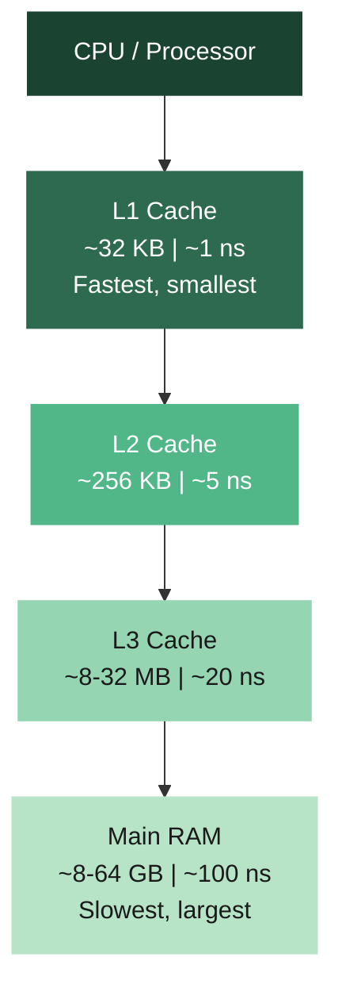

When you access a memory location, the hardware loads a **cache line** — a chunk of nearby memory — into the cache, anticipating sequential access. This is the key mechanism behind the performance difference.

### Sequential vs Stride Access

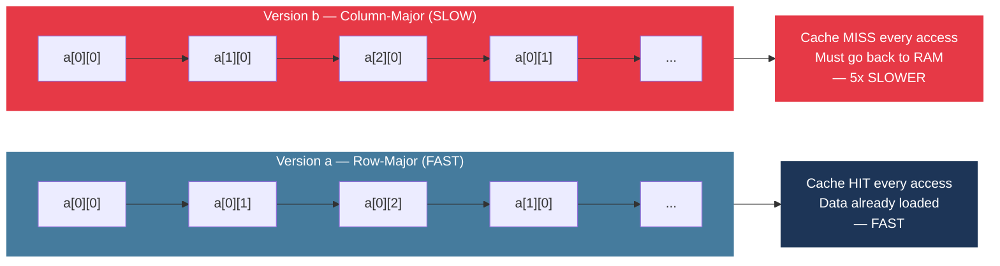

### Measured Performance Difference

For a 10,000 x 10,000 matrix:

| Version | Loop Order | Access Pattern | Time |
|---------|-----------|----------------|------|
| (a) | i outer, j inner | Row-major — sequential | ~500 ms |
| (b) | j outer, i inner | Column-major — stride jumps | ~2,500 ms |

**5x slower. Same computation. Different memory access pattern.**

### Why This Matters for Big Data

This exact principle scales from a single CPU all the way up to distributed systems:


> How you organize and access data determines performance far more than raw computational power. This principle is universal across every scale.

---

## 2. Clock Speed and the Physical Limits of a Single Processor

### The Clock Speed Growth Story

From the 1980s through the early 2000s, making software faster was simple — wait, buy a newer processor.

| Year | Processor | Clock Speed |
|------|-----------|-------------|
| 1988 | MIPS R3000 | 40 MHz |
| 2000s | Intel Pentium 4 | ~3 GHz |
| 2015 | Intel Core i7 | 4.0 to 4.4 GHz |

That is roughly a 100x increase over 25 years.

### The Wall

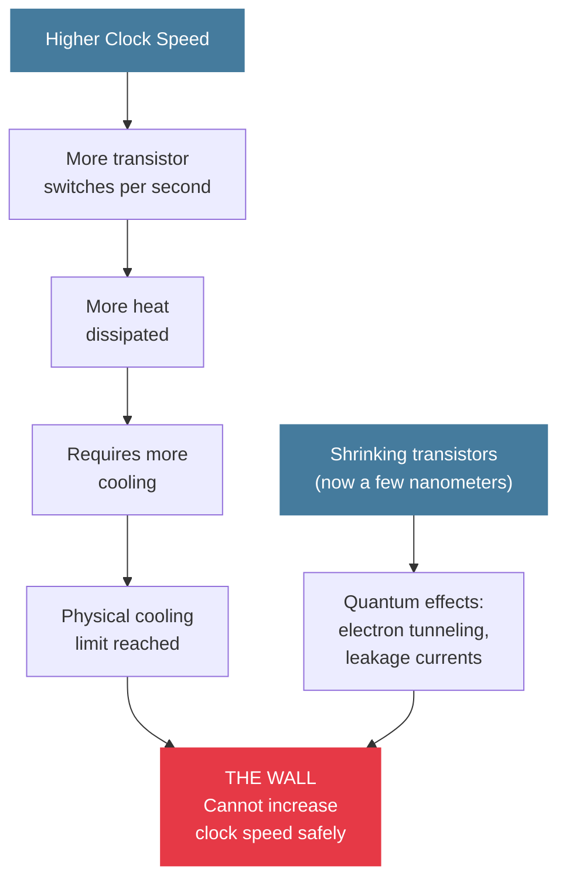

### The Industry Response

When clock speed hit its limit, the industry moved in a different direction entirely:

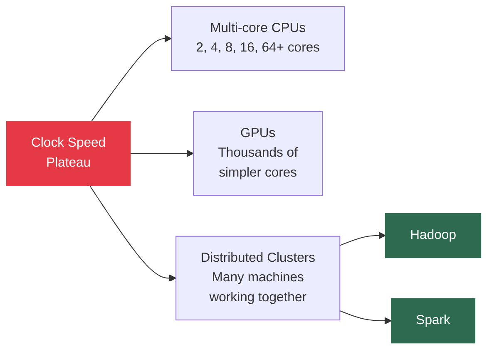

> This is why Big Data systems exist. Not by choice — by physical necessity.

---

## 3. Moore's Law

### The Original Observation

In **1965**, **Gordon Moore** (co-founder of Intel) observed that the number of transistors on an integrated circuit was **doubling approximately every 18 months**, and predicted this trend would continue.

### What Moore's Law Actually Says vs What People Think

| What It Actually States | Common (Loose) Interpretation |
|------------------------|-------------------------------|
| Transistor density doubles every ~18 months | Computing power doubles every 18 months |
| About transistors per chip | Cost halves every 18 months |
| A density observation | You can always wait and get a faster machine |

Both the strict and loose versions held remarkably well from the 1960s through the early 2010s.

### Transistor Count Growth

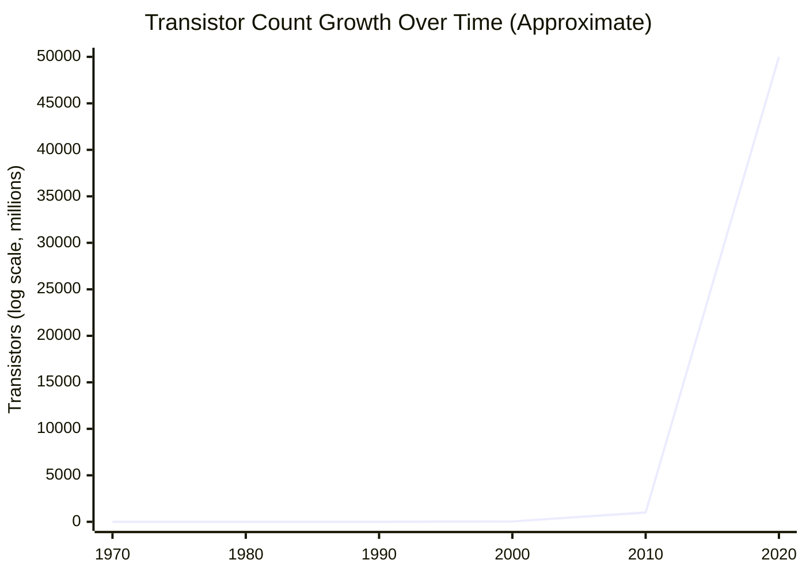

### Is Moore's Law Dead?

The honest answer is: **transistor density scaling has slowed dramatically** and may be approaching physical limits. But the industry has adapted:

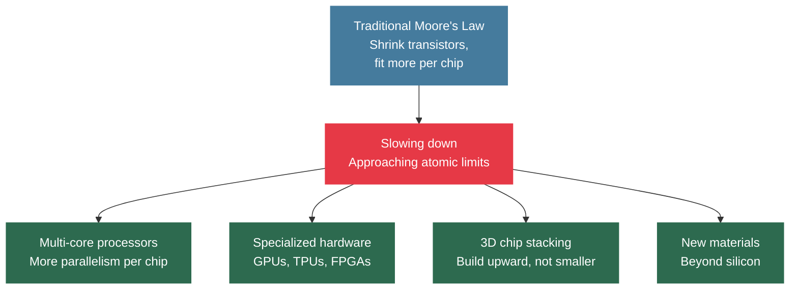

> Single-threaded performance has largely plateaued. Improvements now come from **parallelism** and **specialization** — which is exactly why Big Data systems are designed around distributed, parallel architectures.

---

## 4. Amdahl's Law

### The Formula

$$S = \frac{1}{(1 - P) + \frac{P}{N}}$$

Where:

| Symbol | Meaning |
|--------|---------|
| S | Overall speedup of the program |
| P | Fraction of the program that can be parallelized |
| 1 - P | Fraction that must remain serial (sequential) |
| N | Number of processors |

### The Profound Implication — A Worked Example

Suppose 90% of a program can be parallelized (P = 0.9) and 10% must run sequentially. What is the maximum possible speedup with unlimited processors?

$$S_{max} = \frac{1}{1 - P} = \frac{1}{0.1} = 10$$

**Maximum speedup = 10x. Ever. Regardless of how many processors you add.**

### Speedup vs Number of Processors

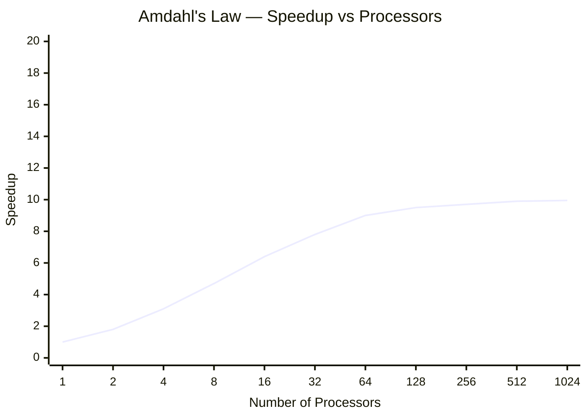

> The curve flattens rapidly. Adding more processors gives diminishing returns because the **serial fraction dominates** at scale.

### The Core Insight

**The serial fraction of a program dominates performance at scale.**

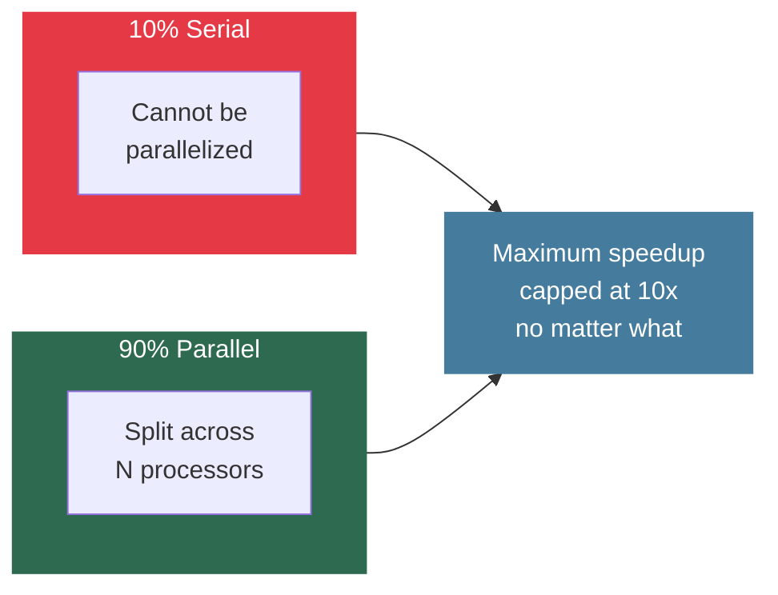

### Practical Big Data Example

Processing a 1 TB log file:
- 95% of work (reading, filtering, counting) — parallelized across 100 machines
- 5% of work (writing final sorted output) — sequential

Maximum speedup = 1 / 0.05 = **20x**, regardless of how many machines you throw at it.

### Why MapReduce Is Designed the Way It Is

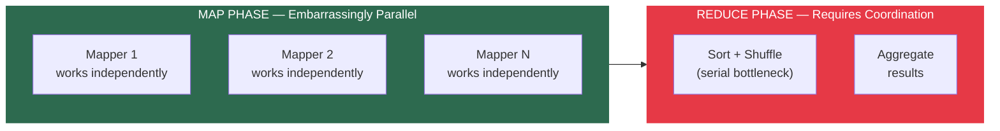

Minimizing what must happen in the Reduce phase is a core MapReduce optimization strategy — directly driven by Amdahl's Law.

### Amdahl's Law vs Gustafson's Law

| | Amdahl's Law | Gustafson's Law |
|--|-------------|----------------|
| Assumption | Problem size is fixed | Problem size grows with more processors |
| View | Pessimistic — serial fraction caps speedup | Optimistic — parallel work grows, serial fraction stays small |
| Relevance | Fundamental warning about bottlenecks | More relevant to Big Data — data keeps growing |
| Lesson | Eliminate serial bottlenecks | Scale problem size with resources |

> Both matter. Amdahl's Law is the warning. Gustafson's Law is the motivation for scaling. Know both.

---

## 5. Real World Hardware — HPC Systems

### Top Supercomputers

| System | Location | Cores | Performance | Power |
|--------|----------|-------|-------------|-------|
| Fugaku | RIKEN, Japan | 7.6 million | 442 petaFLOPS | ~30 megawatts |
| Summit | Oak Ridge, USA | 2.4 million (CPU + GPU) | 148 petaFLOPS | - |
| Your laptop | - | 8-16 | ~0.026 teraFLOPS | - |
| NVIDIA K80 GPU | Workstation | - | ~8.73 teraFLOPS | - |

### The Network Bottleneck

Supercomputers use **InfiniBand** switches (Mellanox) — capable of **100 GB/s** between nodes. Standard data center networks are orders of magnitude slower.

**The bottleneck in distributed computing is almost always network communication.** This is the foundational reason for Hadoop's data locality principle.

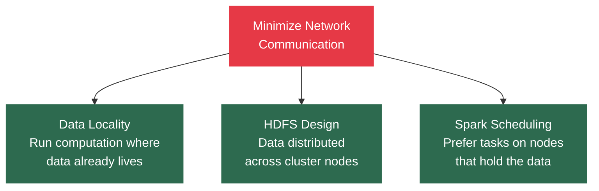

> The best network optimization is to not use the network at all.

### Why Not Just Use Supercomputers for Big Data?

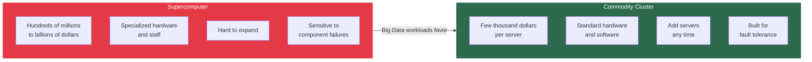

Commodity clusters win on three dimensions: **economics**, **scalability**, and **fault tolerance**.

---

## 6. Why Ideal Speedup Is Never Achieved

Ideal speedup means double the machines = double the speed. This never happens in practice. Here are all the reasons why — and crucially, how Big Data frameworks address each one.

```mermaid
flowchart TD
    IDEAL["Ideal Linear Speedup\n(Never Achieved)"] --> C1["Data Transfer Overhead\nMessages between processors take time"]
    IDEAL --> C2["I/O Bottlenecks\nDisks have limited throughput"]
    IDEAL --> C3["Race Conditions\nShared state needs synchronization\nwhich reintroduces serial execution"]
    IDEAL --> C4["Contention\nMultiple processors competing\nfor same memory bus or disk"]
    IDEAL --> C5["Load Imbalance\nFast processors wait for slow ones\n(data skew problem in Spark/Hadoop)"]
    IDEAL --> C6["Deadlocks\nProcesses waiting on each other\nforever"]
    IDEAL --> C7["Node Failures\nHardware fails daily in large clusters"]
    IDEAL --> C8["Synchronization Barriers\nAll processors wait for\nthe slowest one"]

    style IDEAL fill:#e63946,color:#fff,stroke:#e63946
    style C1 fill:#457b9d,color:#fff,stroke:#457b9d
    style C2 fill:#457b9d,color:#fff,stroke:#457b9d
    style C3 fill:#457b9d,color:#fff,stroke:#457b9d
    style C4 fill:#457b9d,color:#fff,stroke:#457b9d
    style C5 fill:#457b9d,color:#fff,stroke:#457b9d
    style C6 fill:#457b9d,color:#fff,stroke:#457b9d
    style C7 fill:#457b9d,color:#fff,stroke:#457b9d
    style C8 fill:#457b9d,color:#fff,stroke:#457b9d
```

### How Big Data Frameworks Address These Challenges

| Challenge | How Frameworks Respond |
|-----------|----------------------|
| Data transfer overhead | Data locality — run tasks where data lives |
| I/O bottlenecks | Distributed storage (HDFS), columnar formats (Parquet) |
| Race conditions | Immutable data structures in Spark (RDDs are read-only) |
| Load imbalance / data skew | Custom partitioners, salting techniques |
| Node failures | Hadoop writes intermediate results to HDFS; Spark uses lineage-based recovery |
| Synchronization barriers | Spark DAG pipelines operations to minimize synchronization points |
| Coordination overhead | Kafka uses distributed log partitioning to avoid central coordination |

> Every design decision in every Big Data framework traces back to one of these fundamental challenges. Nothing is arbitrary.

---

### The Complete Picture — Why Big Data Systems Look the Way They Do

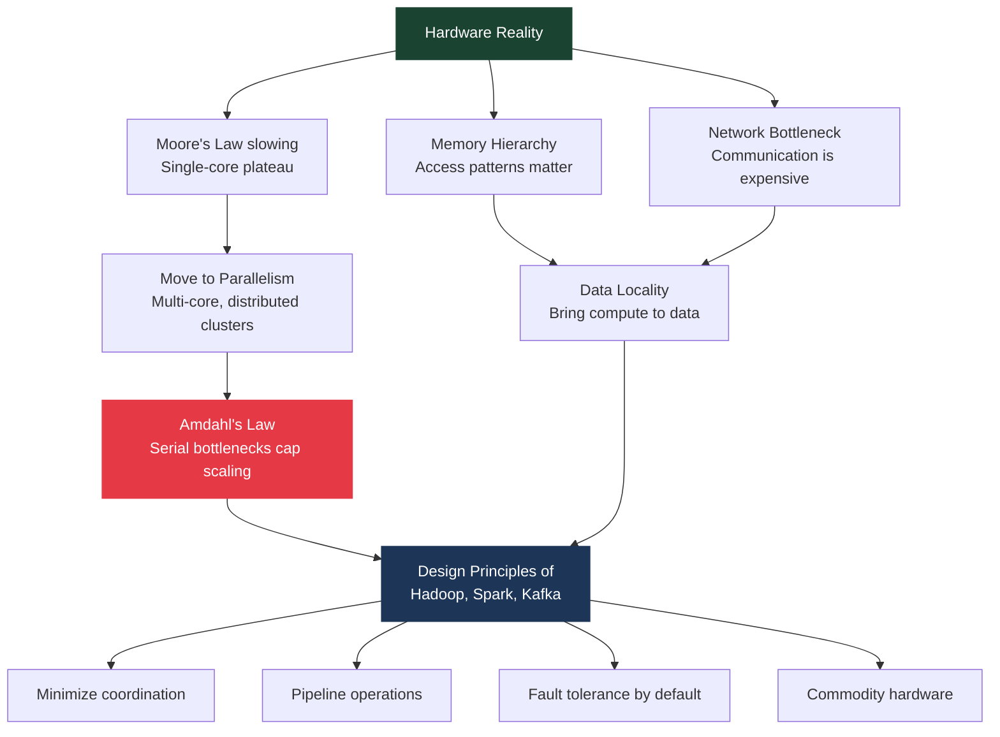

---

*BDA Spring 2026 | Week 1, Lecture 2 | Hardware Reality, Moore's Law and Amdahl's Law*
