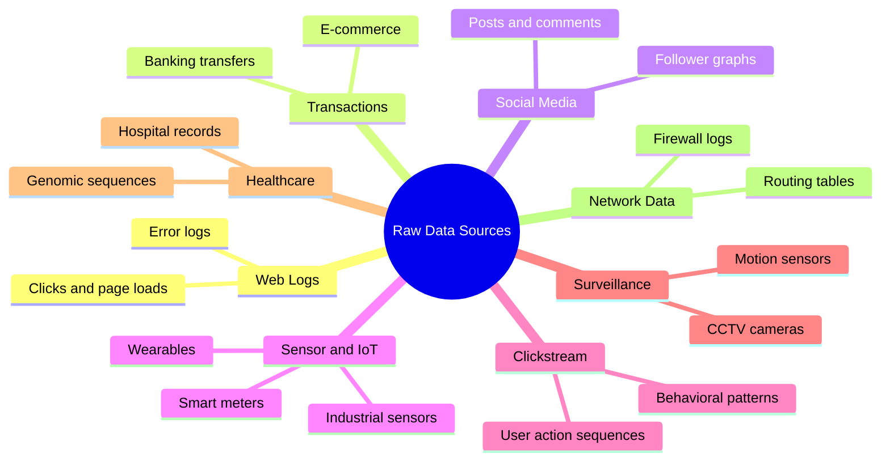
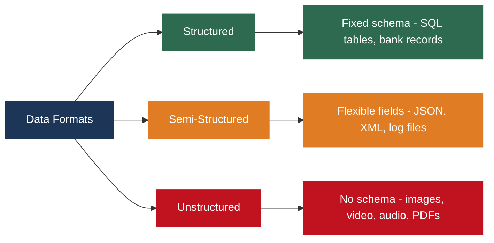
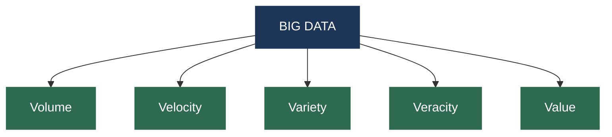
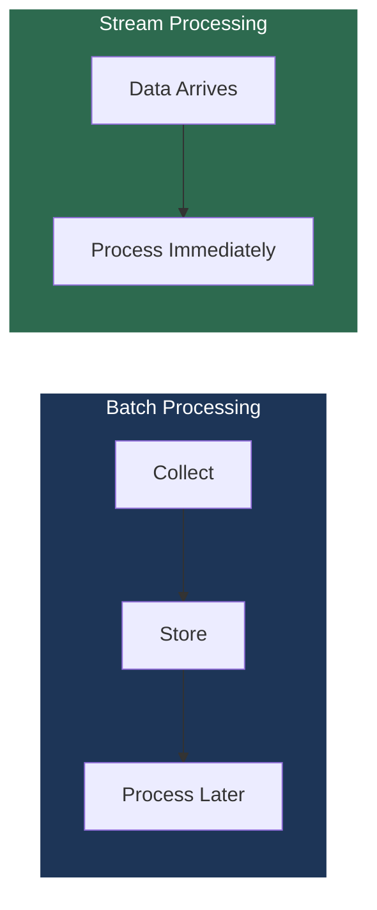
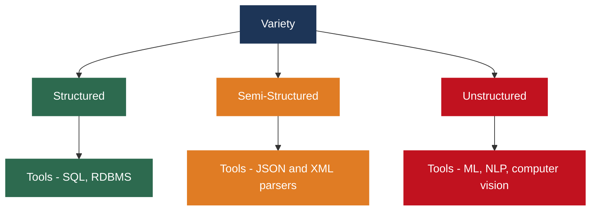
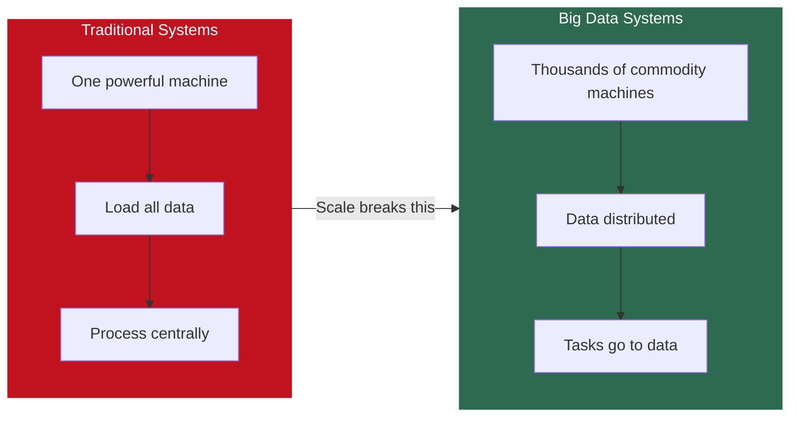
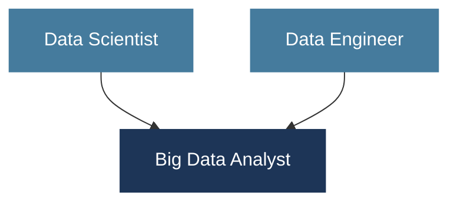
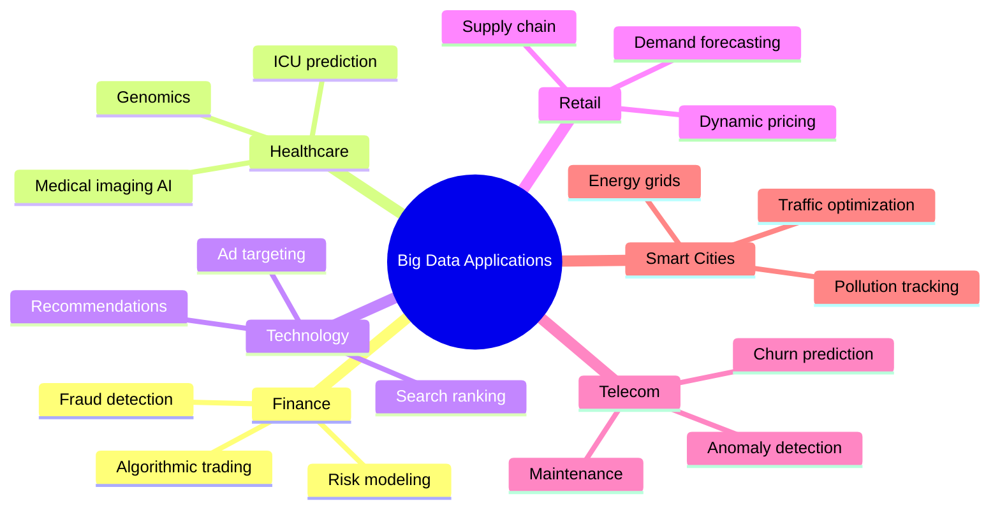

# Big Data Analytics (BDA  Spring 2026)
## Week 1, Lecture 1: What is Big Data? The 5 Vs, Data Sources, and Why It All Matters

> This course sits at the intersection of **systems engineering**, **data science**, **computer architecture**, and **business intelligence**. By the end, you will understand the machinery behind everyday tech like WhatsApp messages, bank transactions, and YouTube recommendations.

---

## Table of Contents

1. [Scale of Data Generation](#1-scale-of-data-generation)
2. [Raw Data Sources](#2-raw-data-sources)
3. [The 5 Vs of Big Data](#3-the-5-vs-of-big-data)
4. [Big Data vs Traditional Data Systems](#4-big-data-vs-traditional-data-systems)
5. [Big Data vs Data Science vs Data Engineering](#5-big-data-vs-data-science-vs-data-engineering)
6. [Industry Use Cases](#6-industry-use-cases)

---

## 1. Scale of Data Generation

The world generates approximately **2.5 quintillion bytes of data every single day.**

$$2.5 \times 10^{18} \text{ bytes per day}$$

That is 2.5 followed by 18 zeros, produced daily across billions of devices, users, and systems worldwide.

---

## 2. Raw Data Sources

Consider a single morning in your life and count every data source it touches.

| Action | Data Type |
|--------|-----------|
| Check Instagram | Social media data: JSON posts, image metadata, timestamps |
| Open banking app | Transactional data: structured records, debits and credits |
| Google search | Clickstream data: queries, hover events, link clicks |
| Smartwatch sync | Sensor/IoT data: heart rate, step count |
| Connect to university WiFi | Network logs: device ID, connection timestamps |
| Walk past CCTV | Surveillance data: image frames, video streams |
| Open email | Server/application logs: access logs, error logs |

Multiply this by 8 billion people, then add hospitals, factories, satellites, and financial markets executing millions of trades per second.

### Data Source Categories

### Three Formats of Data

All these sources do **not** store data the same way.

Unstructured data makes up roughly **80% of all data generated today**. Each format requires different storage strategies and tools, covered in Week 2.

---

## 3. The 5 Vs of Big Data

Big Data is defined by five fundamental characteristics. The original framework came from **Doug Laney in 2001** with 3 Vs (Volume, Velocity, Variety). IBM added Veracity later, and Value was added after that.

---

### V1 - Volume

Volume is the sheer quantity of data. Traditional databases were designed for gigabytes. Big Data operates at terabytes, petabytes, and beyond. Running a SQL query on a petabyte of data on a single machine could take days. That is the Volume problem.

| Scale | Size | Real-World Reference |
|-------|------|---------------------|
| Terabyte (TB) | 10^12 bytes | ~500 hours of HD video |
| Petabyte (PB) | 10^15 bytes | Facebook processes 100+ PB/day |
| Exabyte (EB) | 10^18 bytes | CERN generates ~15 PB/year |
| Zettabyte (ZB) | 10^21 bytes | All human genomes sequenced = ~40 ZB |

---

### V2 - Velocity

Velocity is the speed at which data arrives and must be processed. Traditional batch systems collect data and process it later. They cannot keep up with modern demands.

| Type | Description | Example |
|------|-------------|---------|
| Batch Processing | Collect, store, then process in bulk | Daily sales report generated overnight |
| Stream Processing | Continuous real-time processing as data arrives | Fraud detection on live bank transactions |

Real-world examples: Twitter generates millions of tweets per minute during a cricket World Cup final. A fraud detection system must decide on each transaction in milliseconds. An autonomous vehicle processes sensor data hundreds of times per second.

---

### V3 - Variety

Variety is the diversity of data types and formats.

---

### V4 - Veracity

Veracity is the quality, accuracy, and trustworthiness of data. This is the most overlooked V by beginners but is considered critical by professionals.

| Data Source | Quality Problem |
|-------------|----------------|
| Sensors | Noise, calibration errors, missing readings |
| Surveys | Response bias, incomplete answers |
| Social Media | Bots, fake accounts, spam activity |
| Medical Records | Missing fields, transcription errors |
| Clickstream | Bot traffic, incomplete sessions |

**"Garbage in, garbage out"** is not just a saying. It is a fundamental law of data systems. Running sophisticated machine learning on dirty data produces sophisticated wrong answers.

---

### V5 - Value

Value is the actionable insights and business outcomes extracted from data. The goal is never to collect data for its own sake.

| Company | Data Used | Value Created |
|---------|-----------|--------------|
| Amazon | Purchase history | Product recommendations driving billions in revenue |
| Google | Search patterns | Improved ranking algorithms |
| Hospitals | Patient data | Predict disease outbreaks before they spread |
| Telecom | Network logs | Predict equipment failure before customers notice |

Value is the destination. Volume, Velocity, Variety, and Veracity are the challenges you must overcome to reach it.

---

## 4. Big Data vs Traditional Data Systems

The most fundamental shift is philosophical:

- Traditional systems say: **bring the data to the computation.** One powerful machine, load data in, process centrally.
- Big Data systems say: **bring the computation to the data.** Distribute data across hundreds of commodity machines and send tasks to where data lives.

This is the core philosophy behind Hadoop's design.

| Dimension | Traditional | Big Data |
|-----------|-------------|---------|
| Scale | Gigabytes | Terabytes to Petabytes |
| Data Types | Structured only | Structured + Semi + Unstructured |
| Processing | Single machine | Distributed cluster |
| Schema | Fixed, predefined | Flexible, schema-on-read |
| Speed | Batch queries | Batch and real-time streaming |
| Tools | SQL, RDBMS | Hadoop, Spark, Kafka, NoSQL |
| Hardware | Expensive, specialized | Commodity servers |

---

## 5. Big Data vs Data Science vs Data Engineering

These are related but distinct disciplines. This course sits at their intersection.

| Role | Core Question | Primary Tools |
|------|--------------|---------------|
| Data Scientist | What does this data tell us? What patterns exist? | Python, pandas, scikit-learn, TensorFlow |
| Data Engineer | How do I collect, store, clean, and deliver data at scale? | Spark, Kafka, ETL pipelines, distributed databases |
| Big Data Analyst | How do I build the entire system at scale? | Both sets above combined |

The analogy from class: the data scientist builds the **engine**, the data engineer builds the **road**, the big data analyst designs the entire **transportation system**.

All three roles are highly paid. Data engineers are currently in extremely high demand because even the best data scientists cannot function without reliable, scalable data infrastructure.

---

## 6. Industry Use Cases

**Finance and Banking:** Real-time fraud detection, algorithmic trading executing thousands of trades per second, credit risk modeling across millions of customers, compliance reporting across billions of transactions.

**Healthcare:** Genomic data analysis for personalized cancer treatment, predicting ICU deterioration hours ahead, AI processing of medical imaging for early detection, real-time epidemic tracking.

**Web and Technology:** Indexing and ranking billions of pages, personalized content recommendations, behavioral ad targeting, A/B testing at massive scale.

**Retail and E-Commerce:** Demand forecasting, dynamic pricing, supply chain optimization, real-time inventory management across thousands of warehouses.

**Telecommunications:** Network anomaly detection, predictive equipment maintenance, customer churn prediction, traffic routing optimization.

**Smart Cities and IoT:** Traffic flow optimization via sensor networks, energy grid management, water system monitoring, pollution tracking.

---

*BDA Spring 2026 | Week 1, Lecture 1 | Big Data Fundamentals*
