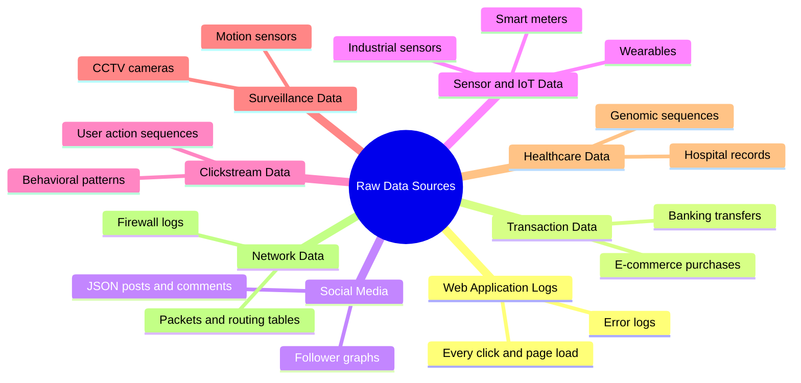
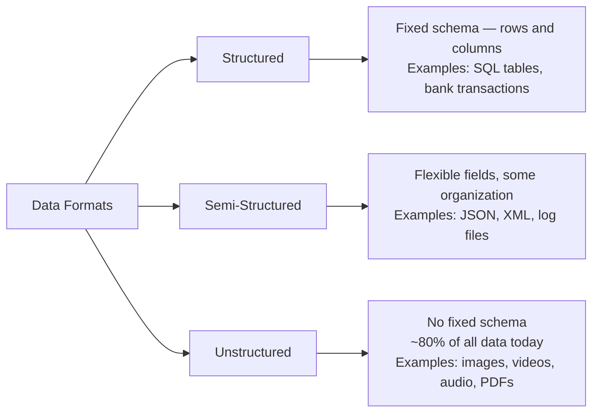
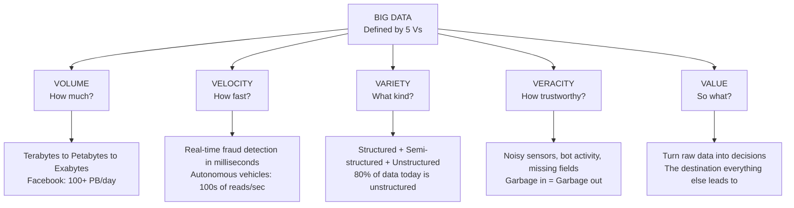
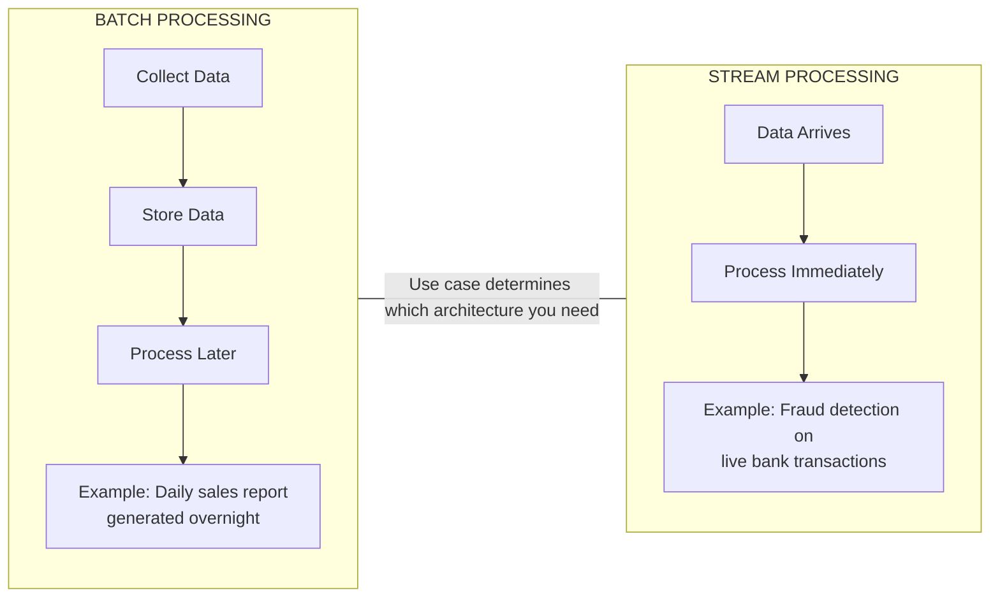
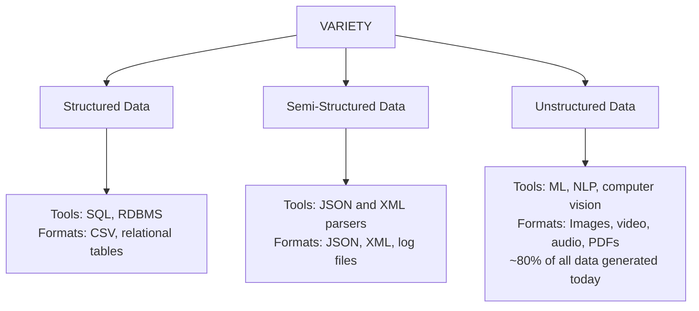
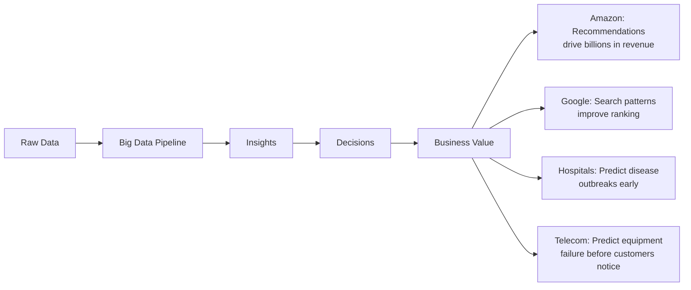
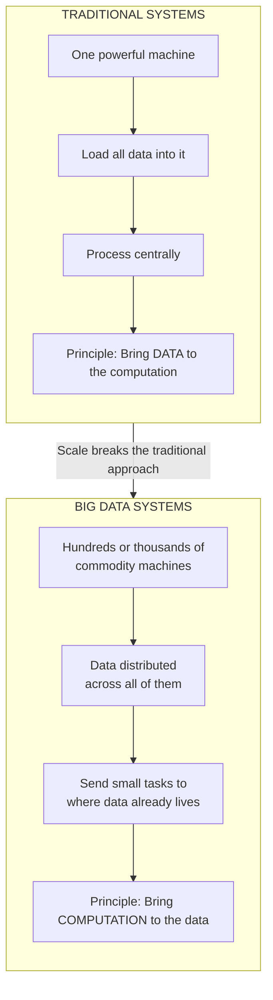
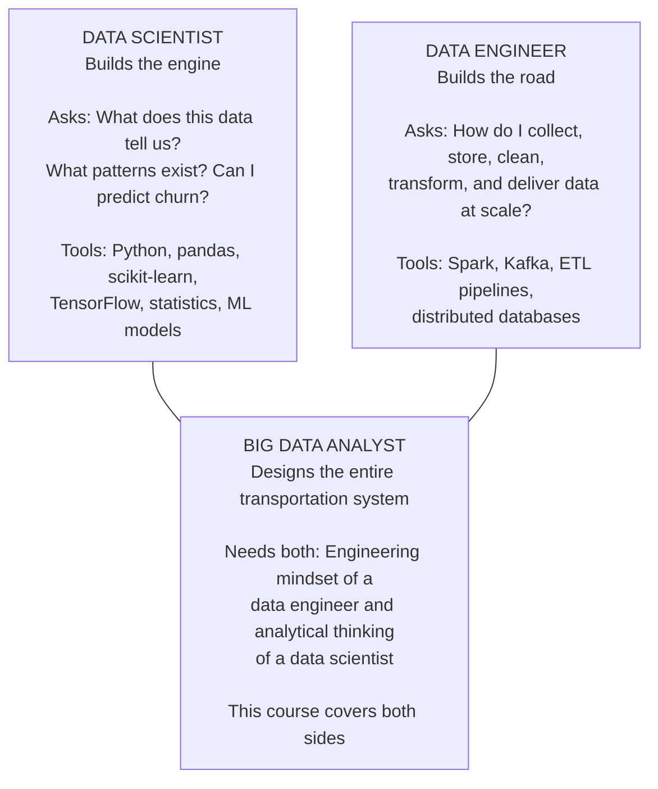
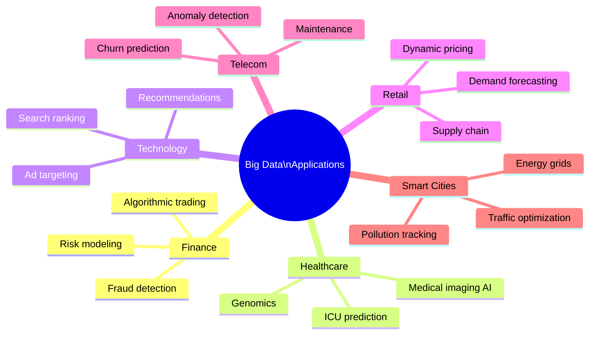

# Big Data Analytics (BDA Spring 2026)
## Week 1 — Lecture 1: What is Big Data? The 5 Vs, Data Sources, and Why It All Matters

---

> This course sits at the intersection of **systems engineering**, **data science**, **computer architecture**, and **business intelligence**. By the end, you will understand the machinery behind everyday tech like WhatsApp messages, bank transactions, and YouTube recommendations.

---

## Table of Contents

1. [Scale of Data Generation](#1-scale-of-data-generation)
2. [Raw Data Sources](#2-raw-data-sources)
3. [The 5 Vs of Big Data](#3-the-5-vs-of-big-data)
4. [Big Data vs Traditional Data Systems](#4-big-data-vs-traditional-data-systems)
5. [Big Data vs Data Science vs Data Engineering](#5-big-data-vs-data-science-vs-data-engineering)
6. [Industry Use Cases](#6-industry-use-cases)

---

## 1. Scale of Data Generation

The world generates approximately **2.5 quintillion bytes of data every single day.**

$$2.5 \times 10^{18} \text{ bytes per day}$$

That is 2.5 followed by 18 zeros, produced daily across billions of devices, users, and systems worldwide.

---

## 2. Raw Data Sources

To understand where Big Data comes from, consider a single morning in your life and count every data source it touches.

| Time | Action | Data Type |
|------|--------|-----------|
| Wake up | Check Instagram | Social media data — JSON posts, image metadata, timestamps |
| Morning | Open banking app | Transactional data — structured records, debits and credits |
| Commute | Google search | Clickstream data — queries, hover events, link clicks |
| Exercise | Smartwatch sync | Sensor/IoT data — heart rate, step count |
| Arrive university | Connect to WiFi | Network logs — device ID, connection timestamps |
| Walk hallway | CCTV records you | Surveillance data — image frames, video streams |
| Open email | Server delivers it | Server/application logs — access logs, error logs |

Multiply this by 8 billion people, then add hospitals recording patient vitals, factories monitoring machinery, satellites imaging the earth, and financial markets executing millions of trades per second. This is why Big Data is fundamentally different from anything before it.

### Data Source Categories

### Three Formats of Data

A critical point raised in class: all these sources do **not** store data the same way.

Each format requires different storage strategies, file formats, and processing tools — covered in depth in Week 2.

---

## 3. The 5 Vs of Big Data

Big Data is not defined by size alone. It is defined by five fundamental characteristics known as the **5 Vs**. The original framework came from **Doug Laney in 2001** with 3 Vs (Volume, Velocity, Variety). IBM later added Veracity, and Value was added after that.

---

### V1 — Volume

Volume refers to the sheer quantity of data being generated and stored.

Traditional databases (MySQL, Oracle, SQL Server) were designed for gigabytes, maybe hundreds of gigabytes. When you run a SQL query on a petabyte of data on a single machine, you wait days, not seconds. That is the Volume problem.

| Scale | Bytes | Real-World Reference |
|-------|-------|---------------------|
| Terabyte (TB) | 10¹² | ~500 hours of HD video |
| Petabyte (PB) | 10¹⁵ | Facebook processes 100+ PB/day |
| Exabyte (EB) | 10¹⁸ | CERN generates ~15 PB/year |
| Zettabyte (ZB) | 10²¹ | All human genomes sequenced = ~40 ZB |

---

### V2 — Velocity

Velocity refers to the speed at which data arrives and must be processed.

Traditional batch processing systems collect data, store it, and process it later. They cannot keep up with modern demands. This drives two distinct processing architectures:

Real-world velocity examples include Twitter generating millions of tweets per minute during a cricket World Cup final, a fraud detection system that must analyze each transaction in milliseconds, and an autonomous vehicle that processes sensor data hundreds of times per second.

---

### V3 — Variety

Variety refers to the diversity of data types and formats that must be handled.

---

### V4 — Veracity

Veracity refers to the quality, accuracy, and trustworthiness of data. This is the most overlooked V by beginners but is considered critical by professionals.

Real-world data is inherently messy:

| Data Source | Quality Problem |
|-------------|----------------|
| Sensors | Noise, calibration errors, missing readings |
| Surveys | Response bias, incomplete answers |
| Social Media | Bots, fake accounts, spam activity |
| Medical Records | Missing fields, transcription errors |
| Clickstream | Bot traffic, incomplete sessions |

**"Garbage in, garbage out"** is not just a saying. It is a fundamental law of data systems. Running sophisticated machine learning on dirty data produces sophisticated wrong answers.

Data cleaning, validation, and quality management are not glamorous topics, but they can make or break an entire analytics project.

---

### V5 — Value

Value refers to the actionable insights and business outcomes that justify all the investment in Big Data infrastructure. The goal is never to collect data for the sake of collecting it.

Value is the destination. Volume, Velocity, Variety, and Veracity are the challenges you must overcome to reach it.

---

## 4. Big Data vs Traditional Data Systems

The most fundamental shift between traditional and Big Data systems is philosophical:

This philosophy of bringing computation to data is the **core design principle of Hadoop**, covered in detail in upcoming weeks.

### Side-by-Side Comparison

| Dimension | Traditional Data Systems | Big Data Systems |
|-----------|------------------------|-----------------|
| Scale | Gigabytes | Terabytes to Petabytes |
| Data Types | Structured only | Structured + Semi + Unstructured |
| Processing | Single machine | Distributed cluster |
| Schema | Fixed, predefined | Flexible, schema-on-read |
| Speed | Batch queries | Batch and real-time streaming |
| Tools | SQL, RDBMS | Hadoop, Spark, Kafka, NoSQL |
| Hardware | Expensive, specialized | Commodity (cheap, ordinary) servers |

---

## 5. Big Data vs Data Science vs Data Engineering

These are related but distinct disciplines. This course sits at their intersection.

All three roles are highly paid in today's market. Data engineers are currently in extremely high demand because companies have realized that even the best data scientists cannot function without reliable, scalable data infrastructure.

---

## 6. Industry Use Cases

Every application below relies on the distributed systems, algorithms, and frameworks taught in this course.

### Finance and Banking

Real-time fraud detection on credit card transactions, algorithmic trading executing thousands of trades per second, credit risk modeling across millions of customers, and regulatory compliance reporting across billions of transactions.

### Healthcare

Analyzing genomic data to personalize cancer treatments, predicting ICU patient deterioration hours before it happens, processing medical imaging with AI for early disease detection, and tracking epidemic spread in real time.

### Web and Technology

Search engine indexing and ranking billions of pages, personalized content recommendation on streaming platforms, advertising targeting based on behavioral patterns, and A/B testing at massive scale.

### Retail and E-Commerce

Demand forecasting, dynamic pricing, supply chain optimization, customer segmentation, and real-time inventory management across thousands of warehouses.

### Telecommunications

Network anomaly detection, predictive maintenance of towers and equipment, customer churn prediction, and traffic routing optimization.

### Smart Cities and IoT

Traffic flow optimization using sensor networks, energy grid management, water system monitoring, and pollution tracking.

---

*BDA Spring 2026 | Week 1, Lecture 1 | Big Data Fundamentals*
