# Big Data Analytics (BDA Spring 2026)
## Week 1, Lecture 2: Hardware Reality, Moore's Law, Amdahl's Law and the Systems Motivation for Big Data

> **Core question of this lecture:** Why do Big Data systems look the way they look? Why distributed clusters of cheap machines instead of one powerful supercomputer? Why move computation to data? The answer lies in hardware, physics, and the fundamental limits of a single machine.

---

## Table of Contents

1. [The Memory Hierarchy and Why It Matters](#1-the-memory-hierarchy-and-why-it-matters)
2. [Clock Speed and the Physical Limits of a Single Processor](#2-clock-speed-and-the-physical-limits-of-a-single-processor)
3. [Moore's Law](#3-moores-law)
4. [Amdahl's Law](#4-amdahls-law)
5. [Real World Hardware: HPC Systems](#5-real-world-hardware-hpc-systems)
6. [Why Ideal Speedup Is Never Achieved](#6-why-ideal-speedup-is-never-achieved)

---

## 1. The Memory Hierarchy and Why It Matters

### The Matrix Loop Problem

Four code snippets, all computing the sum of elements in a 2D matrix. Same matrix, same result, same number of operations. Which is fastest?

```c
// Version (a): row-major traversal          // Version (b): column-major traversal
for (i = 0; i < n; i++)                      for (j = 0; j < n; j++)
  for (j = 0; j < n; j++)                      for (i = 0; i < n; i++)
    sum += a[i][j];                               sum += a[i][j];

// Version (c): explicit flat, row-major     // Version (d): explicit flat, column-major
for (i = 0; i < n; i++)                      for (j = 0; j < n; j++)
  for (j = 0; j < n; j++)                      for (i = 0; i < n; i++)
    sum += a[i*SIZE+j];                           sum += a[i*SIZE+j];
```

Most students say all four are the same since the number of additions is equal. This is wrong. The difference is dramatic.

### Why: Row-Major Memory Layout

In C and most languages, 2D arrays are stored in **row-major order** meaning elements of each row are consecutive in memory.

```
a[3][3] laid out in memory:

[ a[0][0] ][ a[0][1] ][ a[0][2] ][ a[1][0] ][ a[1][1] ][ a[1][2] ][ a[2][0] ][ a[2][1] ][ a[2][2] ]
|_________ Row 0 ______________|_________ Row 1 ______________|_________ Row 2 ___________|
```

### The Cache Hierarchy

The processor does not read from RAM directly for every operation. It has a hierarchy of caches, each faster but smaller than the last.

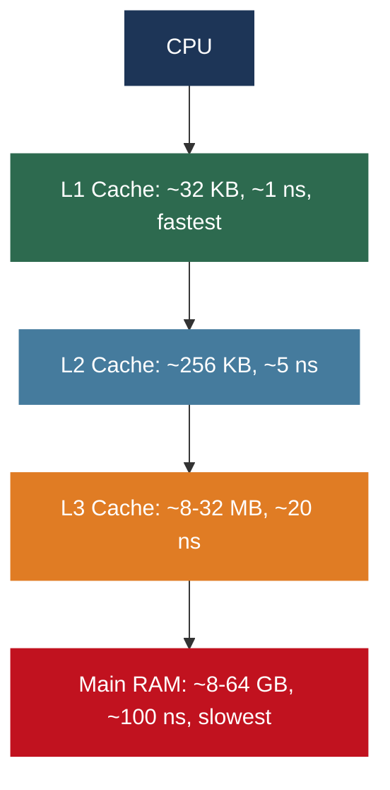

When you access a memory location, the hardware loads a **cache line** -- a chunk of nearby memory -- into the cache, anticipating that you will need what comes next sequentially.

### Sequential vs Stride Access

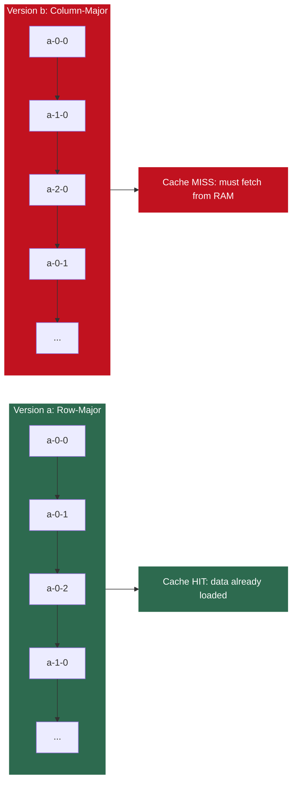

### Measured Performance Difference

For a 10,000 x 10,000 matrix:

| Version | Loop Order | Access Pattern | Time |
|---------|-----------|----------------|------|
| (a) | i outer, j inner | Row-major, sequential | ~500 ms |
| (b) | j outer, i inner | Column-major, stride jumps | ~2,500 ms |

**5x slower. Same computation. Different memory access pattern.**

### Why This Matters for Big Data

The same principle scales from a single CPU all the way up to distributed systems:


> How you organize and access data determines performance far more than raw computational power. This principle is universal at every scale.

---

## 2. Clock Speed and the Physical Limits of a Single Processor

### Clock Speed Growth

From the 1980s through the early 2000s, making software faster was simple -- wait, then buy a newer processor.

| Year | Processor | Clock Speed |
|------|-----------|-------------|
| 1988 | MIPS R3000 | 40 MHz |
| 2000s | Intel Pentium 4 | ~3 GHz |
| 2015 | Intel Core i7 | 4.0 to 4.4 GHz |

Roughly a 100x increase over 25 years. Then the wall was hit.

### The Physical Wall

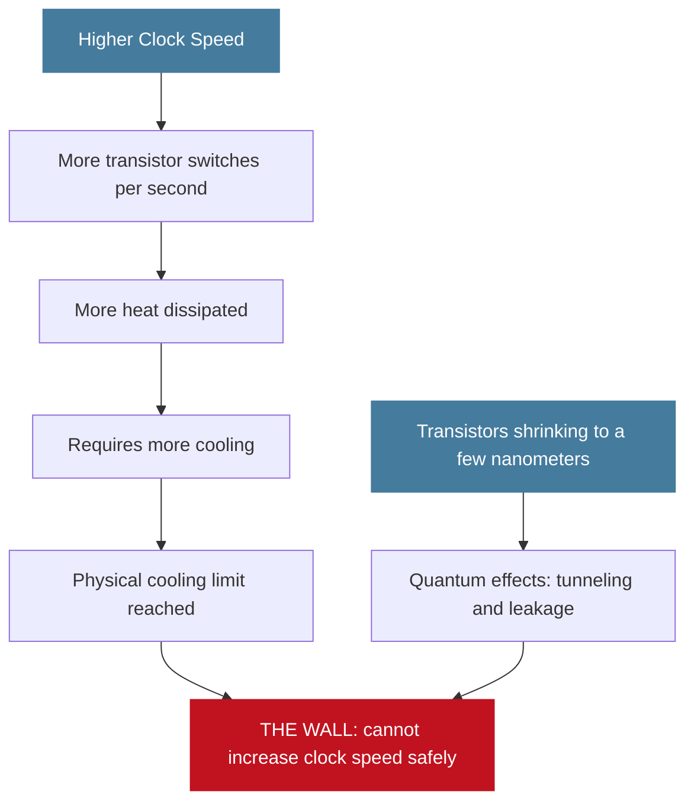

### Industry Response

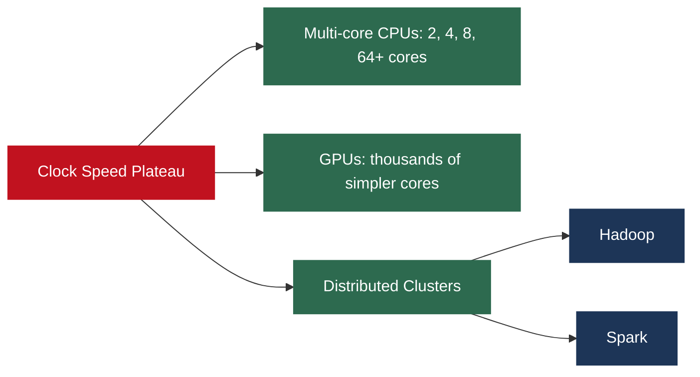

> Big Data distributed systems exist not by choice but by physical necessity.

---

## 3. Moore's Law

### The Observation

In **1965**, **Gordon Moore** (co-founder of Intel) observed that the number of transistors on an integrated circuit was **doubling approximately every 18 months** and predicted this trend would continue.

### What It Says vs What People Think

| What It Actually States | Common Loose Interpretation |
|------------------------|------------------------------|
| Transistor density doubles every ~18 months | Computing power doubles every 18 months |
| A density observation about transistors per chip | Cost halves every 18 months |
| An empirical trend, not a physical law | You can always wait and get a faster machine |

Both versions held remarkably well from the 1960s through the early 2010s.

### Transistor Count Growth

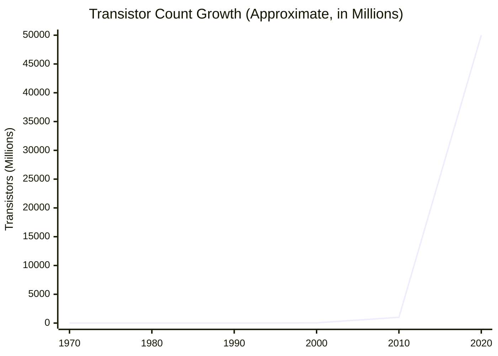

### Is Moore's Law Dead?

Transistor density scaling has **slowed dramatically** and is approaching physical limits. The industry has responded on multiple fronts:

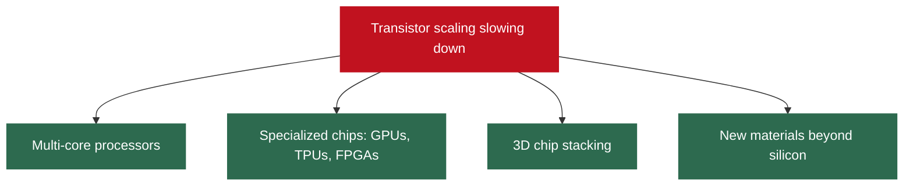

Single-threaded performance has largely plateaued. Improvements now come from **parallelism** and **specialization** -- which is exactly why Big Data systems are built the way they are.

---

## 4. Amdahl's Law

### The Formula

$$S = \frac{1}{(1 - P) + \dfrac{P}{N}}$$

| Symbol | Meaning |
|--------|---------|
| S | Overall speedup of the program |
| P | Fraction of the program that can be parallelized |
| 1 - P | Fraction that must remain serial |
| N | Number of processors |

### The Implication: A Worked Example

Suppose 90% of a program can be parallelized (P = 0.9) and 10% must run sequentially. What is the maximum possible speedup with unlimited processors?

As N approaches infinity:

$$S_{max} = \frac{1}{1 - P} = \frac{1}{0.1} = 10$$

**Maximum speedup = 10x. Forever. No matter how many processors you add.**

### Speedup vs Number of Processors (P = 0.9)

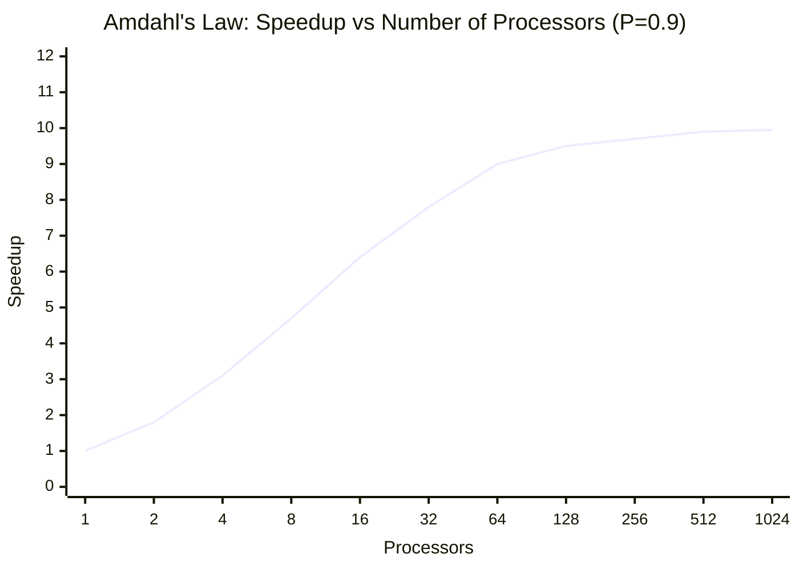

The curve flattens rapidly. Adding more processors gives diminishing returns because the **serial fraction dominates** at scale.

### Core Insight

**The serial fraction of a program dominates performance at scale.** In Big Data system design, engineers obsess over eliminating serial bottlenecks because every coordination step and every centralized component caps scalability.

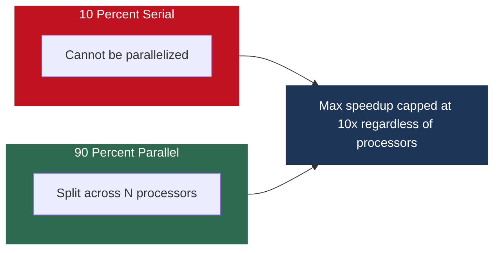

### Practical Big Data Example

Processing a 1 TB log file where 95% of work (reading, filtering, counting) is parallelized across 100 machines but 5% (writing the final sorted output) is sequential:

Maximum speedup = 1 / 0.05 = **20x**, regardless of how many machines you add.

### Why MapReduce Is Designed the Way It Is

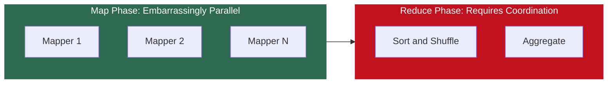

Each mapper works completely independently. Minimizing what happens in the Reduce phase is a core MapReduce optimization strategy -- directly driven by Amdahl's Law.

### Amdahl's Law vs Gustafson's Law

| | Amdahl's Law | Gustafson's Law |
|--|-------------|----------------|
| Assumption | Problem size is fixed | Problem size grows with more processors |
| View | Pessimistic: serial fraction caps speedup | Optimistic: parallel work grows, serial fraction stays small |
| Relevance | Fundamental warning about bottlenecks | More relevant to Big Data where data keeps growing |
| Lesson | Eliminate serial bottlenecks | Scale problem size with available resources |

Both matter. Amdahl's Law is the warning. Gustafson's Law is the motivation for scaling.

---

## 5. Real World Hardware: HPC Systems

### Top Supercomputers

| System | Location | Cores | Performance | Power |
|--------|----------|-------|-------------|-------|
| Fugaku | RIKEN, Japan | 7.6 million | 442 petaFLOPS | ~30 megawatts |
| Summit | Oak Ridge, USA | 2.4 million CPU+GPU | 148 petaFLOPS | - |
| Your laptop | - | 8-16 | ~0.026 teraFLOPS | - |
| NVIDIA K80 GPU | Workstation | - | ~8.73 teraFLOPS | - |

### The Network Bottleneck

Supercomputers use **InfiniBand** switches capable of **100 GB/s** between nodes. Standard data center networks are orders of magnitude slower.

The bottleneck in distributed computing is almost always **network communication**. This is the foundational reason behind Hadoop's data locality principle.

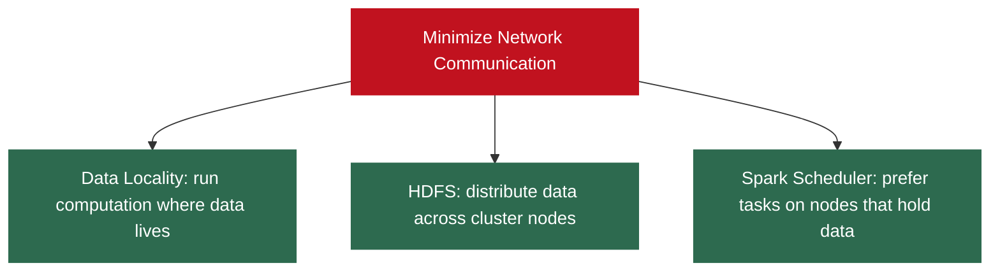

> The best network optimization is to not use the network at all.

### Why Not Just Use Supercomputers for Big Data?

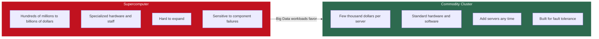

Commodity clusters win on three dimensions: **economics**, **scalability**, and **fault tolerance**.

---

## 6. Why Ideal Speedup Is Never Achieved

Ideal speedup: double the machines = double the speed. This never happens. Here are all the reasons, and how Big Data frameworks address each one.

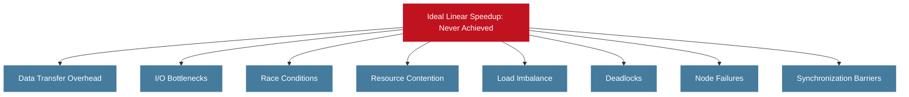

| Challenge | Description | How Frameworks Respond |
|-----------|-------------|----------------------|
| Data Transfer Overhead | Messages between processors take time | Data locality: run tasks where data already lives |
| I/O Bottlenecks | Disks have limited throughput | Distributed storage (HDFS), columnar formats (Parquet) |
| Race Conditions | Shared state needs synchronization, reintroducing serial execution | Immutable RDDs in Spark (read-only by design) |
| Resource Contention | Multiple processors competing for same memory bus or disk | Partitioning strategies in HDFS and Spark |
| Load Imbalance | Fast processors sit idle waiting for slow ones (data skew) | Custom partitioners and salting techniques |
| Deadlocks | Processes waiting on each other forever | Careful system design to avoid circular dependencies |
| Node Failures | Hardware fails daily in large clusters | Hadoop rewrites to HDFS; Spark uses lineage-based recovery |
| Synchronization Barriers | All processors wait for the slowest one | Spark DAG pipelines operations to minimize sync points |

> Every design decision in every Big Data framework traces back to one of these challenges. Nothing is arbitrary.

---

### The Complete Picture: Why Big Data Systems Look the Way They Do

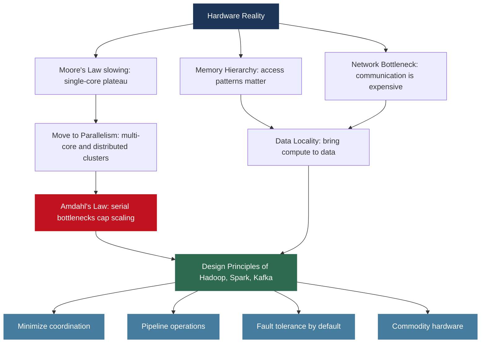

---

*BDA Spring 2026 | Week 1, Lecture 2 | Hardware Reality, Moore's Law and Amdahl's Law*
