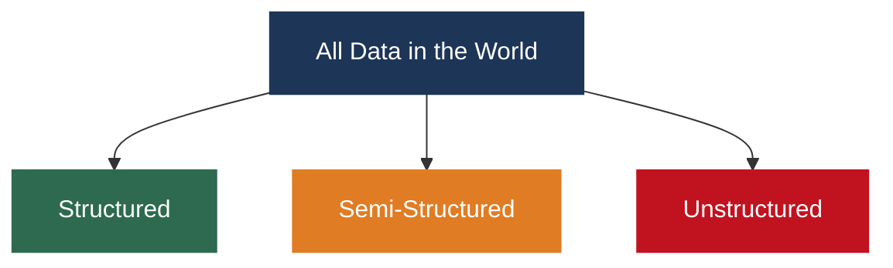
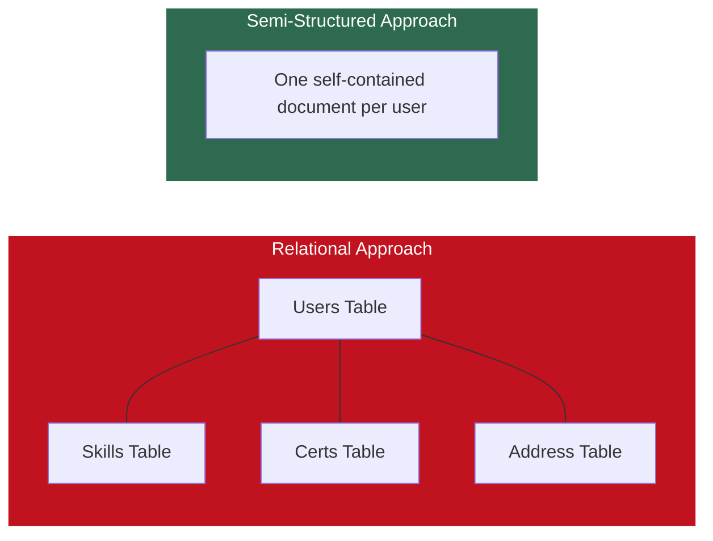
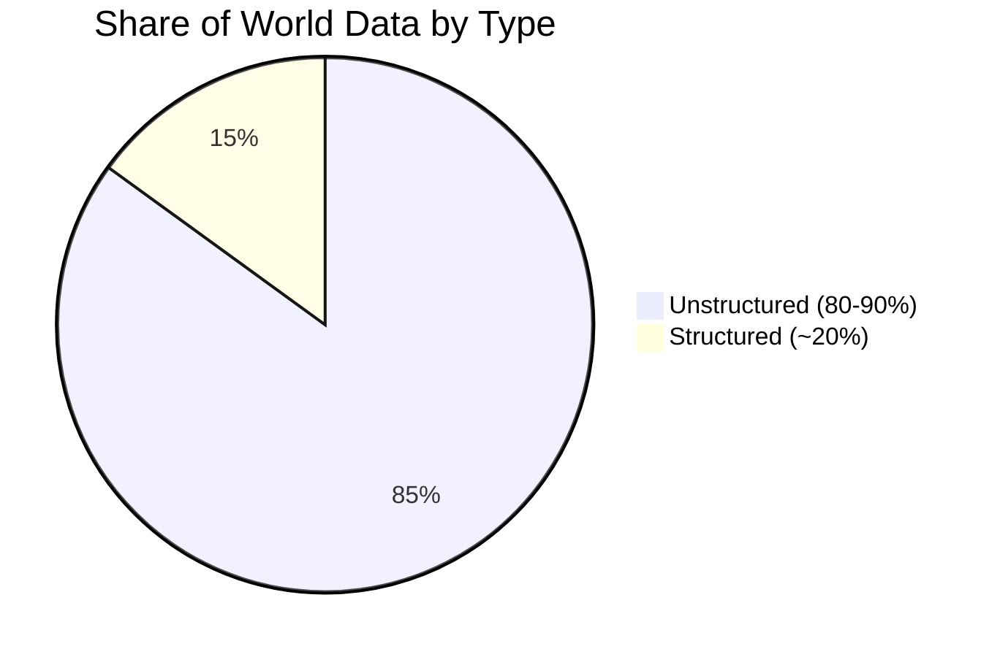
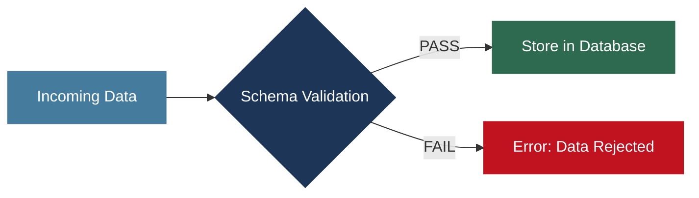
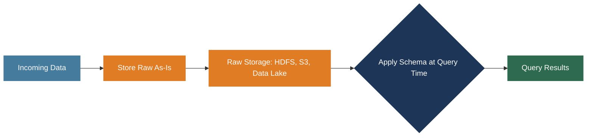
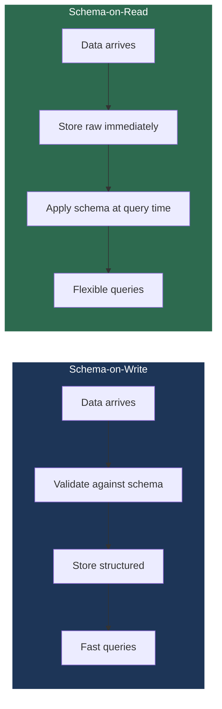
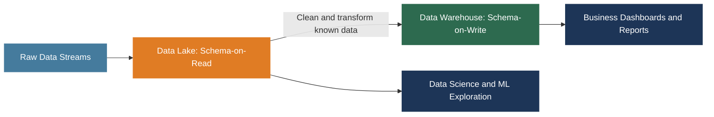
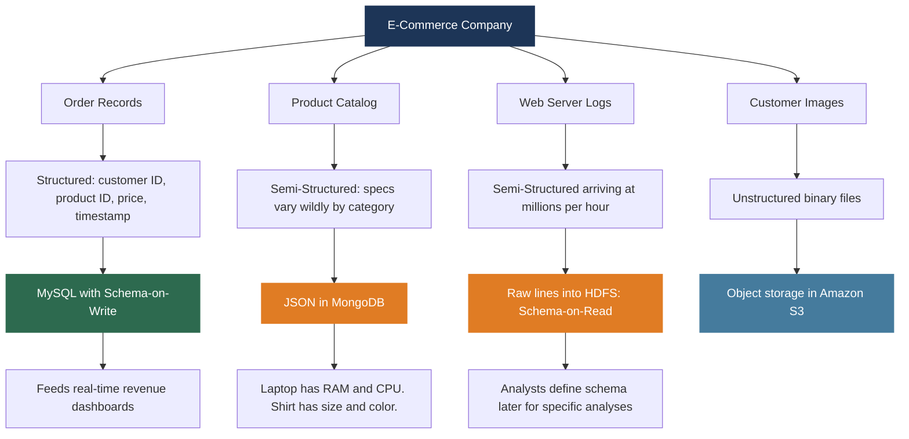

# Big Data Analytics (BDA Spring 2026)
## Week 2, Lecture 1: Structured, Semi-Structured and Unstructured Data — Schema-on-Read vs Schema-on-Write

> Week 1 established the **why** behind Big Data. Week 2 begins the **what** -- what does data actually look like, how is it organized, and how do systems decide what structure to impose on it and when. These decisions have enormous consequences for storage cost, query performance, system flexibility, and engineering complexity.

---

## Table of Contents

1. [The Three Types of Data](#1-the-three-types-of-data)
2. [Comparing All Three Types](#2-comparing-all-three-types)
3. [What Is a Schema?](#3-what-is-a-schema)
4. [Schema-on-Write](#4-schema-on-write)
5. [Schema-on-Read](#5-schema-on-read)
6. [Schema-on-Write vs Schema-on-Read: Full Comparison](#6-schema-on-write-vs-schema-on-read-full-comparison)
7. [Real-World Scenario: E-Commerce Company](#7-real-world-scenario-e-commerce-company)

---

## 1. The Three Types of Data

Every piece of data ever generated falls into one of three categories.



---

### Category 1: Structured Data

Structured data is organized into a **predefined schema** -- fixed rows and columns where every piece of data has a defined type, a defined position, and a defined meaning.

**Classic example: a student records table**

| StudentID | Name | Department | CGPA | Enrollment Year |
|-----------|------|------------|------|-----------------|
| 101 | Ali Hassan | Computer Science | 3.7 | 2022 |
| 102 | Sara Ahmed | Data Science | 3.9 | 2021 |
| 103 | Bilal Khan | Computer Science | 3.4 | 2023 |

Every row follows exactly the same structure. StudentID is always an integer. CGPA is always a decimal. No surprises, no missing columns, no extra fields.

**Where it lives:** Relational Database Management Systems -- MySQL, PostgreSQL, Oracle, Microsoft SQL Server. Queried using SQL. Dominant form of enterprise data storage for 50 years.

| Strengths | Weaknesses |
|-----------|-----------|
| Schema enforced at write time guarantees consistency | Rigid: changing structure on large tables is expensive and risky |
| Fast queries with indexes | Cannot easily represent variable-structure data |
| Data integrity maintained by the database engine | Requires complete upfront design before collecting data |
| Predictable joins between tables | Schema changes need downtime management |

---

### Category 2: Semi-Structured Data

Semi-structured data has some organizational structure but it is **flexible and self-describing** rather than fixed and predefined. The structure is **embedded within the data itself** rather than defined externally by a schema.

The most common formats are **JSON** (JavaScript Object Notation) and **XML** (Extensible Markup Language). In the Big Data world, JSON has largely won because it is more compact and human-readable.

**Example: two user profiles in JSON**

```json
{
  "userID": 1001,
  "name": "Ali Hassan",
  "age": 22,
  "skills": ["Python", "SQL", "Spark"],
  "address": {
    "city": "Peshawar",
    "country": "Pakistan"
  }
}
```

```json
{
  "userID": 1002,
  "name": "Sara Ahmed",
  "age": 21,
  "email": "sara@example.com",
  "skills": ["Java", "Hadoop"],
  "certifications": ["AWS Cloud Practitioner", "Google Data Engineer"]
}
```

Notice what is happening. Ali has an `address` field. Sara does not -- but Sara has `email` and `certifications` that Ali does not have. The `skills` field is an array that can hold any number of values. Different records have different fields.

**In a relational database**, this would require four separate tables with foreign key relationships, and querying one user's complete profile would require four joins.

**In JSON**, each record is self-contained. The structure evolves organically as requirements change.



**Where it lives:** MongoDB (document database), Apache Cassandra, HBase, Apache Hive with schema-on-read, Apache Spark.

**Where you encounter it:** Every REST API response, every configuration file, every web server log entry, social media data, e-commerce product catalogs, IoT device readings.

---

### Category 3: Unstructured Data

Unstructured data has **no predefined format** that a computer can directly interpret without additional processing. It is the largest and fastest-growing category.

> **80 to 90 percent of all data ever generated is unstructured.**

| Type | Description |
|------|-------------|
| Images and photographs | JPEG: a stream of bytes encoding pixel values. No rows, no columns, no keys. |
| Video files | Sequences of compressed image frames plus audio tracks |
| Audio recordings | Waveform data: speech, music, environmental sounds |
| Email bodies and chat | Natural language text with no fixed schema on content |
| Social media posts | Free-form text, hashtags, mentions -- no enforced structure |
| PDF documents | Formatted text and images in a binary format |
| Medical imaging | MRI, CT, X-ray scans stored in complex binary formats like DICOM |
| Raw sensor streams | Continuous binary measurements from IoT devices |

**Important nuance:** Unstructured does not mean meaningless. A photograph contains identity, emotion, location. An email contains intent, relationships, sentiment. A medical scan contains diagnostic information. But extracting that meaning requires **additional processing** -- computer vision, NLP, signal processing. The information is latent, not immediately accessible through a simple query.

**This is the entire motivation for Hadoop and Spark** -- to distribute the processing of massive amounts of unstructured data across clusters. You cannot run an NLP pipeline on a terabyte of emails on a single machine.

> Traditional database courses focus on structured data for historical reasons -- for decades, relational databases could only handle structured data so everything else was thrown away. The rise of Big Data is largely driven by the realization that this 80-90% of previously ignored data contains enormous value.

---

## 2. Comparing All Three Types

| Dimension | Structured | Semi-Structured | Unstructured |
|-----------|------------|-----------------|--------------|
| Organization | Fixed rows and columns | Flexible keys and values | No predefined format |
| Schema | Predefined, strict | Self-describing, flexible | None |
| Examples | SQL tables, CSV files | JSON, XML, log files | Images, video, text, audio |
| Storage Systems | MySQL, Oracle, PostgreSQL | MongoDB, Cassandra, HBase | HDFS, Amazon S3, Data Lakes |
| Query Language | SQL | Query APIs, Hive, Spark SQL | ML models, NLP, CV pipelines |
| Share of all world data | ~20% | Significant | ~80-90% |
| Schema enforcement | At write time | Optional | Not applicable |



---

## 3. What Is a Schema?

A **schema** is the blueprint that defines how data is organized.

In a relational database, the schema specifies:
- Names of all tables
- Columns in each table and their data types
- Constraints: primary keys, foreign keys, NOT NULL, UNIQUE
- Relationships between tables

**Example SQL schema definition:**

```sql
CREATE TABLE Students (
    ID       INT          PRIMARY KEY,
    Name     VARCHAR(50)  NOT NULL,
    CGPA     DECIMAL(3,2)
);
```

This says: every row will have exactly these three fields, with exactly these types, and ID must be unique and non-null.

In Big Data, schema has a broader meaning -- any definition of structure, whether it is the fields in a JSON document, the columns in a Parquet file, or the expected format of a log line.

The critical architectural question is: **when do you enforce this schema?** At write time or at read time?

---

## 4. Schema-on-Write

Schema-on-Write means the schema is **defined and enforced at the time data is written** -- before it is stored.



The schema acts as a gatekeeper. Only conforming data gets in.

**Systems that use this:** MySQL, PostgreSQL, Oracle, Microsoft SQL Server, Snowflake, traditional data warehouses.

### Advantages

**Data consistency.** Every record in the table is guaranteed to have the same structure. When you query, you can rely on every row having the exact columns you expect. No surprises.

**Query performance.** The database knows the exact structure of every record so it can optimize storage layout, build efficient indexes, and execute queries very quickly. No need to figure out structure at query time.

**Data integrity.** Invalid data is rejected at the door. A foreign key constraint ensures you cannot have a transaction referencing a customer ID that does not exist. This is very difficult to guarantee in schema-on-read systems.

### Disadvantages

**Inflexibility.** Once a schema is defined, changing it is expensive. An `ALTER TABLE` on a table with a billion rows can take hours and may lock the table, making it unavailable to live traffic.

**Cannot handle variety.** If different records legitimately have different fields, forcing everything into one rigid schema either requires complex multi-table modeling or results in data loss.

**Requires upfront design.** You must know your complete data structure before collecting any data. In data exploration or rapidly evolving applications, this is often not realistic -- you frequently do not know what questions you will ask until after you have collected the data.

---

## 5. Schema-on-Read

Schema-on-Read inverts the paradigm: **data is stored first in its raw form with no schema enforcement. The schema is applied when data is read and queried.**



No validation at write time. No rejection. Raw data goes directly into HDFS, Amazon S3, or a data lake. The schema is defined in the query itself or in metadata the query engine reads at query time.

**Systems that use this:** Apache Hadoop (HDFS), Apache Hive, Apache Spark, Amazon S3, cloud data lakes.

**Concrete example -- web server logs:**

```
192.168.1.1 - - [08/May/2025:10:23:45 +0500] "GET /index.html HTTP/1.1" 200 1234
```

| Approach | What happens |
|----------|-------------|
| Schema-on-Write | Parse each log line, extract IP, timestamp, method, URL, status, size -- validate every field -- insert into predefined table. Every single line, before storage. |
| Schema-on-Read | Store raw log lines directly into HDFS exactly as they are. No parsing, no validation. Terabytes stored cheaply and immediately. Define the structure later in a Hive or Spark query when you actually need to analyze something. |

The same raw data can be queried with multiple different schemas by different analysts for different purposes.

### Advantages

**Extreme flexibility.** Store data before knowing what questions you will ask. Define different schemas for the same data depending on the analysis. Schema evolution is free -- just define a new schema in your next query.

**Handles diverse data naturally.** Raw logs, JSON documents, binary files, images -- all stored without upfront transformation. Variety is handled naturally.

**Decouples storage from analytics.** The storage system does not need to understand the data's meaning. Different teams use the same raw data with different schemas for different purposes.

**Faster ingestion.** No validation or transformation at write time means data flows into the system at maximum speed. Critical for real-time collection.

### Disadvantages

**Slower query performance.** The query engine must parse and interpret raw data during execution. This is more expensive than querying pre-structured data with indexes.

**Risk of silent data quality issues.** Bad data -- malformed records, missing fields, wrong types -- enters the system without any warning. You discover problems at query time, possibly after months of bad data has accumulated.

**Complexity shifts to query time.** The work of understanding and parsing data structure is deferred to the analyst. Writing queries against raw data requires more expertise than querying a well-structured relational table.

---

## 6. Schema-on-Write vs Schema-on-Read: Full Comparison



| Dimension | Schema-on-Write | Schema-on-Read |
|-----------|----------------|----------------|
| When schema applied | At storage time | At query time |
| Data validation | Upfront, strict | Deferred, flexible |
| Query performance | Fast | Slower |
| Ingestion speed | Slower | Fast |
| Flexibility | Low | High |
| Data quality guarantee | High | Lower |
| Schema change cost | High (ALTER TABLE on large tables) | Free (just redefine in next query) |
| Used in | RDBMS, Data Warehouses | Data Lakes, Hadoop, Spark |
| Examples | MySQL, PostgreSQL, Snowflake | HDFS, Hive, Spark, Amazon S3 |

### Which Do Companies Actually Use?

**Both** -- in different layers of the same architecture. This is the honest answer most textbooks gloss over.



Raw data ingested at high velocity goes into a data lake with schema-on-read -- maximum flexibility, minimum latency. As data is understood and requirements stabilize, it is cleaned, transformed, and loaded into a data warehouse with schema-on-write -- maximum query performance for known analytical workloads.

This architecture (data lake feeding a data warehouse) is sometimes called the **Lambda architecture** or, in modern implementations, the **Lakehouse architecture**. Covered in detail in Week 6.

> For critical systems where data integrity is non-negotiable -- financial ledgers, medical records, legal documents -- schema-on-write with strict validation is the right choice. Schema-on-read is appropriate for analytical workloads, data exploration, and ML pipelines where ingestion speed and flexibility matter more than strict integrity.

---

## 7. Real-World Scenario: E-Commerce Company

One company. One day. Four different data types. Four different storage strategies.



| Data Type | Nature | Storage | Approach |
|-----------|--------|---------|----------|
| Order records | Highly structured, every field defined | MySQL relational database | Schema-on-Write |
| Product catalog | Semi-structured, specs vary by category | JSON in MongoDB | Schema-on-Read / document model |
| Web server logs | Semi-structured, millions per hour | Raw files in HDFS | Schema-on-Read |
| Customer images | Completely unstructured binary | Amazon S3 object storage | No schema |

This is real data engineering. Not one tool, not one approach -- a portfolio of solutions matched to the nature of the data and the requirements of each use case.

---

*BDA Spring 2026 | Week 2, Lecture 1 | Structured, Semi-Structured and Unstructured Data*
