# Big Data Analytics (BDA Spring 2026)
## Week 2, Lecture 2: File Formats -- CSV, JSON, Avro, Parquet, ORC, Compression and Serialization

> The file format you choose can make the difference between a query that runs in 30 seconds and one that runs in 30 minutes. On the exact same data. On the exact same cluster. Simply converting data from CSV to Parquet has been shown to reduce query time by 10x and storage cost by 4x simultaneously.

---

## Table of Contents

1. [Why Different File Formats Exist](#1-why-different-file-formats-exist)
2. [CSV](#2-csv--comma-separated-values)
3. [JSON](#3-json--javascript-object-notation)
4. [Avro](#4-avro--the-serialization-champion)
5. [Parquet](#5-parquet--the-analytics-powerhouse)
6. [ORC](#6-orc--optimized-row-columnar)
7. [Full Format Comparison](#7-full-format-comparison)
8. [Serialization and Compression](#8-serialization-and-compression)
9. [Choosing the Right Format](#9-choosing-the-right-format)

---

## 1. Why Different File Formats Exist

Every file format is an engineering tradeoff between competing objectives. Understanding these tensions is what allows you to make the right choice.

| Objective | Question It Answers |
|-----------|-------------------|
| Storage size | How much disk space does the format consume? At petabyte scale, small differences cost millions. |
| Read performance | How fast can a system read this format? Can it skip irrelevant data and read only needed columns? |
| Write performance | How fast can data be written? Some formats require heavy processing at write time. |
| Splittability | Can a large file be split into chunks processed in parallel? Critical for Hadoop and Spark. |
| Schema support | Does the format store schema alongside data, or must it be managed externally? |
| Schema evolution | If your data structure changes, can old and new data be read gracefully without reprocessing? |
| Human readability | Can a human open and understand the file without special tools? |
| Tool compatibility | How widely is this format supported across languages, databases, and analytics tools? |

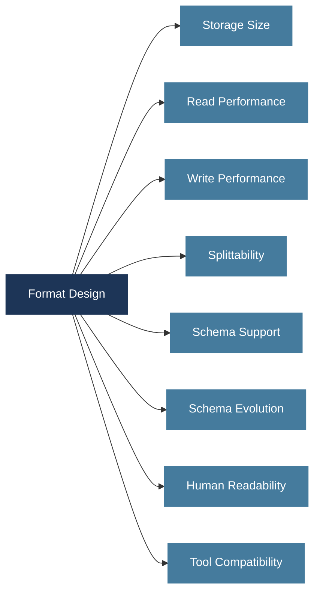

---

## 2. CSV -- Comma-Separated Values

The simplest, oldest, and most universally understood file format in data engineering.

```
StudentID,Name,Department,CGPA,EnrollmentYear
101,Ali Hassan,Computer Science,3.7,2022
102,Sara Ahmed,Data Science,3.9,2021
103,Bilal Khan,Computer Science,3.4,2023
```

Pure plain text. Values separated by commas. Each line is one record. First line is typically the header.

### Strengths

| Strength | Why It Matters |
|----------|---------------|
| Universal compatibility | Every data tool ever built can read CSV. The lingua franca of data exchange. |
| Human readable | Open in Notepad and immediately understand the contents. Invaluable for debugging. |
| Zero setup | No libraries, no parsers, no schema definitions needed. Any language with string splitting works. |

### Weaknesses

| Weakness | Impact |
|----------|--------|
| No schema in the file | Column names are just strings. No type info. Is CGPA a float or a string? Every reader must guess. |
| No compression | Text encoding is wasteful. The number 3.14159 is 7 bytes as text but 8 bytes as a binary float (and compressible). At petabyte scale this is enormous. |
| Unsafe splitting | A field value containing a newline character (legal in CSV if quoted) will corrupt both halves if naively split. |
| Slow for analytics | To query 3 columns out of 100, the system must read and parse all 100 columns then discard 97. Massive wasted I/O. |
| No complex types | Arrays, nested objects, maps cannot be represented natively. Must be encoded as strings and parsed manually. |

> CSV is ideal for small datasets and cross-system data exchange. Its problems only emerge at scale. The skill is knowing when to graduate to a better format.

---

## 3. JSON -- JavaScript Object Notation

Already covered as a data type. Now examined specifically as a file format for Big Data storage.

### Two Variants -- Critical Distinction

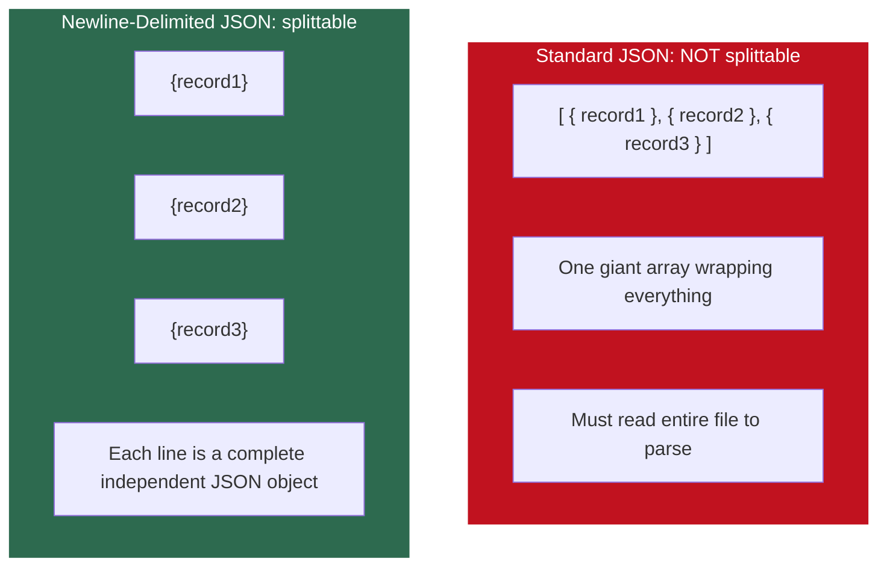

**Always use newline-delimited JSON (NDJSON / JSON Lines) in Big Data systems.** Each line can be processed independently, making the file splittable for parallel processing.

```json
{"studentID": 101, "name": "Ali Hassan", "department": "CS", "skills": ["Python", "SQL"]}
{"studentID": 102, "name": "Sara Ahmed", "department": "DS", "certifications": ["AWS"]}
```

Notice: Ali has an `address` field, Sara has `certifications`. Different records, different fields. This is the core strength of JSON.

### Strengths and Weaknesses

| Strengths | Weaknesses |
|-----------|-----------|
| Schema flexibility: different records can have different fields | Large file size: field names are repeated in every single record |
| Human readable and self-describing | Slow parsing: character-by-character text parsing is expensive at scale |
| Native support for arrays, nested objects, mixed types | No built-in compression |
| No transformation needed when ingesting from REST APIs | Inconsistent type system: no date type, no distinction between int and float |

### The Field Name Repetition Problem

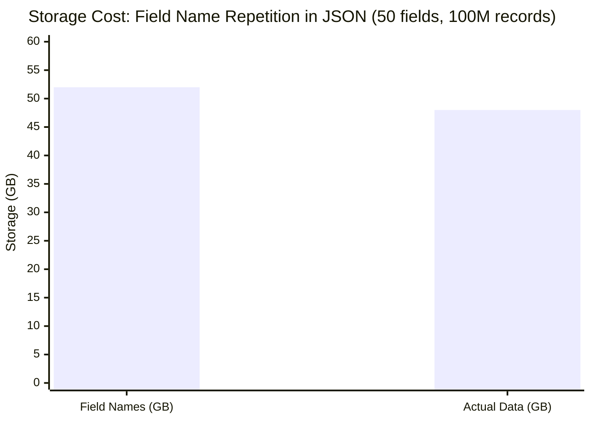

In a dataset with 50 fields and 100 million records, field names alone can consume more storage than the actual data. This is why binary formats like Avro and Parquet were developed.

---

## 4. Avro -- The Serialization Champion

Apache Avro is the first binary format in this lecture. It represents a fundamentally different design philosophy.

### What Is Serialization?

**Serialization** is converting an in-memory data structure (an object, a record) into a sequence of bytes for storage or transmission. **Deserialization** is the reverse.

Every time data moves between memory and disk or network, it must be serialized and deserialized. Slow serialization is a bottleneck in high-throughput pipelines.


### Avro's Design

Avro is a **binary, row-based format**. Data is stored row by row in binary (not text). Each Avro file starts with a schema definition written in JSON, followed by binary-encoded data records.

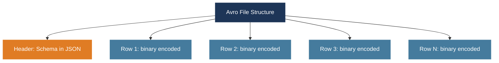

### Schema Evolution -- Avro's Killer Feature

Schema evolution means old readers can read new data and new readers can read old data. Avro defines rules for compatible schema changes.

**The problem without schema evolution:**

You have 6 months of historical data (hundreds of TBs) in Avro. Your app adds a new `sessionID` field.

Without schema evolution, your choices are:
- Reprocess all historical data to add the new field (expensive, time-consuming)
- Maintain two separate pipelines with two schemas (complex, error-prone)

**With Avro schema evolution:**

Add `sessionID` with a default value of `null`. Old data: missing field filled with default. New data: includes actual sessionID. One pipeline. No reprocessing.

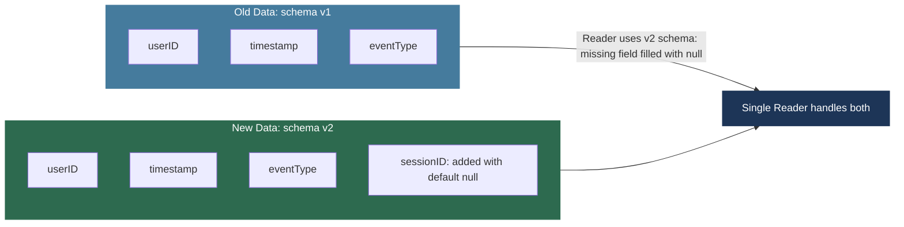

### When to Use Avro

| Best For | Avoid When |
|----------|-----------|
| Message passing systems (Kafka + Schema Registry) | Analytical queries needing only specific columns |
| Streaming data ingestion pipelines | Human readability is required |
| Systems with frequently evolving schemas | Primary workload is aggregations over large datasets |
| Write-heavy workloads where rows are the unit of access | |

---

## 5. Parquet -- The Analytics Powerhouse

Apache Parquet is the most important file format in modern Big Data engineering. It is the de facto standard for analytical workloads in Spark, Hadoop, and cloud data lakes.

### Row-Based vs Columnar Storage

This is the core concept behind Parquet's power.

**The same student table stored two different ways:**

| StudentID | Name | Department | CGPA |
|-----------|------|------------|------|
| 101 | Ali | CS | 3.7 |
| 102 | Sara | DS | 3.9 |
| 103 | Bilal | CS | 3.4 |

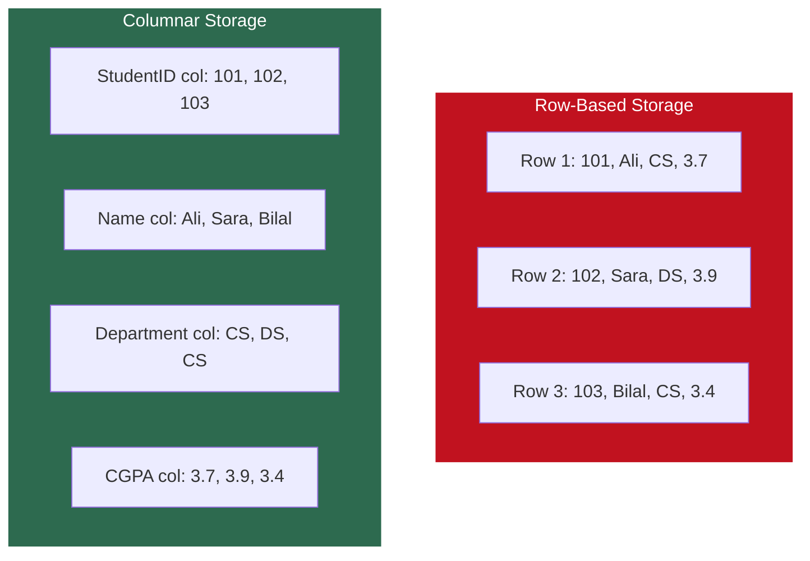

Same data. Completely different physical layout on disk.

### Why Columnar Wins for Analytics

Consider this query on a 100-column, 500 million row table:

```sql
SELECT AVG(CGPA) FROM Students WHERE Department = 'CS'
```

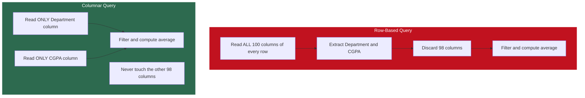

**Result: columnar reads approximately 2% of what row-based reads for this query. Roughly 50x less I/O.**

### OLTP vs OLAP -- When Each Wins

| | OLTP (Online Transaction Processing) | OLAP (Online Analytical Processing) |
|--|--------------------------------------|--------------------------------------|
| Typical operation | Fetch a complete record by ID | Aggregate specific columns across millions of rows |
| Columns needed | All columns of one row | 2-5 columns of millions of rows |
| Best format | Row-based (all fields together) | Columnar (read only needed columns) |
| Examples | MySQL, PostgreSQL | Parquet, ORC, Snowflake, BigQuery |

> Row-based formats are optimal for OLTP. Columnar formats are optimal for OLAP. Now you understand why relational databases are row-based but data warehouses are columnar.

### Columnar Compression Advantage

Columnar storage also achieves dramatically better compression because all values in a column share the same type and tend to be similar in value.

**Example: Department column with 15 values**

```
CS, DS, CS, CS, CS, DS, CS, DS, CS, CS, CS, CS, DS, CS, CS
```

Run-length encoding or dictionary encoding reduces this to essentially two entries. In row-based storage the compressor sees a mix of different data types and values -- compression is far less effective.

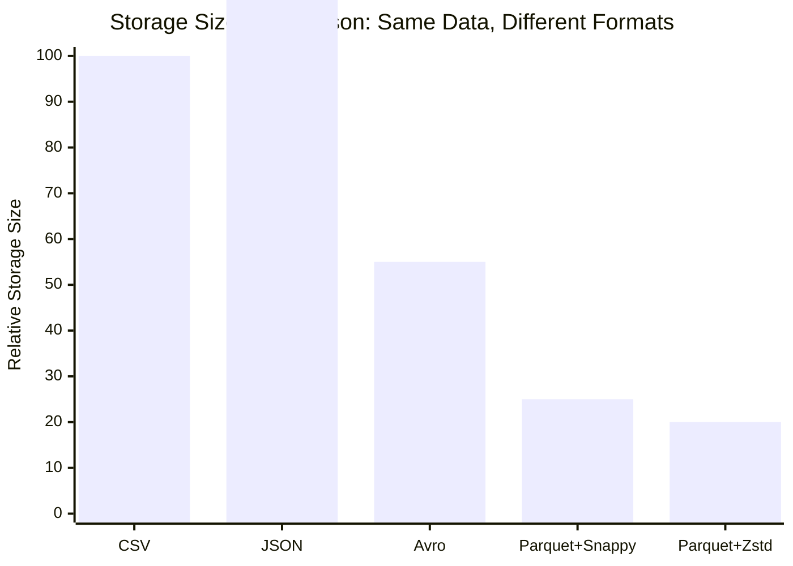

### Parquet Internal Structure

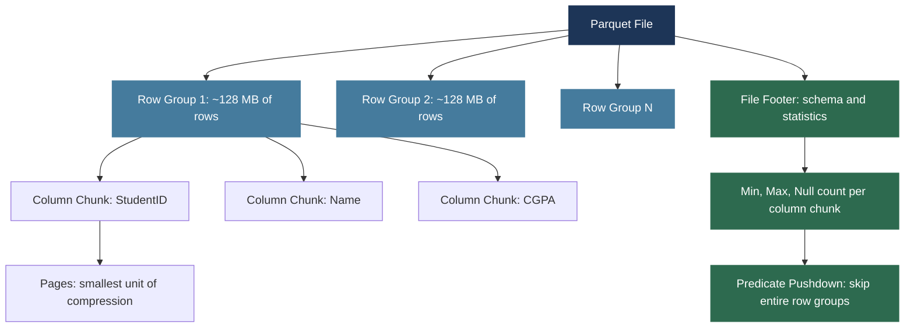

**Predicate pushdown example:** If a row group's minimum CGPA is 3.5 and a query asks for `CGPA < 3.0`, the entire row group is skipped without reading a single data page. Parquet files essentially index themselves via the footer.

### When to Use Parquet

| Best For | Notes |
|----------|-------|
| Analytical queries: aggregations, filtering, grouping | The default choice for analytics |
| Apache Spark workloads | Spark's native preferred format |
| Data warehouses and data lakes | Supported by Spark, Hive, Presto, BigQuery, Snowflake, Athena |
| Long-term archival with query efficiency | Outstanding compression ratio |

---

## 6. ORC -- Optimized Row Columnar

ORC is Apache Hive's answer to the same problem Parquet solves. Also a columnar binary format, developed by Hortonworks specifically for Hive optimization.

### ORC vs Parquet

| Dimension | ORC | Parquet |
|-----------|-----|---------|
| Storage format | Columnar, binary | Columnar, binary |
| Compression | Excellent, slight edge for Hive | Excellent, slight edge for Spark |
| Indexing | More sophisticated: lightweight indexes, bloom filters, multi-level statistics | Footer-based statistics |
| Best ecosystem | Apache Hive | Apache Spark, cross-tool |
| Cross-tool support | Good | Excellent: BigQuery, Snowflake, Athena, Presto |
| New systems default | Use Parquet unless Hive-heavy | Yes, default choice today |

> In practice: if building a new system today, Parquet is the default. ORC remains important in organizations with heavy Hive investment.

---

## 7. Full Format Comparison

| Format | Type | Human Readable | Schema Stored | Splittable | Compression | Best For |
|--------|------|---------------|---------------|------------|-------------|---------|
| CSV | Row, text | Yes | No | Unsafe | None native | Small data, interchange |
| JSON | Row, text | Yes | Self-describing | NDJSON only | None native | APIs, semi-structured |
| Avro | Row, binary | No | Yes | Yes | Medium | Streaming, schema evolution |
| Parquet | Columnar, binary | No | Yes | Yes | Very high | Analytics, Spark, data lakes |
| ORC | Columnar, binary | No | Yes | Yes | Very high | Hive analytics |

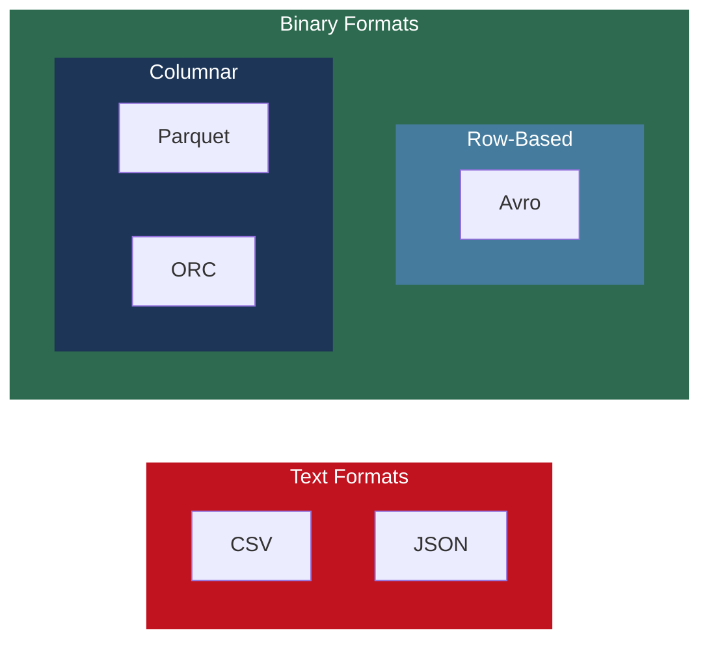

---

## 8. Serialization and Compression

### Text vs Binary Serialization

| | Text Serialization | Binary Serialization |
|--|-------------------|---------------------|
| Used by | CSV, JSON, XML | Avro, Parquet, ORC, Protocol Buffers |
| Human readable | Yes | No |
| Efficiency | Low: integer 1000000 = 7 bytes | High: same integer = 4 bytes |
| Parse speed | Slow: character-by-character | Fast: direct memory mapping |

### Encoding Strategies Inside Binary Formats

Parquet and ORC automatically select the best encoding per column based on data type and value distribution.

| Encoding | How It Works | Best For |
|----------|-------------|---------|
| Dictionary encoding | Store unique values once in a dictionary, encode each occurrence as an integer index | Columns with few distinct values (e.g., Department: CS, DS, EE) |
| Run-length encoding (RLE) | Store value once with a count: CS,CS,CS,CS becomes (CS, 4) | Columns with many consecutive repeated values |
| Delta encoding | Store differences between consecutive values, not absolute values | Timestamps, sequential IDs |
| Bit packing | If column has values 0-7, pack each in 3 bits instead of 8 | Integer columns with small value ranges |

### Compression Algorithms

| Algorithm | Speed | Ratio | Splittable | Notes |
|-----------|-------|-------|------------|-------|
| Gzip | Slow | High (70-80% reduction) | No | Classic but not splittable as standalone. Bottleneck in parallel systems. |
| Snappy | Very fast | Moderate (20-30% reduction) | Yes (inside Parquet/ORC) | Google-developed. Speed over ratio. Dominant in production Spark. |
| LZO | Fast | Good | Yes (with index) | Used in older Hadoop deployments. |
| Zstandard (Zstd) | Fast (like Snappy) | High (like Gzip) | Yes (inside Parquet/ORC) | Facebook-developed. Best of both worlds. The modern default for new systems. |

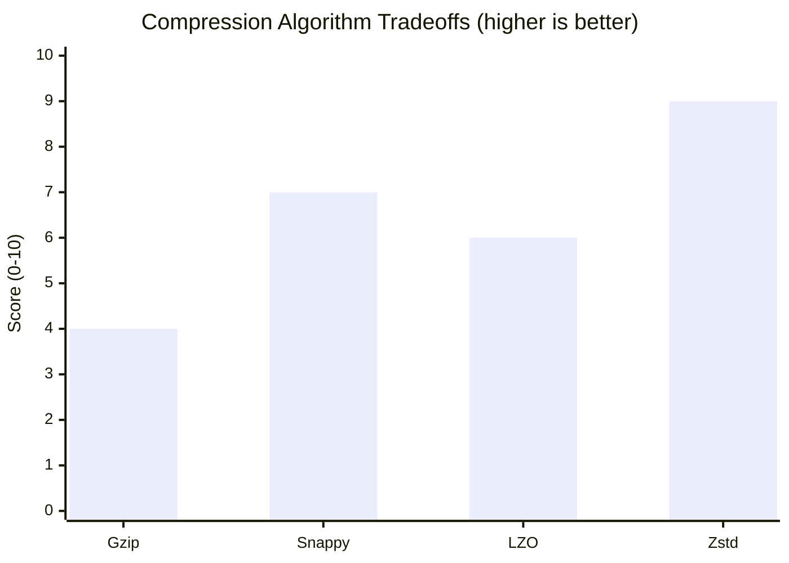

> Zstd achieves compression ratios close to Gzip at speeds comparable to Snappy. It is rapidly becoming the preferred choice in new Big Data deployments. Legacy systems still use Snappy and Gzip due to migration costs.

### The Columnar Compression Effect

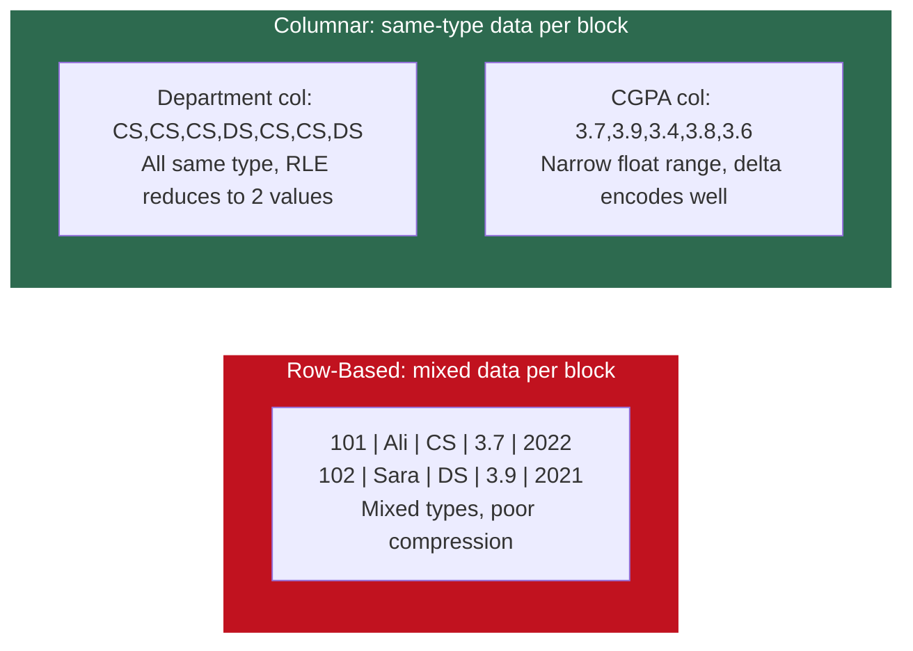

A TransactionType column with only three possible values (PURCHASE, REFUND, WITHDRAWAL) across 10 million records compresses to almost nothing in columnar storage. Row-based storage cannot exploit this because it sees mixed data in every block.

---

## 9. Choosing the Right Format

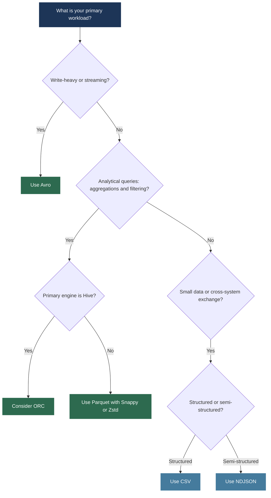

### The Most Common Production Pattern

In most production Big Data systems, both Avro and Parquet are used together in different layers of the same pipeline:


Avro for ingestion. Convert to Parquet for the analytical layer. This is the most common pattern in production systems today.

---

*BDA Spring 2026 | Week 2, Lecture 2 | File Formats, Compression and Serialization*
