# Big Data Analytics (BDA Spring 2026)
## Week 3, Lecture 1: Relational Storage Model, B+ Trees and Hash Indexes

> Most developers use databases every day without understanding how they actually work internally. For simple applications that is fine. But when dealing with Big Data, that ignorance becomes expensive. Queries that should take milliseconds take minutes. This week we open the black box.

---

## Table of Contents

1. [How Relational Databases Actually Store Data](#1-how-relational-databases-actually-store-data)
2. [Indexing: The Concept](#2-indexing-the-concept)
3. [B+ Tree Index](#3-b-tree-index)
4. [Hash Index](#4-hash-index)
5. [B+ Tree vs Hash Index](#5-b-tree-vs-hash-index)
6. [Composite Indexes and Index Selection](#6-composite-indexes-and-index-selection)

---

## 1. How Relational Databases Actually Store Data

### The Page: Fundamental Unit of Storage

When you execute `INSERT INTO Students VALUES (101, 'Ali', 3.7)`, the data does not go into a simple text file. It goes into a **page**.

A **page** (also called a block) is a fixed-size chunk of disk storage. It is the smallest unit a database reads from or writes to disk. The database never reads a single row directly; it always reads an entire page.

| Database | Default Page Size |
|----------|-----------------|
| MySQL InnoDB | 16 KB |
| PostgreSQL | 8 KB |
| SQL Server | 8 KB |
| Oracle | 8 KB (configurable up to 32 KB) |

Why fixed-size pages? Disk I/O is most efficient when reading and writing aligned, fixed-size blocks. Random access to arbitrary byte offsets is slow. Reading aligned fixed-size pages is fast and predictable.

### Page Internal Structure

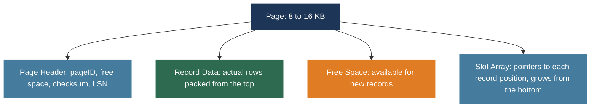

The slot array at the bottom of the page contains pointers to each record's position. This allows records to be moved within a page during updates without changing their external identifiers.

**When inserting:** find a page with sufficient free space, write the record, add a slot entry.

**When a page fills up:** allocate a new page. Over time a table spans thousands or millions of pages.

**Page fragmentation:** as records are deleted, pages develop gaps. Database administrators run `VACUUM` (PostgreSQL) or `OPTIMIZE TABLE` (MySQL) periodically to reclaim this space.

### Heap Storage: The Default Table Organization

By default, relational databases store tables as **heap files**, which are unordered collections of pages where records are inserted wherever space is available.

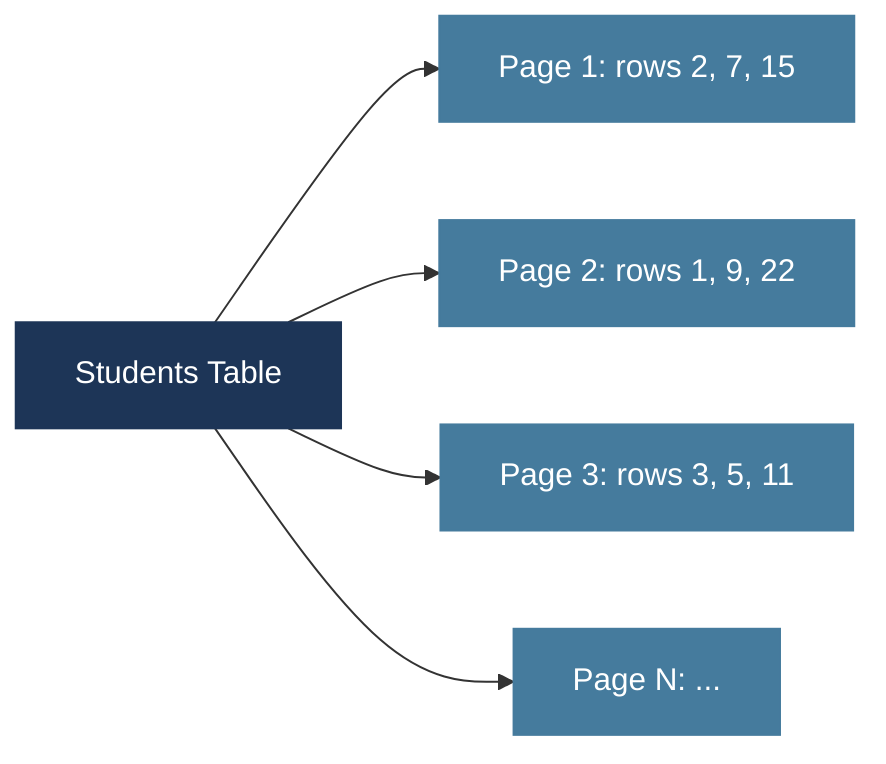

Row 1 might be on page 5. Row 2 might be on page 1. Row 3 might be on page 12. There is no guaranteed order.

| Operation | Heap Storage Behavior |
|-----------|----------------------|
| Insert | Fast: find any page with free space and write |
| Full table scan | Expensive: must read every single page to find a record without an index |
| Filtered query with no index | Must scan all pages, check every record |

**The numbers:** For a table with 10 million students at 96 bytes per row, a 16KB page holds approximately 170 rows. That is 59,000 pages. A query for one row without an index requires reading all 59,000 pages, nearly 1 GB of I/O, potentially several seconds. With a B+ Tree index, the same query takes 3 to 4 disk reads. That is the power of indexing.

### Row-Based Physical Layout

Each row is encoded contiguously on disk:

```
[4 bytes: StudentID] [50 bytes: Name] [30 bytes: Department] [8 bytes: CGPA] [4 bytes: Year]
= 96 bytes per row
```

All fields of one record are stored together. This is row-based storage: efficient for fetching complete records but wasteful for analytical queries that need only a few columns (as covered in Week 2 with Parquet).

---

## 2. Indexing: The Concept

An **index** is a separate data structure maintained alongside the actual table data that allows the database to find records matching a condition without scanning the entire table.

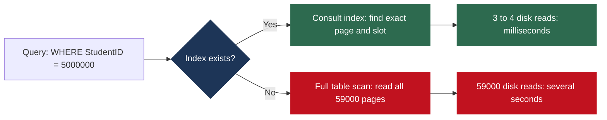

Think of it like a textbook index. You do not read the whole book to find "distributed systems." You look it up in the index, get page numbers 45, 78, 134, and go directly there.

### The Cost of Indexes

Indexes are not free. Every index:
- Consumes additional storage
- Must be updated on every INSERT, UPDATE, and DELETE

A table with 10 indexes requires 11 write operations per insert: one to the table and one to each index. Indexes improve read performance at the direct cost of write performance and storage.

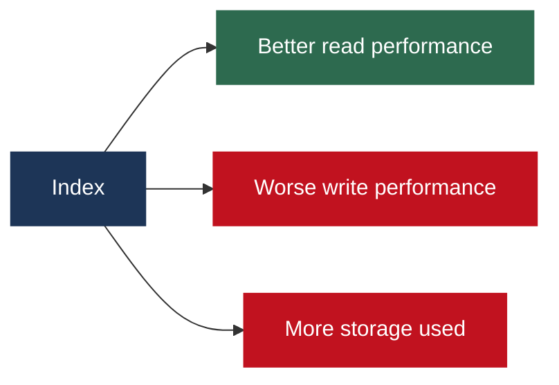

Senior engineers spend significant time deciding which indexes to create and which to drop. Over-indexing a write-heavy table is a common and costly mistake.

---

## 3. B+ Tree Index

The B+ Tree is the most important index structure in computer science. It underlies virtually every relational database ever built: MySQL, PostgreSQL, Oracle, SQL Server, SQLite.

### Why Not Simpler Structures?

**Sorted array:** Binary search gives O(log n) lookups but insertions are O(n). Inserting into the middle of 10 million entries requires shifting millions of elements. Completely impractical for a live database.

**Binary Search Tree:** O(log n) search and insert, but two problems:

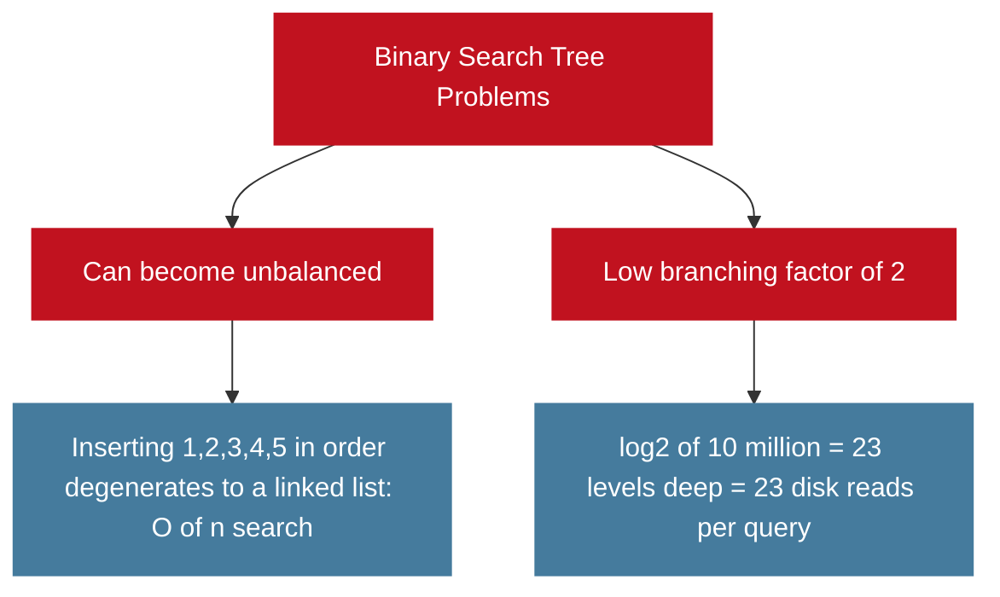

B+ Trees solve both problems with a **high branching factor**. With branching factor 500 over 10 million records: log500(10,000,000) = 3 levels. Only 3 disk reads instead of 23.

### B+ Tree Node Types

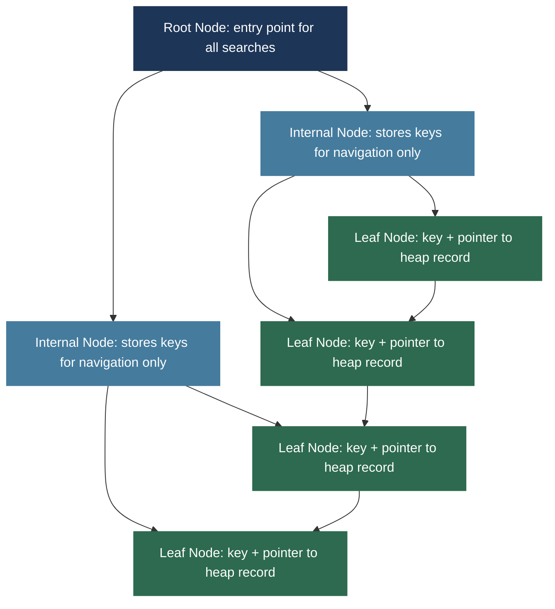

| Node Type | What It Stores | Purpose |
|-----------|---------------|---------|
| Root | Keys only | Entry point for every search |
| Internal nodes | Keys only | Navigate toward the right leaf |
| Leaf nodes | Keys + pointers to heap records | Actual data locations |

Two defining characteristics of B+ Trees (vs plain B Trees):
1. **All data pointers are in leaf nodes only.** Internal nodes contain keys for routing, nothing else.
2. **Leaf nodes are linked in a sorted doubly-linked list.** This is what makes range queries efficient.

### Searching a B+ Tree

Example: search for `StudentID = 55` in a tree with branching factor 3.

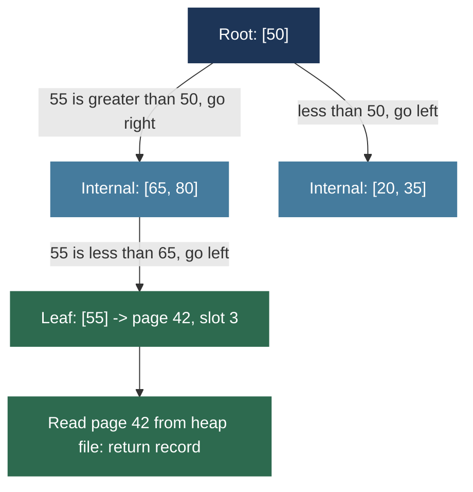

Total: 3 node accesses root, one internal node, one leaf. For a real B+ Tree with branching factor 500 and millions of records, this is still only 3 to 4 levels deep.

### Range Queries: Where B+ Trees Truly Shine

Query: `SELECT * FROM Students WHERE StudentID BETWEEN 25 AND 70`


Leaf nodes are already sorted and already linked. Walking the list is the only overhead after the initial search. No matter how wide the range, this is highly efficient.

### Insertion and Self-Balancing

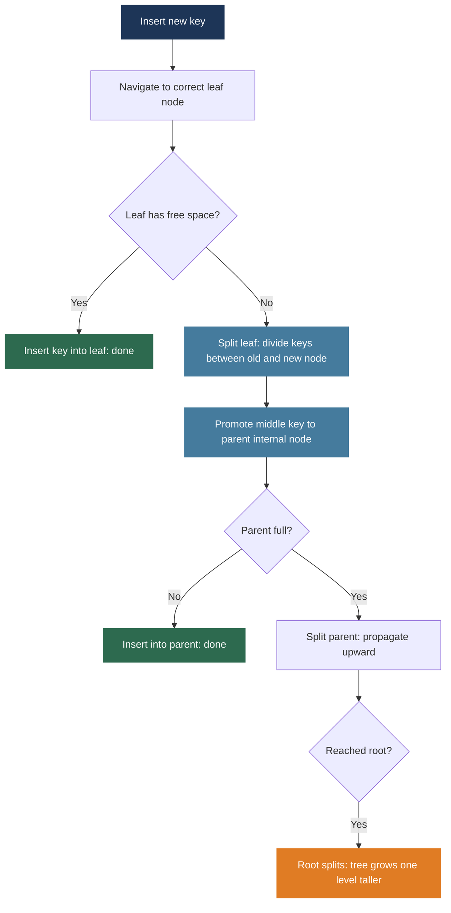

The tree grows from the root upward, not from the bottom. Every leaf node is always at the same depth. The tree is always balanced regardless of insertion order. Search time is always O(log n).

### B+ Tree Performance Summary

| Operation | Time Complexity | Notes |
|-----------|----------------|-------|
| Point search (equality) | O(log n) | 3 to 4 disk reads for millions of records |
| Range query | O(log n + k) | k = number of results returned |
| Insert | O(log n) | May trigger splits propagating upward |
| Delete | O(log n) | May trigger merges propagating upward |
| ORDER BY | Free | Leaf nodes already sorted |
| MIN / MAX | O(log n) | Leftmost or rightmost leaf |

---

## 4. Hash Index

A Hash Index uses a hash function to map each key to a specific location called a **bucket**, then stores record pointers in those buckets.

### How Hash Indexes Work


The hash computation takes nanoseconds. The bucket is at a calculated location. This is effectively O(1), constant time regardless of table size. Compare to B+ Tree's O(log n).

### The Critical Limitation: No Range Queries

Hash functions deliberately destroy order information. Two adjacent keys in sorted order can hash to completely different buckets.

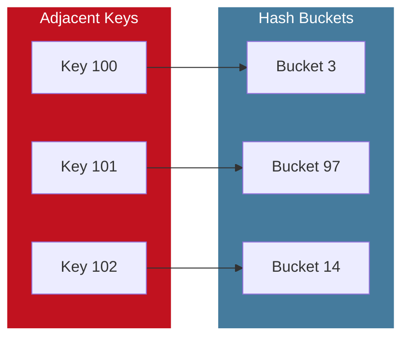

For `WHERE StudentID BETWEEN 100 AND 200`, there is no way to navigate from bucket 3 to bucket 97 to bucket 14 in order. The hash index is useless. The database falls back to a full table scan.

**Queries hash indexes cannot support:**

| Query Type | Example | Why It Fails |
|------------|---------|-------------|
| Range query | `WHERE price > 50` | Order information is destroyed |
| Prefix query | `WHERE name LIKE 'Ali%'` | No sorted order to traverse |
| Sorting | `ORDER BY studentID` | Buckets have no sequential relationship |
| Min / Max | `SELECT MAX(cgpa)` | Cannot find boundary values |

### Hash Collisions

When two different keys hash to the same bucket, a collision occurs. This is unavoidable.

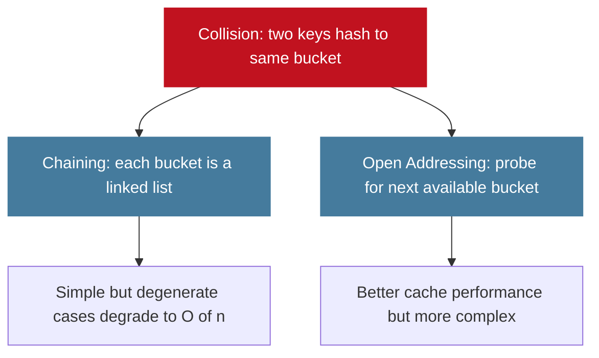

Production hash indexes use sophisticated bucket management to maintain O(1) average performance even with many collisions.

### Where Hash Indexes Are Used

| System | How Hash Indexes Are Used |
|--------|--------------------------|
| Redis | Hash tables internally for its hash data structure |
| PostgreSQL | Explicit hash index type for large equality-based queries on high-cardinality columns (crash-safe since version 10 in 2017) |
| SQL Server In-Memory OLTP | Primary index type for memory-resident tables |
| Database join operations | Temporary hash tables built during hash join execution to accelerate joins |

---

## 5. B+ Tree vs Hash Index

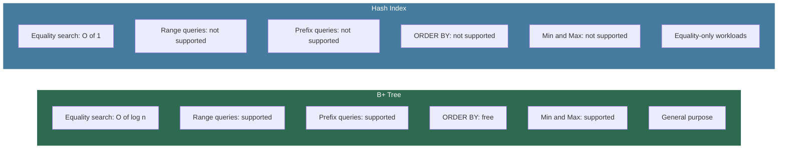

| Feature | B+ Tree | Hash Index |
|---------|---------|-----------|
| Equality search | O(log n): fast | O(1): very fast |
| Range queries | Supported, efficient | Not supported |
| Prefix queries | Supported | Not supported |
| ORDER BY output | Supported, free | Not supported |
| Min / Max queries | O(log n) | Not supported |
| Insert / Delete | O(log n) with rebalancing | O(1) average |
| Storage overhead | Moderate | Low |
| Default in RDBMS | Yes | No |
| Best use case | General purpose | Pure equality lookups |

> **Interview answer:** B+ Trees are the default because they support both equality and range queries efficiently, maintain sorted order for ORDER BY and GROUP BY, and guarantee O(log n) for all operations while staying balanced regardless of insertion order. Hash indexes achieve O(1) equality lookups but cannot support range queries, prefix matching, or sorted output, making them unsuitable as a general-purpose index. B+ Trees sacrifice a small amount of equality speed but this tradeoff is overwhelmingly worthwhile for general workloads.

---

## 6. Composite Indexes and Index Selection

### Composite Indexes

A composite index is built on multiple columns simultaneously.

```sql
CREATE INDEX idx_dept_cgpa ON Students (Department, CGPA);
```

This creates a B+ Tree where the sort key is `(Department, CGPA)`, sorted first by Department, then by CGPA within each department.

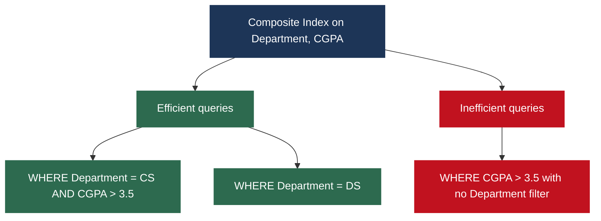

### The Leftmost Prefix Rule

A composite index can be used efficiently only when the query filters on the **leftmost columns** of the index, in order. Column order in composite indexes matters enormously.

For index on `(Department, CGPA)`:

| Query | Uses Index? | Why |
|-------|-------------|-----|
| `WHERE Department = 'CS' AND CGPA > 3.5` | Yes, fully | Filters on both columns left to right |
| `WHERE Department = 'CS'` | Yes, partially | Filters on leftmost column |
| `WHERE CGPA > 3.5` | No | Skips leftmost column Department |

### Index Selection Strategy

| Principle | Explanation |
|-----------|-------------|
| Index high-selectivity WHERE columns | Columns that eliminate most rows when filtered are the most valuable to index |
| Index JOIN columns | Join performance improves dramatically when join columns are indexed on both tables |
| Index ORDER BY and GROUP BY columns | If the index provides the needed sort order, the expensive sort step is skipped |
| Do not over-index | Every index costs write performance and storage. A write-heavy table with 20 indexes will have terrible insert performance. |
| Monitor query plans | Use `EXPLAIN` in PostgreSQL or MySQL to see whether queries are using indexes and at what cost. Real tuning is empirical. |

---

### The Complete Storage Picture

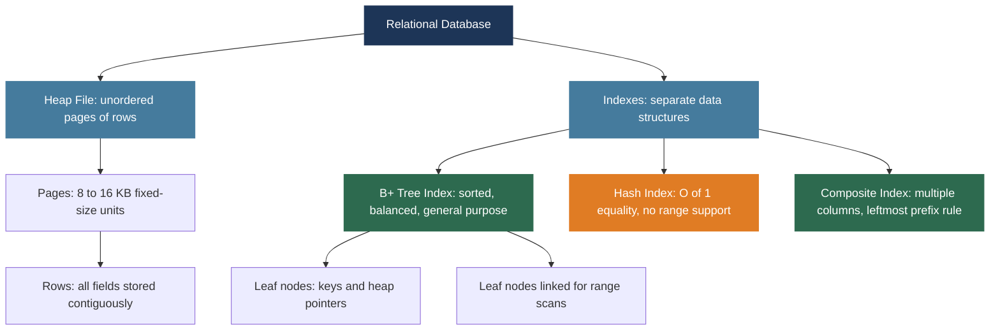

---

*BDA Spring 2026 | Week 3, Lecture 1 | Relational Storage Model, B+ Trees and Hash Indexes*
