# Big Data Analytics (BDA Spring 2026)
## Week 3, Lecture 2: LSM Trees, Columnar Storage, In-Memory Analytics and Vector Databases

> Last class we opened the black box of relational storage. Today we make a major conceptual leap into modern distributed storage systems. By the end of this lecture you will understand why Cassandra, HBase, RocksDB, and every major modern NoSQL system abandoned B+ Trees entirely and what they replaced them with.

---

## Table of Contents

1. [The Write Problem with B+ Trees](#1-the-write-problem-with-b-trees)
2. [LSM Trees: The Architecture](#2-lsm-trees-the-architecture)
3. [Columnar Storage: Internal Architecture](#3-columnar-storage-internal-architecture)
4. [In-Memory Analytics](#4-in-memory-analytics)
5. [Vector Databases](#5-vector-databases)
6. [The Complete Storage Engine Landscape](#6-the-complete-storage-engine-landscape)

---

## 1. The Write Problem with B+ Trees

### Write-Heavy Workloads

Consider these real systems and their write demands:

| System | Write Volume |
|--------|-------------|
| IoT sensor network: 10 million devices, 1 reading per second | 10 million writes per second |
| Social media platform: posts, likes, comments | Millions of writes per second |
| Financial trading system | Hundreds of thousands of transactions per second |
| Application logging: thousands of servers | Millions of log events per second |

All of these are **write-heavy workloads**. Now consider what happens when you try to handle them with a B+ Tree.

### Write Amplification in B+ Trees

Every single insert into a B+ Tree requires:

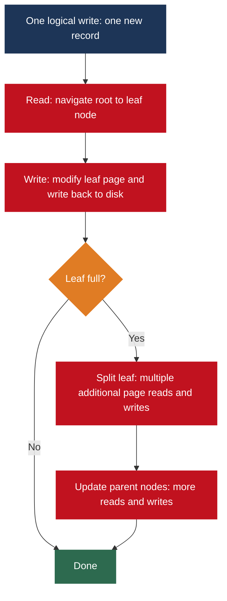

One logical write causes **multiple physical disk writes**. This is called **write amplification**.

### Why Random Writes Are Catastrophically Slow

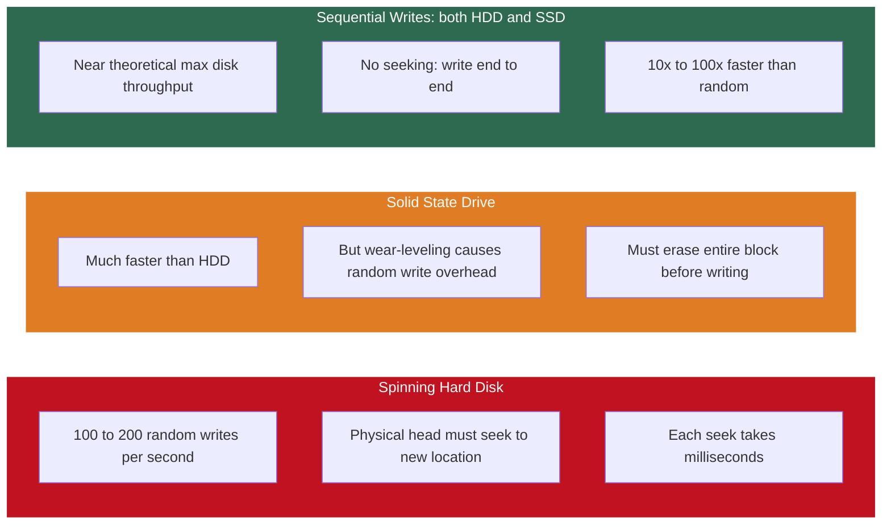

At 10 million writes per second, a B+ Tree on spinning disk is simply not viable. The question engineers at Google and Facebook were asking in the mid-2000s: **can we design a storage engine that converts all random writes into sequential writes?**

The answer was the **Log-Structured Merge Tree**.

---

## 2. LSM Trees: The Architecture

The LSM Tree was described by Patrick O'Neil et al. in a 1996 paper and became enormously influential when Google's Bigtable paper (2006) and open-source systems like LevelDB, RocksDB, Cassandra, and HBase adopted it.

**Core insight:** never modify data on disk. Accumulate writes in memory. Flush periodically to disk as immutable sorted files. Merge files in the background.

### Step 1: The MemTable

When a write arrives, the LSM Tree does NOT write to disk. It writes to the **MemTable**: an in-memory sorted data structure (typically a skip list or red-black tree).


The **Write-Ahead Log (WAL)** is appended sequentially: always writing to the end of a file, never to a random location. If the system crashes, the MemTable is lost but the WAL survives. On restart, replay the WAL to reconstruct the MemTable. **Durability is guaranteed.**

> PostgreSQL uses the exact same WAL pattern. The principle is universal: sequential writes are fast and durable; in-memory structures are fast but volatile; combine them to get both.

### Step 2: SSTables

When the MemTable reaches its size limit (typically 64 MB to 256 MB), it is **flushed** to disk as an immutable **SSTable** (Sorted String Table).

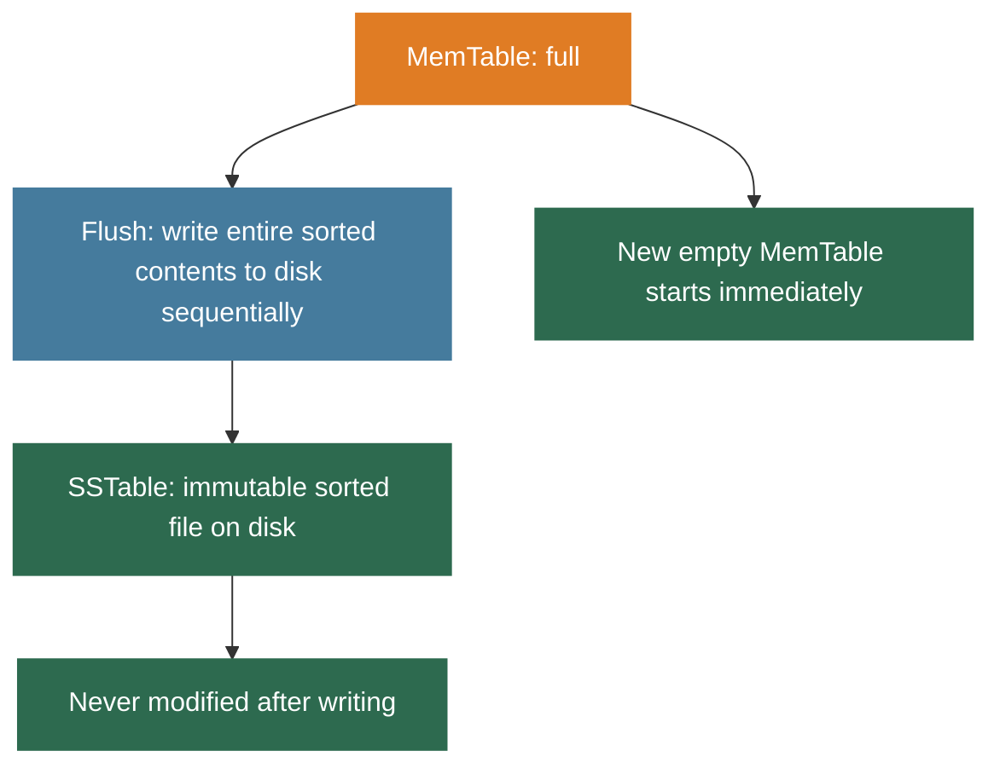

The flush is **fully sequential**: writing from the beginning to the end of the file without seeking. Because SSTables are never modified, there is no random write problem.

**Updates in LSM Trees:** if key7 is updated, a new version of key7 is written to a new SSTable. The old version in a previous SSTable is not touched. LSM Trees are **append-only**. The most recent version is determined at read time by comparing timestamps.

**Deletions in LSM Trees:** a special **tombstone** record is written. The actual data is removed during compaction.

### Step 3: Compaction

Over time, accumulating many SSTables causes three problems:

| Problem | Cause |
|---------|-------|
| Read performance degrades | Must check MemTable, then SSTable 1, SSTable 2, ... SSTable N for every key |
| Space is wasted | If key7 was updated 50 times, 50 SSTables each hold a version; only 1 is valid |
| Too many open files | OS has limits on file handles; scanning many files is expensive |

**Compaction** merges multiple SSTables into a single new SSTable, keeping only the most recent version of each key and physically deleting tombstoned records.

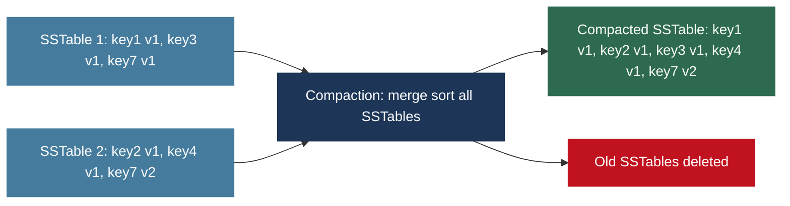

Compaction is **entirely sequential** I/O. It runs as a **background process** without blocking reads or writes, because SSTables are immutable.

### Compaction Strategies

| Strategy | Used By | How It Works | Trade-off |
|----------|---------|-------------|-----------|
| Size-tiered | Apache Cassandra (default) | Merge SSTables of similar size into one larger SSTable | Simple; can temporarily double storage during compaction |
| Leveled | LevelDB, RocksDB | SSTables organized into levels: L0 (recent), L1 (10 MB), L2 (100 MB), etc. Compaction merges L-N into L-(N+1) | Better read performance and more predictable space usage; more complex |

### Step 4: The Read Path

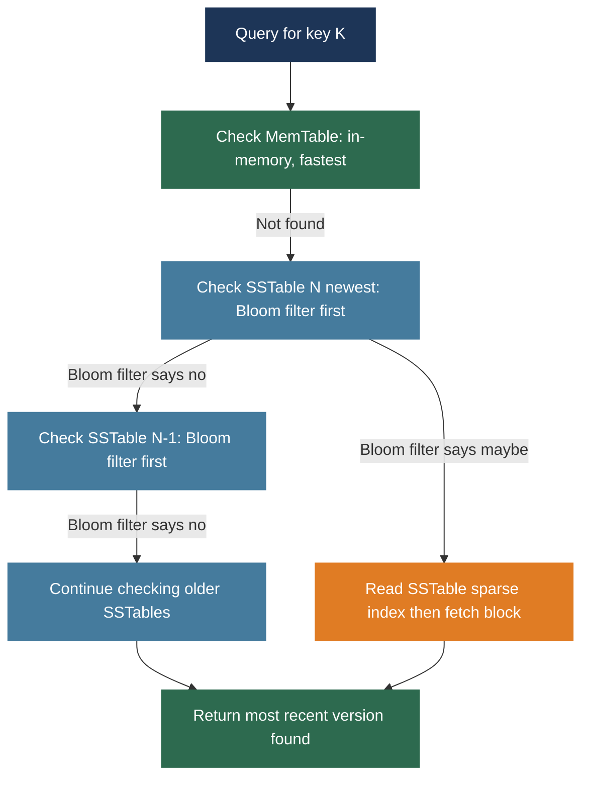

**Bloom filters** are probabilistic data structures that can quickly determine whether a key is **definitely NOT** in an SSTable, without reading the SSTable at all. They are a critical read optimization. (Covered in depth in Week 9.)

**The fundamental tradeoff:**

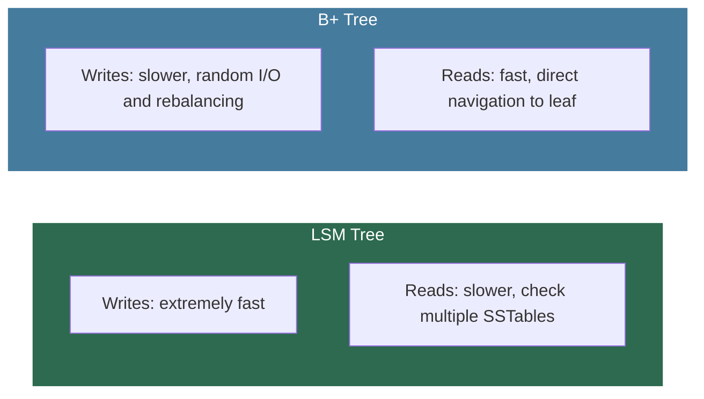

LSM Trees optimize writes at the cost of reads. B+ Trees optimize reads at the cost of writes.

### Systems Built on LSM Trees

| System | Use Case |
|--------|---------|
| Apache Cassandra | Distributed NoSQL database; powers Instagram, Netflix, Apple |
| Apache HBase | Hadoop column-family database; modeled on Google Bigtable |
| LevelDB | Google embedded key-value store; used in Chrome's IndexedDB |
| RocksDB | Facebook fork of LevelDB; used in MySQL MyRocks and many others |
| Apache Kafka | Log-structured storage for its message log |

---

## 3. Columnar Storage: Internal Architecture

Week 2 covered why columnar formats like Parquet and ORC exist. Now we go inside and understand how they actually work.

### Physical Layout

The same five-row student table stored two different ways:

**Row-based layout:**
```
Page: [101|Ali|CS|3.7] [102|Sara|DS|3.9] [103|Bilal|CS|3.4] [104|Zara|DS|3.8] [105|Omar|CS|3.6]
```

**Columnar layout:**
```
StudentID file: [101][102][103][104][105]
Name file:      [Ali][Sara][Bilal][Zara][Omar]
Department file:[CS][DS][CS][DS][CS]
CGPA file:      [3.7][3.9][3.4][3.8][3.6]
```

Each column is stored independently. To read one column, zero bytes are read from any other column.

### Column Encoding Strategies

Columnar storage achieves dramatic compression by applying the best encoding for each column's data characteristics. Parquet and ORC choose encoding per column automatically.

#### Dictionary Encoding: For Low-Cardinality Columns


For 10 million rows with 5 distinct values, dictionary encoding reduces storage by 95% or more.

#### Run-Length Encoding: For Columns with Consecutive Repeats

```
Original:    [CS][CS][CS][DS][DS][CS][CS][CS][CS][DS]
RLE encoded: [(CS,3), (DS,2), (CS,4), (DS,1)]
```

10 values compressed to 4 pairs: 60% reduction. For sorted data with millions of consecutive identical values, RLE achieves extraordinary compression.

#### Delta Encoding: For Monotonically Increasing Values

```
Original timestamps:  [1000000, 1000001, 1000003, 1000007, 1000008]
Delta encoded:        [1000000, +1, +2, +4, +1]
```

Deltas are tiny integers that compress very efficiently. Critical for timestamp columns in event logs.

#### Bit Packing: For Columns with Limited Value Ranges

```
Values 0-7 need only 3 bits, not 8 bits per value.
8-bit: [000][001][010][011][100] = 5 bytes
3-bit: [000 001 010 011 100]    = 2 bytes (roughly)
```

### Encoding Comparison

| Encoding | Best For | Example Column | Compression Gain |
|----------|---------|---------------|-----------------|
| Dictionary | Low-cardinality: few distinct values | Department: CS, DS, EE | Up to 95% for 5 distinct values in 10M rows |
| Run-Length (RLE) | Sorted data with consecutive repeats | Status after sorting | 60-90% depending on run lengths |
| Delta | Monotonically increasing sequences | Timestamps, sequential IDs | 50-80% for typical event logs |
| Bit Packing | Small integer ranges | Rating: 1-5, Day of week: 0-6 | 37-87% depending on range |

### Predicate Pushdown

Each column file maintains statistics at the page level: minimum value, maximum value, null count, distinct count.

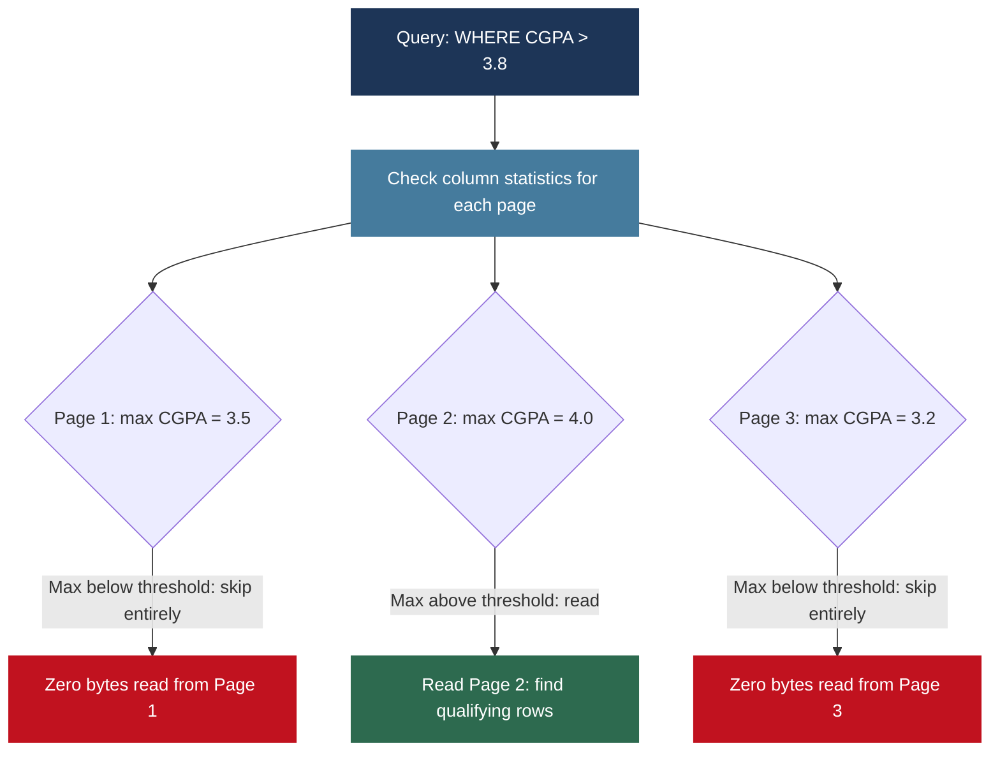

Filter conditions are pushed into the storage layer so irrelevant data is never read into memory. In well-organized Parquet files, predicate pushdown can eliminate 90% or more of I/O for selective queries.

---

## 4. In-Memory Analytics

### The Memory Hierarchy

Eliminating disk from the equation entirely produces dramatic performance gains. The reason is the enormous gap between memory and disk access speeds.

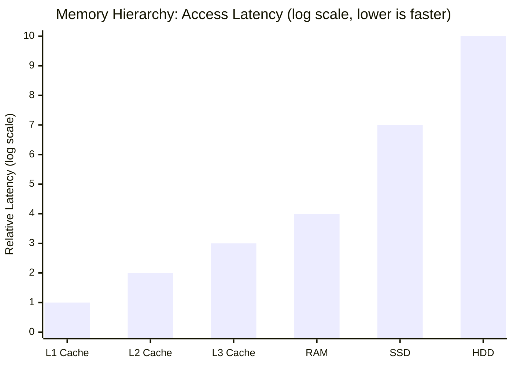

| Storage Level | Access Latency | Relative to RAM |
|--------------|---------------|----------------|
| L1 Cache | 1 nanosecond | 100x faster than RAM |
| L2 Cache | 4 nanoseconds | 25x faster than RAM |
| L3 Cache | 40 nanoseconds | 2.5x faster than RAM |
| RAM | 100 nanoseconds | baseline |
| SSD | 100 microseconds | 1,000x slower than RAM |
| HDD | 10 milliseconds | 100,000x slower than RAM |

The gap between RAM and disk is not linear. It is three to five orders of magnitude. A query touching 1 GB of data in RAM might complete in milliseconds. The same query on disk might take minutes.

### In-Memory Database Systems

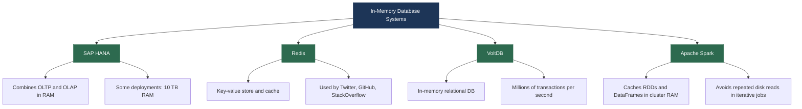

### Challenges of In-Memory Storage

| Challenge | Detail |
|-----------|--------|
| Cost | RAM is significantly more expensive per GB than SSD or HDD. Storing a petabyte in RAM is economically impractical for most organizations. |
| Volatility | RAM loses its contents on power loss. In-memory databases must maintain WALs and periodic snapshots to survive failures. |
| Capacity limits | A single server may have 512 GB to a few TB of RAM. Larger datasets require distribution across many servers, introducing network overhead. |
| Garbage collection | Java-based systems like Spark face JVM GC pressure with large in-memory datasets. Spark's Tungsten engine moved to off-heap memory management to address this. |

---

## 5. Vector Databases

### What Are Vector Embeddings?

Modern machine learning models represent data as **vectors**: lists of floating-point numbers in high-dimensional space. This representation captures semantic meaning mathematically.


**The key property:** semantically similar inputs produce geometrically similar vectors. Sentences with similar meaning are close together in 768-dimensional space. Unrelated sentences are far apart.

| Data Type | What Vectors Capture |
|-----------|---------------------|
| Text sentences | Semantic meaning and topic similarity |
| Images | Visual content and style similarity |
| Products | Category, price, feature similarity |
| Users | Behavioral taste and preference similarity |

### Why Traditional Databases Cannot Handle This

In a relational database you can query `WHERE price = 50` or `WHERE department = 'CS'`. These are exact matches on scalar values.

With vector embeddings, the query is fundamentally different: **find the 10 most similar items to this query vector.** This is a **k-nearest neighbor (kNN) search**.

Distance metrics used:

| Metric | Formula Concept | Best For |
|--------|----------------|---------|
| Cosine similarity | Angle between two vectors, ignoring magnitude | Text embeddings |
| Euclidean distance | Straight-line distance in high-dimensional space | Image embeddings |
| Dot product | Inner product of two vectors | Recommendation systems |

**The brute-force problem:** for 100 million vectors of dimension 1536, finding the nearest neighbor requires 100 million x 1536 floating-point operations per query. Too slow for real-time use.

### Approximate Nearest Neighbor Algorithms

The solution is **Approximate Nearest Neighbor (ANN)** algorithms: find vectors that are approximately nearest, trading a small accuracy loss for dramatic speed gains.

#### HNSW: Hierarchical Navigable Small World

HNSW is the most important ANN algorithm in production today.

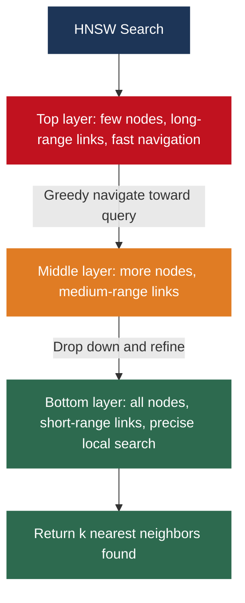

Navigation is **logarithmic** in the number of vectors. Very high recall with far less computation than brute force.

#### Other ANN Algorithms

| Algorithm | Full Name | Key Idea | Used In |
|-----------|-----------|---------|---------|
| IVF | Inverted File Index | Clusters vectors into groups; searches only the most relevant clusters at query time | FAISS |
| ScaNN | Scalable Approximate Nearest Neighbor | Google's production ANN algorithm | Google Search, recommendations |
| FAISS | Facebook AI Similarity Search | Open-source library implementing multiple ANN algorithms | Backend for many vector DBs |

### Production Vector Database Systems

| System | Type | Key Characteristics |
|--------|------|-------------------|
| Pinecone | Managed cloud | Fully hosted, no infrastructure management; handles billion-scale search |
| Milvus | Open source | Highly scalable; supports HNSW and IVF; used by Xiaomi, Tokopedia |
| Weaviate | Open source | GraphQL API; hybrid search: vector similarity plus traditional filtering |
| Qdrant | Open source | Written in Rust; efficient on-disk indexing for datasets larger than RAM |
| pgvector | PostgreSQL extension | Adds vector storage and ANN to standard PostgreSQL; no separate infrastructure |
| Chroma | Open source | Lightweight; popular in LLM application development |

### Vector Databases in Production: Real Applications

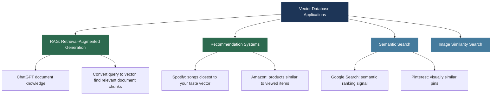

### LSM Trees Meet Vector Databases: A 2025 Development

Research published in 2024 and 2025 has explored using LSM Tree architectures for dynamic vector databases where vectors are frequently inserted and updated.

Traditional ANN indexes like HNSW are difficult to update incrementally: inserting a new vector may require partially rebuilding the index. The **LSM-VEC** approach adapts the LSM Tree pattern: new vectors accumulate in memory, flush to disk as immutable sorted vector files, and compaction re-indexes them in the background. This brings LSM Tree write throughput to the vector search domain. This is an active area of research.

---

## 6. The Complete Storage Engine Landscape

### All Storage Engines Side by Side

| Storage Engine | Key Technology | Write Performance | Read Performance | Best For |
|---------------|---------------|-----------------|-----------------|---------|
| Heap + B+ Tree | Page-based balanced tree | Moderate | Fast with indexes | OLTP, relational databases |
| Heap + Hash Index | Page-based hash buckets | Fast | Very fast (equality only) | Equality-only lookups |
| LSM Tree | MemTable, SSTables, WAL | Very fast | Moderate | Write-heavy NoSQL |
| Columnar (Parquet/ORC) | Column files with encodings | Moderate | Very fast for analytics | OLAP, data lakes |
| In-Memory | RAM storage | Very fast | Extremely fast | Real-time, caching |
| Vector Index (HNSW) | Graph-based ANN | Moderate | Fast (approximate) | Similarity search, AI |

### How Real Production Systems Combine Storage Engines

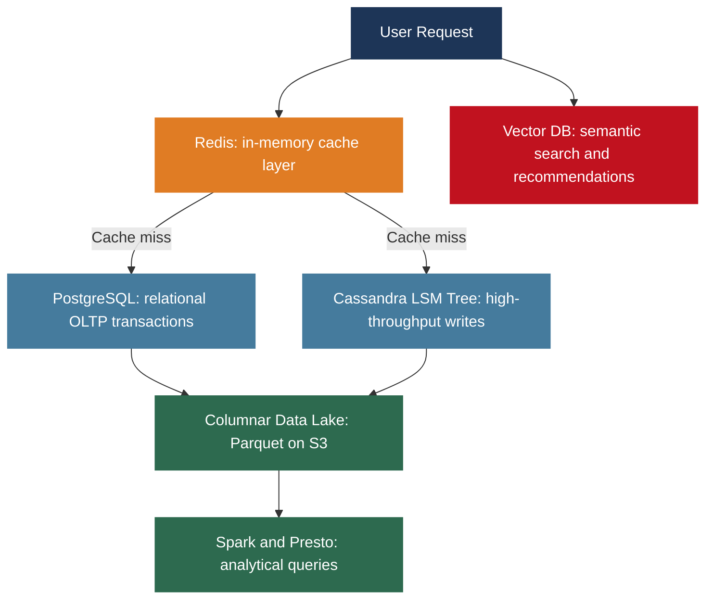

There is no universally best storage engine. Each is optimized for a specific workload. Understanding when to use which engine and being able to justify that decision technically is a core competency of a senior data engineer.

---

## Lecture Summary

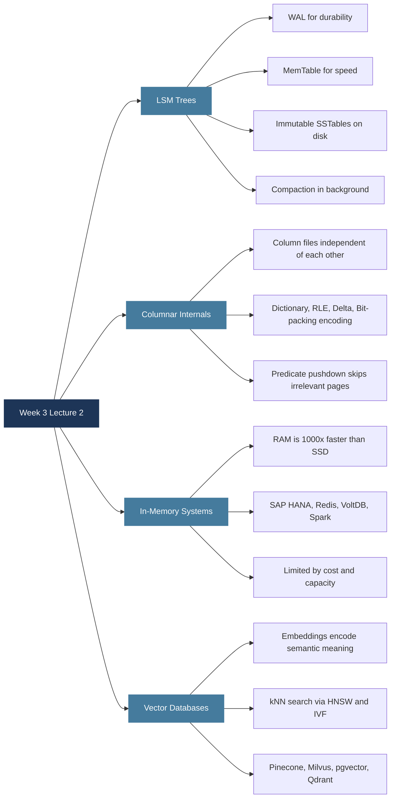

**Next class:** Week 3 continues with partitioning, sharding strategies, caching architectures, and query optimization with Hive, Presto, and Spark SQL.

---

*BDA Spring 2026 | Week 3, Lecture 2 | LSM Trees, Columnar Storage, In-Memory Analytics and Vector Databases*
