# Big Data Analytics (BDA Spring 2026)
## Week 3, Lecture 3: Partitioning, Sharding, Caching and Query Optimization

> A system that works perfectly at 1 million records will often fail catastrophically at 1 billion records, not because the code is wrong, but because the architecture was not designed to scale. Today we cover the techniques that separate systems that scale gracefully from systems that collapse under load.

---

## Table of Contents

1. [Partitioning: Dividing Data for Scale](#1-partitioning-dividing-data-for-scale)
2. [Sharding: Partitioning Across Distributed Nodes](#2-sharding-partitioning-across-distributed-nodes)
3. [Caching: The Fastest Query Is the One You Never Execute](#3-caching-the-fastest-query-is-the-one-you-never-execute)
4. [Query Optimization: Making Queries Fast](#4-query-optimization-making-queries-fast)
5. [Complete Architecture: Putting It All Together](#5-complete-architecture-putting-it-all-together)

---

## 1. Partitioning: Dividing Data for Scale

### The Core Problem

A table with 10 billion rows on a single server has hard physical limits: one disk, one CPU, finite memory. No matter how powerful that server is, a query scanning 500 million rows is bottlenecked by the single machine.

**Partitioning** divides a large dataset into smaller, independently stored and processed pieces called partitions.

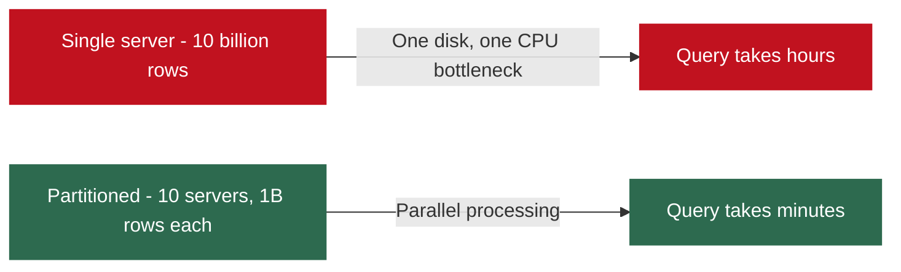

### Two Dimensions of Partitioning

| Type | What Is Divided | Each Partition Contains | Example |
|------|----------------|------------------------|---------|
| Horizontal | Rows | Subset of rows, all columns | Transactions from January on partition 1, February on partition 2 |
| Vertical | Columns | All rows, subset of columns | Columnar storage (Parquet, ORC) is essentially vertical partitioning |

Today's focus is **horizontal partitioning**, which is what "partitioning" and "sharding" mean in Big Data contexts.

---

### Strategy 1: Range Partitioning

Data is divided based on value ranges of a chosen partition key.

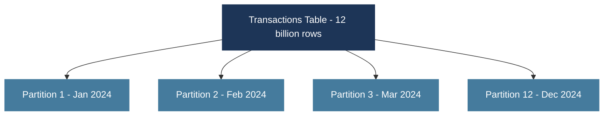

**Partition pruning** is the key benefit. A query for March 2024 data skips all 11 other partitions entirely, never reading them. For 120 monthly partitions over 10 years, a single-month query reads only 1/120th of the data: a 120x speedup from one architectural decision.

| Advantage | Detail |
|-----------|--------|
| Partition pruning | Query engine skips irrelevant partitions entirely, reading only matching ones |
| Efficient range scans | Queries spanning a range (Q1 2024) access consecutive partitions without a full scan |
| Lifecycle management | Old partitions are archived or deleted independently without touching recent data |

| Disadvantage | Detail |
|-------------|--------|
| Hot partition problem | Recent data is queried far more than old data; the latest partition becomes overloaded |
| Uneven partition sizes | December retail data may be 5x larger than February; partitions are imbalanced |

---

### Strategy 2: Hash Partitioning

A hash function is applied to the partition key. The hash value determines which partition the row belongs to.

```
partition_number = hash(partition_key) % number_of_partitions
```

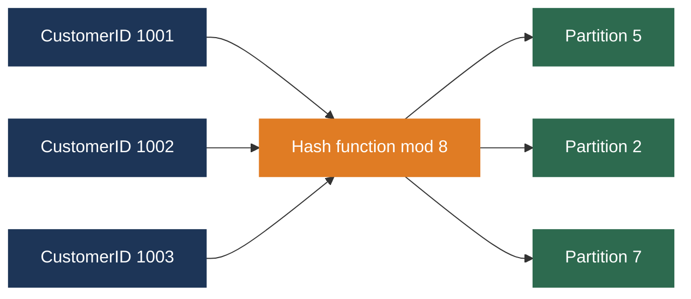

| Advantage | Detail |
|-----------|--------|
| Even data distribution | Good hash functions distribute keys uniformly; no hot spots |
| Balanced storage | Partitions are approximately equal in size |

| Disadvantage | Detail |
|-------------|--------|
| Range queries become full scans | Hashing destroys temporal order; a date range query must scan every partition |
| Rebalancing is expensive | Adding or removing partitions requires rehashing every row; consistent hashing addresses this |

---

### Strategy 3: List Partitioning

Rows are assigned to partitions based on explicit lists of discrete values.

```
Partition Asia:     region IN ('Pakistan', 'India', 'China', 'Japan')
Partition Europe:   region IN ('UK', 'Germany', 'France', 'Italy')
Partition Americas: region IN ('USA', 'Canada', 'Brazil', 'Mexico')
```

Useful when data has a natural categorical dimension and queries frequently filter on it. Requires updating partition definitions when new values appear.

---

### Choosing a Partitioning Strategy

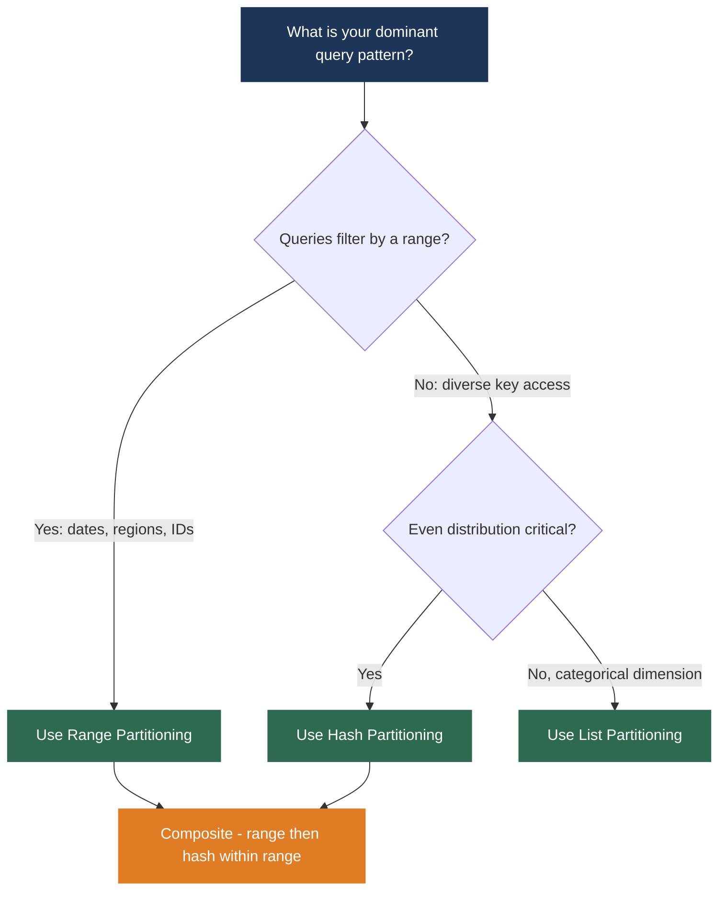

**Composite partitioning** combines both strategies: partition by date range first (one partition per month), then hash-partition by customer ID within each month. This provides temporal range pruning and balanced distribution.

### Partitioning in Apache Spark and Hive

**Spark: writing partitioned data**

```python
# Write partitioned by date, creating directory structure automatically
df.write.partitionBy("year", "month").parquet("/data/transactions/")
```

This creates:
```
/data/transactions/year=2024/month=01/part-00000.parquet
/data/transactions/year=2024/month=02/part-00000.parquet
/data/transactions/year=2024/month=03/part-00000.parquet
```

A subsequent query filtering on `year = 2024 AND month = 3` reads only the `year=2024/month=03/` directory. Partition pruning happens automatically.

**Hive: declaring partitioned tables**

```sql
CREATE TABLE transactions (
    transaction_id BIGINT,
    customer_id    INT,
    amount         DECIMAL(10,2)
)
PARTITIONED BY (year INT, month INT)
STORED AS PARQUET;
```

Hive enforces the partition structure and automatically performs partition pruning for queries that filter on `year` and `month`.

---

## 2. Sharding: Partitioning Across Distributed Nodes

### Partitioning vs Sharding

| Concept | Definition | Scope |
|---------|-----------|-------|
| Partitioning | Dividing data into logical pieces | Data organization; can be on one machine |
| Sharding | Distributing partitions across multiple physical machines | Deployment across a cluster |

Every shard is a partition, but not every partition is a shard. Sharding implies physical distribution across nodes.

### Why Shard?

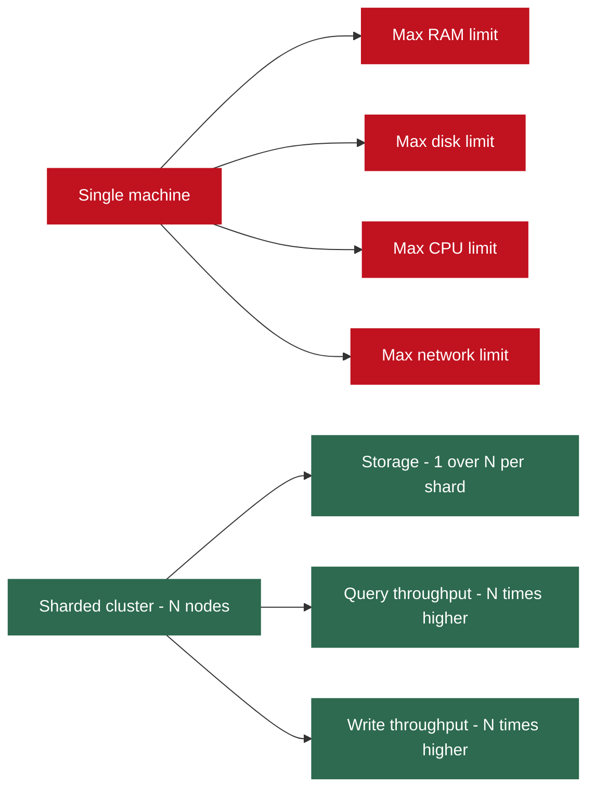

A 100 TB dataset across 100 shards requires only 1 TB per shard. A query touching multiple shards executes in parallel across all of them.

### Sharding Challenges

**Cross-shard queries and joins**

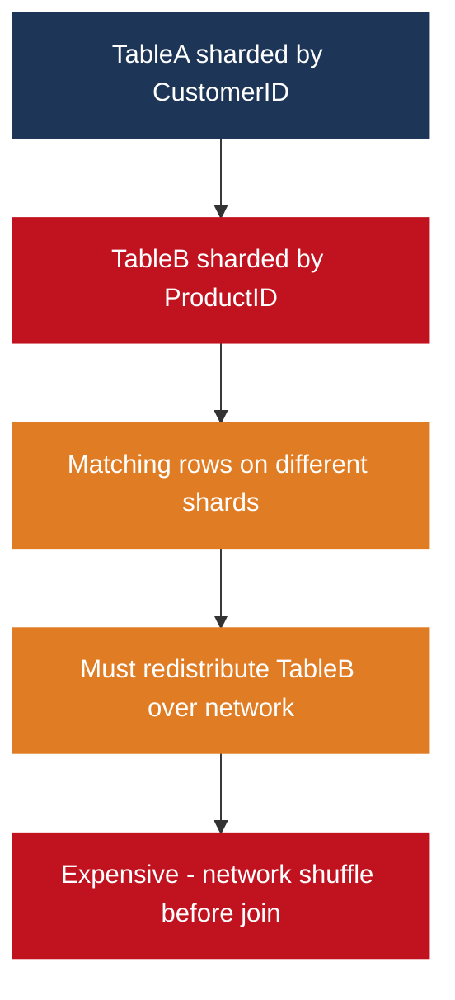

This network shuffle is the exact **shuffle** operation in MapReduce and Spark studied in Weeks 6 and 7. You can now see why it arises from first principles.

If both tables are sharded by the same key (CustomerID), matching rows land on the same shard and the join is local with no shuffle.

**Rebalancing with consistent hashing**

Naive hash sharding requires rehashing every row when adding a new shard. Consistent hashing solves this elegantly.


Used by: Apache Cassandra, Amazon DynamoDB, Chord DHT.

**The hot shard problem**

In a social network, the shard containing data for a user with 500 million followers receives far more reads than a shard containing ordinary users. This is the **celebrity problem** in distributed systems.

Solutions: replicate hot shards to multiple machines, cache frequently accessed data, split hot shards further.

---

## 3. Caching: The Fastest Query Is the One You Never Execute

### The Core Principle

**Caching** stores results of expensive computations in fast memory (RAM) so subsequent requests for the same data are served without repeating the expensive operation.

The **temporal locality of reference**: in most real systems, a small fraction of data accounts for a large fraction of requests. If 80% of queries access only 20% of the data (the Pareto Principle), caching that 20% in RAM serves 80% of queries at memory speed.

### Cache Hit and Miss

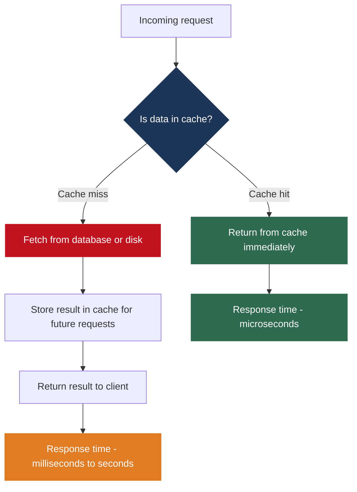

**Cache hit rate** is the primary metric: the fraction of requests served from cache. A 90% hit rate means 90% of requests are served at memory speed.

### Caching Architectures

| Architecture | Description | Trade-offs |
|-------------|-------------|-----------|
| Application-level cache | In-memory map within the application process | Zero network latency; lost on restart; not shared across instances |
| Redis (distributed cache) | Dedicated in-memory key-value store shared across all app instances | Sub-millisecond latency; shared state; supports persistence, TTL, rich data structures |
| Memcached | Simpler distributed cache, strings only | Slightly faster for pure key-value; no persistence; no complex types |
| Database query cache | Internal cache of SQL query results (MySQL removed it in 8.0) | Automatic but causes concurrency problems under high load |
| CDN | Geographically distributed edge cache for web content | Reduces latency for end users; reduces origin server load |

**Typical production Redis flow:**

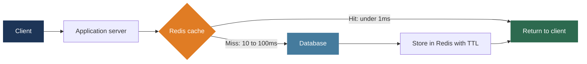

### Cache Eviction Policies

When the cache is full, something must be removed to make room.

| Policy | Logic | Best For |
|--------|-------|---------|
| LRU: Least Recently Used | Evict the item not accessed for the longest time | Most workloads; Redis default |
| LFU: Least Frequently Used | Evict the item accessed fewest times overall | Popular items that stay popular long-term |
| FIFO: First In First Out | Evict the oldest item regardless of access | Simple; often suboptimal |
| TTL-based expiration | Items expire after a fixed time period | Ensuring freshness of time-sensitive data |

### Cache Invalidation Strategies

**Phil Karlton's famous observation:** "There are only two hard things in computer science: cache invalidation and naming things."

This reflects a real challenge. Cache invalidation done incorrectly produces **stale data**: users seeing outdated information.

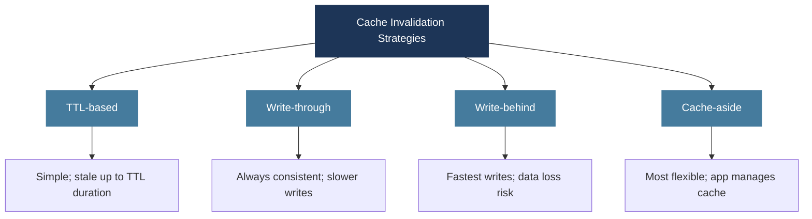

**Redis does not automatically know when your database changes.** If Server A updates PostgreSQL, Redis still holds the old value. Server B will serve stale data on the next request.

The application must manage this explicitly. Common patterns:

- After writing to the database, immediately delete the corresponding cache key. The next request will be a cache miss, fetch fresh data, and repopulate the cache. (Cache-aside with invalidation on write.)
- Use a message queue: database updates publish an event; a cache invalidation service subscribes and removes stale keys. This decouples invalidation from the write path.
- Accept eventual consistency via TTL: data is stale for at most TTL seconds. For many applications this is perfectly acceptable.

---

## 4. Query Optimization: Making Queries Fast

In Big Data systems, unoptimized queries can take hours instead of minutes, consume enormous cluster resources, and cost significant money when paying per compute hour.

### The Query Optimizer

Every SQL-based system (MySQL, PostgreSQL, Hive, Presto, Spark SQL) has an internal **query optimizer** that takes a SQL query and determines the most efficient execution plan.

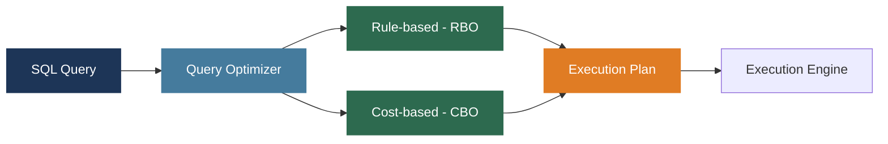

| Optimization Type | How It Works | Examples |
|------------------|-------------|---------|
| Rule-based (RBO) | Applies transformation rules that are always beneficial | Predicate pushdown, column pruning, constant folding, subquery unnesting |
| Cost-based (CBO) | Uses table statistics to estimate cost of multiple plans; chooses cheapest | Join order selection, join strategy selection (broadcast vs sort-merge) |

Cost-based optimization quality depends entirely on statistics accuracy. Outdated statistics lead to bad plan choices. Run `ANALYZE TABLE` or `COMPUTE STATISTICS` regularly.

---

### Query Optimization in Apache Hive

Hive translates HiveQL queries into MapReduce or Tez jobs on Hadoop.

**Partition pruning** automatically skips irrelevant partitions:

```sql
-- Hive reads only the March 2024 partition, skipping all others
SELECT SUM(amount) FROM transactions
WHERE year = 2024 AND month = 3;
```

**MapJoin (broadcast join):** when one table is small enough to fit in memory, Hive broadcasts it to all mappers and performs the join entirely in the map phase, eliminating the shuffle and reduce phase entirely.

```sql
SELECT /*+ MAPJOIN(small_table) */ *
FROM large_table
JOIN small_table ON large_table.id = small_table.id;
```

| Hive Optimization | What It Does | Impact |
|------------------|-------------|--------|
| Partition pruning | Skips non-matching partitions at the storage layer | Up to 120x less data read for monthly partitions |
| Bucketing | Divides data within partitions by hash for efficient joins and sampling | Faster same-key joins and efficient TABLESAMPLE |
| MapJoin (broadcast join) | Broadcasts small table to all mappers; no shuffle/reduce phase | Can reduce join time from minutes to seconds |
| Vectorized execution | Processes 1024 rows per batch instead of one at a time | Better CPU cache utilization; 2 to 5x throughput improvement |

---

### Query Optimization in Presto and Trino

Presto (now also called Trino) is a distributed SQL engine developed at Facebook for interactive analytical queries. Unlike Hive, it executes queries directly using a distributed in-memory engine: sub-second to seconds rather than minutes.

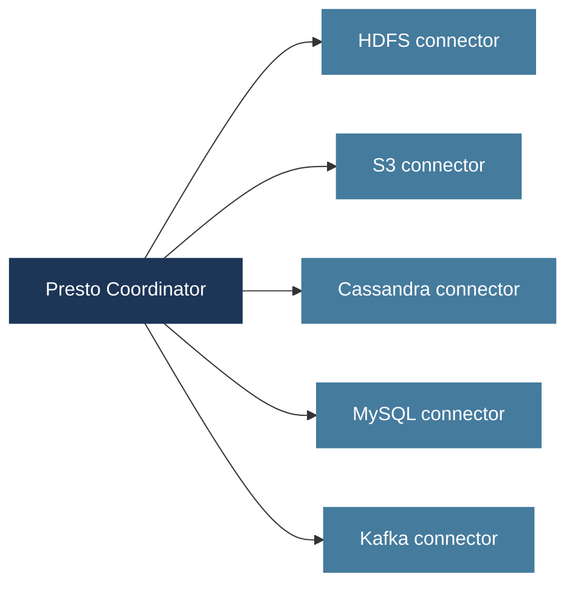

Same SQL syntax regardless of data source. Predicates are pushed down to each connector's native capabilities.

| Presto Feature | What It Does |
|---------------|-------------|
| Cost-based optimizer | Uses column statistics to choose broadcast vs hash vs nested-loop join strategy |
| Dynamic filtering | Narrows probe-side scan at runtime based on values seen on build side of join |
| Adaptive execution | Monitors runtime and adapts plans when actual data distribution differs from statistics |
| Connector architecture | Unified SQL access across HDFS, S3, Cassandra, MySQL, Kafka, and dozens more |

---

### Query Optimization in Apache Spark SQL: Catalyst

Spark SQL's optimizer is called **Catalyst**, one of the most sophisticated query optimization frameworks in the Big Data ecosystem.

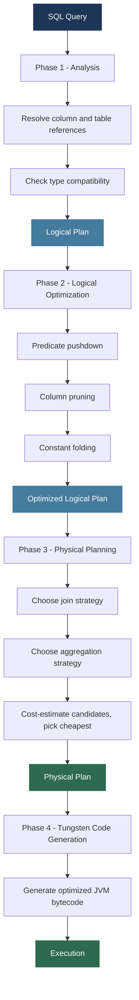

**Predicate pushdown example: filtering before the join reduces rows that participate in it**

```
Original plan:
  Filter [cgpa > 3.5]
    Join [students JOIN enrollments ON id]

After predicate pushdown:
  Join [students JOIN enrollments ON id]
    Filter [cgpa > 3.5]   <- pushed before the join
      Scan [students]
    Scan [enrollments]
```

**Inspect Catalyst's output:**

```python
result = spark.sql("""
    SELECT s.name, s.cgpa, e.course
    FROM students s
    JOIN enrollments e ON s.student_id = e.student_id
    WHERE s.cgpa > 3.5 AND e.year = 2024
""")

result.explain(mode="extended")
# Shows: analyzed plan, optimized plan, physical plan, codegen plan
```

---

### Adaptive Query Execution (AQE) in Spark 3.0+

AQE is one of the most important additions to Spark in recent versions. It extends optimization from compile time into **runtime**: the system adapts the plan based on what it actually observes during execution.

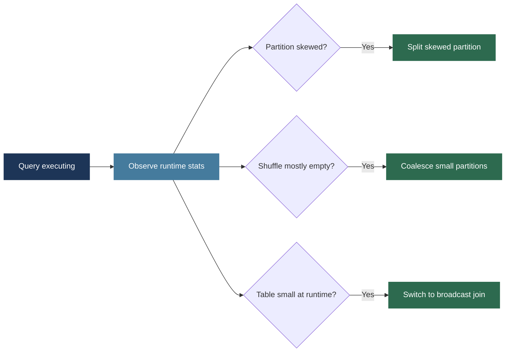

| AQE Feature | Problem Solved | How |
|-------------|---------------|-----|
| Dynamic partition coalescing | 200 shuffle partitions but most are nearly empty | Merges small partitions to reduce task scheduling overhead |
| Dynamic join strategy switching | Table estimated large but small at runtime | Switches from sort-merge to broadcast hash join mid-query |
| Skew join optimization | One partition has 100x more rows than others | Automatically splits the skewed partition to rebalance work |

> Even with AQE, understanding optimization matters. Automatic optimizers work within the framework of the query you write. A fundamentally inefficient query, with unnecessary subqueries or missing partition filters, cannot be fully rescued by any optimizer. Understanding what the optimizer does lets you write queries that give it the best possible starting point, interpret execution plans to diagnose slowness, and apply manual hints when the optimizer makes suboptimal choices.

---

### Practical Query Optimization Checklist

| Practice | Why It Matters |
|----------|---------------|
| Filter early: apply WHERE before JOINs | Reduces rows entering the join, potentially cutting computation by orders of magnitude |
| Always filter on partition columns | A query without a partition filter on a partitioned table does a full table scan, defeating the entire purpose of partitioning |
| Avoid SELECT star | Columnar formats skip unneeded columns only if you do not request them all |
| Use broadcast joins for small tables | Eliminates shuffle entirely: `df1.join(broadcast(df2), "id")` |
| Cache reused DataFrames | If a DataFrame is used multiple times, `df.cache()` avoids recomputation |
| Control partition count | Aim for 2 to 4 partitions per CPU core; too few wastes parallelism, too many creates scheduling overhead |
| Handle data skew | Use salting or AQE skew optimization when one partition is dramatically larger than others |
| Collect statistics regularly | Run `ANALYZE TABLE` to give the optimizer accurate row counts and column distributions |

---

## 5. Complete Architecture: Putting It All Together

A financial services company processes 50 million transactions per day across 10 million customers. Requirements: sub-second customer-facing queries, interactive analytical queries for risk analysts, daily batch reports for compliance.

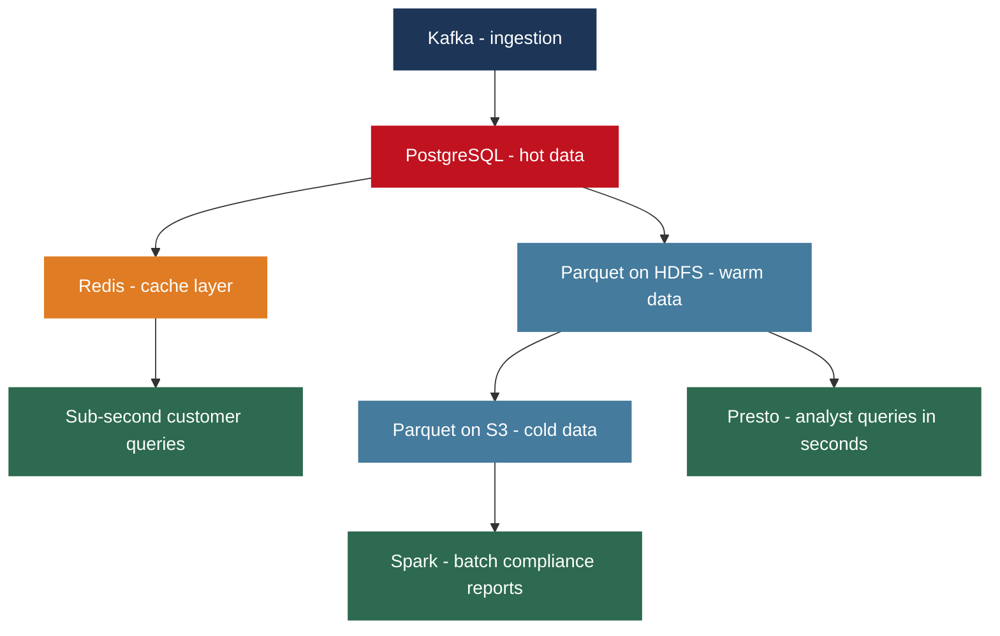

| Layer | Technology | Partitioning | Query Latency |
|-------|-----------|-------------|--------------|
| Hot: last 30 days | PostgreSQL + Redis | Sharded by CustomerID | Sub-second via Redis cache |
| Warm: 30 days to 2 years | Parquet on HDFS + Presto | Partitioned by year and month | Seconds to minutes for interactive analytics |
| Cold: 2 plus years | Parquet on S3 + Spark | Partitioned by year and month | Minutes to hours for batch compliance reports |

Every technique from this week converges: partitioning by date enables partition pruning; sharding by CustomerID distributes write load; Redis caching serves frequent queries at memory speed; Parquet columnar format makes analytical queries efficient; Presto and Spark with Catalyst and AQE optimize execution.

Companies like PayPal, Stripe, and major banks use variations of exactly this pattern.

---

## Lecture Summary

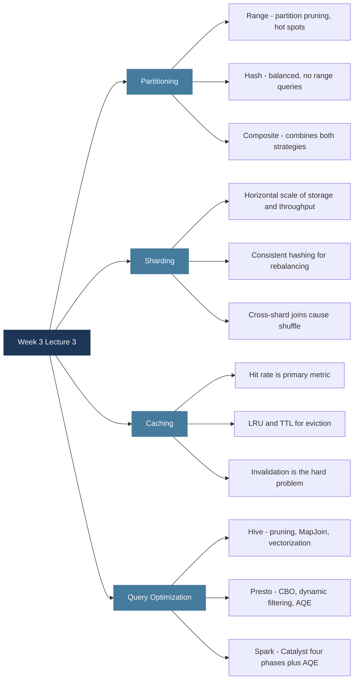

**Next class:** Week 4 begins with Distributed Transactions and Consistency: ACID vs BASE, the CAP Theorem, Paxos, Raft, and Google Spanner's TrueTime. The most conceptually challenging week of the course. Come prepared.

---

*BDA Spring 2026 | Week 3, Lecture 3 | Partitioning, Sharding, Caching and Query Optimization*
