# Big Data Analytics (BDA Spring 2026)
## Week 4, Lecture 1: ACID vs BASE and the CAP Theorem

> We have spent three weeks understanding how data is stored. Today we ask a harder question: how do distributed systems maintain correctness when multiple operations happen simultaneously across multiple machines? This is the question of consistency, and it is the most intellectually challenging topic in distributed systems.

---

## Table of Contents

1. [ACID - The Traditional Standard of Correctness](#1-acid---the-traditional-standard-of-correctness)
2. [BASE - The NoSQL Alternative](#2-base---the-nosql-alternative)
3. [ACID vs BASE - Full Comparison](#3-acid-vs-base---full-comparison)
4. [The CAP Theorem](#4-the-cap-theorem)
5. [PACELC - The Extension of CAP](#5-pacelc---the-extension-of-cap)
6. [Real-World Architecture Decisions](#6-real-world-architecture-decisions)

---

## 1. ACID - The Traditional Standard of Correctness

### The Motivating Problem

You and a friend share a joint account with 10,000 rupees. At the exact same moment, you withdraw 10,000 rupees from an ATM in Peshawar and your friend withdraws 10,000 rupees from an ATM in Karachi. Both ATMs check the balance simultaneously. Both see 10,000 rupees. Both approve. Both dispense.

The bank has just lost 10,000 rupees. This is a **race condition**, and it is a constant threat in any system handling concurrent operations.

A **transaction** is a sequence of database operations treated as a single logical unit. The classic example is a bank transfer: debit account A, credit account B. Both must succeed or neither does.

---

### A - Atomicity

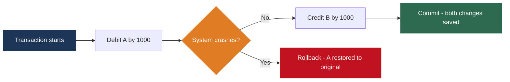

**All or nothing.** Either every operation in a transaction completes, or none of them do. Without atomicity, a crash mid-transfer leaves A debited but B never credited. Money vanishes.

**Implementation:** the Write-Ahead Log records every operation before it is applied. On recovery, incomplete transactions are rolled back using undo logging. Log writes are synchronous and crash-safe (checksums, double-write buffers).

---

### C - Consistency

Consistency means a transaction brings the database from one **valid state** to another valid state, never violating defined constraints.

| Constraint Type | Example |
|----------------|---------|
| Check constraint | Account balance cannot be negative |
| Range constraint | Student grade must be between 0 and 100 |
| Referential integrity | Every order must reference a valid customer ID |
| Business invariant | Total of all balances must remain constant after a transfer |

> Important distinction: Consistency in ACID is largely the **application's responsibility**. The database enforces structural constraints you define (foreign keys, NOT NULL, check constraints). Your application enforces business logic. This is different from the C in CAP, which means something more specific about distributed data visibility.

---

### I - Isolation

Isolation means concurrent transactions execute **as if they were running sequentially**, even if they run simultaneously. Without it, concurrent transactions interfere with each other.

**The three classic anomalies:**

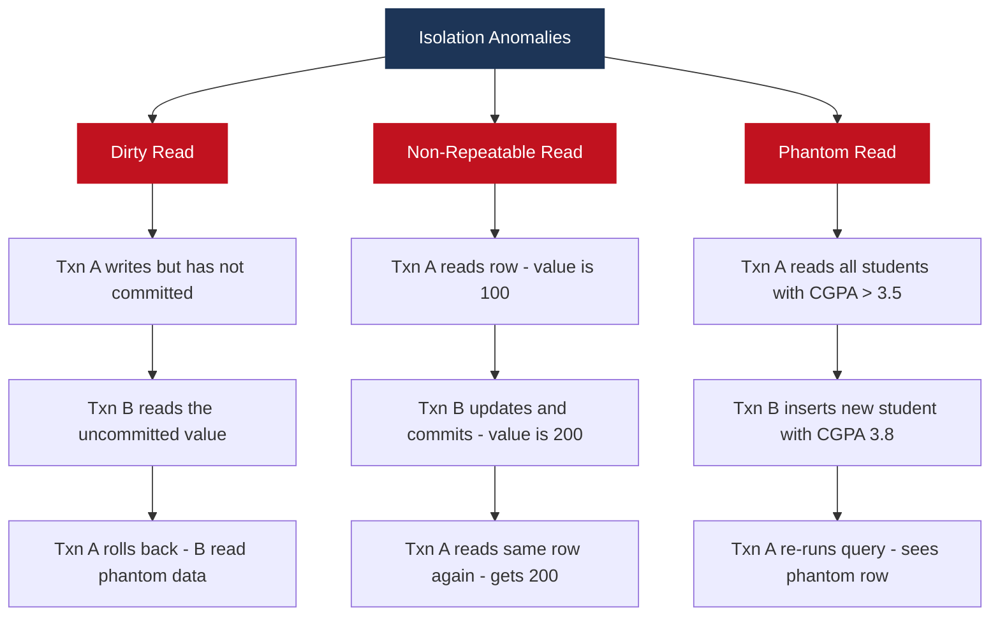

**Isolation levels trade correctness for performance:**

| Isolation Level | Dirty Read | Non-Repeatable Read | Phantom Read |
|----------------|-----------|---------------------|-------------|
| Read Uncommitted | Possible | Possible | Possible |
| Read Committed | Prevented | Possible | Possible |
| Repeatable Read | Prevented | Prevented | Possible |
| Serializable | Prevented | Prevented | Prevented |

**Implementation - MVCC (Multi-Version Concurrency Control):** PostgreSQL maintains multiple versions of each row. Each transaction sees a consistent snapshot as of when it began. Readers never block writers, writers never block readers. Old versions are cleaned up by the VACUUM process when no active transaction needs them.

---

### D - Durability

Once a transaction is committed, it remains committed permanently, even through system failures.

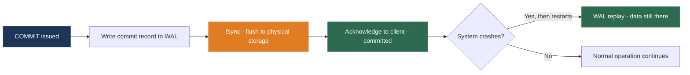

The fsync() call forces the OS to bypass write caching and write to physical storage. This is one of the most expensive database I/O operations, which is why SSDs dramatically improve transaction throughput. Some databases offer `synchronous_commit = off` for speed at the cost of potentially losing the last few transactions on a crash.

---

### ACID in One Example

```sql
BEGIN TRANSACTION;
    UPDATE accounts SET balance = balance - 5000 WHERE id = 'A';
    UPDATE accounts SET balance = balance + 5000 WHERE id = 'B';
COMMIT;
```

| Property | What It Guarantees Here |
|----------|------------------------|
| Atomicity | If crash between the two UPDATEs, both are rolled back |
| Consistency | Balance of A cannot go below zero; total money stays 12000 |
| Isolation | Another transaction sees either both changes or neither |
| Durability | Once COMMIT returns, both changes survive any failure |

---

## 2. BASE - The NoSQL Alternative

Full ACID compliance across a distributed system is extraordinarily expensive. Google (Bigtable), Amazon (Dynamo), and Facebook (Cassandra) faced workloads no ACID database could handle: hundreds of millions of users, billions of operations per day, global distribution. They made a deliberate trade: relax consistency guarantees in exchange for availability, performance, and scale.

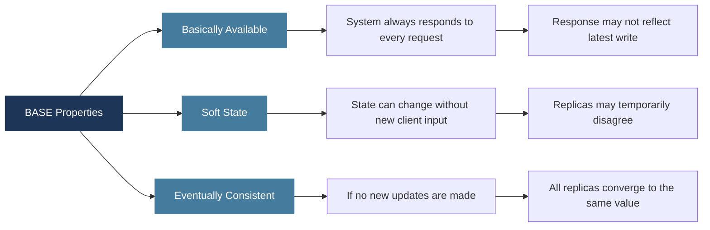

**BA - Basically Available:** the system always responds to every request, even during partial failures, even if the response is slightly stale. No blocking on locks held by other transactions.

**S - Soft State:** different replicas of the same data may temporarily hold different values as replication propagates. The system is in a state of flux until convergence.

**E - Eventually Consistent:** once all replication messages deliver, all replicas converge to the same value. Under normal conditions this happens in milliseconds to seconds.

**Concrete example:** Instagram uses Cassandra. When you post a photo, it is written to one node immediately and replicated asynchronously. A user in another region requesting your profile within milliseconds may not yet see the new photo. One second later, replication has propagated and all users see it. This is acceptable for a social feed. It would be unacceptable for a bank balance.

---

### Tunable Consistency in Cassandra

Modern NoSQL systems offer a middle ground between full ACID and full BASE.

| Consistency Level | Write Succeeds When | Strength |
|------------------|--------------------|----|
| ANY | At least one node receives it | Weakest - fastest |
| ONE | At least one replica acknowledges | Weak |
| QUORUM | Majority of replicas acknowledge | Balanced |
| ALL | All replicas acknowledge | Strongest - slowest |

Setting both reads and writes to QUORUM gives **strong eventual consistency**: reads always see the most recent committed write while tolerating node failures. This is the most common production configuration for serious Cassandra deployments.

---

## 3. ACID vs BASE - Full Comparison

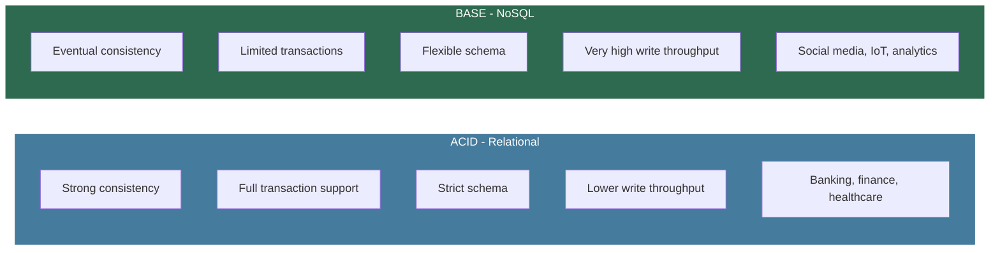

| Property | ACID | BASE |
|----------|------|------|
| Consistency model | Strong, immediate | Eventual |
| Availability | May reduce for correctness | Always responds |
| Transaction support | Full | Limited or none |
| Schema | Strict | Flexible |
| Write throughput | Lower | Very high |
| Read latency | Consistent | Variable |
| Failure handling | Rollback and strict recovery | Continue serving, reconcile later |
| Use cases | Banking, finance, healthcare | Social media, IoT, analytics |
| Examples | PostgreSQL, MySQL, Oracle | Cassandra, DynamoDB, CouchDB |

The choice is not a technical preference. It is a **business requirement** driven by the consequences of consistency violations in your specific domain.

---

## 4. The CAP Theorem

Proposed by Eric Brewer in 2000, formally proven by Gilbert and Lynch in 2002.

> **In a distributed system, you can guarantee at most two of the following three properties simultaneously.**

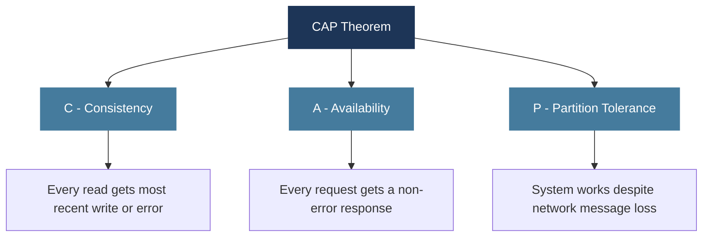

---

### Understanding Network Partitions

A network partition is when nodes in a distributed system **cannot communicate** even though they are both running. The network cable is cut. The switch fails. The cloud availability zone loses connectivity.

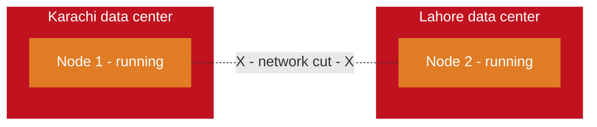

Both nodes are operational. But they cannot exchange messages.

---

### Why You Cannot Have All Three

A client writes X = 100 to Node 1. The partition prevents replication to Node 2. A second client reads X from Node 2.

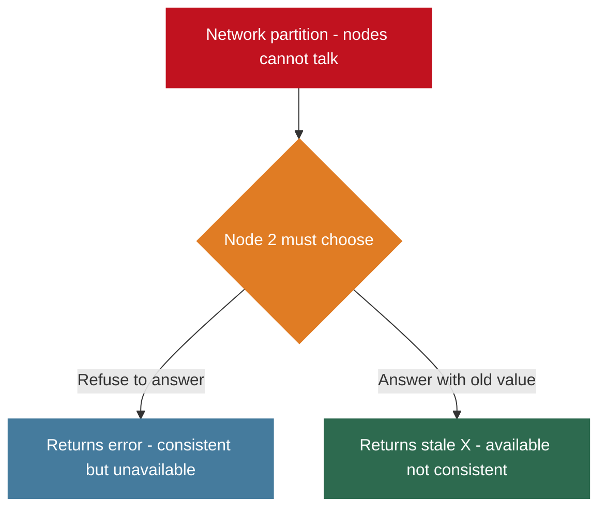

There is no third option. The partition forces a choice between C and A.

---

### Partition Tolerance Is Non-Negotiable

Network partitions are not hypothetical. In any multi-machine system, cables fail, switches malfunction, availability zones lose connectivity, timeouts occur under load. **You must design for partition tolerance.** A system that assumes a perfect network will fail catastrophically in production.

Therefore the real choice in distributed system design is not between C, A, and P. It is between **CP** and **AP**.

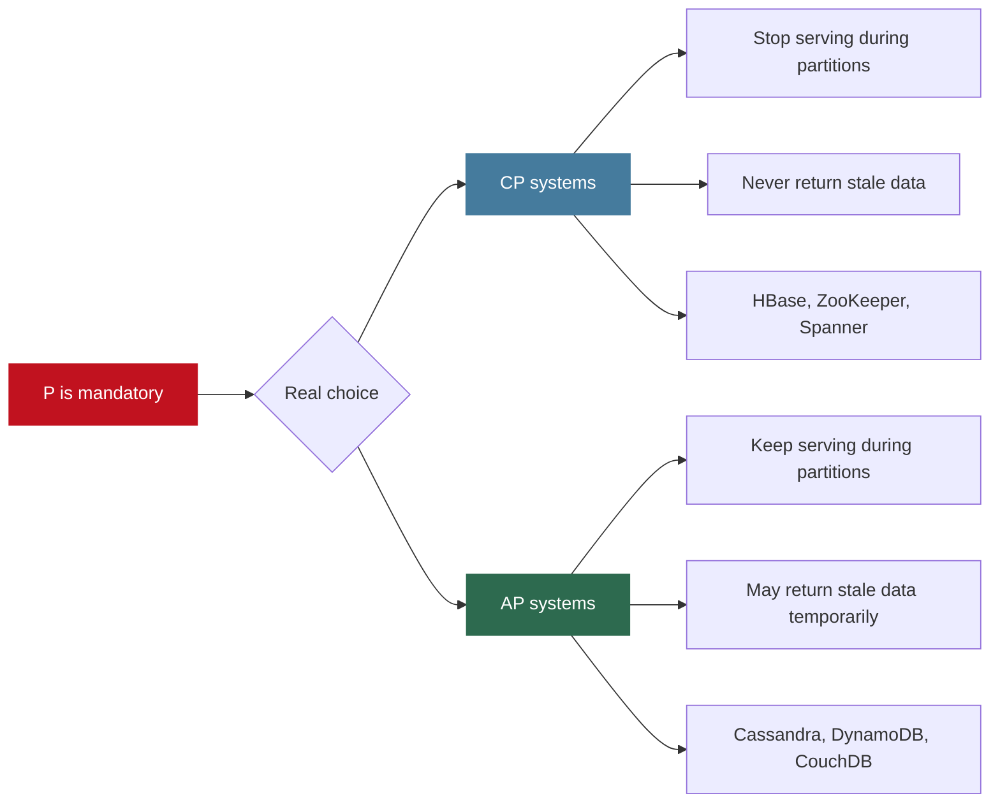

| System Type | Behavior During Partition | Guarantee Given Up | Examples |
|------------|--------------------------|-------------------|---------|
| CP | Some nodes stop serving requests | Availability | HBase, ZooKeeper, Google Spanner |
| AP | All nodes continue serving, may return stale data | Consistency | Cassandra, DynamoDB, CouchDB |

**Important nuance:** CAP is often misapplied. Modern systems like Cassandra allow tunable consistency, behaving as CP for some operations (ALL consistency level) and AP for others (ONE consistency level). CAP is a useful mental model, not a rigid classification.

---

## 5. PACELC - The Extension of CAP

CAP only describes behavior **during** a partition. But partitions are relatively rare. What about normal operation?

Even without a partition, there is a fundamental trade-off between latency and consistency:
- To guarantee all replicas see a write before acknowledging it (strong consistency), you must wait for all replicas to respond, adding latency.
- To respond immediately with low latency, you acknowledge before all replicas confirm, accepting a window of inconsistency.

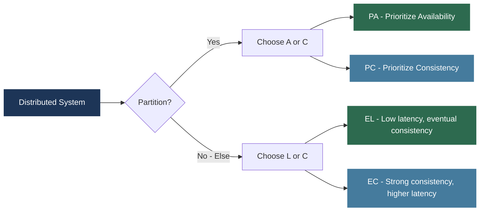

| System | Partition behavior | Normal behavior | Description |
|--------|------------------|----------------|-------------|
| Cassandra | PA | EL | Available during partition, low latency normally |
| DynamoDB | PA | EL | Same profile as Cassandra |
| Google Spanner | PC | EC | Consistent always, accepts higher latency |
| ZooKeeper | PC | EC | Stops serving during partition, consistent reads |

Most real systems are **PA/EL**: available during partitions, low latency during normal operation, eventual consistency in both cases. Spanner is the notable exception: **PC/EC**, consistent always, accepting latency as the cost via TrueTime.

---

## 6. Real-World Architecture Decisions

### Decision Framework

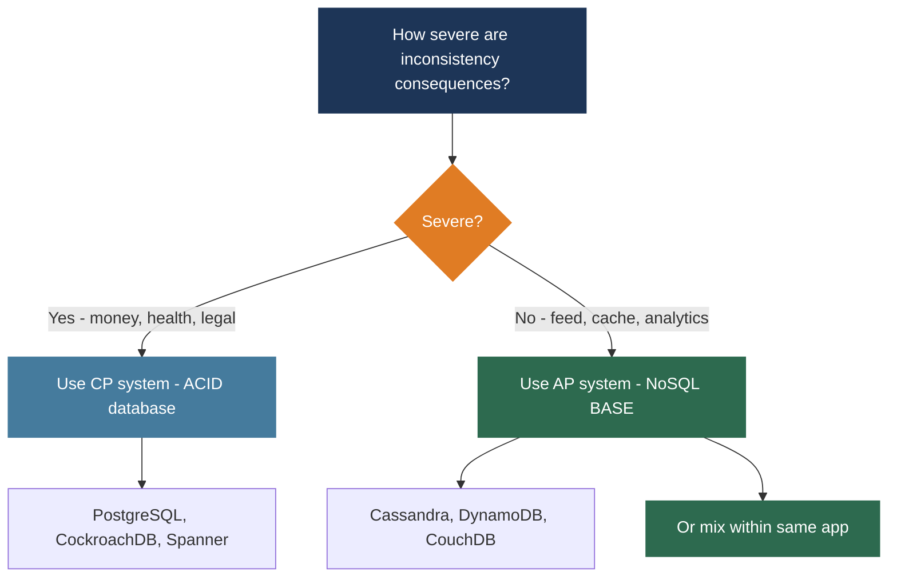

### Three Production Scenarios

| Scenario | Consistency Need | CAP Choice | Technology | Reasoning |
|----------|----------------|-----------|-----------|-----------|
| Online banking | Money must never be double-spent; regulatory audit trails required | CP | PostgreSQL, CockroachDB, Spanner | Better to return an error than an incorrect balance |
| Social media feed | Post appearing 200ms late in another region is acceptable | AP | Cassandra, DynamoDB | Must handle billions of events per day; availability critical |
| E-commerce | Cart additions must work during peak; payment must be exact | AP for cart, CP for checkout | Two separate systems | Different operations have different consistency requirements |

**Amazon's Dynamo paper (2007)** described exactly this split: the shopping cart uses an eventually consistent model; payment processing uses strong consistency. Two different systems, two different consistency models, in the same user-facing application.

The key insight: **the choice between ACID and BASE is a business requirement, not a technical preference.** Different operations within the same application can and should have different consistency requirements.

---

## Lecture Summary

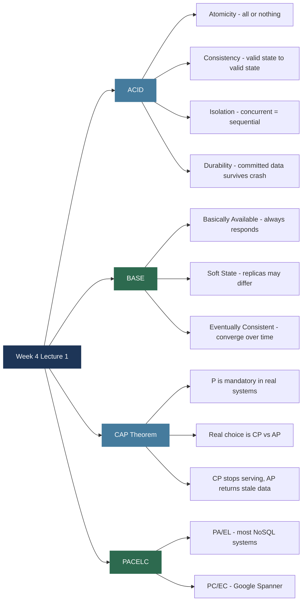

**Next class:** Week 4 continues with distributed consensus algorithms: Paxos, Raft, and Google Spanner's TrueTime.

---

*BDA Spring 2026 | Week 4, Lecture 1 | ACID vs BASE and the CAP Theorem*
