# Big Data Analytics (BDA Spring 2026)
## Week 4, Lecture 2: Consensus Algorithms - Paxos, Raft and Global Consistency with Google Spanner

> Last class we established the theoretical landscape of distributed consistency. Today we answer: when multiple nodes need to agree on something, how do they reach that agreement reliably even when some nodes are slow, unreachable, or sending incorrect messages? This is the consensus problem, and the algorithms that solve it power virtually every serious distributed system in production today.

---

## Table of Contents

1. [The Consensus Problem - Why Is Agreement Hard](#1-the-consensus-problem---why-is-agreement-hard)
2. [Paxos - The Foundation of Distributed Consensus](#2-paxos---the-foundation-of-distributed-consensus)
3. [Raft - Consensus Made Understandable](#3-raft---consensus-made-understandable)
4. [Raft vs Paxos - Practical Comparison](#4-raft-vs-paxos---practical-comparison)
5. [Google Spanner and TrueTime - Global Consistency](#5-google-spanner-and-truetime---global-consistency)
6. [The Consistency Spectrum](#6-the-consistency-spectrum)

---

## 1. The Consensus Problem - Why Is Agreement Hard

### The Core Difficulty

Five people in a room can agree by majority vote. Now place those five people in five different cities communicating only by letter, where some letters get lost, some arrive late, and occasionally a person falls asleep for an unknown duration.

Can you still guarantee all five reach the same decision?

This is exactly what distributed nodes face. You can never know for certain whether a node has crashed or is just very slow. A node that has not responded in 500 milliseconds - is it dead or busy?

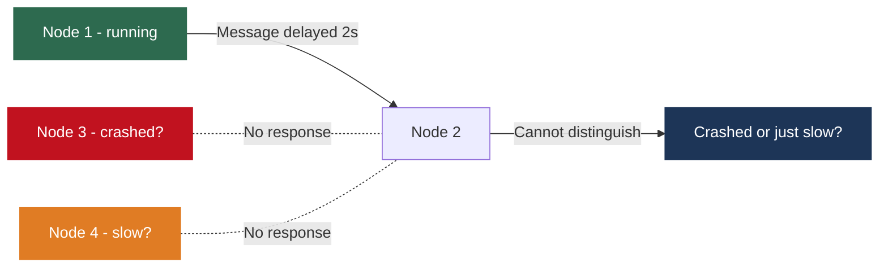

This uncertainty - the inability to distinguish a crashed node from a slow node - is what makes consensus fundamentally hard.

---

### The FLP Impossibility Result

In 1985, Fischer, Lynch, and Paterson proved a landmark theorem:

> **In an asynchronous distributed system, there is no deterministic consensus algorithm that is guaranteed to terminate if even one node can fail.**

| Term | Meaning |
|------|---------|
| Asynchronous | No bound on how long messages take to be delivered; real networks are like this |
| Even one node | Not half the nodes, just one failing node is enough to make the problem unsolvable |
| Terminate | The algorithm may hang indefinitely in the worst case |

**So how do Paxos and Raft work?** They do not violate FLP. They make a practical assumption: in practice, messages are usually delivered within some reasonable time bound. FLP assumes the absolute worst case which never persists in real systems.

Both algorithms guarantee two distinct properties:

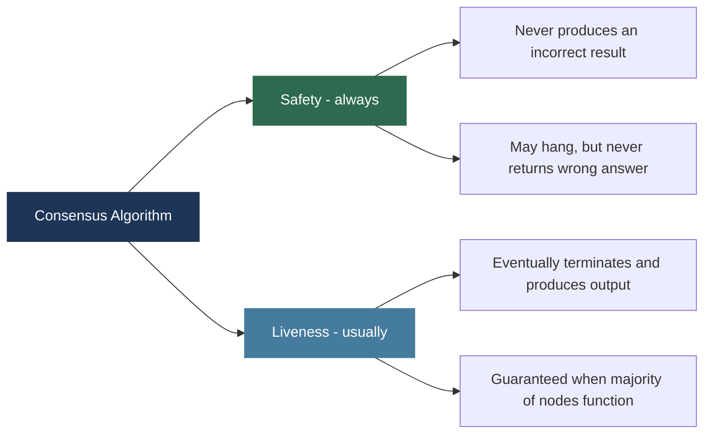

**Safety always, liveness usually** is the key to understanding practical consensus algorithms.

---

## 2. Paxos - The Foundation of Distributed Consensus

Developed by Leslie Lamport. Described in his 1998 paper "The Part-Time Parliament" (written 1989, famously rejected for being too whimsical). Now considered one of the most important papers in computer science.

**What Paxos solves:** given a set of nodes that can each propose a value, ensure exactly one value is chosen, and all nodes that learn the outcome learn the same value. This is single-decree consensus. Real systems use Multi-Paxos to agree on a sequence of values (a replicated log).

---

### Paxos Roles

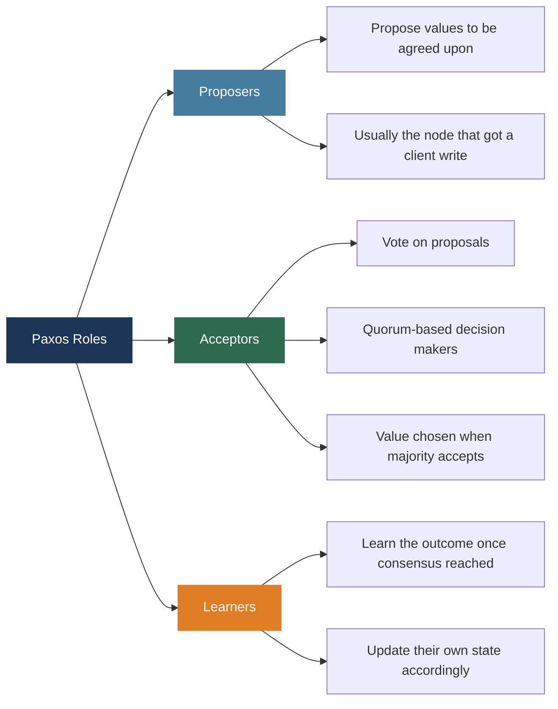

One physical node often plays multiple roles simultaneously.

---

### Paxos Phase 1 - Prepare and Promise

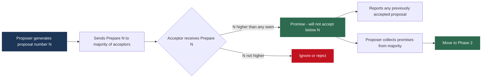

The proposal number N is a sequence number ordering proposals, not the value itself. The promise prevents old proposals from interfering with new ones.

---

### Paxos Phase 2 - Accept and Accepted

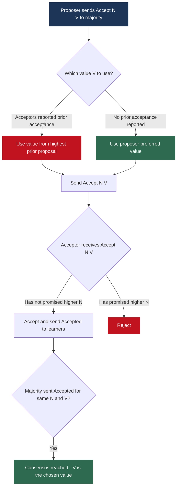

**The critical rule:** if any acceptor reported a prior accepted value in Phase 1, the proposer must use that value. This is what guarantees safety.

---

### Why Paxos Is Correct - The Quorum Overlap Argument

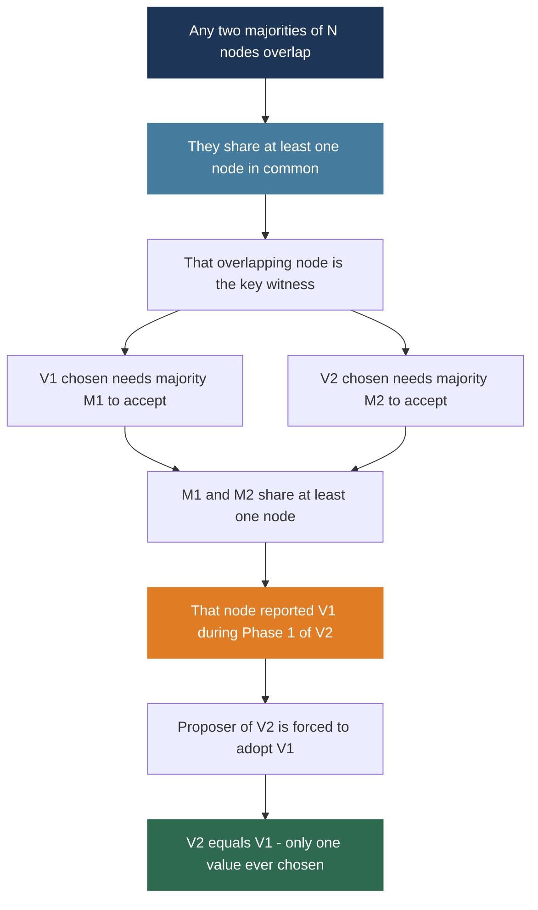

Majority quorums guarantee that any two decisions share a common witness that enforces value consistency.

---

### Why Paxos Is Notorious in Practice

| Gap in Paxos Theory | Production Problem | Consequence |
|--------------------|-------------------|-------------|
| Leader election not specified | Competing proposers interrupt each other (dueling proposers) | Liveness failure - no progress |
| Multi-Paxos extension not fully detailed | Agreeing on a log sequence requires extra mechanisms | Significant additional complexity |
| Reconfiguration not handled | Adding or removing nodes is unspecified | Must invent solutions independently |
| Many implementation details unspecified | Timeouts, message deduplication, crash recovery of promised values | Easy to get wrong in subtle ways |

These gaps motivated the design of Raft.

---

## 3. Raft - Consensus Made Understandable

Developed by Diego Ongaro and John Ousterhout at Stanford, published 2014. The paper is literally titled **"In Search of an Understandable Consensus Algorithm."**

Raft and Paxos are **equivalent in power** - same safety guarantees, same problem solved. The difference is entirely in clarity and completeness of specification.

---

### Raft Node States

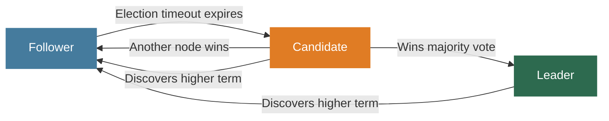

| State | Role | Behavior |
|-------|------|---------|
| Follower | Passive | Responds to leader and candidates; transitions to candidate when heartbeat timeout expires |
| Candidate | Seeking leadership | Requests votes from all nodes; becomes leader if majority votes received |
| Leader | Active manager | Receives all client requests; replicates to followers; sends periodic heartbeats |

---

### Raft Terms - The Logical Clock

Every message includes the sender's current term number. If a node receives a message with a **higher** term, it immediately updates its term and reverts to follower. A leader that was partitioned will discover the higher term when the partition heals and immediately step down.

---

### Raft Leader Election - Step by Step

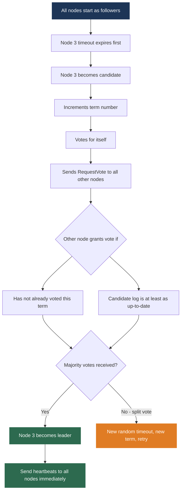

**Randomized timeouts** (e.g. 150-300ms) prevent multiple nodes from timing out simultaneously, making split votes rare. The log up-to-date check is critical - it ensures only candidates with complete logs can become leader, preventing data loss.

---

### Raft Log Replication - Step by Step

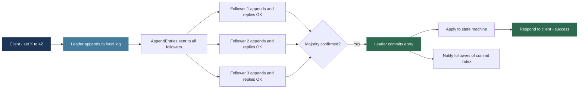

The client gets a response **only after a majority has persisted the entry**. If the leader crashes immediately after responding, at least a majority of nodes have the entry, so the new leader will have it too.

**What if leader crashes before telling followers about the commit?**
The new leader must win votes from a majority. At least one voter in any majority has the committed entry and only votes for candidates whose log is at least as up-to-date. Therefore the new leader always has all committed entries. Committed entries are never lost.

---

## 4. Raft vs Paxos - Practical Comparison

| Dimension | Paxos | Raft |
|-----------|-------|------|
| Understandability | Notoriously difficult | Designed explicitly to be clear |
| Leader model | Weak - any node can propose | Strong - single designated leader |
| Leader election | Not specified | Randomized timeouts, fully specified |
| Log management | Not fully specified | Log matching property, fully specified |
| Membership changes | Not specified | Joint consensus, specified |
| Typical use | Chubby (Google), ZooKeeper internals | etcd, Consul, CockroachDB, TiKV |

### Where Raft Runs Today

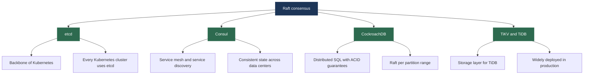

Every Kubernetes deployment in the world is running Raft through etcd.

---

## 5. Google Spanner and TrueTime - Global Consistency

Google Spanner (2012 paper) provides:
- **External consistency** - stronger than serializability
- **Global ACID transactions** across multiple continents
- **SQL interface** with horizontal scalability to millions of machines

Many distributed systems researchers considered this theoretically impossible before Google demonstrated it.

---

### The Problem - Clocks in Distributed Systems

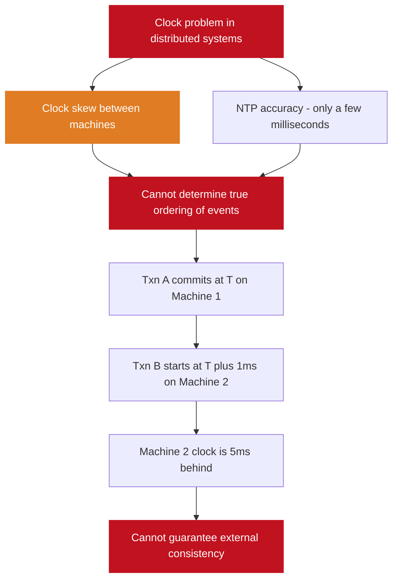

Traditional databases work around this with logical clocks (vector clocks, Lamport timestamps), but these require coordination between nodes, adding latency. Spanner takes a different approach: make physical clocks accurate enough that their uncertainty is bounded and known.

---

### TrueTime - Bounded Clock Uncertainty

Instead of saying "the current time is T", TrueTime says:

> **The current time is somewhere in the interval [T_earliest, T_latest]**

The true current time is **guaranteed** to be within this interval.

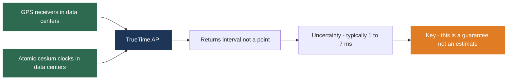

| Technology | Accuracy | Role |
|-----------|---------|------|
| GPS receivers | Microsecond accuracy via satellite atomic clocks | Primary time source in each data center |
| Cesium atomic clocks | Extreme precision independent of GPS | Backup when GPS signal unavailable |
| NTP (traditional) | Tens of milliseconds, no hard guarantee | What most systems use; not good enough for Spanner |

The crucial difference is not just accuracy. It is the **guarantee**. NTP says "probably accurate to within tens of ms." TrueTime says "guaranteed accurate to within 7ms."

---

### How Spanner Uses TrueTime for External Consistency

**The requirement:** if Transaction T1 commits before Transaction T2 starts, then T1's commit timestamp must be less than T2's commit timestamp.

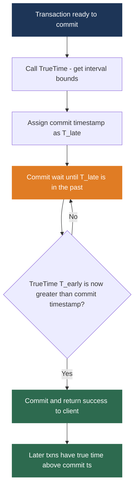

**Why commit wait works:** after waiting, the true current time is guaranteed to exceed the commit timestamp. Any transaction starting after the client receives success has a true start time greater than the commit timestamp. Ordering is guaranteed.

**The latency trade-off:** commit wait duration equals the TrueTime uncertainty interval (1-7ms). This is often *faster* than traditional distributed transaction coordination (two-phase commit across continents = tens to hundreds of ms). For read-only transactions, Spanner uses snapshot reads at a past timestamp with no commit wait at all.

Every microsecond of clock accuracy translates directly into reduced transaction latency. This is why Google invests in GPS receivers and atomic clocks in every data center.

---

### Spanner Architecture

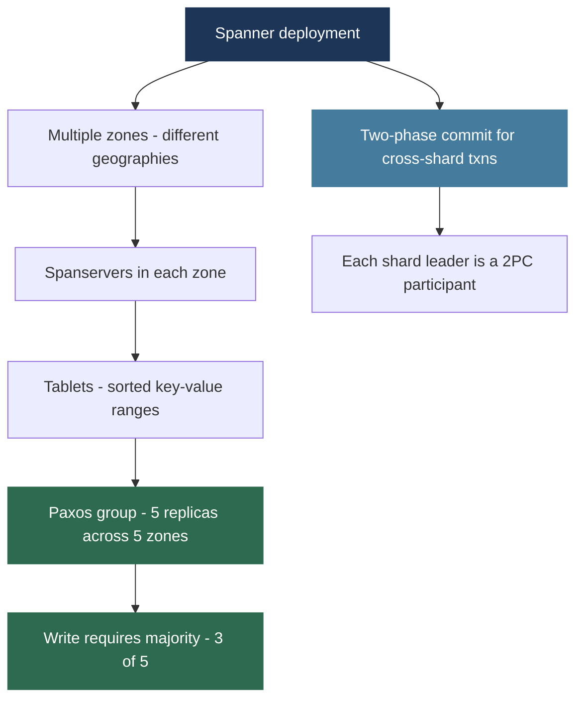

| Component | Role |
|-----------|------|
| Zones | Unit of physical isolation; typically a data center or portion of one |
| Spanservers | Manage tablets within each zone |
| Tablets | Ranges of data in sorted key-value store built on Bigtable and Colossus |
| Paxos groups | Each tablet replicated across 5 zones; write needs 3 of 5 |
| Two-phase commit | Coordinates transactions touching multiple Paxos groups |

---

### Spanner's Impact

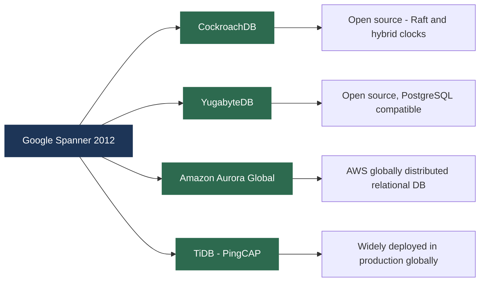

---

## 6. The Consistency Spectrum

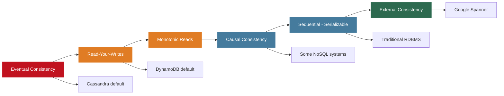

Moving right on the spectrum: stronger consistency, higher correctness, higher latency, higher coordination overhead, lower availability during partitions.

Moving left: weaker consistency, application must handle inconsistency, lower latency, higher availability.

**The engineering skill is not choosing the strongest or weakest - it is choosing the minimum consistency level each operation requires.**

### One Application, Multiple Consistency Levels

| Operation | Consistency Level | Reasoning |
|-----------|-----------------|-----------|
| Product catalog, inventory estimates, feeds | Eventual | Slightly stale data is acceptable |
| Shopping cart | Read-your-writes | You must see your own additions immediately |
| Order status updates | Causal | Shipped must appear after Confirmed |
| Payment transactions | External - Spanner level | Money must be exactly right, globally consistent |

Amazon's 2007 Dynamo paper described exactly this split: shopping cart uses eventual consistency, payment uses strong consistency. Two different systems, two different models, in the same user-facing application.

---

## Lecture Summary

```mermaid
flowchart TD
    W4L2[Week 4 Lecture 2] --> FLP2[FLP Impossibility]
    W4L2 --> PAXOS3[Paxos]
    W4L2 --> RAFT2[Raft]
    W4L2 --> SPAN2[Spanner and TrueTime]
    W4L2 --> SPEC[Consistency Spectrum]

    FLP2 --> F1[Safety always, liveness usually]
    FLP2 --> F2[Cannot guarantee both with any failures]

    PAXOS3 --> PA1[Two phases - Prepare then Accept]
    PAXOS3 --> PA2[Majority quorum guarantees safety]
    PAXOS3 --> PA3[Notoriously hard to implement completely]

    RAFT2 --> RA1[Leader election via randomized timeouts]
    RAFT2 --> RA2[Log replication - majority must confirm]
    RAFT2 --> RA3[Powers etcd, Consul, CockroachDB]

    SPAN2 --> SP1[TrueTime - GPS and atomic clocks]
    SPAN2 --> SP2[Bounded uncertainty 1 to 7ms - guaranteed]
    SPAN2 --> SP3[Commit wait enables external consistency]

    SPEC --> SC1[Choose minimum consistency per operation]
    SPEC --> SC2[One app can mix consistency levels]

    style W4L2 fill:#1d3557,color:#fff,stroke:#1d3557
    style FLP2 fill:#c1121f,color:#fff,stroke:#c1121f
    style PAXOS3 fill:#457b9d,color:#fff,stroke:#457b9d
    style RAFT2 fill:#2d6a4f,color:#fff,stroke:#2d6a4f
    style SPAN2 fill:#e07c24,color:#fff,stroke:#e07c24
    style SPEC fill:#457b9d,color:#fff,stroke:#457b9d
```

**Next class:** Week 5 - Distributed Systems Fundamentals. Distributed architectures, fault tolerance and replication strategies, master-worker model, and scalability vs availability trade-offs.

---

*BDA Spring 2026 | Week 4, Lecture 2 | Paxos, Raft and Google Spanner TrueTime*
