# Big Data Analytics (BDA Spring 2026)
## Week 5, Lecture 1: Distributed System Architectures, Fault Tolerance and Replication

> In a distributed system, failure is not an exceptional event. Failure is the normal operating condition. Google's clusters of 1,000 machines see approximately one machine fail every day. The question is never whether failures will happen. The question is whether your system continues to function correctly when they do.

---

## Table of Contents

1. [What Is a Distributed System](#1-what-is-a-distributed-system)
2. [Distributed System Architectures](#2-distributed-system-architectures)
3. [Fault Tolerance - Building Systems That Survive Failure](#3-fault-tolerance---building-systems-that-survive-failure)
4. [Replication Strategies and Topologies](#4-replication-strategies-and-topologies)
5. [Failure Detection and Recovery](#5-failure-detection-and-recovery)
6. [Scalability - Growing the System](#6-scalability---growing-the-system)
7. [Complete Architecture Example](#7-complete-architecture-example)

---

## 1. What Is a Distributed System

> **A distributed system is a collection of independent computers that appears to its users as a single coherent system.**

Two things in that definition matter:

- **Independent computers** - each machine has its own processor, memory, storage, and OS. They communicate exclusively by passing messages over a network.
- **Appears as a single coherent system** - from the user's perspective they are interacting with one system. The distribution is transparent.

The gap between the physical reality (many machines, unreliable network) and the desired abstraction (one reliable system) is where all the complexity lives.

---

### The Eight Fallacies of Distributed Computing

Peter Deutsch and James Gosling at Sun Microsystems identified eight assumptions that are all wrong:

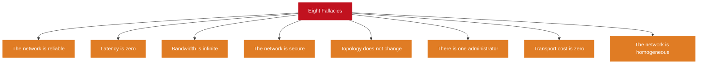

| Fallacy | Reality |
|---------|---------|
| Network is reliable | Packets are dropped; connections time out; routers malfunction |
| Latency is zero | Within a data center: microseconds to ms; across continents: tens to hundreds of ms |
| Bandwidth is infinite | Networks have finite capacity; shuffling large datasets saturates links |
| Network is secure | Without explicit encryption and auth, communications can be intercepted |
| Topology does not change | Servers added and removed; routes change; IPs change |
| One administrator | Large systems span multiple teams, organizations, and data centers |
| Transport cost is zero | Serialization, transmission, and deserialization all consume CPU and time |
| Network is homogeneous | Different hardware, OS, protocols, and performance throughout |

Every fallacy assumed true leads to bugs that appear only in production under load or failure.

---

## 2. Distributed System Architectures

### Architecture 1 - Client-Server

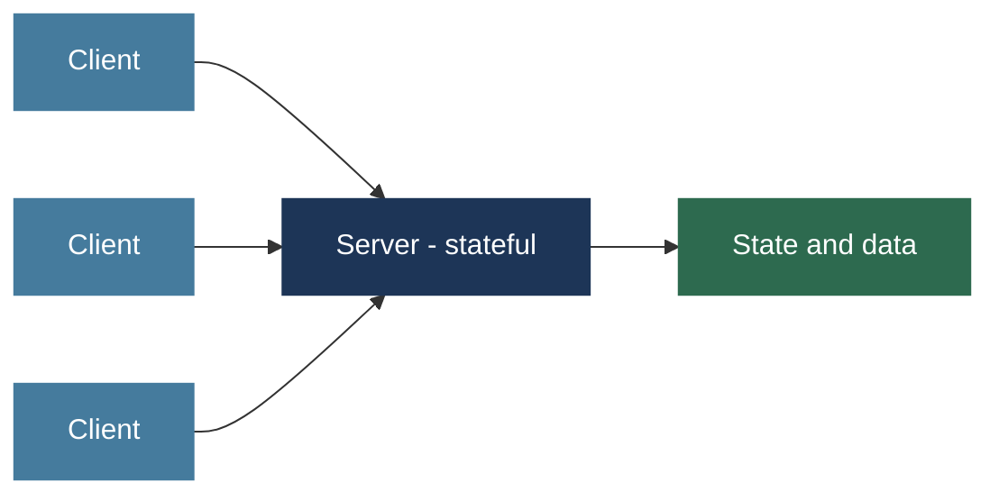

| Aspect | Detail |
|--------|--------|
| Strengths | Simple to understand; clear separation of concerns; easy to reason about state |
| Weaknesses | Server is a single point of failure and a scalability bottleneck |
| How to scale | Vertical scaling, read replicas, load balancers across multiple instances |
| Examples | Traditional web apps, REST APIs, most database clients |

---

### Architecture 2 - Master-Worker

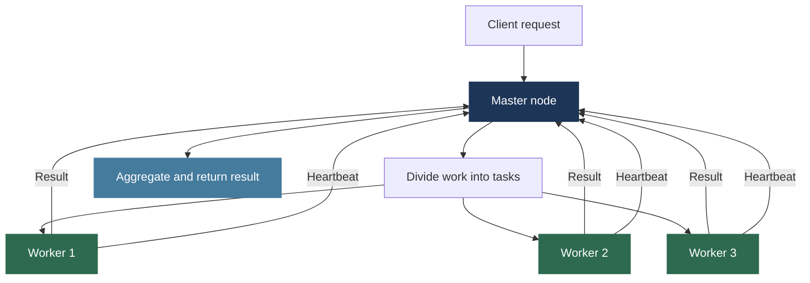

The master receives requests, divides work, assigns to workers, tracks completion, collects results, and handles worker failures by reassigning tasks.

| Aspect | Detail |
|--------|--------|
| Strengths | Clear responsibility boundaries; workers are simple and stateless; master has global scheduling view |
| Weakness | Master is a single point of failure and coordination bottleneck |
| Master replication | Standby master takes over on primary failure; Hadoop Active and Standby NameNode |
| Master sharding | Divide responsibilities across multiple masters, each owning a subset |
| Examples | Hadoop MapReduce, Apache Spark, HDFS |

> Master replication is a consensus problem. Which replica is the current master? HDFS uses ZooKeeper (ZAB protocol, a Paxos variant) to elect the active NameNode and ensure only one master is active. This is exactly what Raft's election mechanism solves.

---

### Architecture 3 - Peer-to-Peer

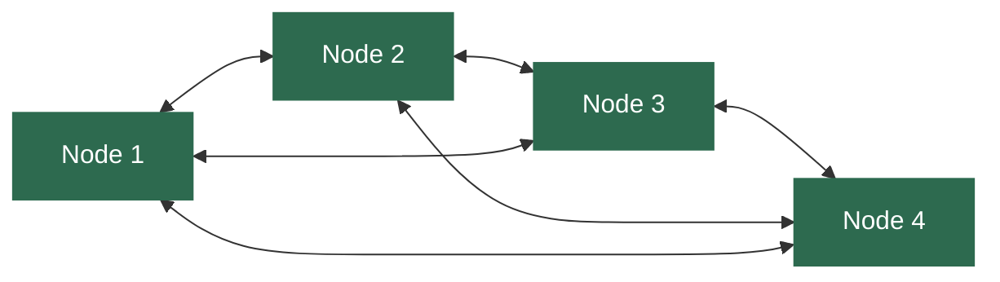

No master. All nodes are equal - every node can act as both client and server.

| Mechanism | Purpose |
|-----------|---------|
| Consistent hashing | Each node owns a key range on a hash ring; any node finds the owner of any key without central coordination |
| Gossip protocols | Nodes periodically exchange state with random neighbors; information spreads exponentially fast without a master |
| Quorum reads and writes | Operations require acknowledgment from a configurable number of replicas; tunable consistency |

| Aspect | Detail |
|--------|--------|
| Strengths | No single point of failure; scales naturally; no coordination bottleneck |
| Weaknesses | Coordination is complex; consistency harder to achieve without a master |
| Examples | BitTorrent, Cassandra, DynamoDB, Bitcoin |

---

### Architecture 4 - Microservices

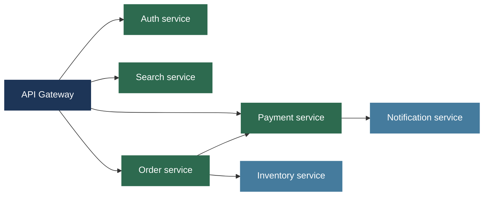

Each service owns a specific business capability, its own database, and communicates via APIs or message queues.

| Strength | Weakness |
|---------|---------|
| Independent deployability - update one service without redeploying others | All network fallacies apply to every inter-service call |
| Independent scalability - scale payment service separately from search | Distributed transactions across services require saga patterns or two-phase commit |
| Technology diversity - different services can use different languages and DBs | Debugging requires tracing requests across dozens of services |
| Fault isolation - a bug in one service does not necessarily bring down others | Operational complexity grows with number of services |

Used by Netflix (600+ services), Uber, and Amazon. Data pipelines in modern organizations are typically implemented as microservices.

---

### Architecture 5 - Lambda and Kappa

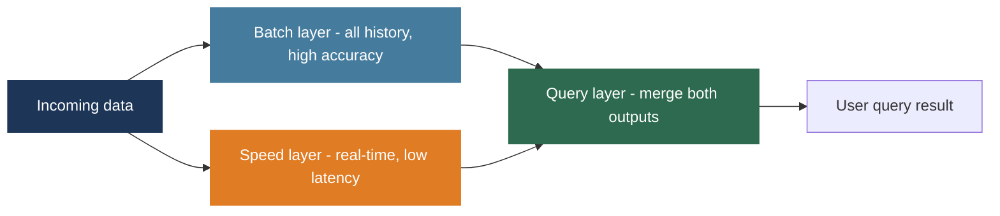

| Architecture | Approach | Trade-off |
|-------------|---------|----------|
| Lambda | Batch layer for history plus speed layer for real-time; query merges both | High accuracy and low latency, but two codebases to maintain |
| Kappa | Stream-only; historical reprocessing by replaying the event log | Simpler architecture; only works if stream processor handles all patterns |

Full detail covered in Week 7.

---

## 3. Fault Tolerance - Building Systems That Survive Failure

### The Fundamental Mechanism - Redundancy

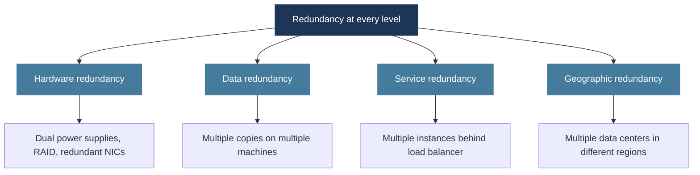

Each level of redundancy adds cost. The engineering challenge is determining how much redundancy is sufficient for your reliability requirements.

---

## 4. Replication Strategies and Topologies

### Synchronous Replication

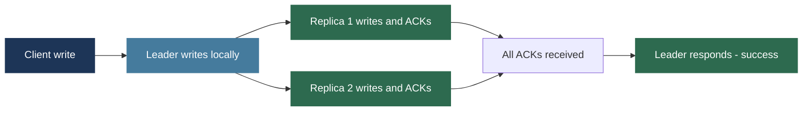

Client does not receive success until all replicas confirm.

| Property | Value |
|---------|-------|
| Data loss on leader crash | None - replicas have all committed data |
| Write latency | Higher - must wait for slowest replica |
| Used by | PostgreSQL sync replication, Raft systems, HDFS critical writes, Spanner |

---

### Asynchronous Replication

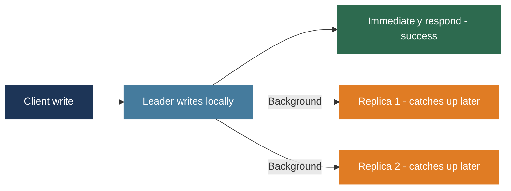

Client gets success immediately; replication happens in the background.

| Property | Value |
|---------|-------|
| Data loss risk | Yes - if leader crashes before replicas catch up, acknowledged writes may be lost |
| Write latency | Lower - client does not wait for replicas |
| Used by | MySQL async replication, Cassandra with ONE consistency, MongoDB default |

---

### Semi-Synchronous Replication

Wait for at least one replica (not all) before responding to client. Eliminates the single-machine data loss risk while avoiding waiting for all replicas including slow or distant ones. Used by MySQL semi-synchronous replication.

---

### Replication Topologies

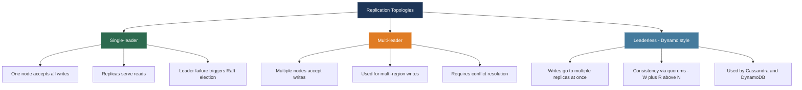

**Multi-leader conflict resolution strategies:**

| Strategy | How It Works | Risk |
|---------|-------------|------|
| Last-write-wins | Timestamp determines winner | Clock skew can cause newer writes to lose |
| Application merge | Application-defined merge function | Requires custom logic per data type |
| CRDTs | Data structures that merge automatically without conflicts | Complex to design; not suitable for all data types |

**Leaderless consistency guarantee:** if W replicas must confirm a write and R replicas must respond to a read, then W + R > N ensures the read quorum always overlaps the write quorum.

**Read repair mechanisms in leaderless systems:**

| Mechanism | How It Works |
|-----------|-------------|
| Version vectors | Each write carries a version number; read returns all versions and resolves conflicts |
| Last-write-wins | Timestamp determines most recent; simple but clock-skew risk |
| Read repair | Read that detects stale replicas immediately updates them to latest |
| Anti-entropy | Background process continuously compares and repairs replica differences |

---

## 5. Failure Detection and Recovery

### Heartbeat-Based Detection

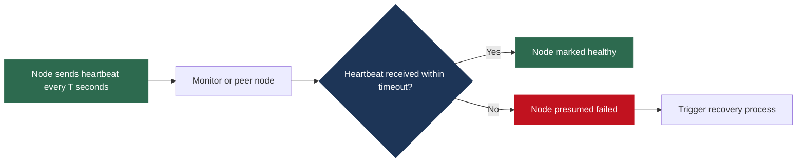

**The timeout trade-off:**

| Timeout Setting | Problem |
|----------------|---------|
| Too short | False positives - slow nodes declared dead; split-brain if old leader recovers after new election |
| Too long | Slow failure detection - applications experience full timeout duration as downtime |

**Phi Accrual Failure Detector** (used by Cassandra and Akka): instead of a binary alive/dead decision, continuously calculates a suspicion level phi based on the statistical distribution of heartbeat arrival times. As heartbeats become increasingly late relative to historical patterns, phi rises. Applications set a threshold phi at which they declare failure. Adapts to changing network conditions and reduces false positives.

---

### Recovery by Failure Type

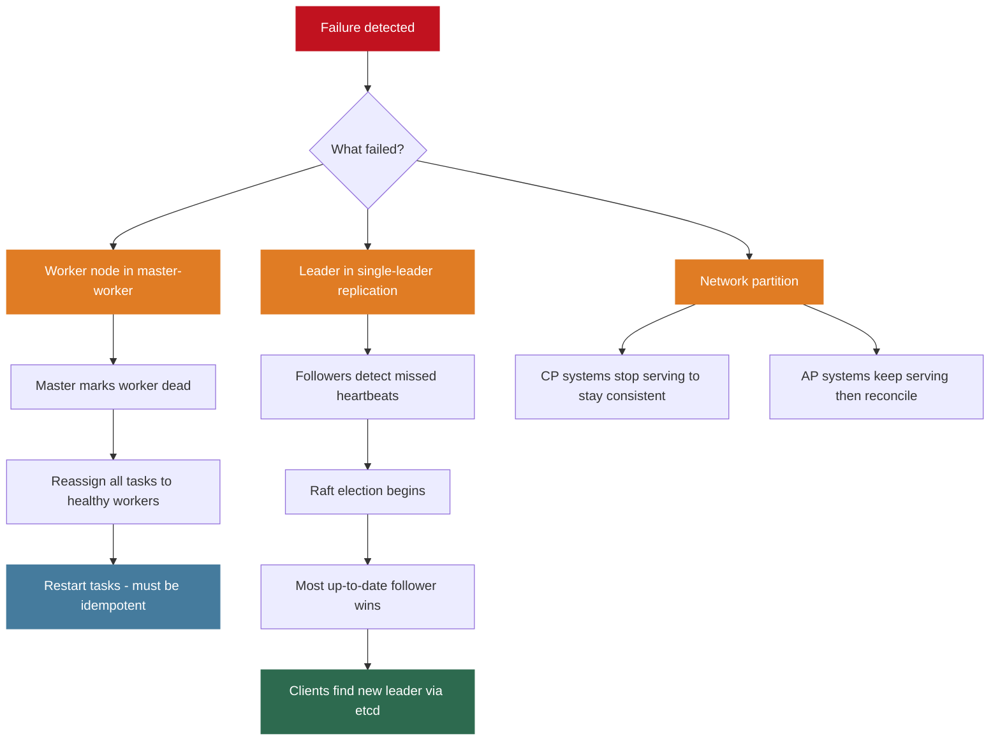

Tasks in Hadoop MapReduce are designed to be **idempotent**: running the same task twice produces the same result. This makes it safe to restart tasks that may have partially completed on a failed worker.

---

## 6. Scalability - Growing the System

### Vertical vs Horizontal Scaling

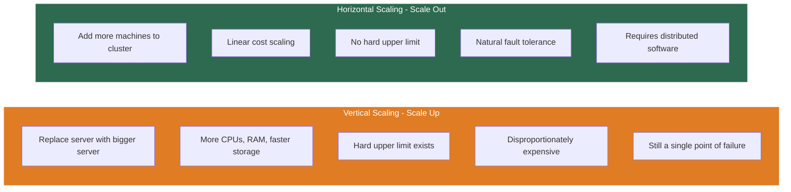

All Big Data frameworks (Hadoop, Spark, Kafka, Cassandra) are designed for horizontal scalability on commodity clusters.

**Amdahl's Law revisited:** the serial fraction of your computation limits horizontal scaling. A workload that is 95% parallelizable achieves at most 20x speedup regardless of cluster size. Designing for horizontal scalability means minimizing the serial fraction: the parts requiring coordination, synchronization, or central processing.

---

### Replication Factor Trade-offs

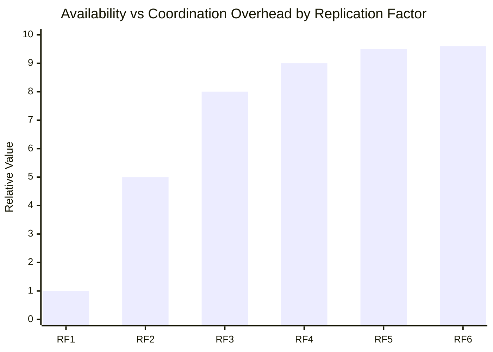

| Replication Factor | Tolerates | Write Overhead | Typical Use |
|-------------------|----------|---------------|-------------|
| 1 | Nothing | Minimal | Development only |
| 2 | One failure | Low | Non-critical data |
| 3 | One failure | Moderate | Standard production |
| 5 | Two simultaneous failures | Higher | Multi-region deployments |
| 6+ | Diminishing returns | High | Rarely justified |

3 to 5 replicas is the production sweet spot. Beyond 5, the consistency and coordination overhead exceeds the availability benefit.

---

## 7. Complete Architecture Example

A global ride-sharing platform requires multiple consistency models within one application.

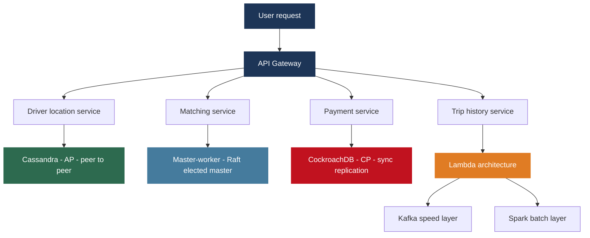

| Component | Architecture | Consistency | Reasoning |
|-----------|-------------|-------------|-----------|
| Driver location | Cassandra, RF 3 per region, quorum reads and writes | AP - eventual | 4 Hz writes from millions of drivers; 500ms stale location is fine for matching |
| Matching service | Master-worker; Raft-elected master via ZooKeeper | Strong coordination | Computationally intensive; master partitions geographic area into cells |
| Payment service | CockroachDB; synchronous replication; serializable | CP - strong | Double-charging is unacceptable; brief unavailability during partition is acceptable |
| Trip history | Lambda; Kafka speed layer plus Spark batch; Parquet on S3 | Eventual for feeds, consistent for reports | Low-latency recent queries plus high-accuracy batch analytics |

One platform, four different distributed system patterns, because each component has different requirements. This is real distributed systems architecture.

---

## Lecture Summary

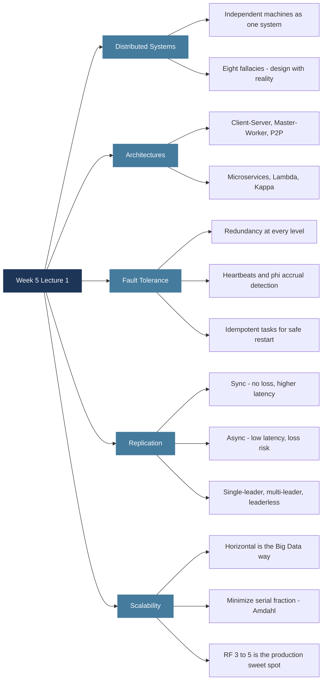

**Next class:** Hadoop ecosystem deep dive - HDFS architecture, NameNode and DataNode relationship, block replication, and how HDFS handles node failures.

---

*BDA Spring 2026 | Week 5, Lecture 1 | Distributed System Architectures, Fault Tolerance and Replication*
