# Big Data Analytics (BDA Spring 2026)
## Week 5, Lecture 2: Scalability Patterns, Availability, Load Balancing and Service Discovery

> Last class we covered distributed system architecture, replication, and fault tolerance. Today we answer three practical questions every distributed systems engineer faces daily: how do you scale under load, how do you measure and engineer availability, and how does traffic get routed across many instances?

---

## Table of Contents

1. [Scalability Patterns](#1-scalability-patterns)
2. [Availability - Measuring and Engineering Reliability](#2-availability---measuring-and-engineering-reliability)
3. [Load Balancing](#3-load-balancing)
4. [Service Discovery](#4-service-discovery)
5. [Circuit Breakers - Preventing Cascading Failures](#5-circuit-breakers---preventing-cascading-failures)

---

## 1. Scalability Patterns

### Pattern 1 - Stateless Services and Horizontal Scaling

A **stateless service** stores no state between requests. Every request carries all information needed to process it. Because any instance can handle any request, scaling is trivial.

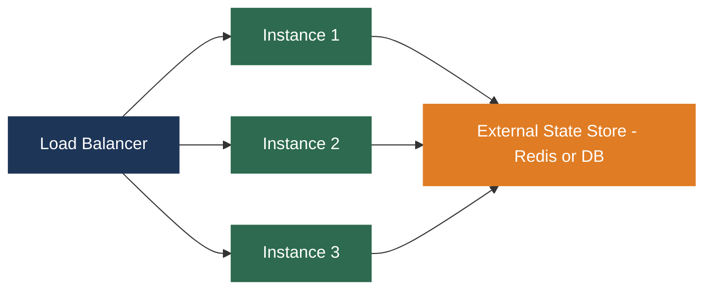

State is not eliminated. It is **externalized** into a shared store (Redis, database). The service retrieves state when needed and writes it back. This is why your Netflix account works whether your request hits a server in Virginia or Oregon.

| Property | Stateless Service | Stateful Service |
|----------|-----------------|-----------------|
| Horizontal scaling | Trivial - add more instances | Hard - state must move with the request |
| Instance interchangeability | Any instance handles any request | Requests must go to the right instance |
| Failure recovery | Start a new instance | Must recover or migrate state |
| Exam tip | Make it stateless first, then scale | Last resort when state cannot be externalized |

---

### Pattern 2 - Data Partitioning for Write Scalability

Stateless services scale reads easily. But writes eventually bottleneck a single database node. Partitioning distributes writes across multiple nodes.

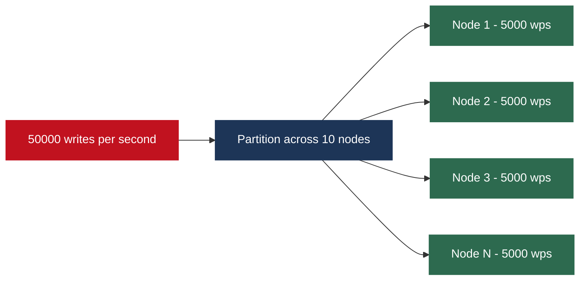

Cassandra handles millions of writes per second at Instagram and Netflix because data is partitioned across hundreds of nodes writing in parallel.

**Critical constraint:** writes touching multiple partitions require distributed transactions, which are expensive. Good data modeling means designing so most writes touch only one partition.

---

### Pattern 3 - Read Replicas for Read Scalability

Reads typically outnumber writes 10:1 or more. Read replicas distribute read load without touching write capacity.

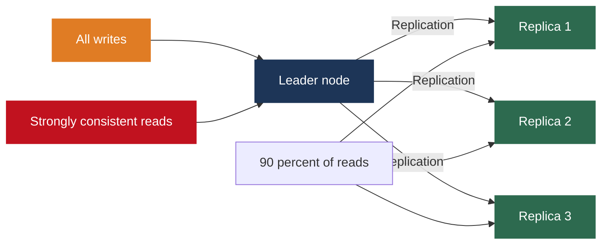

| Aspect | Detail |
|--------|--------|
| Read scalability | 9 replicas plus 1 leader gives 10x read capacity |
| Consistency trade-off | Replicas have replication lag; reads may return slightly stale data |
| Read-your-writes | Route reads immediately after a write to the leader for that session |
| Lag monitoring | ProxySQL and PgBouncer can route reads based on replica freshness |

---

### Pattern 4 - Caching Hierarchy for Latency and Throughput

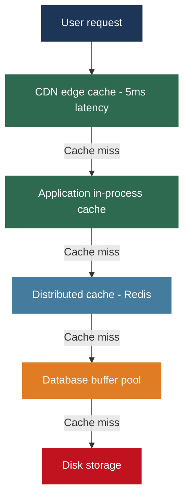

| Cache Layer | Location | Latency | Best For |
|-------------|---------|---------|---------|
| CDN | Geographically distributed edge nodes | 5ms vs 200ms | Static assets, pages served globally |
| In-process | Inside application memory | Zero network overhead | Small, rarely changing reference data |
| Redis/Memcached | Shared distributed cache | Sub-millisecond | Sessions, computed results, query results |
| DB buffer pool | Database memory | Automatic | Frequently accessed database pages |

A 99% cache hit rate reduces database load by 100x. Cache warming: new instances start with a cold cache; pre-warm before routing traffic or gradually increase load on new instances.

---

### Pattern 5 - Asynchronous Processing with Message Queues

Not all work needs to happen in the critical path of a user-facing request. Message queues decouple producers from consumers.

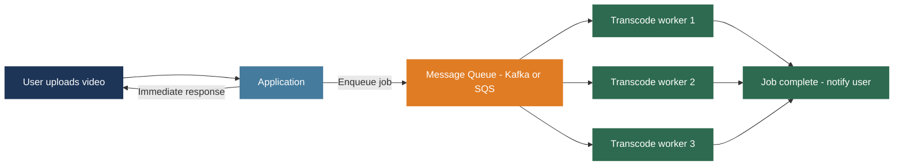

Benefits: user gets an immediate response; workers scale independently of the upload service; system degrades gracefully under load rather than failing. This is the foundation of stream processing architectures covered in Week 9.

---

## 2. Availability - Measuring and Engineering Reliability

### The Nines of Availability

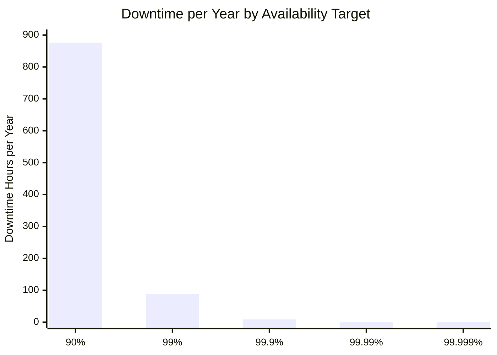

| Availability | Downtime per Year | Downtime per Month | Downtime per Week |
|-------------|------------------|-------------------|-------------------|
| 90% - one nine | 36.5 days | 72 hours | 16.8 hours |
| 99% - two nines | 3.65 days | 7.2 hours | 1.68 hours |
| 99.9% - three nines | 8.76 hours | 43.8 minutes | 10.1 minutes |
| 99.99% - four nines | 52.6 minutes | 4.38 minutes | 1.01 minutes |
| 99.999% - five nines | 5.26 minutes | 26.3 seconds | 6.05 seconds |

**Engineering implication:** three nines (8.76 hours/year) means two 5-minute deployments per week already consume 8.67 hours. Zero-downtime deployments are not optional for any system targeting three nines or better.

**Five nines** means 5.26 minutes total downtime per year. Every deployment, migration, and maintenance window must be zero-downtime. Failure detection and recovery must complete in seconds.

---

### Series vs Parallel Availability

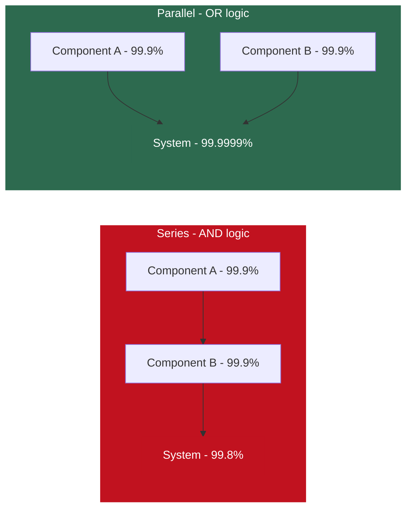

**Series formula:** `System Availability = A × B`
Two components at 99.9% in series gives 0.999 × 0.999 = 99.8%. Ten microservices each at 99.9% in series gives 99.0% system availability.

**Parallel formula:** `System Unavailability = Unavail(A) × Unavail(B)`
Two components at 99.9% in parallel gives unavailability of 0.001 × 0.001 = 0.000001%, meaning 99.9999% availability.

| Configuration | Formula | Example Result |
|--------------|---------|---------------|
| 2 services in series at 99.9% | 0.999 × 0.999 | 99.8% |
| 10 services in series at 99.9% | 0.999^10 | 99.0% |
| 2 replicas in parallel at 99.9% | 1 - (0.001 × 0.001) | 99.9999% |
| 3 replicas in parallel at 99.9% | 1 - (0.001^3) | 99.9999999% |

---

### Correlated Failures - The Hidden Danger

The parallel formula assumes **independent** failures. In practice many failures are correlated.

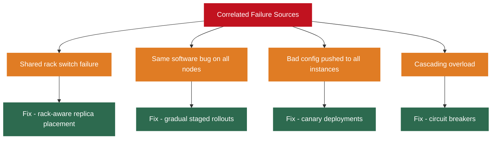

| Failure Type | Risk | Mitigation |
|-------------|------|-----------|
| Shared rack switch | All nodes on same rack fail together | Rack-aware placement across different switches |
| Software bug | Same query crashes all replicas simultaneously | Gradual rollouts; test on canary first |
| Config change | Bad config takes down all instances at once | Deploy to 1% of instances first, verify, then proceed |
| Cascading load | Slow node causes retries that overwhelm others | Circuit breakers, timeouts, backpressure |

**Diminishing returns on replicas:** 1 to 2 replicas gives a dramatic improvement. 2 to 3 helps further. 5 to 6 gives almost no meaningful gain. 3 to 5 replicas across separate availability zones is the production sweet spot for most systems.

---

## 3. Load Balancing

### Load Balancing Algorithms

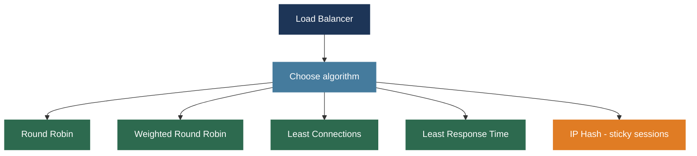

| Algorithm | How It Works | Best For | Limitation |
|-----------|-------------|---------|-----------|
| Round Robin | Requests distributed in sequence 1, 2, 3, 1, 2, 3 | Equal-capacity instances, uniform request times | Long requests pile up on unlucky instances |
| Weighted Round Robin | Higher-capacity instances get proportionally more requests | Mixed instance sizes | Still ignores current busyness |
| Least Connections | New request goes to instance with fewest active connections | Variable-length requests | Does not account for response time |
| Least Response Time | Routes to instance with fewest connections and lowest avg latency | Maximizing speed | Slightly more complex to implement |
| IP Hash | Client IP hash determines which instance handles all their requests | Stateful services that cannot externalize state | If that instance fails, session is lost |

---

### Layer 4 vs Layer 7 Load Balancing

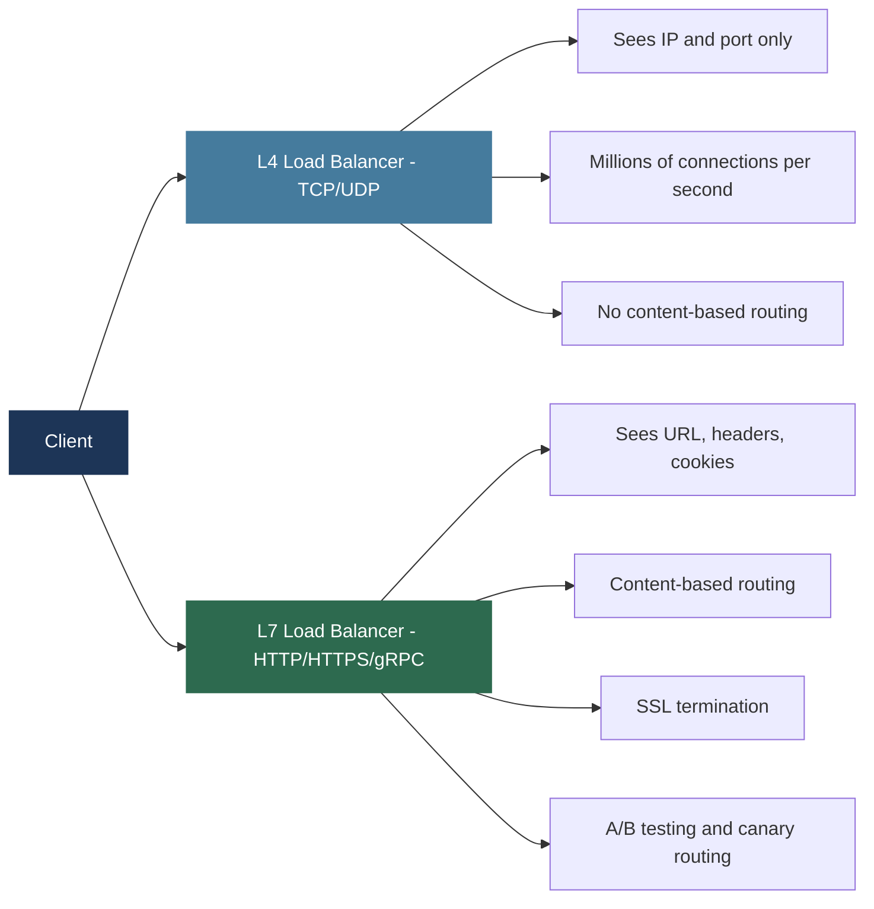

| Feature | L4 - Transport Layer | L7 - Application Layer |
|---------|---------------------|----------------------|
| What it sees | IP addresses and ports only | URLs, HTTP headers, cookies, body |
| Speed | Extremely fast; minimal CPU | More overhead; still handles 100K+ rps |
| Content routing | No | Yes - route /payment to payment service |
| SSL termination | No | Yes - offloads crypto from app servers |
| A/B testing | No | Yes - route beta users to new version |
| Examples | AWS NLB, HAProxy TCP mode | NGINX, HAProxy HTTP mode, AWS ALB |

**Production pattern:** L4 at the network edge for raw throughput, L7 at the application layer for content-based routing and SSL termination.

---

### Health Checks

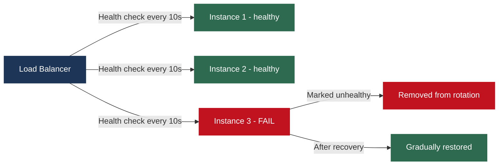

| Health Check Type | What It Verifies | Catches |
|------------------|-----------------|---------|
| Basic process check | Is the process running? | Crashes and freezes |
| HTTP endpoint check | Does /health return 200? | App-level failures |
| Deep health check | Database connectivity, cache, dependencies | Degraded instances that are running but cannot serve |

---

## 4. Service Discovery

In static environments, instance IPs are fixed and known. In cloud deployments with auto-scaling, instances start and stop constantly. Service discovery solves how services find each other dynamically.

### Client-Side Discovery

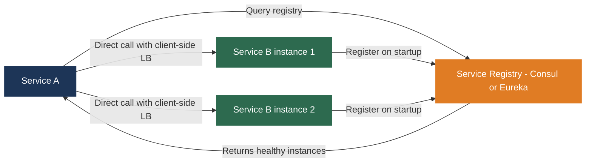

| Aspect | Detail |
|--------|--------|
| How it works | Each service queries registry directly and applies load balancing itself |
| Advantage | No central load balancer in request path; lower latency |
| Disadvantage | Load balancing logic lives in every service client |
| Used by | Netflix Eureka with Ribbon client-side load balancer |

---

### Server-Side Discovery

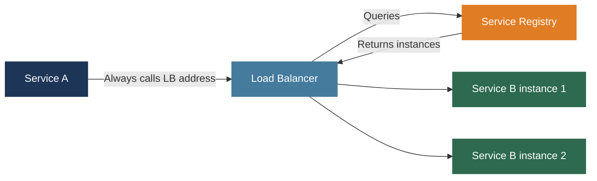

| Aspect | Detail |
|--------|--------|
| How it works | Client sends to load balancer; LB queries registry internally |
| Advantage | Clients are simple; no discovery logic needed in each service |
| Disadvantage | Load balancer is an extra hop in every request |
| Used by | AWS ELB with ECS, Kubernetes Services |

---

### Discovery Approaches Compared

| Approach | Client Complexity | Latency | Failure of Registry | Used By |
|----------|-----------------|---------|--------------------|----|
| Client-side | High - needs library per language | Low - direct call | Clients cache last known instances | Netflix Eureka |
| Server-side | Low - just call LB address | Medium - extra hop | LB may cache instances | Kubernetes, AWS ELB |
| DNS-based | Zero - standard DNS | Low | DNS TTL may serve stale IPs briefly | Kubernetes DNS, Consul DNS |
| Service mesh | Zero - sidecar handles everything | Very low | Control plane pushes updates | Istio, Consul Connect |

---

### Service Mesh - The Modern Approach

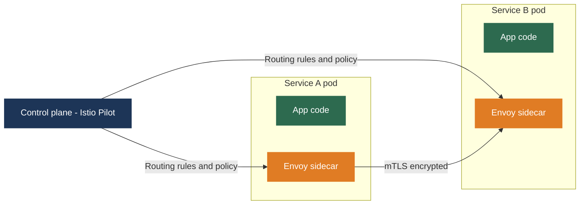

Every service instance gets a sidecar proxy (Envoy). All network traffic passes through the sidecar. The application makes a simple call to a hostname; the sidecar handles discovery, load balancing, retries, circuit breaking, and encryption.

Use a service mesh when you have 20 or more services and the same reliability and security policies must be enforced consistently across all of them. Below that threshold, a simple load balancer and registry is sufficient.

---

## 5. Circuit Breakers - Preventing Cascading Failures

### The Cascading Failure Problem

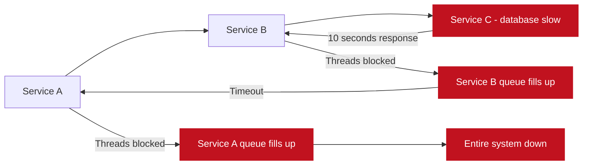

One slow downstream service cascades up the call chain and collapses everything. Service C's problem was temporary but became catastrophic because B and A kept waiting.

---

### Circuit Breaker States

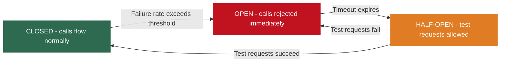

| State | Behavior | When |
|-------|---------|------|
| Closed | All calls pass through normally; failure rate is monitored | Normal operation |
| Open | Calls are immediately rejected without contacting downstream | Failure rate exceeded threshold (e.g. 50% of calls in last 60s) |
| Half-Open | A limited number of test requests are allowed through | After a configured timeout in Open state |

**The benefit:** when Service C is failing, Services A and B fail fast (immediate error) instead of accumulating blocked threads waiting for timeouts. The system degrades gracefully. Service C gets time to recover without being overwhelmed.

**Libraries:** Netflix Hystrix (deprecated but influential), Resilience4j (Java), Istio (mesh-level, no code changes needed).

---

## Lecture Summary

```mermaid
flowchart TD
    W5L2[Week 5 Lecture 2] --> SCALE[Scalability Patterns]
    W5L2 --> AVAIL[Availability]
    W5L2 --> LB5[Load Balancing]
    W5L2 --> SD[Service Discovery]
    W5L2 --> CB[Circuit Breakers]

    SCALE --> S1[Stateless services - externalize state]
    SCALE --> S2[Partitioning for write scale]
    SCALE --> S3[Read replicas for read scale]
    SCALE --> S4[Caching hierarchy]
    SCALE --> S5[Async queues for background work]

    AVAIL --> AV1[Five nines = 5.26 min downtime per year]
    AVAIL --> AV2[Series multiplies availability down]
    AVAIL --> AV3[Parallel multiplies unavailability down]
    AVAIL --> AV4[Correlated failures defeat redundancy]

    LB5 --> LB1[Round Robin, Least Connections, IP Hash]
    LB5 --> LB2[L4 for throughput, L7 for routing]
    LB5 --> LB3[Health checks auto-remove failed nodes]

    SD --> SD1[Client-side, server-side, DNS, mesh]
    SD --> SD2[Service mesh for 20 plus services]

    CB --> CB1[Closed, Open, Half-Open states]
    CB --> CB2[Fail fast to prevent cascade]

    style W5L2 fill:#1d3557,color:#fff,stroke:#1d3557
    style SCALE fill:#457b9d,color:#fff,stroke:#457b9d
    style AVAIL fill:#457b9d,color:#fff,stroke:#457b9d
    style LB5 fill:#457b9d,color:#fff,stroke:#457b9d
    style SD fill:#457b9d,color:#fff,stroke:#457b9d
    style CB fill:#457b9d,color:#fff,stroke:#457b9d
```

**Next class:** Week 5 continues with network programming, distributed coordination, and consensus algorithms.

---

*BDA Spring 2026 | Week 5, Lecture 2 | Scalability Patterns, Availability, Load Balancing and Service Discovery*
