# Big Data Analytics (BDA Spring 2026)
## Week 5, Lecture 3: Network Programming - TCP/IP, Sockets and ZeroMQ Messaging Patterns

> Every distributed system concept we have studied - Raft leader election, Cassandra gossip, Kafka producer-consumer, Spark task assignment - ultimately reduces to processes sending bytes to each other over a network. Today we understand those building blocks from first principles.

---

## Table of Contents

1. [The Network Stack](#1-the-network-stack)
2. [TCP vs UDP - The Fundamental Transport Choice](#2-tcp-vs-udp---the-fundamental-transport-choice)
3. [Socket Programming in Java](#3-socket-programming-in-java)
4. [ZeroMQ - High-Performance Messaging](#4-zeromq---high-performance-messaging)
5. [From Sockets to Distributed Systems](#5-from-sockets-to-distributed-systems)

---

## 1. The Network Stack

### OSI Model vs TCP/IP in Practice

The OSI model defines seven layers. In practice the TCP/IP stack collapses these into four layers that matter for distributed systems programming.

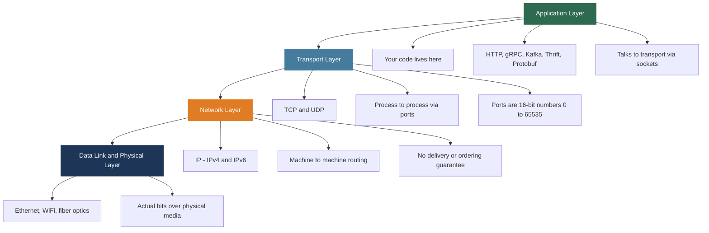

**The critical insight:** as a distributed systems programmer you work at the **Application-Transport boundary** - writing data to sockets, which hands it to TCP or UDP, which handles delivery, and IP routes it to the right machine. You write bytes in. Bytes come out on the other machine. The OS and hardware handle everything in between.

### Well-Known Ports in Big Data Systems

| Port | Service |
|------|---------|
| 80 | HTTP web server |
| 5432 | PostgreSQL |
| 9092 | Apache Kafka |
| 2181 | Apache ZooKeeper |
| 9000 | HDFS NameNode |
| 8080 | Spark Web UI |
| 6379 | Redis |

---

## 2. TCP vs UDP - The Fundamental Transport Choice

### TCP - Transmission Control Protocol

TCP provides a **reliable, ordered, byte-stream** communication channel.

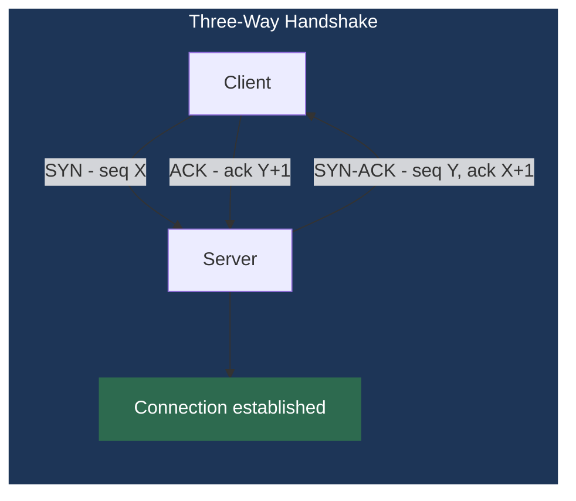

The three-way handshake costs **one round-trip time (RTT)** before any data flows.

- Same data center RTT: ~0.1 ms
- Cross-continent RTT: ~200 ms

This is why **connection pooling** (reusing established TCP connections) is essential for performance.

**TCP Key Properties:**

| Property | Mechanism | Cost |
|----------|-----------|------|
| Reliable delivery | Receiver sends ACK; sender retransmits on timeout | Overhead per segment |
| Ordered delivery | Sequence numbers; receiver reorders if needed | Buffer memory |
| Byte-stream | No message boundaries; app must add framing | Must prefix each message with its length |
| Flow control | Receiver advertises buffer space; sender stays within it | Reduced throughput if receiver is slow |
| Congestion control | Slow start and backoff on packet loss detection | Throughput adapts to network conditions |

**Message framing formula:** since TCP is a byte stream, you must add your own message boundaries.

$$\text{Message on wire} = \underbrace{[L_0 L_1]}_{\text{2-byte length}} + \underbrace{[B_0 B_1 \ldots B_{n-1}]}_{\text{n payload bytes}}$$

`DataOutputStream.writeUTF()` does exactly this - writes a 2-byte length prefix followed by the string bytes. `DataInputStream.readUTF()` reads the length first, then reads exactly that many bytes.

---

### UDP - User Datagram Protocol

UDP provides an **unreliable, unordered, datagram** channel.

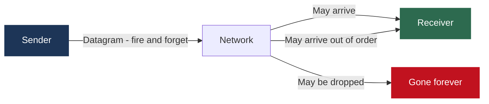

**UDP Key Properties:**

| Property | Detail |
|----------|--------|
| No connection setup | No handshake; first byte goes out immediately |
| No retransmission | Lost packets are gone; no recovery |
| Datagram boundaries preserved | Each write = one packet; each read = one packet |
| No flow or congestion control | Sender can overwhelm receiver or network |
| Supports broadcast and multicast | One packet to multiple recipients |

**Maximum UDP payload size:**

$$\text{Max UDP payload} = 65535 - 8_{\text{UDP header}} - 20_{\text{IP header}} = 65507 \text{ bytes}$$

In practice, stay under **1472 bytes** to avoid IP fragmentation on standard Ethernet (MTU 1500 bytes).

---

### TCP vs UDP - Decision Framework

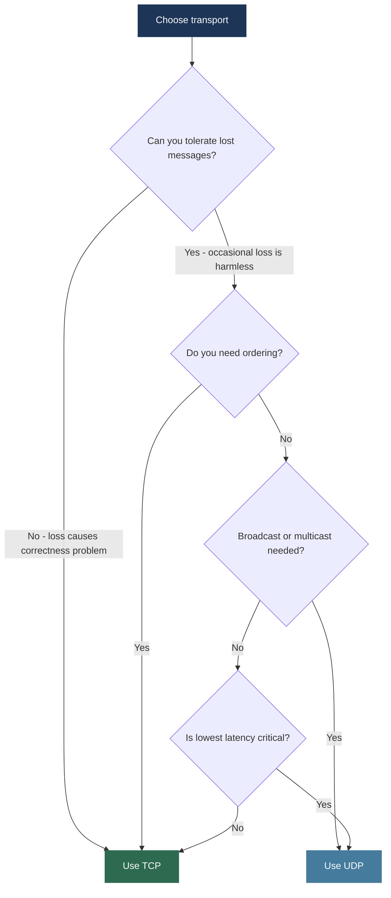

| Use Case | Protocol | Reasoning |
|---------|---------|-----------|
| Kafka producer to broker | TCP | Cannot lose messages; each event has business value |
| Database connections | TCP | Queries and results must be complete and ordered |
| HDFS block transfers | TCP | File data must arrive complete and correct |
| Cassandra gossip protocol | UDP | Membership info is redundant; occasional loss is harmless |
| DNS lookups | UDP | Fast; client just retries if no response |
| Video streaming | UDP | Stale retransmitted frame is worse than a skipped frame |
| Monitoring metrics | UDP | Better to skip a data point than add overhead to every measure |

---

## 3. Socket Programming in Java

### What Is a Socket?

A socket is an OS abstraction representing one endpoint of a network connection, identified by:

$$\text{TCP connection} = (\underbrace{src\_IP}_{}, \underbrace{src\_port}_{}, \underbrace{dst\_IP}_{}, \underbrace{dst\_port}_{})$$

This **four-tuple** uniquely identifies every active connection on the internet. The OS uses it to route incoming packets to the correct process.

From a programmer's perspective, a socket is like a file: write bytes to it, read bytes from it, close it when done. The OS handles all TCP machinery underneath.

---

### TCP Server - Step by Step

```java
public class SocketServer {
    public static void main(String[] args) throws IOException {
        // 1. Bind to port 50555 - OS registers this port for our process
        ServerSocket ss = new ServerSocket(50555);

        // 2. Block here until a client completes the TCP handshake
        Socket s = ss.accept();
        System.out.println("Connected: " + s.getInetAddress());

        // 3. Wrap the raw byte stream with typed I/O
        DataInputStream  in  = new DataInputStream(s.getInputStream());
        DataOutputStream out = new DataOutputStream(s.getOutputStream());

        // 4. Read a length-prefixed UTF string
        System.out.println(in.readUTF());

        // 5. Send response
        out.writeUTF("Thank you from Server");

        // 6. TCP FIN - begin four-way teardown
        s.close();
    }
}
```


**The listen queue:** the OS buffers incoming connections that completed the handshake but have not been `accept()`-ed yet. Default size is 50. High-traffic servers use `new ServerSocket(port, backlog)` with a large backlog.

---

### TCP Client - Step by Step

```java
public class SocketClient {
    public static void main(String[] args) throws IOException {
        // Initiates three-way handshake; blocks until connected or throws
        Socket c = new Socket("localhost", 50555);

        DataOutputStream out = new DataOutputStream(c.getOutputStream());
        out.writeUTF("Hello from " + c.getLocalSocketAddress());

        DataInputStream in = new DataInputStream(c.getInputStream());
        System.out.println("Server says: " + in.readUTF());

        c.close();
    }
}
```

`localhost` resolves to `127.0.0.1` - the **loopback address**. Traffic to `127.0.0.1` never leaves the machine; it loops back through the network stack. The client is automatically assigned an **ephemeral port** (high-numbered temporary port) by the OS.

---

### Handling Multiple Clients - The Concurrency Problem

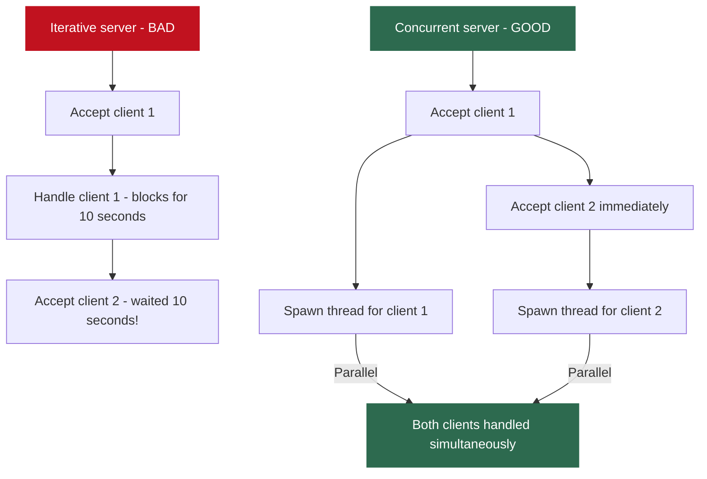

```java
// Concurrent server pattern
ServerSocket ss = new ServerSocket(50555);
ExecutorService pool = Executors.newFixedThreadPool(100);
while (true) {
    Socket s = ss.accept();
    pool.submit(() -> handleClient(s));  // thread pool, not new thread per client
}
```

| Approach | Handles | Problem |
|---------|---------|---------|
| Iterative | One client at a time | All others wait |
| Thread per client | Many clients | 10,000 clients = 10,000 threads; too much memory |
| Thread pool | Many clients efficiently | Fixed overhead; standard production pattern |
| Java NIO + Netty | Hundreds of thousands | Single thread manages many connections via epoll |

**Netty** (used by Kafka, Elasticsearch, Cassandra) is built on Java NIO and handles massive connection counts without creating a thread per connection.

---

### InetAddress - Network Identity

```java
InetAddress single   = InetAddress.getByName("nu.edu.pk");
InetAddress[] multi  = InetAddress.getAllByName("www.google.com");
InetAddress local    = InetAddress.getLocalHost();

single.getHostName();        // reverse DNS: IP -> hostname
single.getHostAddress();     // IP address as string e.g. "192.168.1.1"
single.isReachable(2000);    // ping with 2000ms timeout
```

`getAllByName` returns multiple IPs because large services use **DNS round-robin load balancing** - the same hostname resolves to many servers. Different clients get different IPs, distributing load without a central load balancer. `isReachable()` is a manual health check - the same thing monitoring systems do periodically to detect failed nodes.

---

### UDP Socket Programming

```java
// UDP Server - no accept(), just receive datagrams
DatagramSocket server = new DatagramSocket(9876);
byte[] buffer = new byte[1024];
DatagramPacket pkt = new DatagramPacket(buffer, buffer.length);
server.receive(pkt);   // blocks until a datagram arrives

// Echo back to sender - address comes FROM the packet itself
DatagramPacket reply = new DatagramPacket(
    pkt.getData(), pkt.getLength(),
    pkt.getAddress(), pkt.getPort()   // sender address extracted from packet
);
server.send(reply);
```

```java
// UDP Client
DatagramSocket client = new DatagramSocket();
byte[] msg = "Hello UDP".getBytes();
InetAddress addr = InetAddress.getByName("localhost");
DatagramPacket send = new DatagramPacket(msg, msg.length, addr, 9876);
client.send(send);   // fire and forget - no waiting for connection
```

**Key UDP differences from TCP:**

| Aspect | TCP | UDP |
|--------|-----|-----|
| Connection before send | Required (handshake) | Not required |
| Sender address | Remembered by connection | Must extract from each packet |
| Buffer overflow | OS queues; sender slows down | Extra bytes silently discarded |
| Reading partial data | Yes - read as much as available | No - all or nothing per datagram |

This is exactly the Cassandra gossip pattern: a node sends a gossip message to a random peer. If lost, no problem - gossip is periodic and redundant. The information arrives eventually through other paths.

---

## 4. ZeroMQ - High-Performance Messaging

ZeroMQ (OMQ) is a messaging library that provides high-level patterns built on top of sockets. Performance: **~8 million messages/second** at **~30 microsecond latency**.

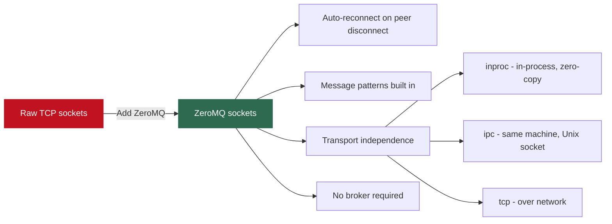

Switch from `inproc://` for testing to `tcp://` for production with one line change. ZeroMQ queues messages for disconnected peers and delivers them on reconnection - raw TCP requires you to implement this yourself.

---

### Pattern 1 - Request-Reply (REQ-REP)

Strictly synchronous client-server. One request, one reply, repeat.

```java
// REQ Client
ZMQ.Context ctx = ZMQ.context(1);      // 1 I/O thread handles up to 1 Gbps
ZMQ.Socket sock = ctx.socket(ZMQ.REQ);
sock.connect("tcp://localhost:5555");
sock.send("Hello", 0);
byte[] reply = sock.recv(0);
System.out.println(new String(reply));
sock.close(); ctx.term();
```

```java
// REP Server
ZMQ.Context ctx = ZMQ.context(1);
ZMQ.Socket sock = ctx.socket(ZMQ.REP);
sock.bind("tcp://*:5555");             // server binds; client connects
while (true) {
    byte[] req = sock.recv(0);
    sock.send("World", 0);
}
```

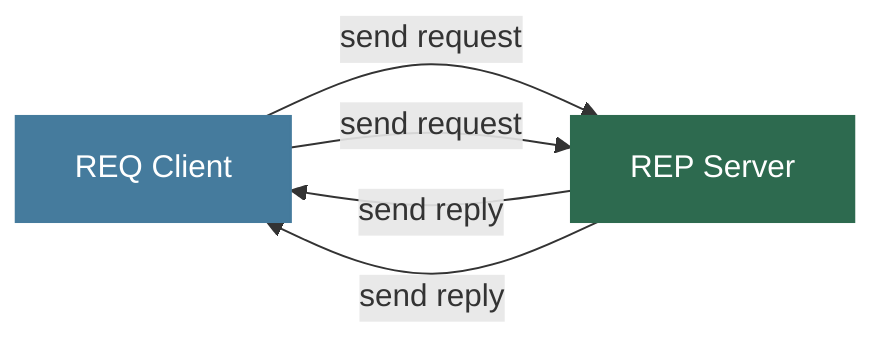

**Lockstep constraint:** after `send()` you must call `recv()` before sending again. Calling `send()` twice in a row returns an error. This enforces the request-reply discipline.

**Maps to distributed systems:** RPC calls. Kafka producer-broker acknowledgment, Spark task submission to executors, HDFS client-to-NameNode metadata requests all follow this pattern conceptually.

---

### Pattern 2 - Publisher-Subscriber (PUB-SUB)

One-to-many broadcast with topic filtering.

```java
// PUB Publisher
ZMQ.Context ctx = ZMQ.context(1);
ZMQ.Socket pub = ctx.socket(ZMQ.PUB);
pub.bind("tcp://*:5557");
int count = 0;
while (true) {
    pub.send(("Hello World " + count++).getBytes(), 0);
}
```

```java
// SUB Subscriber
ZMQ.Context ctx = ZMQ.context(1);
ZMQ.Socket sub = ctx.socket(ZMQ.SUB);
sub.connect("tcp://localhost:5557");
sub.subscribe("World".getBytes());   // receive only msgs starting with "World"
for (int i = 0; i < 100; i++) {
    System.out.println(new String(sub.recv(0)));
}
```

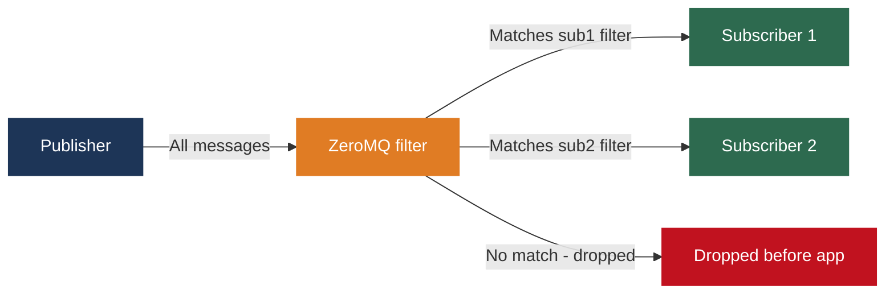

**The slow subscriber problem:** subscribers always miss the first few messages. Connection setup takes time; the publisher starts immediately. For real-time streams (stock prices, sensor readings) this is acceptable. For audit logs or event sourcing - use **Kafka**, which persists messages so late subscribers can read from the beginning.

**Maps to distributed systems:** Kafka is conceptually ZeroMQ PUB-SUB plus persistence. ZooKeeper's watch mechanism is pub-sub where clients subscribe to changes on specific nodes.

---

### ZeroMQ vs Raw Sockets vs Kafka - Decision Framework

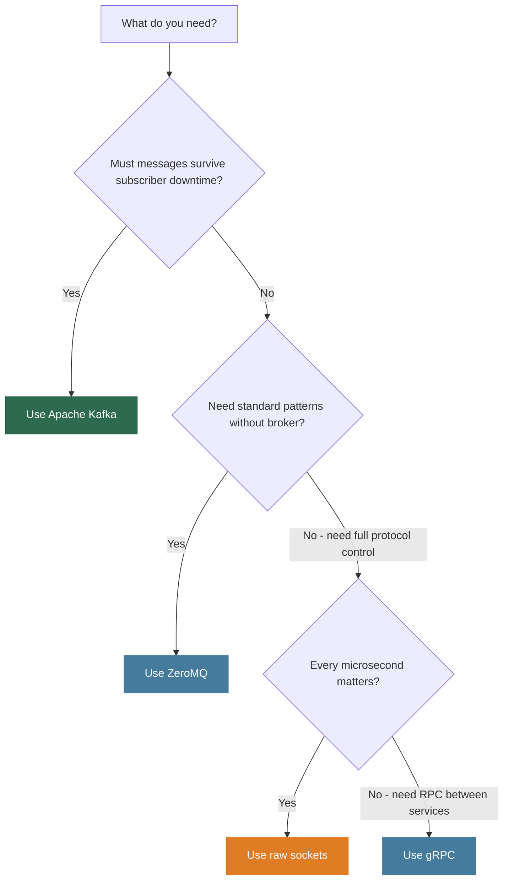

| Technology | When to Use | Not When |
|-----------|-------------|----------|
| Raw TCP sockets | Building a new protocol from scratch; maximum control | You need standard patterns |
| ZeroMQ | High-performance IPC; loss acceptable; no broker wanted | You need message durability |
| Apache Kafka | Durable event streams; replay needed; loss unacceptable | You need microsecond latency |
| gRPC | Synchronous RPC between microservices; typed schemas | High-frequency fire-and-forget messaging |

---

## 5. From Sockets to Distributed Systems

Every distributed system operation you have studied in this course is bytes on a socket.

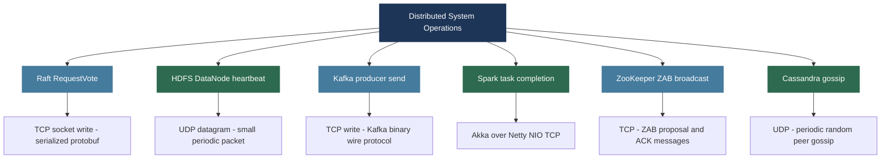

### Reading Socket Error Messages in Production

Even if you never write socket code, you will read these errors in logs constantly:

| Error Message | What It Means | Likely Cause |
|--------------|--------------|-------------|
| `Connection refused` | No process listening on that port | Server not started; wrong port |
| `Connection timed out` | SYN sent but no SYN-ACK received | Host unreachable; firewall blocking |
| `Connection reset by peer` | Remote side sent TCP RST | Server crashed; request rejected |
| `Broken pipe` | Wrote to socket whose peer already closed | Client disconnected before response |
| `Too many open files` | Process hit OS file descriptor limit | Connection leak; not closing sockets |
| `Address already in use` | Another process on this port | Previous server instance still running |

---

## Lecture Summary

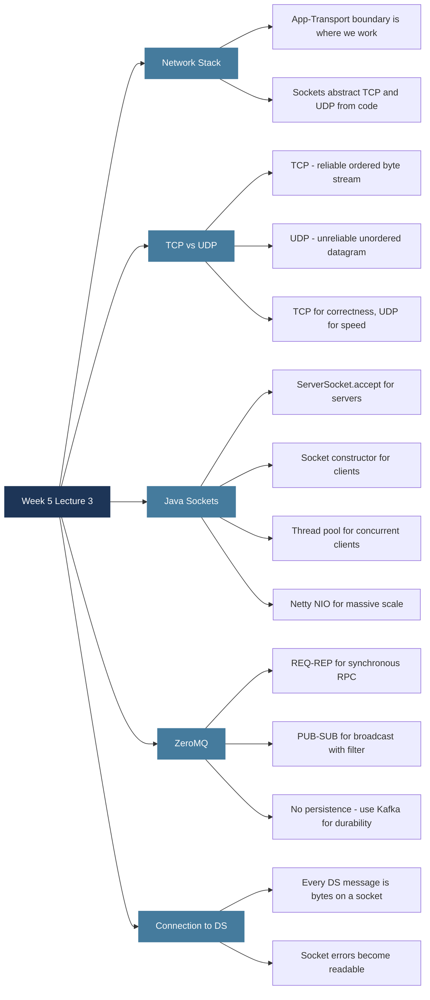

**Next class:** Week 6 - The Hadoop Ecosystem. HDFS architecture in depth - NameNode and DataNode relationship, block distribution and replication, fault tolerance in HDFS, and the HDFS API. Everything from master-worker architectures, replication, and fault tolerance comes together in HDFS.

---

*BDA Spring 2026 | Week 5, Lecture 3 | Network Programming - TCP/IP, Sockets and ZeroMQ*
