# Big Data Analytics (BDA Spring 2026)
## Week 6, Lecture 1: HDFS Architecture - NameNode, DataNodes, Block Replication and Fault Tolerance

> HDFS is one of the most elegant implementations of distributed systems principles ever built. When you understand HDFS deeply, you are not just learning one file system. You are seeing every distributed systems concept from Weeks 3-5 applied in a real production system that has processed more data than almost any other software in history.

---

## Table of Contents

1. [Design Philosophy of HDFS](#1-design-philosophy-of-hdfs)
2. [HDFS Architecture - The Complete Picture](#2-hdfs-architecture---the-complete-picture)
3. [Block Replication - Durability by Design](#3-block-replication---durability-by-design)
4. [HDFS Read and Write Paths](#4-hdfs-read-and-write-paths)
5. [HDFS in Practice - Commands and Configuration](#5-hdfs-in-practice---commands-and-configuration)
6. [HDFS Limitations and the Modern Perspective](#6-hdfs-limitations-and-the-modern-perspective)

---

## 1. Design Philosophy of HDFS

HDFS was created in 2004 by Doug Cutting and Mike Cafarella as an open-source implementation of the Google File System (GFS) paper published in 2003. It became the foundation of the entire Hadoop ecosystem.

### The Four Core Design Requirements

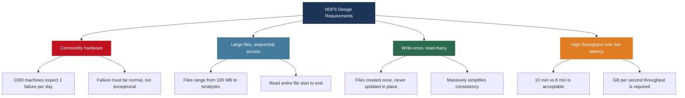

Every HDFS design decision traces back to these four requirements. Every time something seems unusual, trace it back here and it will make sense.

---

## 2. HDFS Architecture - The Complete Picture

HDFS follows the **master-worker** architecture from Week 5: one NameNode master, many DataNode workers.

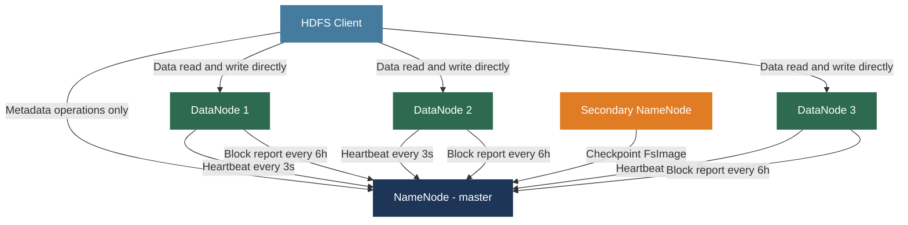

**Critical architectural rule:** the NameNode is NEVER in the data transfer path. It handles only metadata. All actual bytes flow directly between clients and DataNodes.

---

### The NameNode - The Brain of HDFS

The NameNode runs on a dedicated high-memory server. It stores NO file data. It stores only the metadata - the complete map of the file system.

**Two critical in-memory data structures:**

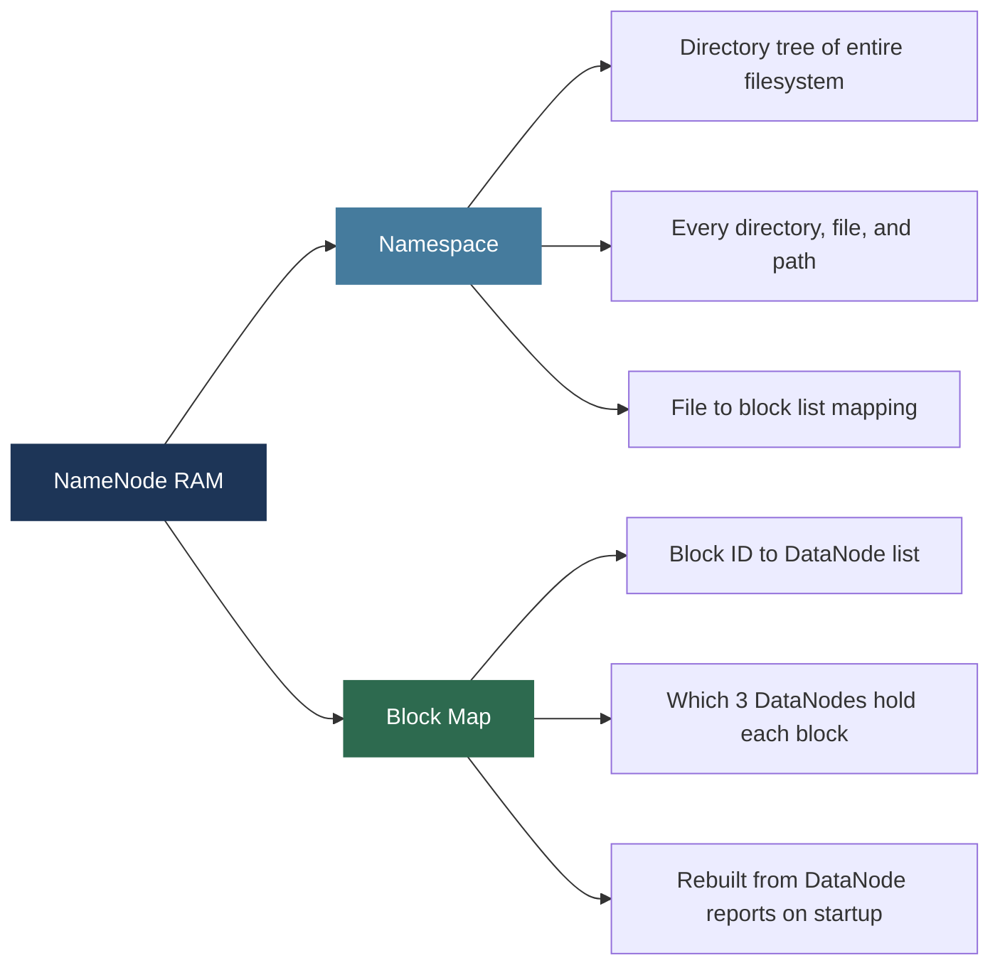

**Concrete example:** a 512 MB file at `/data/weblog.txt` with default 128 MB block size:

$$\text{Number of blocks} = \left\lceil \frac{512 \text{ MB}}{128 \text{ MB}} \right\rceil = 4 \text{ blocks}$$

| Block | Bytes | Replica 1 | Replica 2 | Replica 3 |
|-------|-------|-----------|-----------|-----------|
| Block 1 | 0 - 128 MB | DataNode 7 | DataNode 23 | DataNode 41 |
| Block 2 | 128 - 256 MB | DataNode 3 | DataNode 19 | DataNode 55 |
| Block 3 | 256 - 384 MB | DataNode 12 | DataNode 8 | DataNode 30 |
| Block 4 | 384 - 512 MB | DataNode 6 | DataNode 44 | DataNode 17 |

**NameNode memory requirement formula:**

$$\text{NameNode RAM} \approx \underbrace{150 \text{ bytes}}_{\text{per block entry}} \times \text{total blocks in cluster}$$

A cluster with 100 million blocks needs approximately **15 GB of NameNode RAM**. Production NameNodes have 64 GB to 128 GB of RAM for very large clusters.

**Why block locations are NOT persisted:** DataNode membership changes constantly. Storing locations persistently would require constant updates and would become inconsistent. Instead the NameNode rebuilds the Block Map fresh from DataNode reports on every startup - always reflecting current reality.

---

### NameNode Persistent State - FsImage and EditLog

The namespace (directory tree and file-to-block mappings) must survive NameNode restarts. HDFS uses the same **WAL + checkpoint** pattern studied in Week 3.

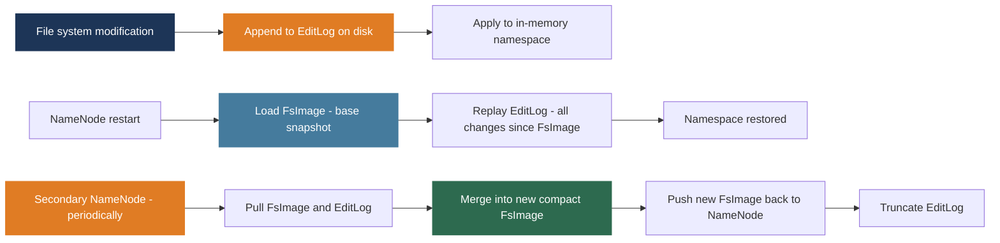

| Component | What It Is | Analogy |
|-----------|-----------|---------|
| FsImage | Complete namespace snapshot at time T | Database full backup |
| EditLog | Sequential log of all changes since last FsImage | WAL / transaction log |
| Secondary NameNode | Periodic FsImage + EditLog merger | Checkpoint process |

> **Important:** the Secondary NameNode is NOT a hot standby. It is a checkpointing helper. It cannot take over if the NameNode fails.

---

### HDFS High Availability - Active and Standby NameNode

Introduced in Hadoop 2. Solves the original HDFS single point of failure at the NameNode.

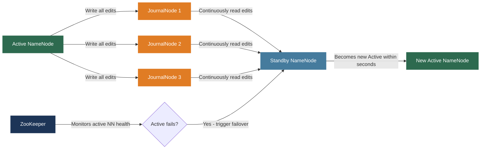

JournalNodes use a **Paxos-like quorum protocol** - edits are accepted when a majority of JournalNodes acknowledge. The Standby continuously replays these edits, keeping its namespace synchronized. ZooKeeper detects Active NameNode failure and triggers failover within seconds.

This is exactly the **leader election and replication** pattern from Week 4 (Raft) and Week 5 - applied to HDFS metadata management.

---

### DataNodes - The Storage Workers

Each DataNode is a commodity server with many hard drives or SSDs. DataNodes store actual block data as plain files in the local OS filesystem (ext4 or XFS on Linux) - no special on-disk format.

```mermaid
flowchart TD
    DN[DataNode responsibilities] --> STORE[Block storage]
    DN --> SERVE[Block serving]
    DN --> HB[Heartbeats]
    DN --> BR[Block reports]
    DN --> SCAN[Block scanner]

    STORE --> ST1[Blocks stored as plain files on local disk]
    STORE --> ST2[Uses local OS filesystem - ext4 or XFS]

    SERVE --> SV1[Client opens direct TCP connection]
    SERVE --> SV2[NameNode never touches data bytes]

    HB --> HB1[Every 3 seconds by default]
    HB --> HB2[Missed for 10 min means node is dead]

    BR --> BR1[Full block inventory on startup]
    BR --> BR2[Full report every 6 hours]
    BR --> BR3[How NameNode builds the Block Map]

    SCAN --> SC1[Reads and verifies checksum on every block]
    SCAN --> SC2[Reports corrupt blocks to NameNode]

    style DN fill:#1d3557,color:#fff,stroke:#1d3557
    style STORE fill:#2d6a4f,color:#fff,stroke:#2d6a4f
    style SERVE fill:#2d6a4f,color:#fff,stroke:#2d6a4f
    style HB fill:#457b9d,color:#fff,stroke:#457b9d
    style BR fill:#457b9d,color:#fff,stroke:#457b9d
    style SCAN fill:#e07c24,color:#fff,stroke:#e07c24
```

---

### Block Size - Why 128 MB?

Traditional filesystems use 4 KB or 8 KB blocks. HDFS uses 128 MB by default.

**NameNode memory benefit:**

$$\frac{1 \text{ TB file with 4 KB blocks}}{150 \text{ bytes/block entry}} = \frac{268 \text{ million blocks} \times 150 \text{ bytes}}{1} \approx 40 \text{ GB NameNode RAM for ONE file}$$

$$\frac{1 \text{ TB file with 128 MB blocks}}{150 \text{ bytes/block entry}} = \frac{8192 \text{ blocks} \times 150 \text{ bytes}}{1} \approx 1.2 \text{ MB NameNode RAM for ONE file}$$

**The three reasons for 128 MB blocks:**

| Reason | Explanation |
|--------|-------------|
| NameNode memory | 8192 blocks vs 268 million blocks for a 1 TB file |
| TCP connection overhead | Few connections per file; time spent transferring not connecting |
| Sequential I/O optimization | 128 MB reads keep disk read-ahead full; no seeks needed |

**The trade-off - the small files problem:**

$$\text{Wasted space} = 128 \text{ MB} - \text{actual file size} \approx 128 \text{ MB for a 1 KB config file}$$

A 1 KB configuration file stored in HDFS occupies a full 128 MB block. Millions of small files overwhelm NameNode memory and perform terribly. **Solution:** combine small files into SequenceFiles or Avro containers before storing in HDFS.

---

## 3. Block Replication - Durability by Design

Default replication factor is 3. HDFS tolerates simultaneous failure of any 2 DataNodes holding a given block.

### The Replication Pipeline

HDFS avoids sending data 3 times by using a streaming pipeline.


**Why pipelining achieves 3x replication at ~1x time:**

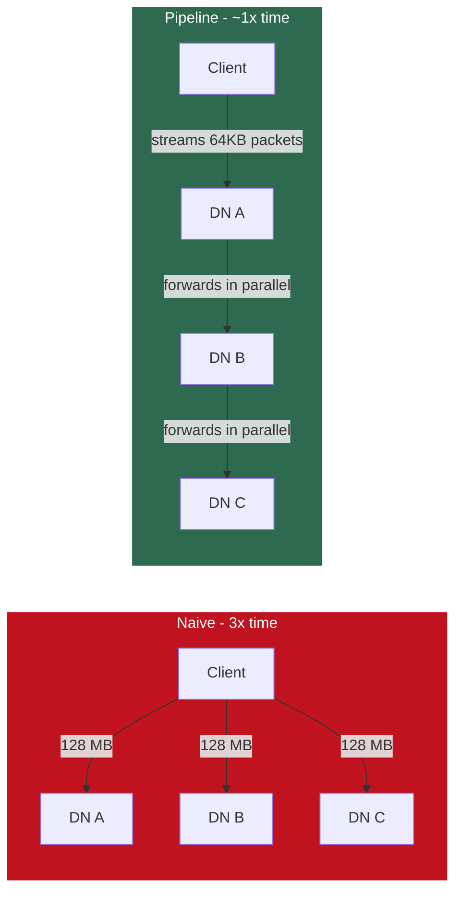

Data flows through the pipeline in a **streaming fashion** - DN A does not wait for the entire 128 MB before forwarding. It forwards 64 KB packets as they arrive. All three DataNodes receive data simultaneously.

**Effective write bandwidth formula:**

$$\text{Time} \approx \frac{128 \text{ MB}}{\text{min}(\text{network bandwidth}, \text{disk write speed})} + \underbrace{2 \times \text{RTT}}_{\text{pipeline setup overhead}}$$

---

### Rack-Aware Replica Placement

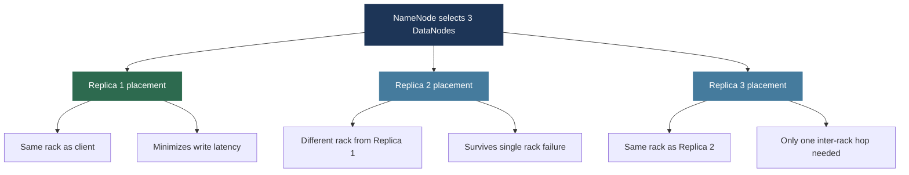

**Result:** Rack A holds 1 replica, Rack B holds 2 replicas.

- Rack A fails: 2 replicas survive on Rack B
- Rack B fails: 1 replica survives on Rack A
- Single DataNode fails: 2 replicas survive on other DataNodes

The NameNode knows rack topology through a configurable rack awareness script that maps DataNode IP addresses to rack identifiers.

---

### Re-Replication and Block Health Monitoring

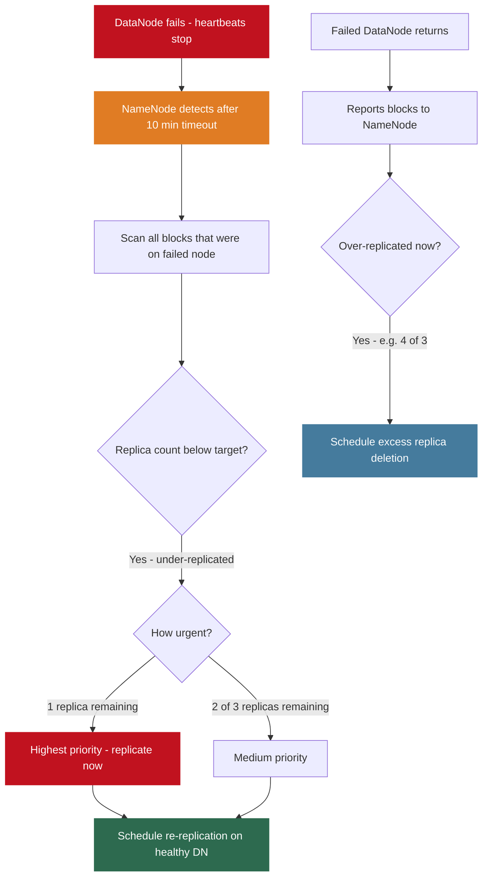

Re-replication is **automatic and continuous** - no operator intervention needed. The NameNode handles it in the background.

---

### HDFS Safemode on Startup

On startup the NameNode enters **safemode** - a read-only state while it waits for DataNodes to report their blocks and the Block Map is reconstructed.

$$\text{Exit safemode when} \quad \frac{\text{blocks with} \geq \text{min replicas}}{\text{total blocks}} \geq 99.9\%$$

Only after enough replicas are confirmed available does the NameNode exit safemode and allow writes.

---

## 4. HDFS Read and Write Paths

### Complete Write Path

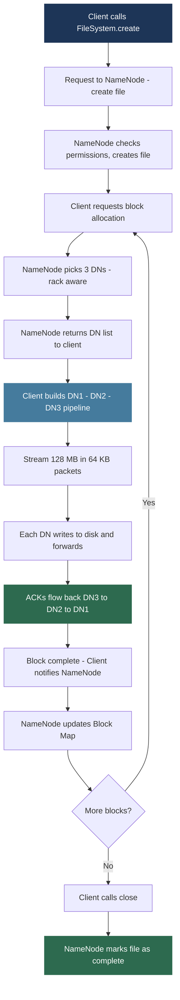

**Write lease:** the NameNode grants the client exclusive write access (write lease) when the file is created. Periodically renewed. If the client crashes without closing, the NameNode eventually revokes the lease and recovers the file.

**Write failure handling:** if a DataNode fails mid-pipeline, the failed DN is removed from the pipeline, the remaining DNs continue, and the NameNode schedules re-replication after write completes.

---

### Complete Read Path

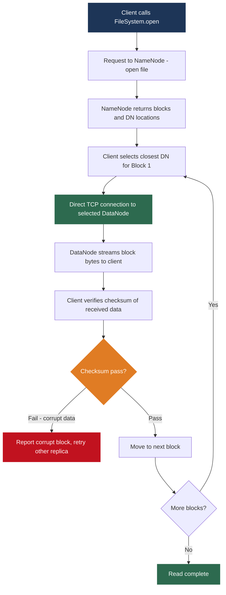

**DataNode selection - data locality:** the client prefers the replica on the same machine (if it is a DataNode itself), then same rack, then any machine. Moving computation to the data rather than data to the computation - the core of MapReduce's performance model (Week 7).

**Checksum verification:** HDFS computes checksums for every chunk written. On read, the client verifies. A checksum failure triggers retry from a different replica and marks the corrupt replica for deletion and re-replication. This is why HDFS is trusted with petabytes of critical data.

---

### NameNode vs DataNode - Role Summary

| Aspect | NameNode | DataNode |
|--------|---------|---------|
| What it stores | Namespace and Block Map (in RAM) | Actual block bytes (on disk) |
| Hardware | High RAM, no need for large storage | Many large disks, modest RAM |
| Count per cluster | 1 active (plus 1 standby in HA) | Hundreds to thousands |
| Client interaction | Metadata only - open, close, stat | Data only - read and write bytes |
| Failure impact | Entire cluster unavailable (mitigated by HA) | Only blocks on that node affected |
| Heartbeat interval | Receives heartbeats | Sends heartbeat every 3 seconds |

---

## 5. HDFS in Practice - Commands and Configuration

### HDFS Shell Commands

```bash
# List directory
hdfs dfs -ls /data/

# Create directory
hdfs dfs -mkdir /data/logs/

# Upload from local to HDFS
hdfs dfs -put localfile.csv /data/logs/

# Download from HDFS to local
hdfs dfs -get /data/logs/file.csv ./

# Display file contents
hdfs dfs -cat /data/logs/file.csv

# Delete file
hdfs dfs -rm /data/logs/file.csv

# Delete directory recursively
hdfs dfs -rm -r /data/logs/

# Show disk usage (human readable)
hdfs dfs -du -h /data/

# Check replication factor of a file
hdfs dfs -stat %r /data/logs/file.csv

# Change replication factor
hdfs dfs -setrep 5 /data/important-file.csv

# Full cluster health check
hdfs fsck /
```

`hdfs fsck` scans the entire namespace and reports under-replicated blocks, corrupt blocks, and missing blocks. Running this regularly is standard cluster maintenance.

---

### WebHDFS - REST API

Any language can access HDFS over HTTP without the Hadoop Java client.

```bash
# List directory
curl "http://namenode:9870/webhdfs/v1/data/?op=LISTSTATUS"

# Read a file
curl -L "http://namenode:9870/webhdfs/v1/data/file.txt?op=OPEN"

# Write a file (two steps: NameNode redirects, then PUT to DataNode)
curl -i -X PUT "http://namenode:9870/webhdfs/v1/data/file.txt?op=CREATE"
# Response contains redirect URL pointing to a DataNode
curl -i -X PUT -T localfile.txt "http://datanode:9864/webhdfs/v1/..."
```

The two-step write is by design: NameNode redirects the actual data transfer to a DataNode, keeping the NameNode out of the data path.

---

### Key Configuration Parameters

```xml
<!-- hdfs-site.xml -->

<!-- Block size: 128 MB default (in bytes) -->
<property>
    <name>dfs.blocksize</name>
    <value>134217728</value>
</property>

<!-- Replication factor: 3 default -->
<property>
    <name>dfs.replication</name>
    <value>3</value>
</property>

<!-- NameNode metadata directory -->
<property>
    <name>dfs.namenode.name.dir</name>
    <value>file:///data/namenode</value>
</property>

<!-- DataNode data directories - one per physical disk -->
<property>
    <name>dfs.datanode.data.dir</name>
    <value>file:///data/disk1,file:///data/disk2,file:///data/disk3</value>
</property>

<!-- NameNode heap in hadoop-env.sh - set large for big clusters -->
<!-- export HDFS_NAMENODE_OPTS="-Xmx128g" -->
```

Multiple DataNode data directories (one per disk) is standard. HDFS distributes blocks across all configured directories, utilizing all disks in parallel. A DataNode with 12 disks can read/write 12 blocks simultaneously - 12x the I/O throughput of a single disk.

$$\text{DataNode throughput} \approx \text{num disks} \times \text{per-disk throughput}$$

---

## 6. HDFS Limitations and the Modern Perspective

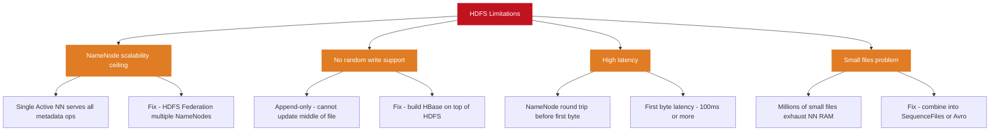

### HDFS vs Modern Cloud Object Storage

```mermaid
flowchart LR
    subgraph HDFS2[HDFS]
        H1[NameNode bottleneck]
        H2[On-premises only]
        H3[Ops overhead - manage cluster]
        H4[Random write not supported]
    end
    subgraph S3[Cloud Object Storage - S3, GCS, ADLS]
        S1[No metadata bottleneck]
        S2[Virtually unlimited scale]
        S3[Fully managed - no ops]
        S4[Same write-once semantics]
    end

    style HDFS2 fill:#e07c24,color:#fff,stroke:#e07c24
    style S3 fill:#2d6a4f,color:#fff,stroke:#2d6a4f
```

In 2026 cloud object storage (Amazon S3, Google Cloud Storage, Azure Data Lake Storage) has largely replaced HDFS in new deployments. Spark, Presto, and Hive now work natively with object storage. The **Lakehouse architecture** (covered in Lecture 3 this week) is built on object storage rather than HDFS.

**HDFS remains relevant because:**
- Millions of existing Hadoop clusters are still running
- On-premises deployments where cloud is not an option
- Understanding HDFS gives you a deep understanding of distributed storage that transfers directly to understanding cloud object storage, because the same principles apply

---

## Lecture Summary

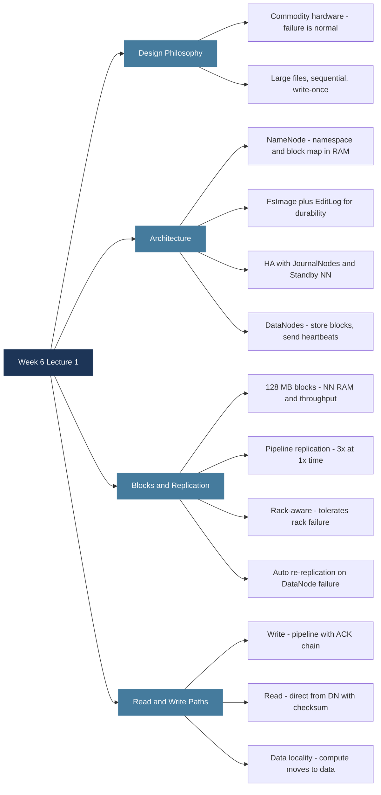

**Next class:** the Hadoop ecosystem continues with MapReduce internals, YARN resource management, and how HDFS data locality integrates with MapReduce task scheduling.

---

*BDA Sprinig 2026 | Week 6, Lecture 1 | HDFS Architecture - NameNode, DataNodes, Block Replication and Fault Tolerance*
