# Big Data Analytics (BDA Spring 2026)
## Week 6, Lecture 2: HDFS APIs, MapReduce Integration, Managed Hadoop and Cloud Storage

> Last class we understood HDFS from the inside. Today we look at it from the outside: how do applications interact with HDFS, how does MapReduce integrate with it, and how does the industry actually run Hadoop in 2026?

---

## Table of Contents

1. [The Hadoop FileSystem API](#1-the-hadoop-filesystem-api)
2. [MapReduce Integration with HDFS](#2-mapreduce-integration-with-hdfs)
3. [HDFS C API](#3-hdfs-c-api)
4. [Managed Hadoop on Cloud](#4-managed-hadoop-on-cloud)
5. [HDFS vs Cloud Object Storage](#5-hdfs-vs-cloud-object-storage)
6. [YARN - Hadoop Resource Manager](#6-yarn---hadoop-resource-manager)

---

## 1. The Hadoop FileSystem API

### The Key Design Decision - Storage Abstraction

Hadoop defines an **abstract FileSystem API** - a Java interface that any storage system can implement.

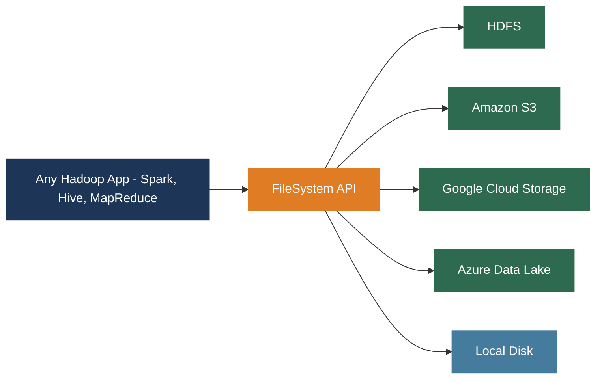

Change `hdfs://namenode:9000/data/` to `s3://my-bucket/data/` and the exact same code reads from S3. This is one of the most consequential design decisions in Big Data history. It is what allowed the industry to migrate from on-premises HDFS to cloud object storage without rewriting all their applications.

---

### Core Java FileSystem API

```java
import org.apache.hadoop.conf.Configuration;
import org.apache.hadoop.fs.*;

// Connect to HDFS
Configuration conf = new Configuration();
conf.set("fs.defaultFS", "hdfs://namenode:9000");
FileSystem fs = FileSystem.get(conf);

// Create directory
fs.mkdirs(new Path("/data/logs/2026/03/"));

// Write a file
FSDataOutputStream out = fs.create(new Path("/data/logs/events.txt"));
out.writeUTF("First log entry");
out.writeUTF("Second log entry");
out.close();

// Read a file
FSDataInputStream in = fs.open(new Path("/data/logs/events.txt"));
System.out.println(in.readUTF());
in.close();

// List directory
FileStatus[] statuses = fs.listStatus(new Path("/data/logs/"));
for (FileStatus s : statuses) {
    System.out.println(s.getPath() + "  size=" + s.getLen());
}

// File metadata
FileStatus s = fs.getFileStatus(new Path("/data/logs/events.txt"));
System.out.println("Size: "        + s.getLen());
System.out.println("Replication: " + s.getReplication());
System.out.println("Block size: "  + s.getBlockSize());
System.out.println("Modified: "    + s.getModificationTime());

// Atomic rename (used for safe output commit)
fs.rename(new Path("/data/tmp/_writing.txt"),
          new Path("/data/final/events.txt"));

// Delete
fs.delete(new Path("/data/logs/events.txt"), false);  // file
fs.delete(new Path("/data/logs/"), true);              // directory, recursive
```

---

### Positional Reads - Critical for Columnar Formats

`FSDataInputStream` adds one critical capability beyond standard Java streams: **positional reads**.

```java
FSDataInputStream in = fs.open(new Path("/data/file.parquet"));

// Seek to 50 MB offset then read sequentially
in.seek(1024L * 1024 * 50);

// Read 4 KB at 100 MB offset WITHOUT moving current position
byte[] buf = new byte[4096];
in.read(1024L * 1024 * 100, buf, 0, 4096);
```

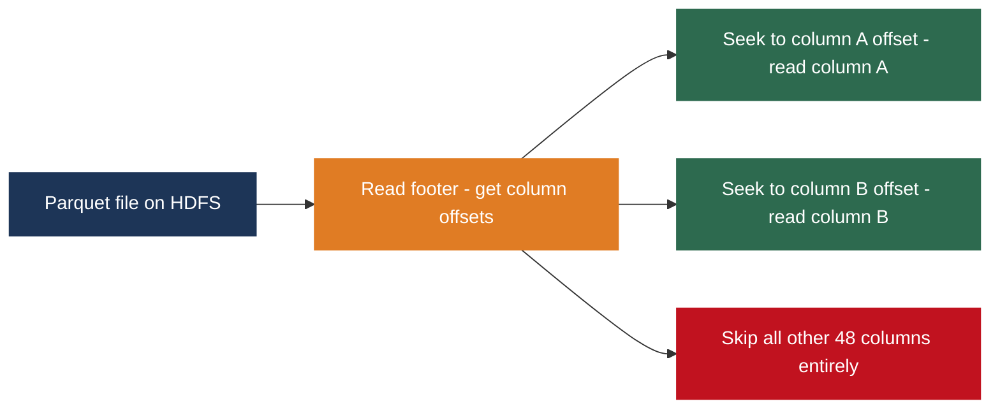

When Spark reads a Parquet file needing 2 columns out of 50, it uses positional reads to seek directly to those columns in each row group. Without positional reads, Parquet's column pruning benefit would be unachievable.

---

### Writing Patterns

**Durability levels when writing:**

```java
FSDataOutputStream out = fs.create(new Path("/data/output.txt"));
out.hflush();  // flush to DataNode memory buffers (visible, not yet durable)
out.hsync();   // flush to DataNode disk (durable against crashes)
out.close();   // mark file as complete in NameNode
```

| Method | Data Location After Call | Survives DataNode Crash? | Speed |
|--------|--------------------------|--------------------------|-------|
| `hflush()` | DataNode memory buffers | No | Fast |
| `hsync()` | DataNode disk (fsync called) | Yes | Slow |
| `close()` | Disk + NameNode updated | Yes | Slow |

**Atomic write pattern - the production standard:**

```java
Path tmp   = new Path("/data/tmp/_writing_output.txt");
Path final = new Path("/data/output.txt");

FSDataOutputStream out = fs.create(tmp);
// write all data...
out.close();

fs.rename(tmp, final);  // atomic at NameNode level
```

`rename()` is a single NameNode metadata operation - atomic within HDFS. Other readers never see a partial file. MapReduce and Spark both use this pattern for their output.

> **Cloud caveat:** rename from HDFS to S3 is NOT atomic. It is a copy-then-delete. This is why Lakehouse table formats (Delta Lake, Iceberg) implement their own commit protocols rather than relying on filesystem rename.

---

## 2. MapReduce Integration with HDFS

### The Data Locality Principle

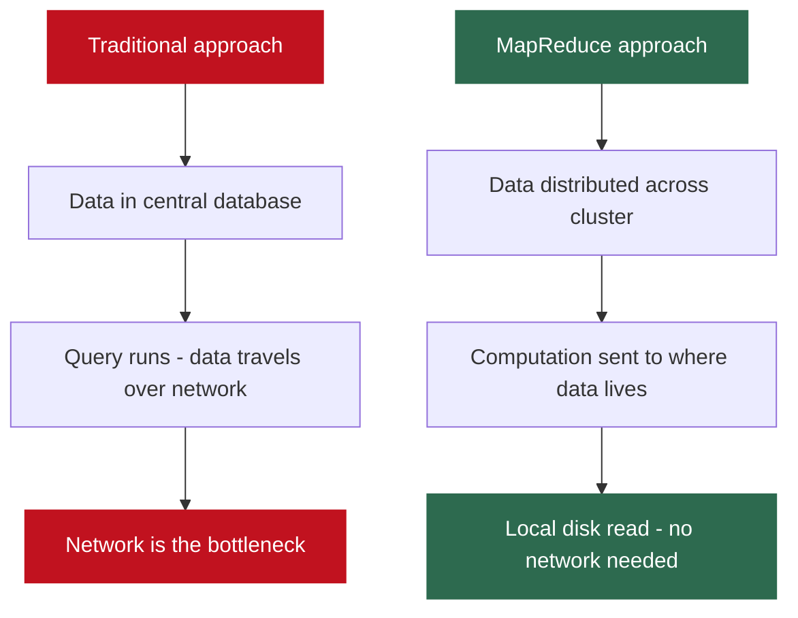

**Why data locality matters - the numbers:**

$$\text{Local disk read (SSD): } \frac{100 \text{ GB}}{10 \text{ GB/s}} = 10 \text{ seconds}$$

$$\text{Network transfer: } \frac{100 \text{ GB}}{1-2.5 \text{ GB/s}} = 40-100 \text{ seconds}$$

Local disk is 4-10x faster than network for large sequential reads. Moving computation to data, not data to computation.

**Three locality levels, in order of preference:**

| Level | Where Task Runs | Data Transfer | Speed |
|-------|----------------|--------------|-------|
| Node-local | Same DataNode holding the block | None - local disk read | Fastest |
| Rack-local | Different DataNode, same rack | Intra-rack network (~10 Gbps) | Fast |
| Off-rack | DataNode in a different rack | Inter-rack switch (shared bottleneck) | Slowest |

YARN's ResourceManager communicates with the NameNode to find block locations and schedules tasks on the DataNodes that hold the data.

---

### InputFormat - How MapReduce Reads HDFS

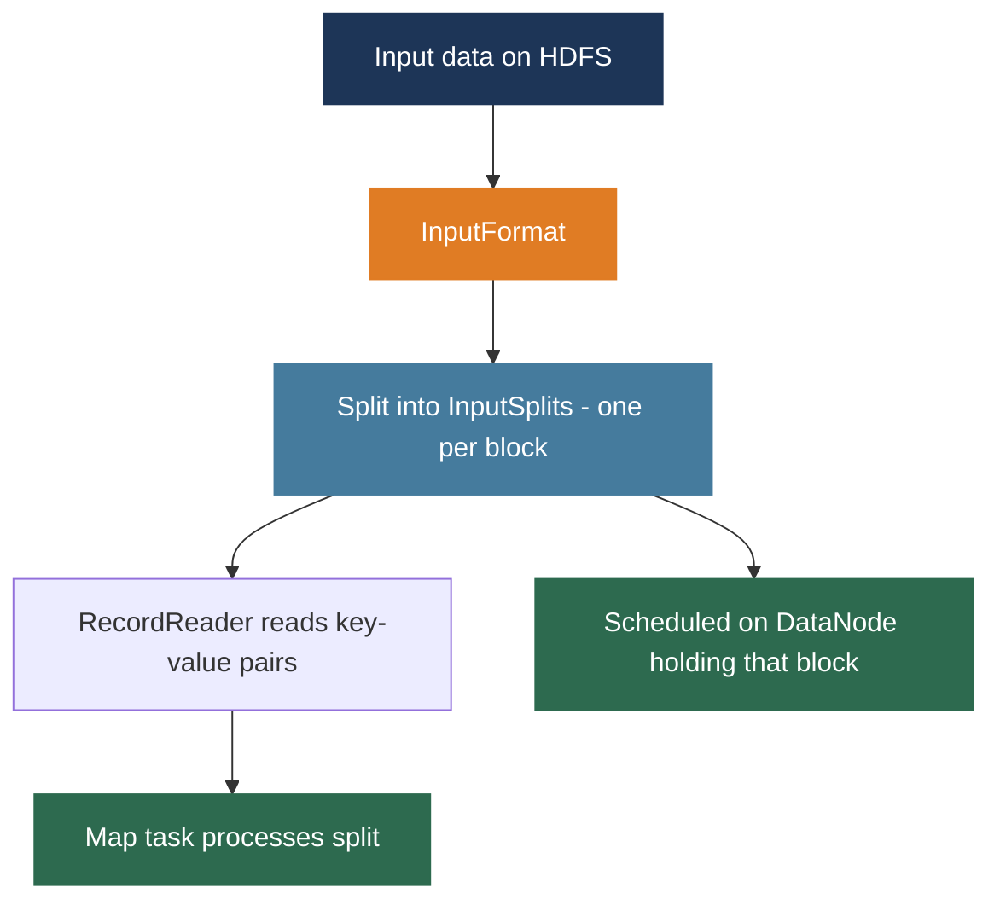

```java
Job job = Job.getInstance(conf, "Word Count");
job.setInputFormatClass(TextInputFormat.class);
FileInputFormat.addInputPath(job, new Path("/data/input/"));
```

| InputFormat | What It Reads | Split Strategy | Notes |
|-------------|--------------|----------------|-------|
| TextInputFormat | Text files, one line per record | One split per block | Default; key = byte offset, value = line |
| SequenceFileInputFormat | Hadoop binary key-value files | Block-aligned | Efficient for pipeline intermediates |
| DBInputFormat | JDBC relational databases | By row range | Imports from RDBMS to HDFS |
| Custom | Any source you implement | Configurable | TableInputFormat for HBase |

**Split alignment detail:** TextInputFormat aligns splits to block boundaries so each Map task processes data local to one DataNode. A line straddling a block boundary: the split starts at the first complete line after the boundary and reads slightly past the boundary to finish the last line.

$$\text{One InputSplit} \approx \text{One HDFS block} \approx \text{One Map task} \approx \text{One DataNode}$$

---

### OutputFormat - How MapReduce Writes HDFS

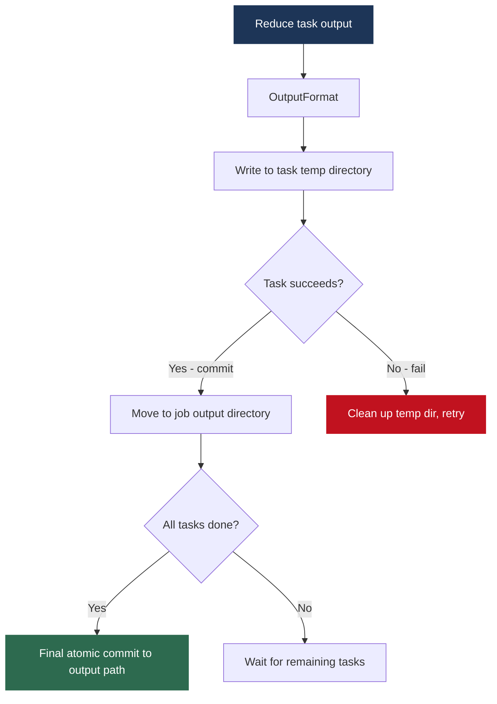

The output directory either contains complete, correct output or does not exist. There is never partial output. Applications reading MapReduce output can rely on this guarantee.

Output files are named: `part-r-00000`, `part-r-00001`, ... (one per Reduce task).

---

### Word Count - Complete MapReduce + HDFS Flow

```java
public class WordCount {

    // MAPPER: input is (byte_offset, line_text)
    public static class TokenizerMapper
        extends Mapper<LongWritable, Text, Text, IntWritable> {
        private final static IntWritable one = new IntWritable(1);
        private Text word = new Text();

        public void map(LongWritable key, Text value, Context context)
                throws IOException, InterruptedException {
            StringTokenizer itr = new StringTokenizer(value.toString());
            while (itr.hasMoreTokens()) {
                word.set(itr.nextToken());
                context.write(word, one);   // emit (word, 1)
            }
        }
    }

    // REDUCER: input is (word, [1,1,1,...])
    public static class IntSumReducer
        extends Reducer<Text, IntWritable, Text, IntWritable> {
        private IntWritable result = new IntWritable();

        public void reduce(Text key, Iterable<IntWritable> values, Context ctx)
                throws IOException, InterruptedException {
            int sum = 0;
            for (IntWritable val : values) sum += val.get();
            result.set(sum);
            ctx.write(key, result);         // emit (word, total)
        }
    }

    public static void main(String[] args) throws Exception {
        Configuration conf = new Configuration();
        Job job = Job.getInstance(conf, "word count");
        job.setJarByClass(WordCount.class);
        job.setMapperClass(TokenizerMapper.class);
        job.setCombinerClass(IntSumReducer.class);  // local pre-aggregation
        job.setReducerClass(IntSumReducer.class);
        job.setOutputKeyClass(Text.class);
        job.setOutputValueClass(IntWritable.class);
        FileInputFormat.addInputPath(job,  new Path(args[0]));
        FileOutputFormat.setOutputPath(job, new Path(args[1]));
        System.exit(job.waitForCompletion(true) ? 0 : 1);
    }
}
```

**Complete execution flow:**

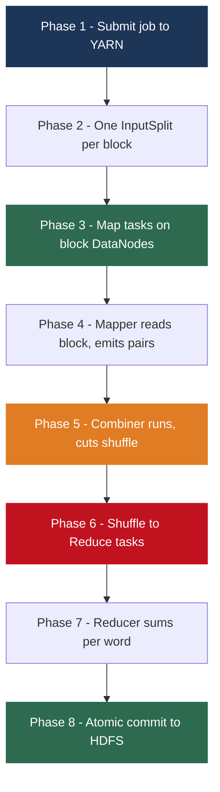

**The Combiner optimization:**

$$\text{Without combiner: shuffle } (word, 1) \times N \text{ times per word}$$
$$\text{With combiner: shuffle } (word, N) \text{ once per word per Map task}$$

The combiner is a local Reducer that runs on each Map task before the shuffle, collapsing `(word, [1,1,1,1])` to `(word, 4)`. It must be **commutative and associative** - the final result must be identical whether or not it ran. Sum is commutative and associative. Average is not.

**Why intermediate data goes to local disk, not memory:**

A 1 TB input file processed by 100 Map tasks means 10 GB per Map task, potentially producing more than 10 GB of intermediate pairs before the combiner. Keeping this in memory is infeasible. Disk writes also provide fault tolerance - if a Reduce task fails, it can re-fetch Map output from disk.

This disk write in the Map phase is MapReduce's primary performance weakness. **Spark was developed specifically to eliminate it** by keeping intermediate data in memory for iterative algorithms.

---

## 3. HDFS C API

### libhdfs - JNI-Based C Access

```c
#include "hdfs.h"

int main() {
    // Connect
    hdfsFS fs = hdfsConnect("namenode", 9000);

    // Write
    hdfsFile wf = hdfsOpenFile(fs, "/data/test.txt",
                               O_WRONLY | O_CREAT, 0, 0, 0);
    const char* buf = "Hello HDFS from C\n";
    hdfsWrite(fs, wf, buf, strlen(buf));
    hdfsFlush(fs, wf);
    hdfsCloseFile(fs, wf);

    // Read
    hdfsFile rf = hdfsOpenFile(fs, "/data/test.txt", O_RDONLY, 0, 0, 0);
    char rbuf[256];
    tSize n = hdfsRead(fs, rf, rbuf, sizeof(rbuf));
    rbuf[n] = '\0';
    printf("Read: %s\n", rbuf);
    hdfsCloseFile(fs, rf);

    // List directory
    int num;
    hdfsFileInfo* info = hdfsListDirectory(fs, "/data/", &num);
    for (int i = 0; i < num; i++)
        printf("%s  %lld bytes\n", info[i].mName, info[i].mSize);
    hdfsFreeFileInfo(info, num);

    hdfsDisconnect(fs);
    return 0;
}
```

| Library | Mechanism | JVM Required | Use Case |
|---------|-----------|-------------|---------|
| libhdfs | JNI - C calls into Java HDFS client | Yes | Standard C/C++ access |
| libhdfs3 | Native C++ reimplementation | No | High-performance, no JVM overhead |
| pyarrow.hdfs | Python wrapper over libhdfs | Yes | Python data engineering |
| hdfs3 | Python wrapper over libhdfs3 | No | Python without JVM |

libhdfs3 was developed by Pivotal and is used in Apache HAWQ for high-performance environments where JVM memory overhead is unacceptable.

---

## 4. Managed Hadoop on Cloud

### The Problem with On-Premises Hadoop

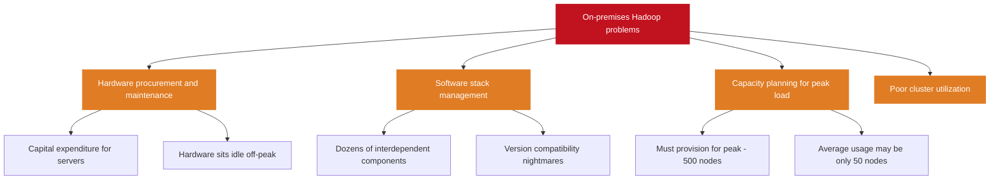

---

### Amazon EMR - Elastic MapReduce

```bash
# Launch a cluster
aws emr create-cluster \
    --name "BDA-2026-Cluster" \
    --release-label emr-6.15.0 \
    --applications Name=Spark Name=Hive Name=Presto \
    --instance-type m5.xlarge \
    --instance-count 10 \
    --use-default-roles \
    --ec2-attributes KeyName=my-key-pair \
    --log-uri s3://my-bucket/emr-logs/

# Submit a Spark job
aws emr add-steps \
    --cluster-id j-XXXXXXXXXXXXX \
    --steps Type=Spark,Name="Analysis",\
ActionOnFailure=CONTINUE,\
Args=[--class,MyJob,s3://bucket/jars/job.jar,\
s3://bucket/input/,s3://bucket/output/]
```

| Feature | Detail |
|---------|--------|
| Elastic scaling | Add or remove nodes while running; scale up before a job, down after |
| Spot instances | Use AWS Spot Instances for workers at 70-90% discount vs on-demand |
| S3 as primary storage | EMRFS implements FileSystem API against S3; cluster can be terminated, data persists |
| Managed config | Specify apps wanted; EMR configures versions and compatibility |
| Transient clusters | Launch for one job, terminate when done; pay only for job runtime |

---

### Google Cloud Dataproc

```bash
# Create cluster (starts in ~90 seconds vs EMR's 5-10 minutes)
gcloud dataproc clusters create bda-cluster \
    --region us-central1 \
    --master-machine-type n1-standard-4 \
    --worker-machine-type n1-standard-4 \
    --num-workers 5 \
    --image-version 2.1

# Submit PySpark job
gcloud dataproc jobs submit pyspark \
    gs://my-bucket/scripts/analysis.py \
    --cluster bda-cluster \
    --region us-central1 \
   , gs://my-bucket/input/ gs://my-bucket/output/
```

Key differentiator: **90-second cluster startup** makes ephemeral one-job-one-cluster the standard pattern. Launch, run, terminate. Pay only for job runtime.

### Managed Hadoop Services Comparison

| Feature | Amazon EMR | Google Dataproc | Azure HDInsight |
|---------|-----------|----------------|----------------|
| Startup time | 5-10 minutes | ~90 seconds | 10-20 minutes |
| Discount instances | Spot Instances | Preemptible VMs | Spot VMs |
| Primary storage | Amazon S3 | Google Cloud Storage | Azure Data Lake |
| Best for | AWS-centric orgs | GCP-centric orgs | Azure-centric orgs |
| Autoscaling | Yes | Yes, with policies | Yes |

---

## 5. HDFS vs Cloud Object Storage

### Architecture Comparison

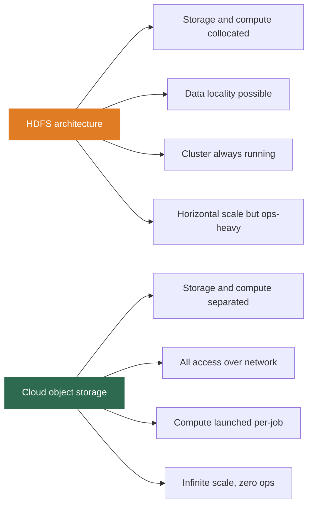

### Why Data Locality Loss Is No Longer a Major Problem in 2026

**Cloud network bandwidth:**

$$\text{Modern AWS instance: up to 25 Gbps} = 3.125 \text{ GB/s}$$

$$\text{Parallel S3 reads (many connections): up to 10+ GB/s effective}$$

$$\text{Local SSD: } \approx 3-7 \text{ GB/s}$$

**Columnar format effect on data volume read:**

$$\text{Query needs 2 of 50 columns, 10% of row groups}$$
$$\text{Bytes actually read} = 1 \text{ TB} \times \frac{2}{50} \times 10\% = \mathbf{4 \text{ GB}}$$

With Parquet and predicate pushdown, Spark may read only 0.4% of total bytes. Network bandwidth becomes irrelevant for most analytical queries.

**When data locality still matters:** full sequential scans of very large uncompressed datasets with high CPU utilization (e.g. raw ML training data). For these workloads, co-located HDFS or local NVMe SSDs still provide meaningful performance advantages.

| Workload | HDFS preferred | Cloud storage preferred |
|---------|---------------|------------------------|
| Batch analytics on Parquet | No - cloud fine | Yes - simpler, cheaper |
| Full-scan ML training on raw data | Yes - locality helps | Sometimes network bottleneck |
| Streaming with low latency | Yes - local is faster | Possible with high bandwidth |
| New greenfield deployments | Rarely in 2026 | Yes - standard choice |
| Existing on-prem clusters | Continue running | Migrate over time |

---

## 6. YARN - Hadoop Resource Manager

### Before and After YARN

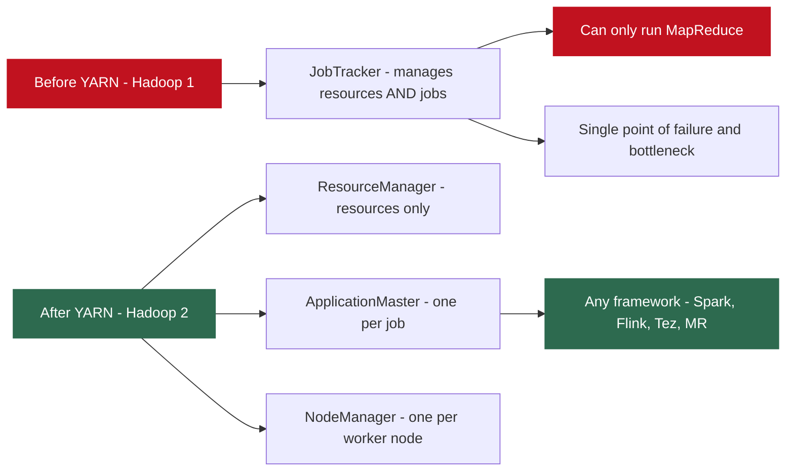

### YARN Architecture

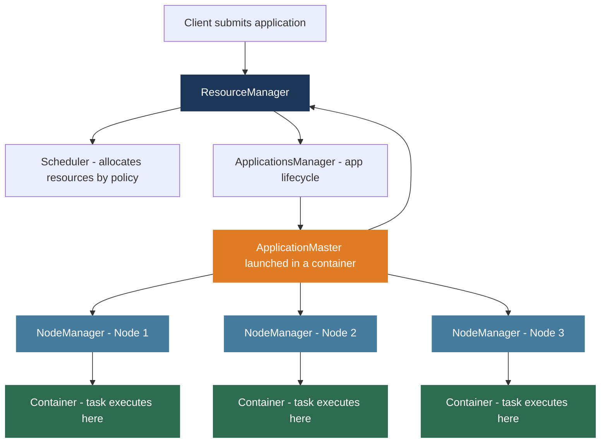

| Component | Responsibility |
|-----------|---------------|
| ResourceManager | Cluster-level resource authority; knows total CPU, RAM, disk across all nodes |
| Scheduler | Allocates resources to applications according to policy (FIFO, Capacity, Fair) |
| ApplicationsManager | Manages app lifecycle - starts ApplicationMaster, handles failures |
| NodeManager | Runs on every worker; reports available resources; launches containers |
| ApplicationMaster | One per application; negotiates resources; launches and monitors tasks |
| Container | Resource-bounded execution environment (N cores, M GB RAM) |

### YARN Scheduling Policies

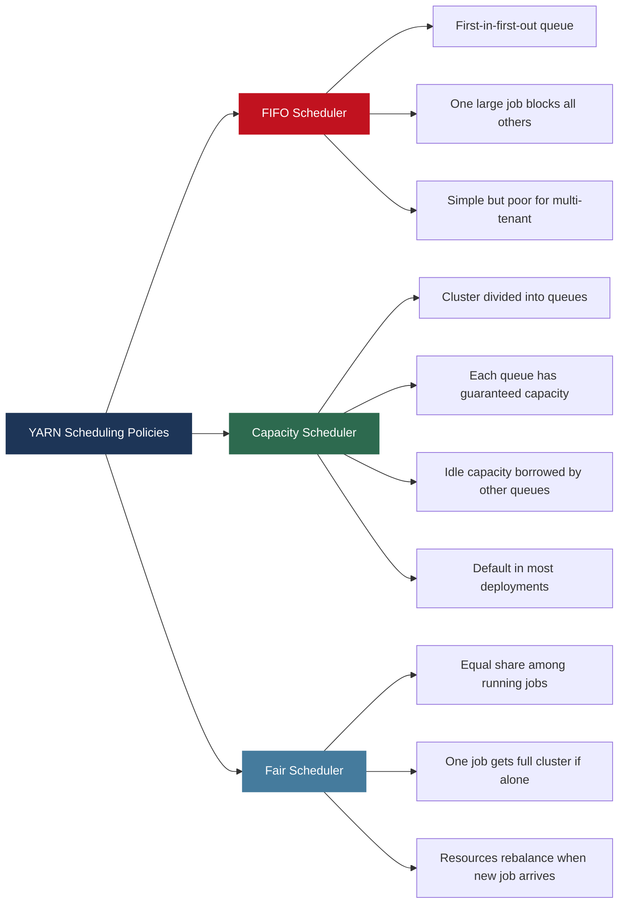

**Capacity Scheduler example - multi-tenant cluster:**

| Queue | Guaranteed Capacity | Users |
|-------|--------------------|----|
| analytics | 40% | Analytics team |
| data-engineering | 30% | DE team |
| ml-training | 20% | ML team |
| default | 10% | Everyone else |

Each team always gets at least their guaranteed share. When a team's queue is idle, other teams can borrow the spare capacity.

---

## Lecture Summary

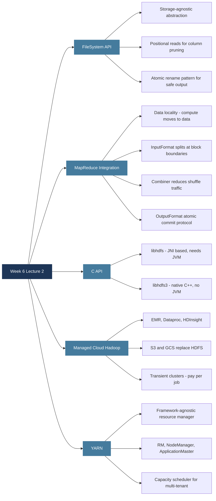

**Next class:** The Lakehouse Architecture - Delta Lake, Apache Iceberg, Apache Hudi, and the Databricks vs Snowflake comparison. One of the most important current topics in Big Data, directly reflecting 2026 industry practice.

---

*BDA Spring 2026 | Week 6, Lecture 2 | HDFS APIs, MapReduce Integration, Managed Hadoop and Cloud Storage*
