# Big Data Analytics (BDA Spring 2026)
## Week 6, Lecture 3: The Lakehouse Architecture - Delta Lake, Apache Iceberg, Apache Hudi, Databricks vs Snowflake

> This is genuinely current material. The architecture debated and adopted in industry right now, in 2026. This is what your first employer is either already running or actively planning to migrate to.

---

## Table of Contents

1. [The Problem - Why We Needed Something New](#1-the-problem---why-we-needed-something-new)
2. [The Lakehouse - Unifying Storage and Analytics](#2-the-lakehouse---unifying-storage-and-analytics)
3. [The Open Table Format - Technical Foundation](#3-the-open-table-format---technical-foundation)
4. [Delta Lake - The Pioneer](#4-delta-lake---the-pioneer)
5. [Apache Iceberg - The Enterprise Standard](#5-apache-iceberg---the-enterprise-standard)
6. [Apache Hudi - The Streaming Specialist](#6-apache-hudi---the-streaming-specialist)
7. [Choosing Between the Three Formats](#7-choosing-between-the-three-formats)
8. [Databricks vs Snowflake](#8-databricks-vs-snowflake)
9. [The Complete Lakehouse Architecture](#9-the-complete-lakehouse-architecture)

---

## 1. The Problem - Why We Needed Something New

### The Two-Tier Architecture (2010-2020)

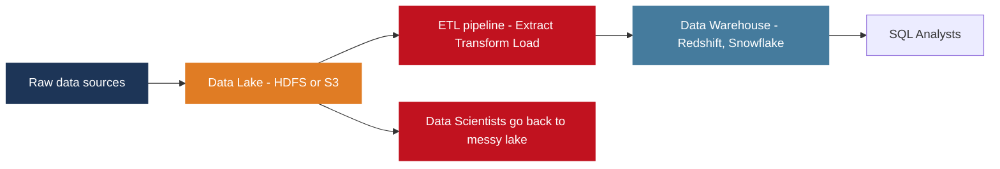

**Tier 1 - Data Lake:** raw data in whatever format it arrives. No schema enforcement. Schema-on-read. Cheap storage (pennies per GB on S3).

**Tier 2 - Data Warehouse:** cleaned, transformed, structured data. Optimized for SQL analytics. Reliable and consistent. Expensive (pays for both storage and compute).

This seemed reasonable. Use cheap storage for raw data. Use expensive fast storage for analytics. It failed badly.

---

### The Five Failure Modes

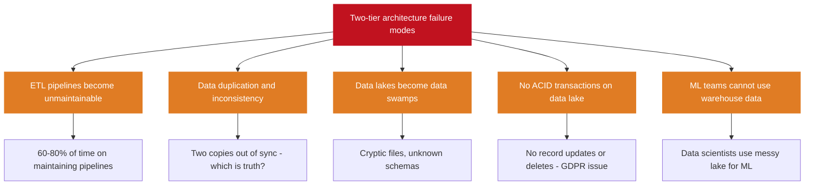

The result: complex, expensive, fragile architectures. Data engineers burn out maintaining pipelines. Analysts do not trust their data. ML teams cannot get clean training data.

---

## 2. The Lakehouse - Unifying Storage and Analytics

### The Core Insight

The reason data warehouses are reliable is not their proprietary storage format. It is because they have **transactional metadata management**. If you add a transactional metadata layer on top of open file formats in cloud object storage, you get all the benefits of a data warehouse at data lake scale and cost.

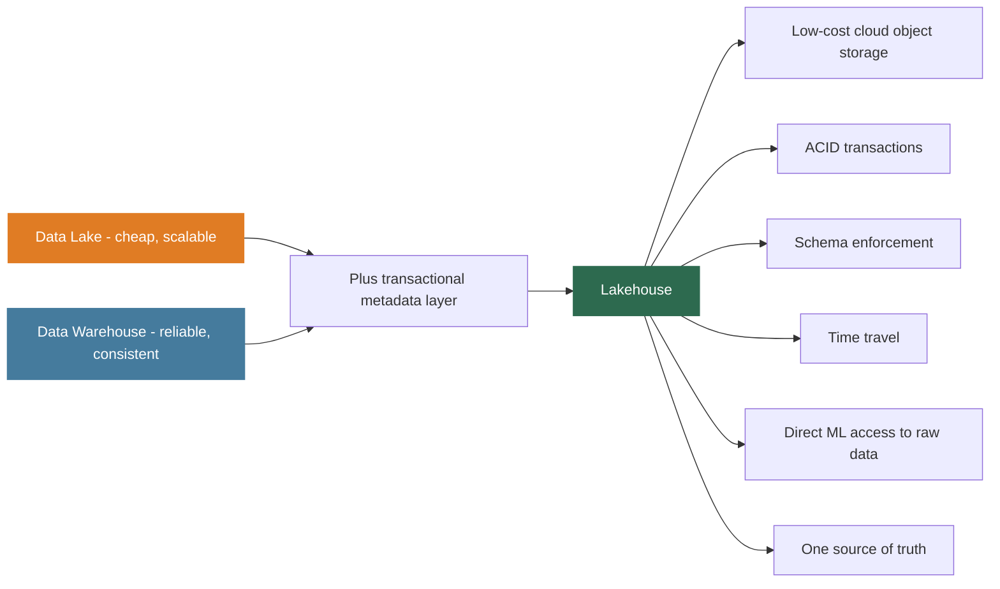

> **Lakehouse definition:** A data management architecture that combines the low-cost scalable storage of data lakes with the data management and performance features of data warehouses, implemented on open file formats with a transactional metadata layer.

Named and conceptualized by Databricks researchers in a 2021 paper. Three open table formats implement this vision: **Delta Lake**, **Apache Iceberg**, and **Apache Hudi**.

---

## 3. The Open Table Format - Technical Foundation

A raw Parquet file in S3 is just bytes. There is no concept of a table, no transaction history, no schema evolution record, no way to atomically update data.

**What an open table format adds:**

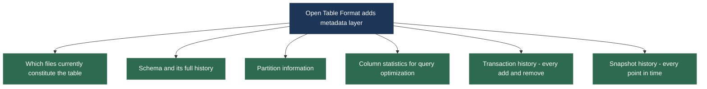

The metadata layer enables ACID transactions, time travel, schema evolution, and efficient query optimization without modifying underlying Parquet files.

---

## 4. Delta Lake - The Pioneer

Open-sourced by Databricks in 2019. The first open table format to gain widespread adoption. Most widely used in 2026, particularly in Databricks environments.

### Delta Lake File Structure

```
s3://my-bucket/my-table/
├── _delta_log/
│   ├── 00000000000000000000.json   transaction 0 - table creation
│   ├── 00000000000000000001.json   transaction 1 - first write
│   ├── 00000000000000000002.json   transaction 2 - second write
│   ├── 00000000000000000003.json   transaction 3 - delete operation
│   ├── 00000000000000000010.checkpoint.parquet  checkpoint at txn 10
│   └── _last_checkpoint            pointer to latest checkpoint
├── part-00000-abc123.snappy.parquet   data file
├── part-00001-def456.snappy.parquet   data file
└── part-00002-ghi789.snappy.parquet   data file
```

Each JSON file in `_delta_log` is one atomic commit containing:

| Action Type | What It Records |
|-------------|----------------|
| Add | New data files: path, size, column statistics (min/max/null counts), partition values |
| Remove | Logically deleted files (not physically removed until vacuum) |
| Metadata | Schema changes, partition changes, configuration changes |
| Protocol | Delta Lake protocol version requirements |

### ACID Transactions via Optimistic Concurrency

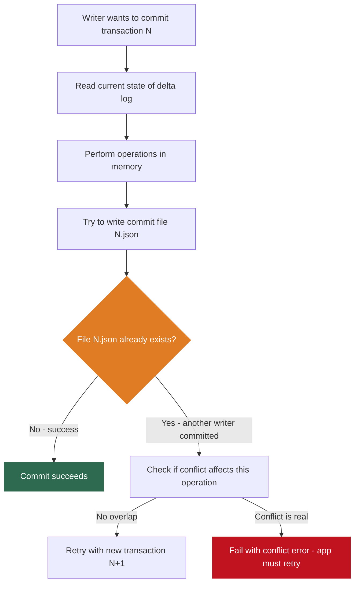

**ACID properties in Delta Lake:**

| Property | How Implemented |
|----------|----------------|
| Atomicity | Commit file either exists (success) or does not (failure) - no partial state |
| Consistency | Schema enforcement on every write; CHECK constraints available |
| Isolation | Readers see a consistent snapshot from one specific transaction version |
| Durability | Committed JSON files in S3 have eleven-nines durability guarantee |

### Time Travel - Delta Lake's Killer Feature

Because the transaction log records every version, you can query the table at any point in time.

```python
from delta.tables import DeltaTable
from pyspark.sql import SparkSession

spark = SparkSession.builder \
    .config("spark.sql.extensions",
            "io.delta.sql.DeltaSparkSessionExtension") \
    .getOrCreate()

# Current state
df_now = spark.read.format("delta") \
    .load("s3://my-bucket/transactions/")

# Table as it was at version 5
df_v5 = spark.read.format("delta") \
    .option("versionAsOf", 5) \
    .load("s3://my-bucket/transactions/")

# Table as it was 7 days ago
df_week = spark.read.format("delta") \
    .option("timestampAsOf", "2026-03-10 00:00:00") \
    .load("s3://my-bucket/transactions/")

# Full transaction history
DeltaTable.forPath(spark, "s3://my-bucket/transactions/") \
    .history().show(truncate=False)
```

**Time travel use cases:**

| Use Case | How Time Travel Helps |
|---------|----------------------|
| Mistake recovery | Accidentally deleted rows - query before deletion and restore |
| Regulatory audit | Auditors need exact data at a specific date - point at time-travel query |
| ML reproducibility | Retrain on identical training data from 6 months ago |
| Debugging | Compare table at two timestamps to find what changed |

### Schema Evolution and Enforcement

```python
# Default: schema enforcement - this FAILS if schema does not match
new_df.write.format("delta").mode("append") \
    .save("s3://my-bucket/transactions/")

# Explicit schema evolution - allows adding new columns
new_df.write.format("delta") \
    .option("mergeSchema", "true") \
    .mode("append") \
    .save("s3://my-bucket/transactions/")
```

| Change Type | Allowed? | Notes |
|-------------|---------|-------|
| Add new columns | Yes | Safe - old queries still work |
| Widen data types (int to long) | Yes | Safe - no data loss |
| Remove columns | No | Breaking - rejects write |
| Narrow data types (long to int) | No | Breaking - potential data loss |

### MERGE - Upserts at Scale

```python
from delta.tables import DeltaTable

delta_table = DeltaTable.forPath(spark, "s3://my-bucket/customers/")

delta_table.alias("target").merge(
    updates_df.alias("source"),
    "target.customer_id = source.customer_id"
).whenMatchedUpdate(set={
    "name": "source.name",
    "email": "source.email",
    "updated_at": "source.updated_at"
}).whenNotMatchedInsert(values={
    "customer_id": "source.customer_id",
    "name": "source.name",
    "email": "source.email",
    "created_at": "source.created_at",
    "updated_at": "source.updated_at"
}).execute()
```

MERGE enables **Change Data Capture (CDC)** pipelines: database changes from MySQL or PostgreSQL can be efficiently merged into a Delta Lake table, keeping the data lake in sync without full reloads.

---

## 5. Apache Iceberg - The Enterprise Standard

Developed at Netflix, open-sourced 2018, Apache top-level project 2020. In 2026 Iceberg has become the dominant open table format in enterprise environments outside the Databricks ecosystem. Supported natively by virtually every major query engine.

### Iceberg Multi-Level Metadata Hierarchy

```
s3://my-bucket/my-table/
├── metadata/
│   ├── v1.metadata.json        table metadata version 1
│   ├── v2.metadata.json        table metadata version 2
│   ├── snap-1234567890.avro    snapshot manifest list
│   ├── manifest-abc.avro       manifest file listing data files
│   └── manifest-def.avro       manifest file listing data files
└── data/
    ├── year=2026/month=03/
    │   ├── part-00000.parquet
    │   └── part-00001.parquet
    └── year=2026/month=02/
        └── part-00000.parquet
```

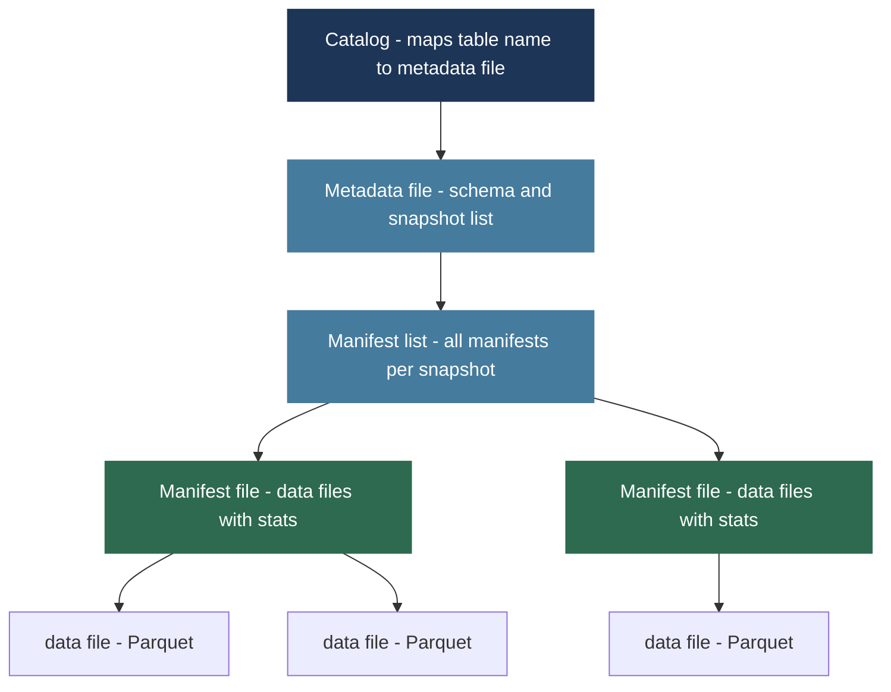

**Four metadata levels:**

| Level | What It Contains | Enables |
|-------|-----------------|---------|
| Catalog | Maps table name to current metadata file | Entry point for all query engines |
| Metadata file | Schema, partition spec, list of snapshots | Schema history and snapshot tracking |
| Manifest list | Per-snapshot list of manifests with partition stats | Skip entire manifests via partition pruning |
| Manifest files | Actual data file paths with column-level statistics | Skip data files via predicate pushdown |

### Why Iceberg's Hierarchy Matters at Scale

**The 10 million files problem:**

$$\text{Delta Lake: to find active files must process entire transaction log}$$
$$\text{At 10M files this becomes very slow}$$

$$\text{Iceberg: prune at manifest list level first}$$
$$\text{Query filtering on year=2026 skips all manifests covering only earlier years}$$
$$\text{May skip 90\% of manifests without reading a single manifest file}$$

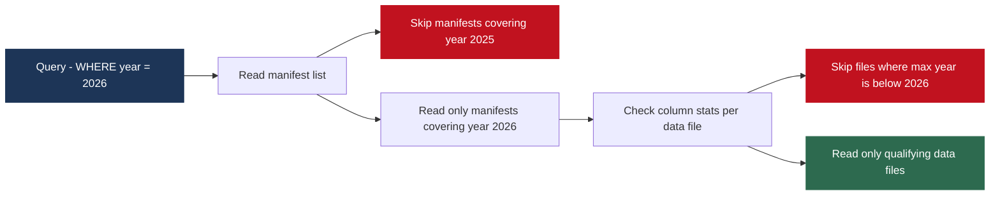

### Iceberg Key Features

**Hidden partitioning** - users write natural queries; Iceberg applies partition pruning automatically:

```sql
-- Table partitioned by month(event_time) - hidden from users
CREATE TABLE events (
    event_id   BIGINT,
    event_time TIMESTAMP,
    user_id    BIGINT,
    event_type STRING
) USING iceberg
PARTITIONED BY (months(event_time));

-- User writes natural query - no need to add AND year=2026 AND month=3
SELECT COUNT(*) FROM events
WHERE event_time BETWEEN '2026-03-01' AND '2026-03-31';
-- Iceberg automatically applies partition pruning behind the scenes
```

**Row-level deletes for GDPR compliance:**

```sql
-- Delete individual user records without rewriting entire files
DELETE FROM user_events WHERE user_id = 12345678;
-- Iceberg records this as a delete file applied at query time
```

**Partition evolution** - change partitioning strategy without rewriting data. New data uses new partitioning. Old data retains old partitioning. Queries work correctly across both.

| Feature | Iceberg | Delta Lake | Notes |
|---------|---------|-----------|-------|
| Hidden partitioning | Yes | No | Iceberg unique advantage |
| Partition evolution | Yes | Limited | Major Iceberg strength |
| Multi-engine support | Excellent | Good (mainly Spark) | Iceberg's biggest enterprise win |
| Row-level deletes | Yes | Yes | Both support |
| Time travel | Yes | Yes | Both support |
| Concurrent writers | Yes | Yes | Both handle via optimistic concurrency |

---

## 6. Apache Hudi - The Streaming Specialist

Developed at Uber, open-sourced 2017, Apache top-level project 2020. Designed for a specific primary use case: **near-real-time data ingestion with upsert support**.

Uber needed to continuously ingest billions of trip events, driver locations, and payments - with update and delete support - and make updated data available within minutes.

### Hudi Storage Types

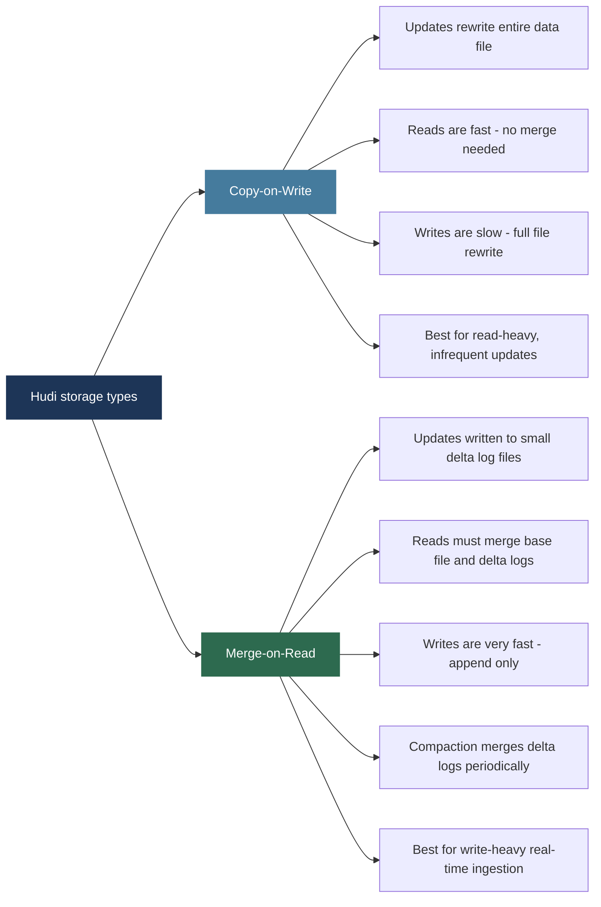

**MoR is Hudi's key differentiator.** Data ingested from Kafka can be written to Hudi MoR tables with sub-minute latency, while analytical queries still work by merging base files and delta logs at query time.

### Hudi Incremental Queries

```python
# Read only records changed since a specific commit - unique to Hudi
incremental_df = spark.read.format("hudi") \
    .option("hoodie.datasource.query.type", "incremental") \
    .option("hoodie.datasource.read.begin.instanttime", "20260310120000") \
    .load("s3://my-bucket/trips/")

# Returns ONLY records modified after 2026-03-10 12:00:00
# Perfect for CDC pipelines and incremental processing
```

**Why incremental queries matter:**

$$\text{Without incremental queries: reprocess entire table on every pipeline run}$$
$$\text{With incremental queries: process only changed records}$$

$$\text{If 0.1\% of a 10 TB table changes daily:}$$
$$\text{Full scan cost: 10 TB read every run}$$
$$\text{Incremental cost: 10 GB read every run} = \mathbf{1000x \text{ cost reduction}}$$

---

## 7. Choosing Between the Three Formats

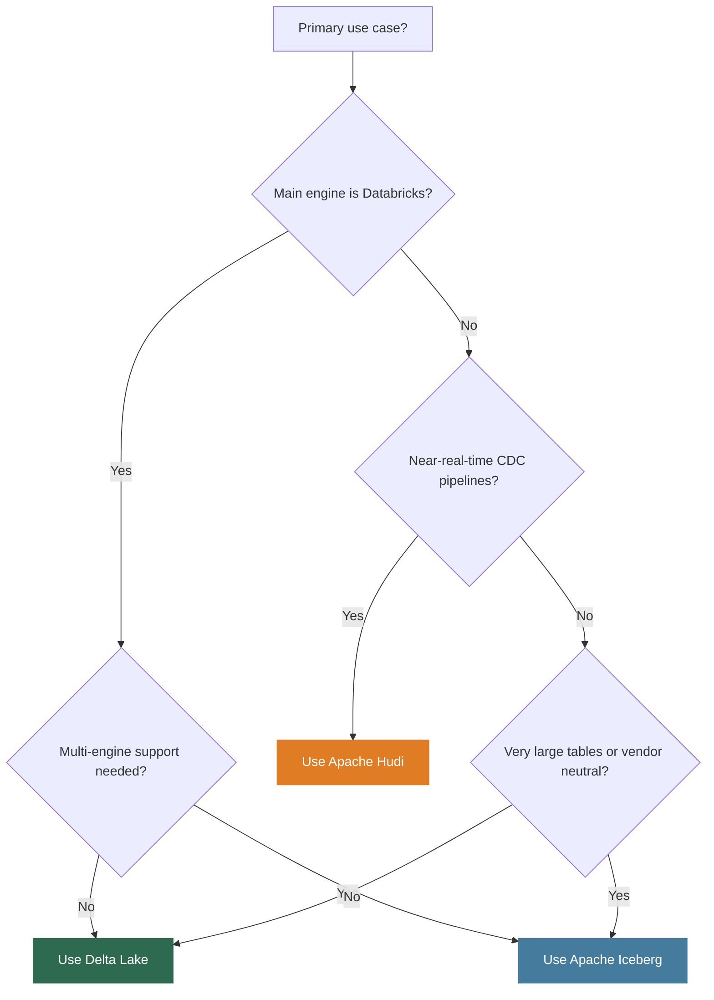

| Dimension | Delta Lake | Apache Iceberg | Apache Hudi |
|---|---|---|---|
| Primary strength | Databricks integration | Multi-engine, enterprise scale | Near-real-time, CDC |
| Transaction log | JSON files (flat) | Multi-level metadata hierarchy | Timeline-based |
| Best query engine | Spark and Databricks | Any engine (Spark, Trino, Flink) | Spark |
| Hidden partitioning | No | Yes | No |
| Partition evolution | Limited | Excellent | Limited |
| Upsert performance | Good via MERGE | Good | Excellent via MoR |
| Incremental queries | Limited | Limited | Excellent |
| Table scale (many files) | Good | Excellent | Good |
| Adoption in 2026 | Very high (Databricks) | Very high (broad enterprise) | High (streaming) |

**The 2026 reality:** Iceberg is winning the enterprise market outside Databricks. AWS Glue, Athena, EMR, Snowflake, BigQuery, and Apple all have native Iceberg support. The Iceberg REST catalog is becoming the universal table format API.

---

## 8. Databricks vs Snowflake

### Snowflake - The Data Warehouse Reborn

Founded 2012. Cloud-native data warehouse designed from the ground up for cloud object storage.

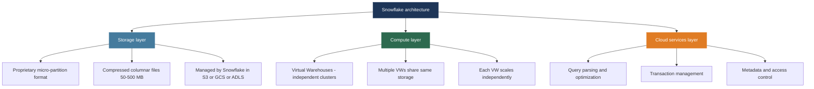

**Snowflake strengths and limitations:**

| Strengths | Limitations |
|----------|------------|
| Zero operational overhead - fully managed | Not designed for ML model training at scale |
| Elastic compute - VWs auto-suspend and resume | Not designed for unstructured data processing |
| Excellent SQL analytical performance | Real-time streaming ingestion is limited |
| Data sharing - share live data without copying | Custom code execution is constrained |
| Pay only for compute time actually used | Data movement needed for ML workflows |

**Virtual Warehouse concept:**

$$\text{Snowflake} = \underbrace{\text{Shared Storage}}_{\text{S3/GCS/ADLS}} + \underbrace{\text{N independent Virtual Warehouses}}_{\text{no resource contention between teams}}$$

Data engineering team runs large ETL on XL warehouse while analysts run interactive queries on Medium warehouse - zero resource contention, same data.

---

### Databricks - The Unified Analytics Platform

Founded 2013 by creators of Apache Spark at UC Berkeley. Evolved from managed Spark into the Databricks Lakehouse Platform.

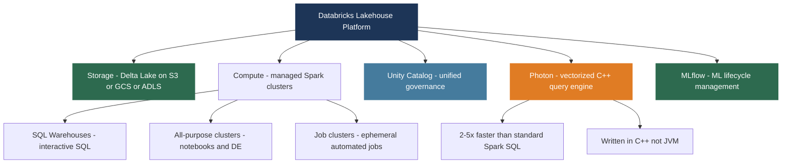

**Databricks strengths and limitations:**

| Strengths | Limitations |
|----------|------------|
| Unified platform - SQL, Python, ML, streaming in one | Higher operational complexity than Snowflake |
| Open formats - Delta Lake on standard cloud storage | Steeper learning curve |
| Best platform for large-scale ML with GPU clusters | Historically lagged Snowflake on complex SQL (gap now closed with Photon) |
| MLflow integration for experiment tracking and serving | Cluster management requires expertise |
| Spark Structured Streaming for real-time pipelines | |

---

### Head-to-Head Comparison

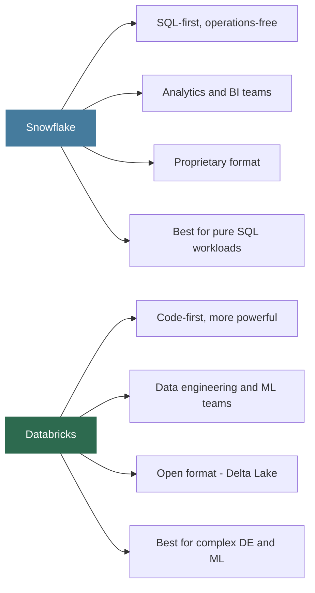

| Dimension | Snowflake | Databricks |
|-----------|----------|-----------|
| Primary interface | SQL | Python and Scala (SQL also available) |
| Operational complexity | Very low - fully managed | Moderate - cluster management needed |
| ML at scale | Limited (Snowpark ML improving) | Excellent - GPU clusters, MLflow |
| Streaming | Limited | Excellent - Structured Streaming |
| Data format | Proprietary micro-partitions | Open - Delta Lake on cloud storage |
| Vendor lock-in | Higher | Lower (open formats) |
| SQL performance | Excellent | Excellent with Photon |
| Best for | SQL analysts, BI reporting | Data engineers, ML teams |

**The 2026 reality:** Many large organizations use both.

$$\text{Typical architecture} = \underbrace{\text{Databricks}}_{\text{DE pipelines + ML training}} \rightarrow \underbrace{\text{Snowflake}}_{\text{SQL analytics + BI}}$$

Databricks processes and transforms. Snowflake serves analysts. A more sophisticated version of the two-tier architecture - but with open formats and far less ETL complexity.

**For students:** learn both conceptually. For hands-on skills, prioritize Databricks because it requires broader skills (Python, Spark, SQL, ML) that transfer everywhere. Open source skills - Spark, Iceberg, Delta Lake - are the most transferable.

---

## 9. The Complete Lakehouse Architecture

### The Medallion Architecture - Bronze, Silver, Gold

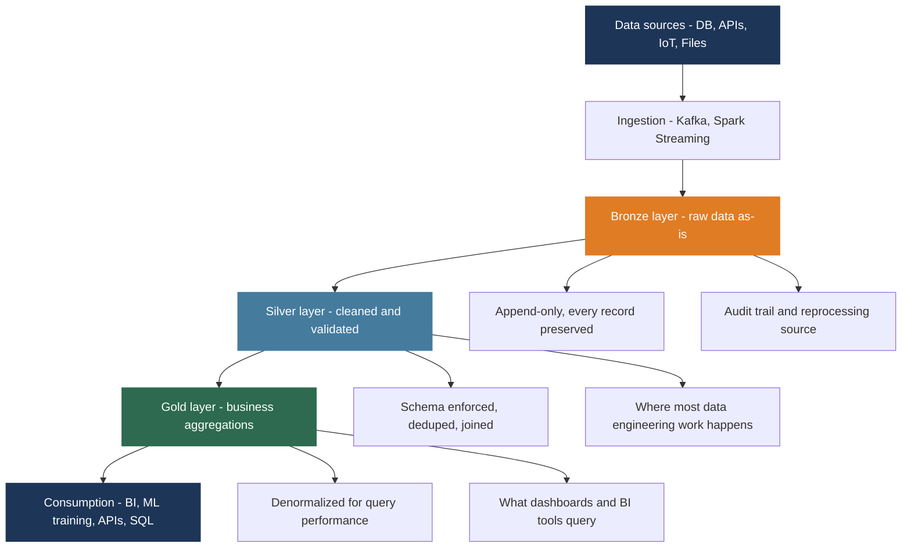

All three layers sit in the **same object storage**, managed by the **same open table format**, governed by the **same catalog**. No separate data warehouse tier. No ETL to an external system.

**Medallion layer responsibilities:**

| Layer | Raw Data State | What Happens Here | Who Uses It |
|-------|---------------|------------------|-------------|
| Bronze | Exactly as arrived, no changes | Nothing - preserve everything | Data engineers for debugging and reprocessing |
| Silver | Cleaned, validated, deduplicated | Filtering, type casting, joins, deduplication | Data engineers, data scientists |
| Gold | Business-level aggregates | Aggregation, denormalization for speed | BI tools, dashboards, SQL analysts |

### Two-Tier vs Lakehouse - The Full Comparison

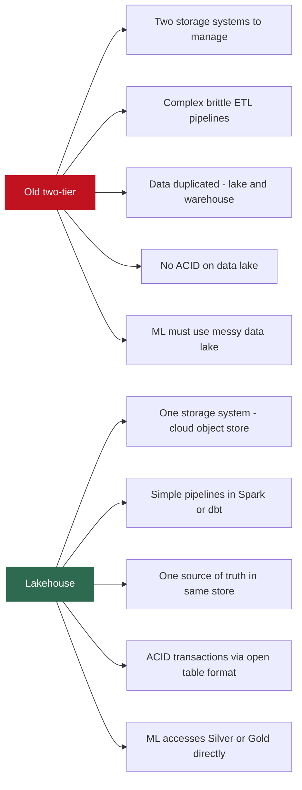

---

## Lecture Summary

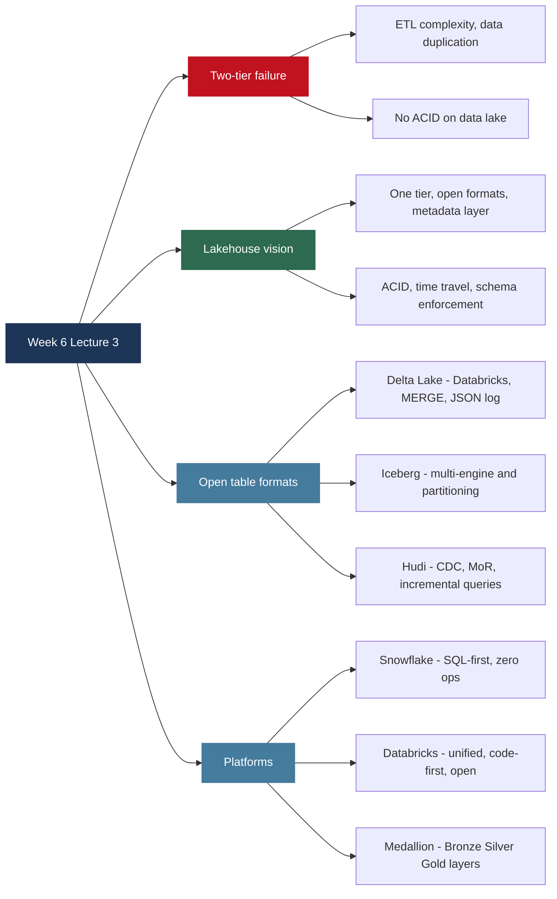

**Next class:** Week 7 - MapReduce and Apache Spark. MapReduce programming model in complete depth, the shuffle phase, performance optimization, then Spark architecture and PySpark hands-on code.

---

*BDA Spring 2026 | Week 6, Lecture 3 | The Lakehouse Architecture - Delta Lake, Apache Iceberg, Apache Hudi, Databricks vs Snowflake*
