# Big Data Analytics (BDA Spring 2026)
## Week 7, Lecture 1: The MapReduce Programming Model - Design, Execution and Optimization

> MapReduce is not the dominant processing framework in 2026. Apache Spark has largely replaced it. You will likely never write a production MapReduce job in your career. We study it because it is the conceptual foundation of every distributed data processing framework that followed. Understanding MapReduce deeply means understanding the DNA of Spark, Flink, and Kafka Streams.

---

## Table of Contents

1. [Origins and Philosophy](#1-origins-and-philosophy)
2. [MapReduce Data Model - Keys and Values](#2-mapreduce-data-model---keys-and-values)
3. [Execution Model - Complete Deep Dive](#3-execution-model---complete-deep-dive)
4. [Fault Tolerance - MapReduce's Superpower](#4-fault-tolerance---mapreduces-superpower)
5. [Optimization - Practical Tuning](#5-optimization---practical-tuning)
6. [Multi-Step MapReduce - Chaining Jobs](#6-multi-step-mapreduce---chaining-jobs)
7. [MapReduce in 2026 - Legacy and Relevance](#7-mapreduce-in-2026---legacy-and-relevance)

---

## 1. Origins and Philosophy

### The 2004 Google Paper

MapReduce was introduced in a landmark 2004 paper: **"MapReduce: Simplified Data Processing on Large Clusters"** by Jeffrey Dean and Sanjay Ghemawat. One of the most cited and influential papers in computer science history.

**The core insight:** most of Google's large-scale computations - building the web index, computing PageRank, processing web logs - could be expressed as two simple operations borrowed from functional programming: `map` and `reduce`.

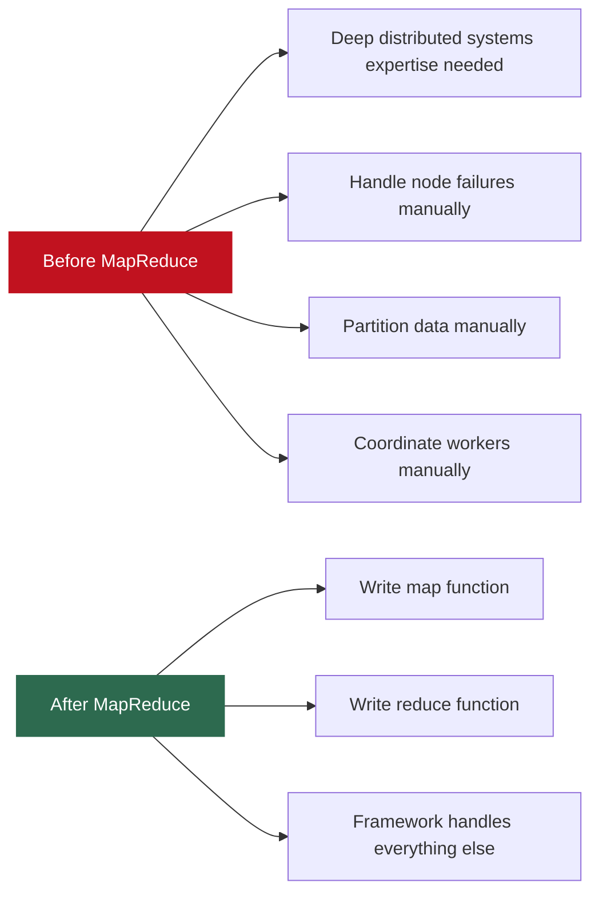

Any programmer who could write a map function and a reduce function could process petabytes of data on a thousand machines.

---

### The Functional Programming Roots

```python
# Functional MAP: apply function to every element
numbers = [1, 2, 3, 4, 5]
squares = list(map(lambda x: x * x, numbers))
# squares = [1, 4, 9, 16, 25]

# Functional REDUCE: combine all elements into one value
from functools import reduce
total = reduce(lambda acc, x: acc + x, numbers)
# total = 15
```

MapReduce scales these to distributed systems:

| Concept | Single Machine | MapReduce Distributed |
|---------|---------------|----------------------|
| Map | Apply function to list in memory | Apply to billions of records across thousands of machines |
| Reduce | Combine list in memory | Combine across network-distributed intermediate results |
| Parallelism | Sequential on one core | Trivially parallel - each map is independent |

**Why parallelism is trivial:** each map invocation operates on exactly one input record and is completely independent of every other map invocation. No coordination needed. Run one per record across any number of machines simultaneously.

---

## 2. MapReduce Data Model - Keys and Values

Everything in MapReduce is expressed as **key-value pairs**. This is the universal data model.

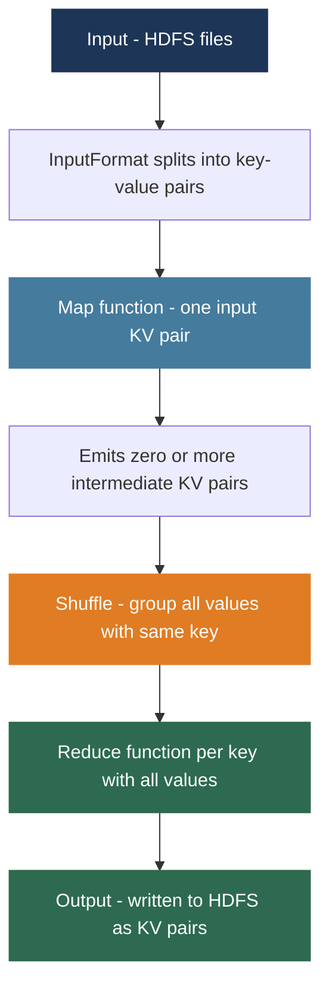

| Phase | Key | Value |
|-------|-----|-------|
| Input (TextInputFormat) | Byte offset in file | Line of text |
| Map output | Word emitted by user | Integer 1 |
| Reduce input | One unique word | Iterator over all 1s for that word |
| Reduce output | Word | Final count |

The key-value model is deliberately minimal. The constraint forces all computation to be expressed as transformations and aggregations on key-value pairs - this is exactly what enables automatic distribution and fault tolerance.

---

## 3. Execution Model - Complete Deep Dive

### Phase 0 - Job Submission and Input Splitting

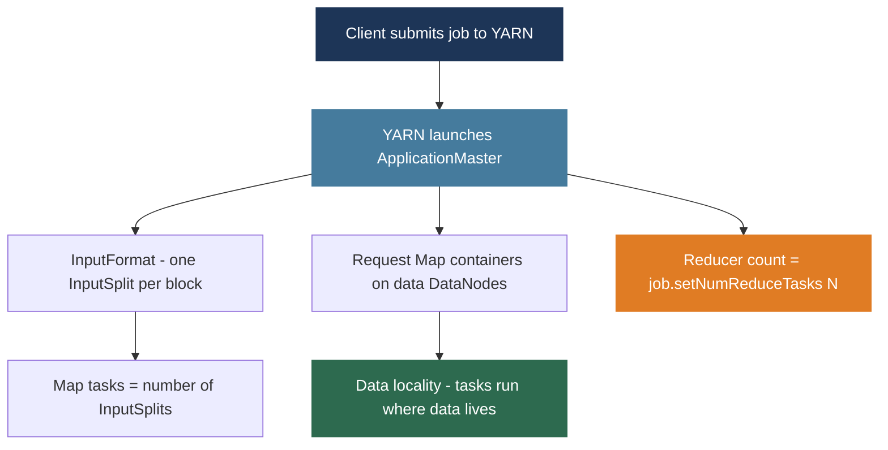

---

### Phase 1 - The Map Phase

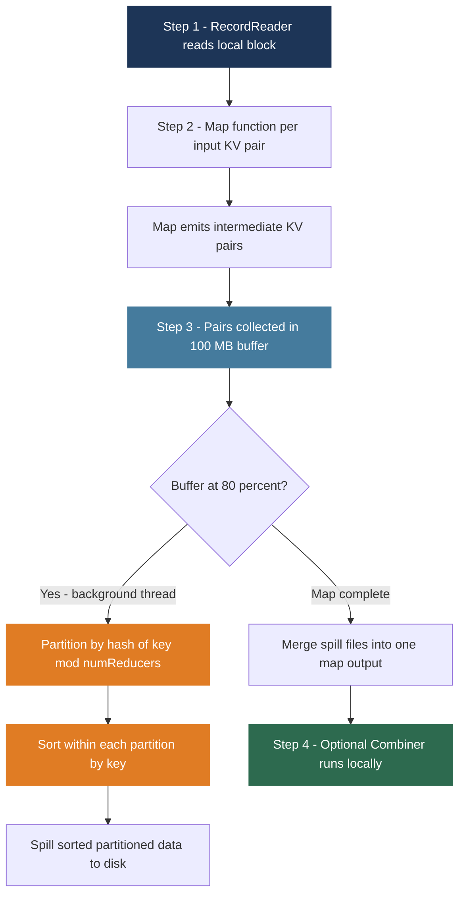

**Word Count map example:**

```
Input:  (offset=0,  "the quick brown fox")
Output: ("the",1), ("quick",1), ("brown",1), ("fox",1)

Input:  (offset=20, "the fox jumped")
Output: ("the",1), ("fox",1), ("jumped",1)
```

**Partitioning formula:**

$$\text{partition} = \text{hash}(key) \mod \text{numReducers}$$

All pairs for Reducer 0 go to partition 0, all for Reducer 1 go to partition 1, and so on. This guarantees that all values for any given key reach exactly one reducer.

**Why sort within each partition?**

$$\text{Sorting by key} \Rightarrow \text{identical keys are adjacent} \Rightarrow \text{linear scan suffices to group values}$$

Sorting complexity is O(N log N). The alternative (hashing) is O(N) but requires more memory and produces unordered output. MapReduce chose sorting for predictable, bounded memory usage and sorted output useful for downstream operations.

---

### The Combiner - Local Pre-Aggregation

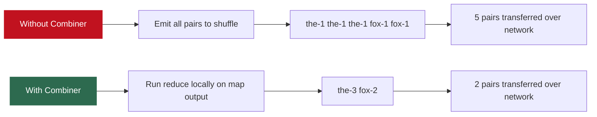

The Combiner is a local Reducer that runs on each Map task before the shuffle. For a corpus where "the" appears millions of times per block, the Combiner reduces millions of `("the", 1)` pairs to one `("the", N)` pair per Map task.

**Combiner constraint - must be commutative and associative:**

$$\text{Sum: } f(f(3,5), 7) = f(3, f(5,7)) \quad \checkmark \text{ Safe}$$

$$\text{Average: } avg(avg(3,5), 7) = avg(4, 7) = 5.5 \neq avg(3, 5, 7) = 5.0 \quad \times \text{ Not safe}$$

---

### Phase 2 - The Shuffle Phase

The shuffle is the most network-intensive phase. It is where the distributed nature of computation is most visible.

**What is the shuffle?** Moving each Reducer's share of the map output (Partition K) from all Map tasks to Reducer K.

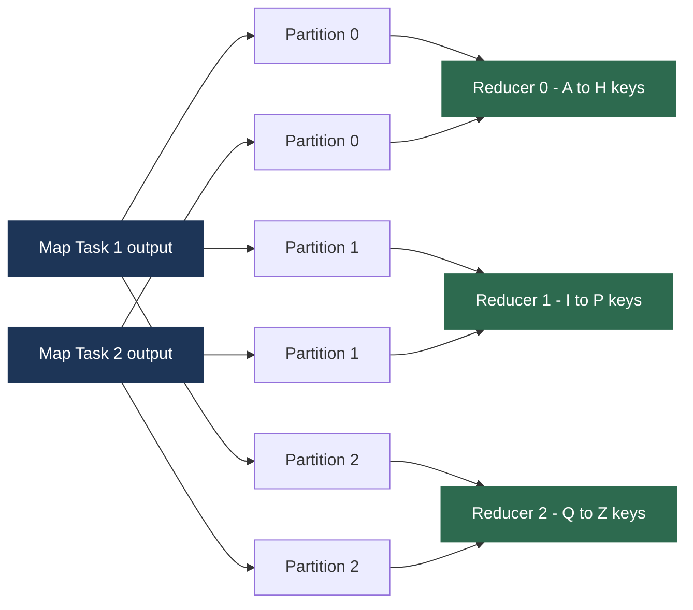

**Shuffle mechanics:**

| Sub-phase | What Happens |
|----------|-------------|
| Fetch | Reduce tasks send HTTP requests to Map task nodes, fetching their partition as soon as Map tasks complete (pipelined - does not wait for all maps to finish) |
| Merge | As partitions arrive, Reduce task merges them maintaining sorted order using N-way merge sort |
| Spill | If merged data exceeds memory, intermediate merged results are written to local disk |

**The shuffle is the bottleneck.** In a large job it transfers terabytes across the cluster network. Mitigation strategies:

| Strategy | Mechanism | Benefit |
|---------|-----------|---------|
| Combiner | Reduce pairs before shuffle | Cuts shuffle volume by 10x or more |
| Map output compression | Snappy compress before transfer | Cuts bytes over network by 3-5x |
| Rack-aware scheduling | Prefer intra-rack data locality | Reduces cross-rack bottleneck |

---

### Phase 3 - The Reduce Phase

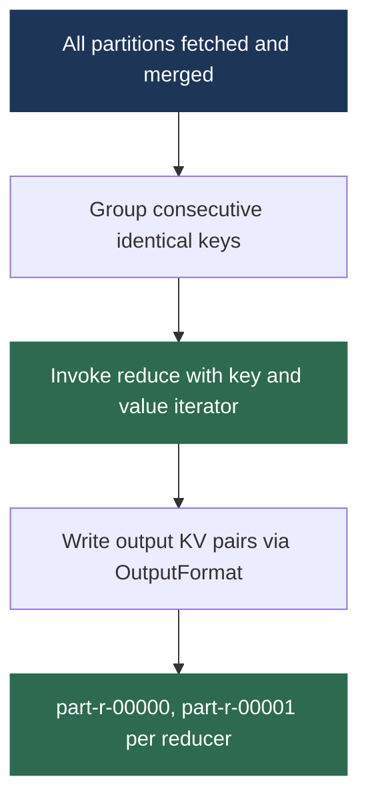

**Word Count reduce example:**

```
Input:  ("brown",  [1])     → Output: ("brown",  1)
Input:  ("fox",    [1, 2])  → Output: ("fox",    3)
Input:  ("jumped", [1])     → Output: ("jumped", 1)
Input:  ("quick",  [1])     → Output: ("quick",  1)
Input:  ("the",    [3, 1])  → Output: ("the",    4)
```

"fox" has values [1, 2]: one direct 1 from Map Task 1, one 2 from Map Task 2 after the Combiner summed two 1s. Reducer correctly sums to 3.

**Output is sorted per partition but NOT globally sorted.** For global sort, use `TotalOrderPartitioner` which samples the key distribution and assigns key ranges such that Partition 0 < Partition 1 < ... This is what the TeraSort benchmark uses.

---

### Complete Data Flow

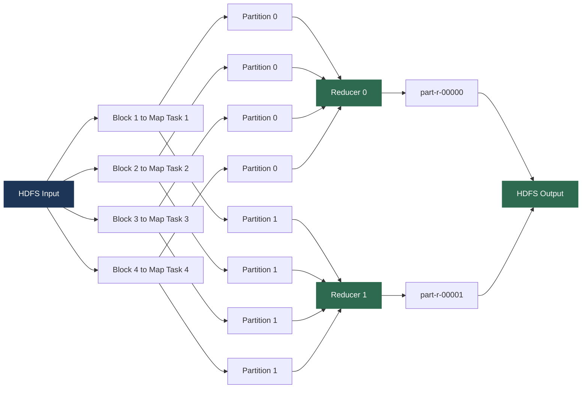

---

## 4. Fault Tolerance - MapReduce's Superpower

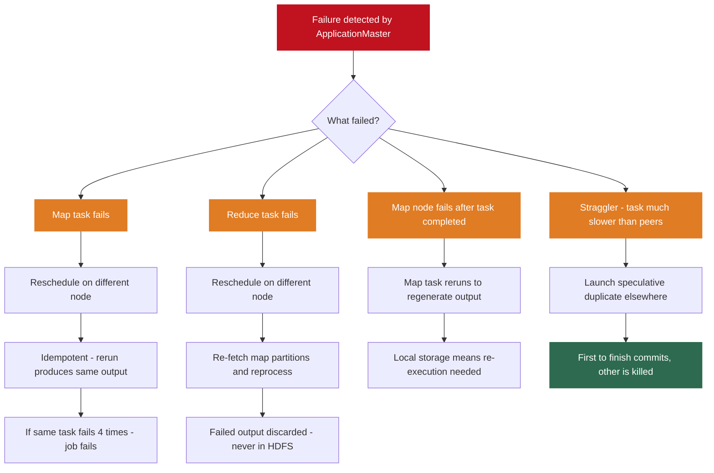

**Speculative execution math:**

$$\text{Job with 1000 map tasks, 999 finish in 1 min, 1 straggler takes 10 min}$$
$$\text{Without speculation: total time} = 10 \text{ min}$$
$$\text{With speculation: duplicate launched, finishes in} \approx 1 \text{ min}$$
$$\text{Speedup} \approx 10\times \text{ at the cost of one extra task}$$

**Why Map task idempotency is guaranteed:**
- Input read from HDFS - immutable, always available
- Output written to local disk - isolated per task, no shared state
- Same input always produces same output - pure function

---

## 5. Optimization - Practical Tuning

### Choosing the Number of Reducers

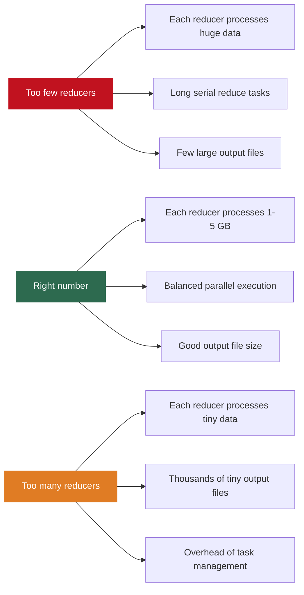

**Rule of thumb:**

$$\text{Number of reducers} = \frac{\text{total intermediate data size}}{1 \text{ GB to } 5 \text{ GB per reducer}}$$

$$\text{Example: 100 GB intermediate data} \Rightarrow \text{use 20 to 100 reducers}$$

```java
// Set number of reducers
job.setNumReduceTasks(50);

// Map-only job (no reducers): output only needs filtering or transformation
job.setNumReduceTasks(0);  // eliminates shuffle entirely - much faster
```

---

### Compression for Shuffle Optimization

```xml
<!-- Enable Snappy compression for map output - reduces shuffle volume -->
<property>
    <name>mapreduce.map.output.compress</name>
    <value>true</value>
</property>
<property>
    <name>mapreduce.map.output.compress.codec</name>
    <value>org.apache.hadoop.io.compress.SnappyCodec</value>
</property>
```

| Codec | Speed | Ratio | Best For |
|-------|-------|-------|---------|
| Snappy | Very fast | Moderate (30-50% reduction) | Map output - CPU cost offset by I/O savings |
| LZO | Fast | Good | Map output on older clusters |
| Gzip | Slow | High (70-80% reduction) | Final output - written once, read many times |
| Zstd | Fast | High | Modern clusters - best of both |

---

### Data Skew - The Silent Performance Killer

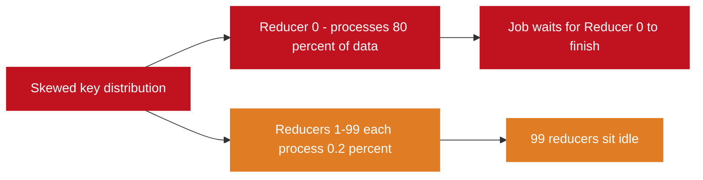

**Solution: Salting** - append a random suffix to hot keys to distribute them across multiple reducers.

```java
// Mapper: salt hot keys
public void map(LongWritable key, Text value, Context context) {
    String word = value.toString().trim();
    if (isHotKey(word)) {
        // Distribute "the" across 10 reducers as "the_0" through "the_9"
        String saltedKey = word + "_" + random.nextInt(10);
        context.write(new Text(saltedKey), one);
    } else {
        context.write(new Text(word), one);
    }
}
// Pass 1 output: ("the_0", 150000), ("the_1", 180000), ..., ("the_9", 120000)
// Pass 2 (merge): ("the", 1450000)
```

**Salting trade-off:**

$$\text{Before salting: 1 reducer processes } N \text{ records for hot key}$$
$$\text{After salting: 10 reducers each process } N/10 \text{ records}$$
$$\text{Speedup} \approx 10\times \text{ at cost of one additional MapReduce pass}$$

---

### Secondary Sort Pattern

MapReduce sorts by key before reduce. Within a key, values arrive in arbitrary order. To get ordered values within a key, use a composite key.

```java
// Composite key: (word, timestamp) - sorted by both
// But grouped by: word only
// Result: reducer receives all records for "word" sorted by timestamp

job.setSortComparatorClass(CompositeKeyComparator.class);
job.setGroupingComparatorClass(NaturalKeyGroupingComparator.class);
```


Elegant but complex to implement. One example of how MapReduce's simplicity forces elaborate workarounds for operations that more expressive frameworks handle naturally.

---

## 6. Multi-Step MapReduce - Chaining Jobs

Complex computations require multiple MapReduce passes. Output of one job becomes input of the next.

**Example: average word length by first letter**

```java
// Job 1: map word to (first_letter, length), reduce to (letter, sum+count)
Job job1 = Job.getInstance(conf, "Sum and Count");
FileInputFormat.addInputPath(job1,  new Path("/input/"));
FileOutputFormat.setOutputPath(job1, new Path("/tmp/intermediate/"));
job1.waitForCompletion(true);

// Job 2: map (letter, sum+count) to (letter, avg_length)
Job job2 = Job.getInstance(conf, "Compute Average");
FileInputFormat.addInputPath(job2,  new Path("/tmp/intermediate/"));
FileOutputFormat.setOutputPath(job2, new Path("/output/"));
job2.waitForCompletion(true);
```

**The critical problem:**


For an N-step job:

$$\text{HDFS reads} = N, \quad \text{HDFS writes} = N, \quad \text{Total HDFS touches} = 2N$$

For a 10-step machine learning pipeline: data touches HDFS 20 times. Each touch involves disk I/O and potentially network I/O. For iterative algorithms converging over many passes, this is catastrophically slow.

**This HDFS materialization of every intermediate result is the fundamental performance limitation of MapReduce. It is the primary reason Apache Spark was invented.**

Spark keeps intermediate results in memory, eliminating the HDFS read-write cycle between steps. An iterative algorithm requiring 100 MapReduce passes (200 HDFS touches) can run in Spark with 1 HDFS read and 1 HDFS write, storing all 100 iterations in cluster RAM.

---

## 7. MapReduce in 2026 - Legacy and Relevance

### Where MapReduce Is Still Used

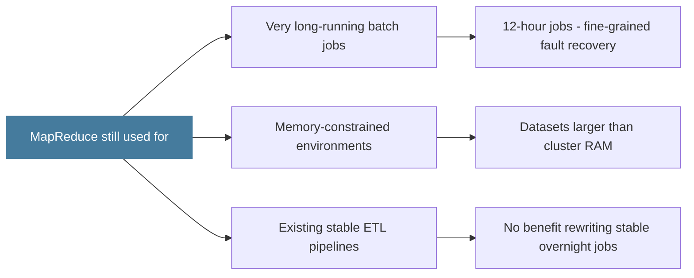

### Where MapReduce Has Been Replaced

| Workload | Why Spark Is Better |
|---------|-------------------|
| Interactive analytics | Spark runs in seconds vs minutes - in-memory |
| Machine learning | Iterative algorithms need memory, not disk per step |
| Graph processing | Iterative convergence algorithms - Spark GraphX |
| Streaming | Spark Structured Streaming vs no native MR streaming |
| SQL queries | Spark SQL or Hive on Tez vs slow MR execution |

### The Conceptual Legacy

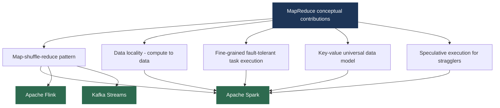

---

## Lecture Summary

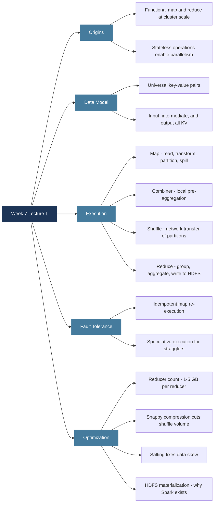

**Next class:** Apache Spark - architecture, how it eliminates MapReduce's limitations, RDDs and the DAG execution model, transformations vs actions, and PySpark hands-on code.

---

*BDA Spring 2026 | Week 7, Lecture 1 | The MapReduce Programming Model - Design, Execution and Optimization*
