# Big Data Analytics (BDA Spring 2026)
## Week 7, Lecture 2: Apache Spark Architecture - RDDs, DAG Execution and Lazy Evaluation

> Last class we studied MapReduce's elegance and its fundamental limitation: every intermediate result materializes to HDFS, making iterative computation extremely slow. Today we study Apache Spark - designed explicitly to solve that limitation. Every architectural decision Spark makes is a direct response to a specific MapReduce shortcoming.

---

## Table of Contents

1. [The Origin of Spark](#1-the-origin-of-spark)
2. [Spark Architecture - The Complete Picture](#2-spark-architecture---the-complete-picture)
3. [Resilient Distributed Datasets - The Core Abstraction](#3-resilient-distributed-datasets---the-core-abstraction)
4. [Lazy Evaluation and the DAG](#4-lazy-evaluation-and-the-dag)
5. [Transformations - Complete Reference](#5-transformations---complete-reference)
6. [Actions - Triggering Computation](#6-actions---triggering-computation)
7. [Persistence - Caching RDDs](#7-persistence---caching-rdds)
8. [PySpark Word Count - Key-Value RDDs](#8-pyspark-word-count---key-value-rdds)
9. [RDD Fault Tolerance - The Lineage Mechanism](#9-rdd-fault-tolerance---the-lineage-mechanism)

---

## 1. The Origin of Spark

### The Problem Spark Was Built to Solve

The year is 2009. Matei Zaharia is a PhD student at UC Berkeley's AMPLab. ML researchers are using Hadoop MapReduce for iterative algorithms - K-means, logistic regression, PageRank. Algorithms that run the same computation over the same dataset many times.


**The problem:** the dataset never changes between iterations - only the model parameters update. Yet Hadoop reads and writes the full dataset N times. A K-means job requiring 10 iterations reads the entire dataset from HDFS 10 times.

**Zaharia's insight:** if you could keep the dataset in memory across iterations, you eliminate 90% of the I/O.


**The speedup:**

$$\text{MapReduce: } N \text{ HDFS reads} + N \text{ HDFS writes} = 2N \text{ disk operations}$$

$$\text{Spark: } 1 \text{ HDFS read} + 1 \text{ HDFS write} + (N-1) \text{ memory reads} = \frac{2N \text{ disk} \to 2 \text{ disk}}{\approx 10\text{-}100\times \text{ speedup}}$$

This insight led to the 2012 paper: **"Resilient Distributed Datasets: A Fault-Tolerant Abstraction for In-Memory Cluster Computing."** Spark was open-sourced in 2010, became an Apache project in 2013, and by 2015 had essentially replaced MapReduce as the dominant Big Data processing framework. In 2026 it remains the most widely used distributed data processing engine in the world.

---

## 2. Spark Architecture - The Complete Picture

### Components Overview

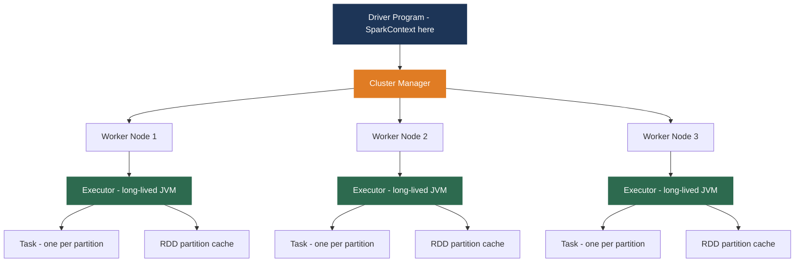

---

### The Driver and SparkContext

The **Driver** is the process containing your application's `main()` function.

**Driver responsibilities:**
- Create the SparkContext - the entry point to all Spark functionality
- Define the computation - the sequence of transformations and actions
- Translate logical computation into a physical execution plan
- Schedule tasks on the cluster
- Collect results from Executors

```python
# PySpark shell - sc is automatically created
# <SparkContext master=local[*] appName=PySparkShell>

# Standalone application - create explicitly
from pyspark import SparkConf, SparkContext
conf = SparkConf().setMaster("local[*]").setAppName("My Application")
sc = SparkContext(conf=conf)
```

**Master parameter options:**

| Master | Meaning |
|--------|---------|
| `local` | Single thread, no parallelism |
| `local[4]` | 4 threads on local machine |
| `local[*]` | One thread per CPU core |
| `yarn` | YARN cluster |
| `spark://host:7077` | Standalone Spark cluster |
| `k8s://...` | Kubernetes cluster |

---

### Cluster Manager Options

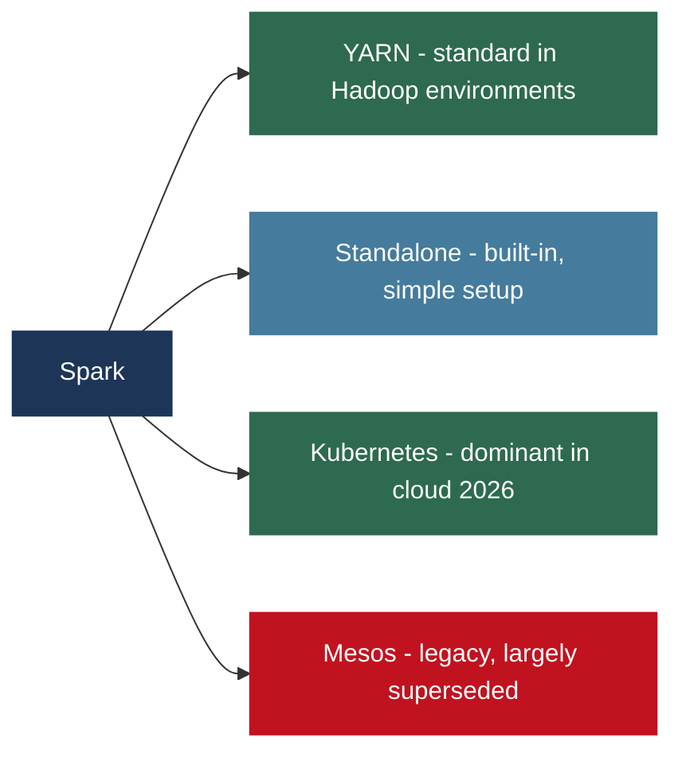

---

### Executors vs MapReduce Tasks

**The critical architectural difference from MapReduce:**

| Feature | MapReduce | Spark |
|---------|----------|-------|
| Worker process lifecycle | New JVM per task | Long-lived Executor JVM |
| Task startup time | Seconds (JVM startup) | Milliseconds (task to existing JVM) |
| Memory between tasks | Lost on task end | Persists in Executor memory |
| Multiple tasks per node | One at a time | Many parallel tasks per Executor |

```bash
# Submit with resource configuration
spark-submit \
    --num-executors 20 \
    --executor-cores 4 \
    --executor-memory 8g \
    --driver-memory 4g \
    myapp.py
```

This launches 20 Executors, each with 4 cores and 8 GB RAM.

$$\text{Total cluster resources} = 20 \times 4 = 80 \text{ CPU cores}, \quad 20 \times 8 = 160 \text{ GB RAM}$$

---

### Client Mode vs Cluster Mode

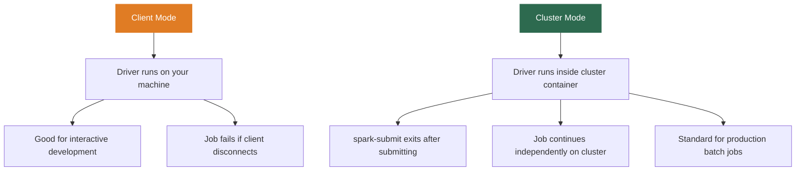

---

## 3. Resilient Distributed Datasets - The Core Abstraction

### What Is an RDD?

**R - Resilient:** fault-tolerant via lineage. If a partition is lost due to node failure, it can be recomputed automatically from its lineage record.

**D - Distributed:** partitioned across multiple nodes. Each partition is an independent unit processed in parallel on different Executors.

**D - Dataset:** a collection of elements. Essentially a distributed list partitioned across the cluster.

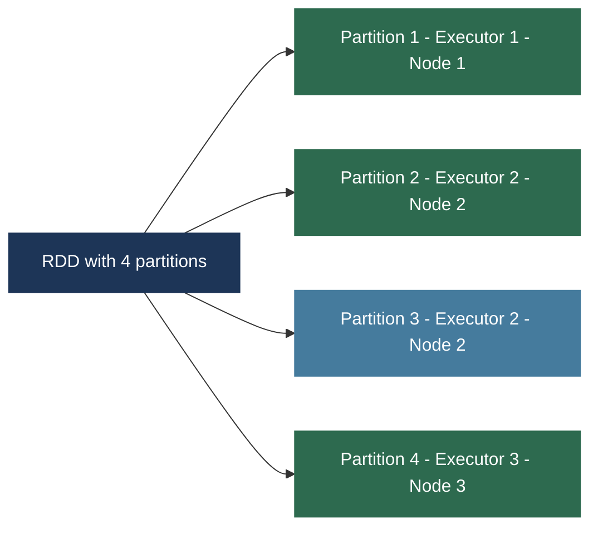

**Formal definition:** an RDD is a read-only, partitioned collection of records created through deterministic operations on either data in stable storage or other RDDs.

---

### Creating RDDs

```python
# From external data - one partition per HDFS block by default
rdd = sc.textFile("hdfs://namenode:9000/data/logs.txt")

# From external data - specify minimum partition count
rdd = sc.textFile("hdfs://namenode:9000/data/logs.txt", minPartitions=100)

# Multiple files with wildcard
rdd = sc.textFile("hdfs://namenode:9000/data/logs-*.txt")

# From in-memory Python list - small data only
rdd = sc.parallelize([1, 2, 3, 4, 5, 6, 7, 8, 9, 10])

# From list with explicit partition count
rdd = sc.parallelize([1, 2, 3, 4, 5], numSlices=3)

# From list of strings
rdd = sc.parallelize(["FAST", "University", "Peshawar"])
```

> **Warning:** `sc.parallelize()` sends data from Driver to Executors. Use only for small data. For production, always read from external storage.

---

### The Two Types of RDD Operations

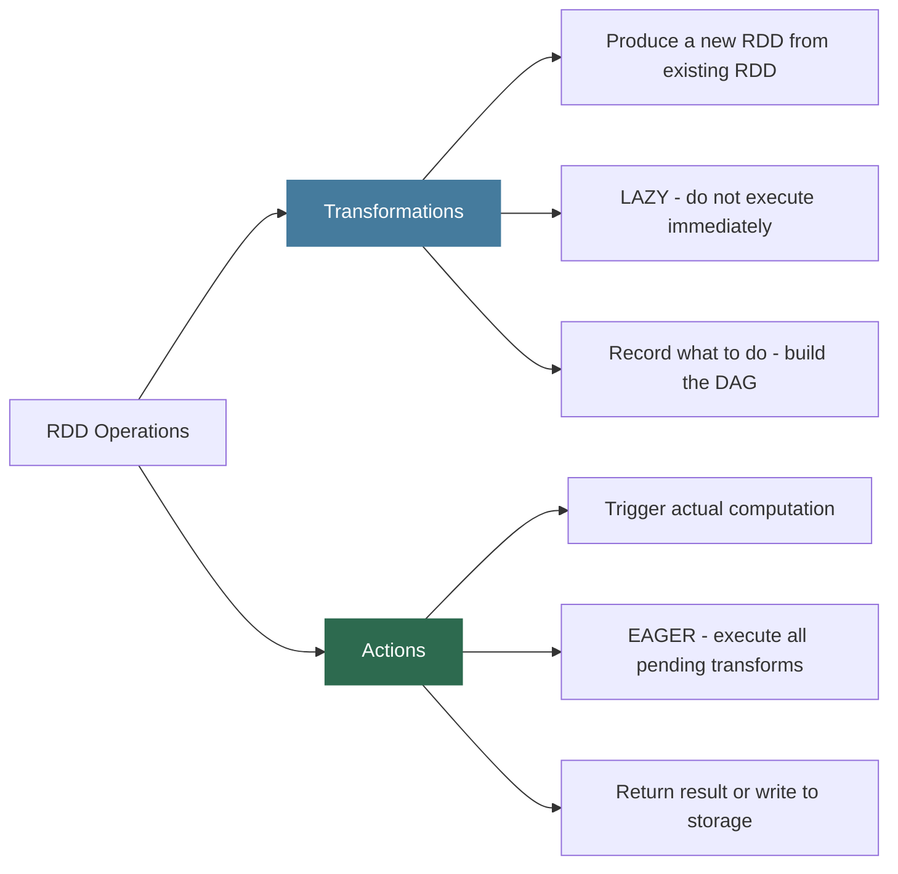

---

## 4. Lazy Evaluation and the DAG

### The Lineage Graph

When you apply transformations to RDDs, Spark does NOT compute anything. It builds a **lineage graph** - a record of how each RDD was derived from its parents.

```python
# NOTHING executes here - Spark just records the computation
lines = sc.textFile("hdfs://namenode:9000/logs.txt")     # RDD 1
errors   = lines.filter(lambda x: "ERROR" in x)          # RDD 2
warnings = lines.filter(lambda x: "WARNING" in x)        # RDD 3
both  = errors.union(warnings)                            # RDD 4
words = both.flatMap(lambda x: x.split(" "))              # RDD 5
result = words.map(lambda x: (x, 1)) \
              .reduceByKey(lambda a, b: a + b)            # RDD 6

# THIS line triggers ALL the above computations
count = result.count()   # ACTION - computation happens here
```

**The DAG (Directed Acyclic Graph):**

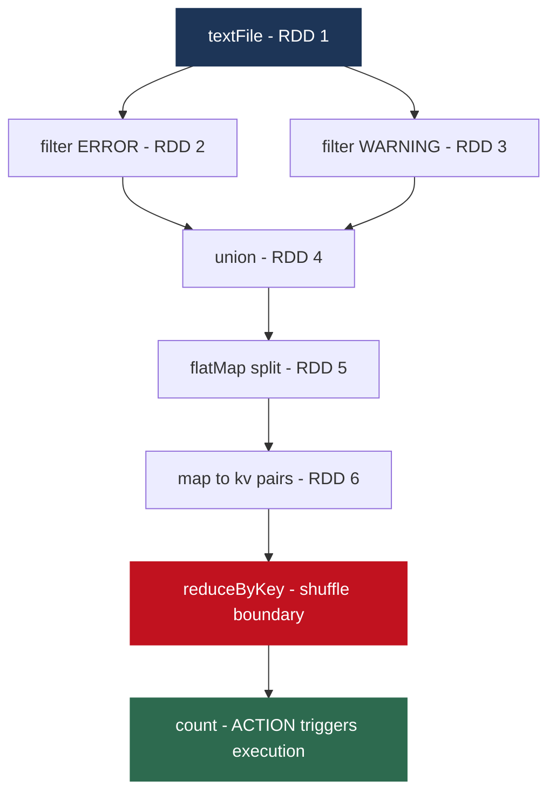

No data has moved. No computation has happened. Spark simply knows what it needs to do.

---

### Why Lazy Evaluation Enables Optimization

Because Spark sees the entire computation before executing any of it, it can apply optimizations impossible in an eager model:

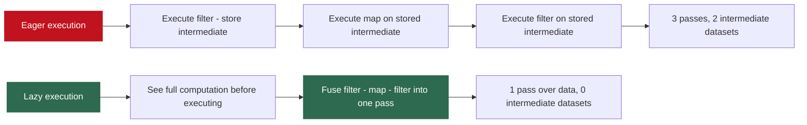

| Optimization | How Lazy Evaluation Enables It |
|-------------|-------------------------------|
| Pipeline fusion | Consecutive narrow operations fused into one pass - no intermediate storage |
| Predicate pushdown | Filter pushed to data source - reads only matching rows from Parquet |
| Join reordering | Smallest tables joined first to minimize intermediate data size |
| Dead code elimination | Transforms never used in any Action are never executed |

---

### Stages and Tasks

When an Action triggers execution, the DAG Scheduler translates the DAG into a physical plan of **Stages** and **Tasks**.

**Key rule:** Spark divides the DAG into stages at shuffle boundaries. Operations that can be pipelined (map, filter, flatMap) group into one stage. Operations requiring data movement (reduceByKey, join, groupByKey) create a new stage.

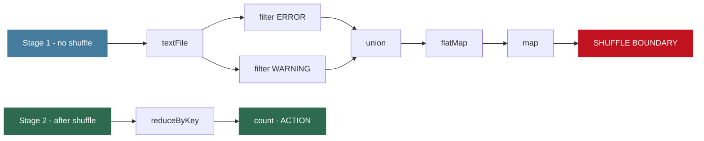

Within a stage, all operations are **pipelined** - one pass over each partition. Between stages, data is **shuffled** - repartitioned by key across Executors.

**Tasks** are the units of work executed by Executors. Each partition in a stage produces one Task:

$$\text{Stage with 200 partitions} \Rightarrow 200 \text{ tasks} \Rightarrow \text{run in parallel across all executor cores}$$

**Partition count tuning:**

$$\text{Recommended partitions} = 2 \text{ to } 4 \times \text{total CPU cores in cluster}$$

$$\text{Example: 80 cores} \Rightarrow \text{160 to 320 partitions for good parallelism}$$

---

## 5. Transformations - Complete Reference

### Narrow Transformations - No Shuffle

Narrow transformations process each partition independently. Output depends only on one input partition. Pipelined within a stage with no data movement.

```python
# filter - keep elements where condition is True
inputRDD = sc.textFile("log.txt")
errorRDD   = inputRDD.filter(lambda x: "Error" in x)
warningRDD = inputRDD.filter(lambda x: "Warning" in x)

# map - one output element per input element
inputRDD = sc.parallelize([1, 2, 3, 4])
squareRDD = inputRDD.map(lambda x: x * x)
# Result: [1, 4, 9, 16]

# map returning a list (NOT flattened)
listRDD = sc.parallelize(["Coffee Panda", "Happy Panda"]) \
            .map(lambda line: line.split(" "))
# Result: [['Coffee', 'Panda'], ['Happy', 'Panda']]

# flatMap - flattens the sequences returned by func
wordsRDD = sc.parallelize(["Coffee Panda", "Happy Panda"]) \
             .flatMap(lambda line: line.split(" "))
# Result: ['Coffee', 'Panda', 'Happy', 'Panda']
```

**map vs flatMap - the critical difference:**

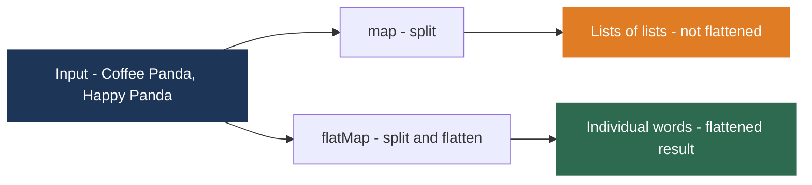

For Word Count, always use `flatMap` - you want individual words, not lists of words.

```python
# distinct - removes duplicates (requires shuffle - creates stage boundary)
rdd = sc.parallelize([1, 2, 2, 3, 3, 3, 4])
rdd.distinct()   # [1, 2, 3, 4]
```

---

### Set Operations

```python
rdd1 = sc.parallelize([1, 2, 3, 4, 5])
rdd2 = sc.parallelize([3, 4, 5, 6, 7])

rdd1.union(rdd2)         # [1,2,3,4,5,3,4,5,6,7] - no shuffle, keeps duplicates
rdd1.intersection(rdd2)  # [3,4,5] - requires shuffle
rdd1.subtract(rdd2)      # [1,2]   - requires shuffle
rdd1.cartesian(rdd2)     # all pairs (1,3),(1,4),...(5,7) - DANGEROUS
```

**Cartesian product warning:**

$$|\text{cartesian}| = |rdd1| \times |rdd2|$$

$$\text{1 million} \times \text{1 million} = \text{1 trillion pairs} \Rightarrow \text{impossible to process}$$

Use `cartesian` only for small reference datasets.

---

### Wide Transformations - Shuffle Required

Wide transformations require data to move between partitions. They always create stage boundaries.

```python
# reduceByKey - pre-aggregates locally before shuffle (like MapReduce Combiner)
words = sc.textFile("doc.txt").flatMap(lambda line: line.split(" "))
word_counts = words.map(lambda w: (w, 1)) \
                   .reduceByKey(lambda a, b: a + b)

# groupByKey - shuffles ALL values before any aggregation (AVOID for aggregation)
grouped = events_rdd.groupByKey()   # user_id: [event1, event2, event3, ...]

# sortByKey
sorted_counts = word_counts.sortByKey(ascending=False)

# join - inner join on key
users  = sc.parallelize([(1,"Alice"), (2,"Bob"), (3,"Charlie")])
scores = sc.parallelize([(1, 95), (2, 87), (1, 92)])
user_scores = users.join(scores)
# [(1, ("Alice", 95)), (1, ("Alice", 92)), (2, ("Bob", 87))]
```

**The most important Spark performance rule:**

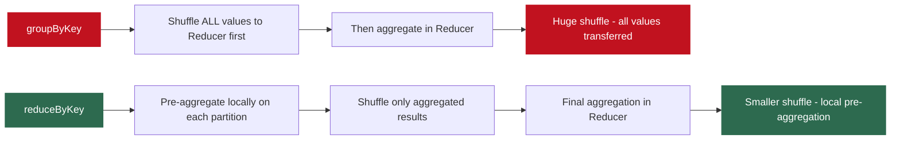

> **Always prefer `reduceByKey` over `groupByKey` for aggregations.**

Also available: `leftOuterJoin`, `rightOuterJoin`, `fullOuterJoin`.

---

### Transformation Summary

| Transformation | Type | Shuffle? | Stage Boundary? |
|---------------|------|---------|----------------|
| `filter` | Narrow | No | No |
| `map` | Narrow | No | No |
| `flatMap` | Narrow | No | No |
| `union` | Narrow | No | No |
| `distinct` | Wide | Yes | Yes |
| `reduceByKey` | Wide | Yes | Yes |
| `groupByKey` | Wide | Yes | Yes |
| `sortByKey` | Wide | Yes | Yes |
| `join` | Wide | Yes | Yes |
| `intersection` | Wide | Yes | Yes |
| `subtract` | Wide | Yes | Yes |

---

## 6. Actions - Triggering Computation

Actions trigger execution of all pending transformations and return a result.

```python
# count - number of elements
errorRDD.count()          # e.g., 1547

# first - first element
inputRDD.first()          # first line of file

# take(n) - first n elements as Python list
for line in badLinesRDD.take(10):
    print(line)

# collect - ALL elements - DANGER
for line in badLinesRDD.collect():   # transfers ALL data to Driver
    print(line)

# saveAsTextFile - write to HDFS (correct way for large RDDs)
lines.saveAsTextFile("hdfs://namenode:9000/output/")

# reduce - aggregate all elements (func must be commutative and associative)
total = sc.parallelize([1,2,3,4,5]).reduce(lambda a, b: a + b)
# total = 15

# foreach - apply func with side effects (e.g. write to external DB)
rdd.foreach(lambda x: database.insert(x))
```

**collect() - the danger action:**

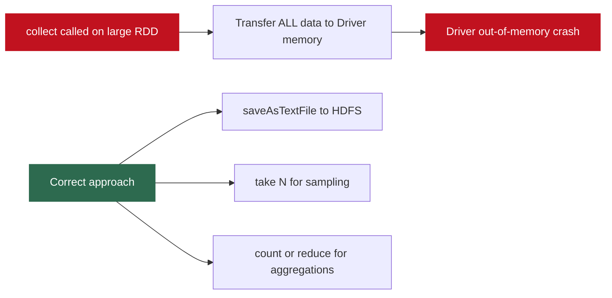

Never use `collect()` on large RDDs. It transfers all data from all Executors to the Driver. A 1-billion-element RDD = terabytes of data transferred to one machine.

---

## 7. Persistence - Caching RDDs

By default, Spark recomputes an RDD from scratch every time an Action is called on it. If you call two Actions on the same RDD, the entire computation runs twice.

```python
# Without caching - reads file TWICE
lines = sc.textFile("log.txt")
lines.count()   # reads from HDFS
lines.first()   # reads from HDFS again

# With caching - reads file ONCE
lines = sc.textFile("log.txt")
lines.persist()   # or lines.cache()
lines.count()     # reads from HDFS, caches in Executor RAM
lines.first()     # reads from Executor RAM - no HDFS touch

# Free the cache when done
lines.unpersist()
```

**The iterative algorithm advantage:**

$$\text{Without cache: 10 iterations} \times \text{HDFS read per iteration} = 10 \text{ disk reads}$$
$$\text{With cache: 1 HDFS read + 9 RAM reads} \Rightarrow \approx 10\times \text{ speedup}$$

### Storage Levels

| Storage Level | Where Stored | When to Use |
|--------------|-------------|------------|
| `MEMORY_ONLY` | Deserialized in JVM heap | Default. Fastest access. Use when data fits in RAM. |
| `MEMORY_AND_DISK` | RAM, spills to disk if full | When data might exceed available RAM |
| `MEMORY_ONLY_SER` | Serialized bytes in JVM heap | Less memory, slightly slower access |
| `DISK_ONLY` | On disk only | Rarely used |
| `MEMORY_AND_DISK_2` | RAM and disk, replicated to 2 nodes | For fault tolerance without recomputation cost |

```python
from pyspark import StorageLevel
rdd.persist(StorageLevel.MEMORY_AND_DISK)

# cache() is shorthand for MEMORY_ONLY
rdd.cache()
```

**When to cache:**
- RDD used in multiple Actions
- Expensive to recompute (large HDFS read + complex transforms)
- Fits comfortably in cluster memory

**When NOT to cache:**
- RDD used only once - overhead without benefit
- Cheap to recompute - reading a small file
- Does not fit in memory - wastes memory management overhead

---

## 8. PySpark Word Count - Key-Value RDDs

### Complete Word Count Implementation

```python
from pyspark import SparkContext, SparkConf

conf = SparkConf().setMaster("local").setAppName("Word Count")
sc = SparkContext(conf=conf)

words = sc.textFile("/document.txt") \
          .flatMap(lambda line: line.split(" "))

wc = words.map(lambda word: (word, 1)) \
          .reduceByKey(lambda a, b: a + b)

wc.saveAsTextFile("/sparktest")
```

**Line-by-line analysis:**

| Line | Operation | Type | Data State |
|------|-----------|------|-----------|
| `sc.textFile(...)` | Read file from HDFS | Transformation | Nothing happens yet |
| `.flatMap(split)` | Split lines into words | Transformation (narrow) | Nothing happens yet |
| `.map(word, 1)` | Create KV pairs | Transformation (narrow) | Nothing happens yet |
| `.reduceByKey(sum)` | Sum per word | Transformation (wide, shuffle) | Nothing happens yet |
| `.saveAsTextFile(...)` | Write to HDFS | **ACTION** | All above executes now |

Everything from `textFile` through `reduceByKey` is recorded as a DAG. The single `saveAsTextFile` call triggers all of it.

---

### Converting RDD to DataFrame

```python
from pyspark.sql import SparkSession

spark = SparkSession.builder.appName("My App").getOrCreate()
sc = spark.sparkContext

dataCol = ["key", "value"]
dataObj = [("k1", 100), ("k2", 200), ("k3", 150)]

rddObj  = sc.parallelize(dataObj)
dfRddObj = rddObj.toDF(dataCol)

dfRddObj.printSchema()
# root
#  |-- key:   string (nullable = true)
#  |-- value: long   (nullable = true)

dfRddObj.show()
# +---+-----+
# |key|value|
# +---+-----+
# | k1|  100|
# | k2|  200|
# | k3|  150|
# +---+-----+

dfRddObj.select("key").show()
dfRddObj.filter(dfRddObj["value"] > 100).show()
```

**Why DataFrames over raw RDDs:**

| Feature | RDD API | DataFrame API |
|---------|---------|--------------|
| Schema | No schema info | Column names and types known |
| Optimizer | No optimization | Catalyst optimizer - aggressive optimization |
| SQL interface | No | `spark.sql("SELECT ...")` works |
| Performance | Manual optimization | Tungsten bytecode generation |
| Ease of use | Low level | High level - like pandas |

Modern Spark code uses DataFrames and Spark SQL for most work. Full coverage in the next lecture.

---

## 9. RDD Fault Tolerance - The Lineage Mechanism

### Lineage vs Replication

Traditional fault tolerance (HDFS) achieves reliability through **data replication** - store 3 copies so losing one does not lose data.

RDDs achieve fault tolerance through **lineage** - every RDD knows exactly how it was created.

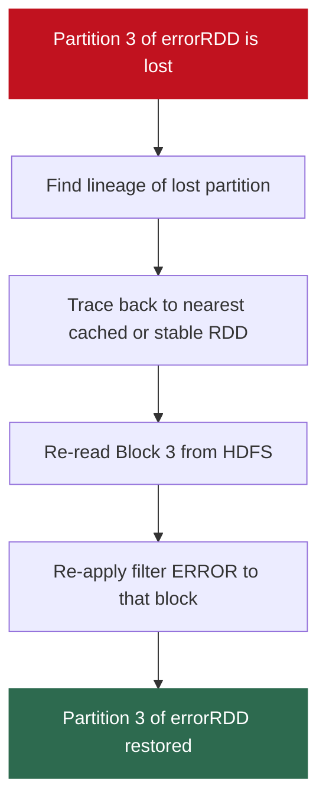

**No replica needed.** Recovery uses computation, not storage redundancy.

### RDD Lineage Example

```
Lineage graph:
sc.textFile(HDFS) [stable storage]
    └── filter("Error")
            └── errorRDD [LOST partition 3]

Recovery path:
1. Identify: partition 3 of textFile (from HDFS block 3)
2. Re-read: block 3 from HDFS
3. Re-apply: filter("Error")
4. Result: partition 3 of errorRDD restored
```

**The trade-off:**

$$\text{Recovery cost} = \text{re-execute all transforms from last checkpoint or stable storage}$$

For a chain of 20 transformations, losing partition 3 requires re-running all 20 transforms for that partition. This is why **checkpointing** exists for long lineage chains.

### Checkpointing for Long Lineage

```python
sc.setCheckpointDir("hdfs://namenode:9000/checkpoints/")

# After many expensive transformations...
expensive_rdd.checkpoint()  # write to HDFS, truncate lineage
expensive_rdd.count()       # action required to trigger checkpointing

# Future recovery reads from HDFS checkpoint
# instead of recomputing entire chain
```

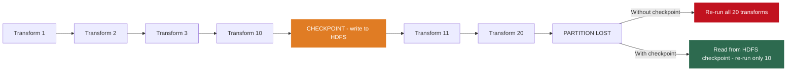

---

## Lecture Summary

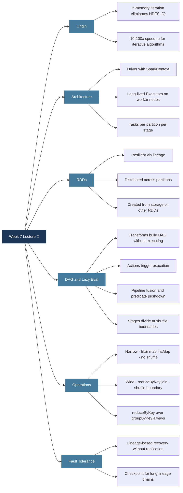

**Next class:** Spark DataFrames and Spark SQL - the modern high-level API. The Catalyst optimizer, Tungsten execution engine, Adaptive Query Execution, and PySpark code for DataFrames and the Spark ML pipeline.

---

*BDA Spring 2026 | Week 7, Lecture 2 | Apache Spark Architecture - RDDs, DAG Execution and Lazy Evaluation*
